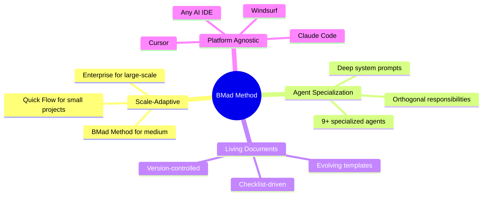
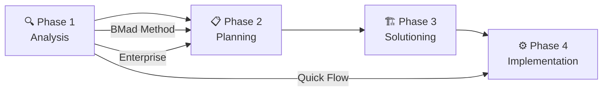
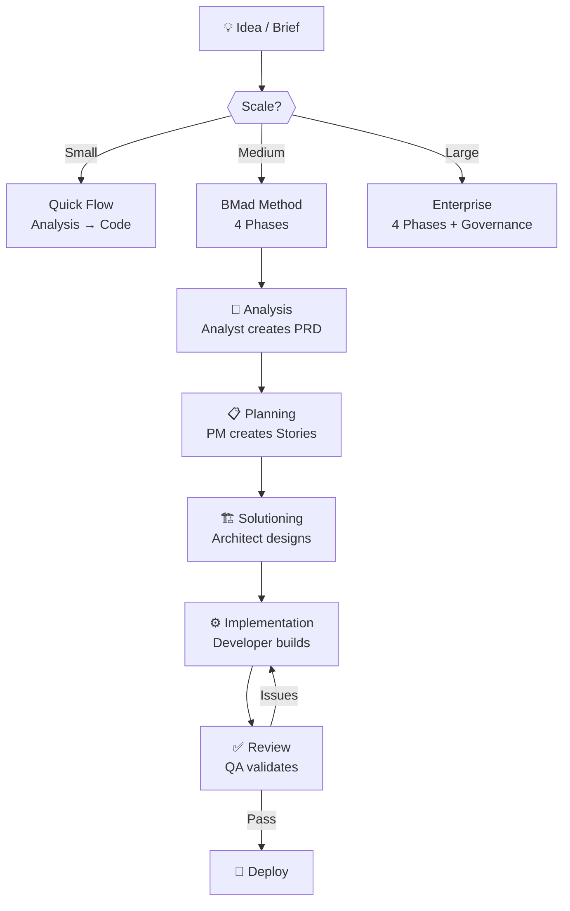

# BMad Method — Overview

## What is the BMad Method?

**BMad Method (Build More Architect Dreams)** is a **100% free and open-source** Agile AI Driven Development framework. It provides a complete system of **specialized AI agents**, **structured workflows**, and **living document templates** designed to replace the chaotic "vibe coding" approach with a disciplined, scalable software development process.

> [!NOTE]
> **Repository:** [bmadcode/BMAD-METHOD](https://github.com/bmadcode/BMAD-METHOD)
> **Current Version:** v2.1.0
> **License:** MIT (100% Free)
> **Creator:** BMad (Brian)

| Attribute | Description |
|---|---|
| **Type** | Agile AI Driven Development Framework |
| **License** | MIT — completely free, no premium tiers |
| **Target audience** | Solo developers, startups, teams using AI coding assistants |
| **Supported platforms** | Claude Code, Cursor, Windsurf, Cline, and any AI IDE |
| **Key technology** | Multi-agent orchestration, XML workflows, living documents |

## Problems Solved

| Problem | Description | How BMad Method Solves It |
|---|---|---|
| **Vibe Coding** | Directly prompting AI without plan → code breaks when scaling | 4-phase structured process with mandatory analysis before coding |
| **Context Fragmentation** | AI quality degrades as context fills up with junk | Specialized agents with dedicated context, XML workflows for efficient parsing |
| **Inconsistency** | Different AI responses for the same task | Standardized templates and checklists ensure uniform output |
| **Lack of Scalability** | Simple projects don't need enterprise processes, complex projects need more | Scale-adaptive intelligence: Quick Flow / BMad Method / Enterprise — 3 tracks |
| **Agent Confusion** | General-purpose AI doesn't know HOW to be PM/Architect/Developer | 9+ specialized agents with deep system prompts |
| **Expensive Tools** | Many AI dev tools charge monthly fees | 100% MIT, zero cost, no premium features |

---

## Design Philosophy

**4 Core Principles:**

1. **Scale-Adaptive Intelligence** — The system auto-adjusts complexity to match project scale. Don't use a cannon to kill a fly.
2. **Specialized Agents** — Each agent masters one domain (PM, Architect, Developer...) instead of one "do-everything" agent.
3. **Living Documents** — Templates evolve with the project, not static files.
4. **Platform Agnostic** — Works with any AI IDE, not locked to a single tool.

---

## Who Should Use It?

| Audience | Primary Use Case |
|---|---|
| **Solo Developer** | Build quality products without a team, following standardized processes |
| **Startup Founder** | Quick MVP with professional architecture, no overhead |
| **Development Team** | Unify AI-assisted workflow across all members |
| **Tech Lead** | Ensure code quality, architecture consistency |
| **AI/Prompt Engineer** | Study multi-agent orchestration patterns and XML workflow design |

---

## Architecture Overview

### 4-Phase System

| Phase | Agent | Input | Output |
|---|---|---|---|
| **Analysis** | Analyst | Raw idea/brief | PRD (Product Requirements Document) |
| **Planning** | PM / Design Architect | PRD | User Stories, UX Specifications |
| **Solutioning** | Architect | User Stories + UX Specs | Architecture Document, Tech Stack, API Specs |
| **Implementation** | Developer / DevOps | Architecture + Stories | Production code, tests, deployments |

### 3 Planning Tracks

| Track | When to Use | Phases | Duration |
|---|---|---|---|
| **Quick Flow** | Simple task, < 1 day | Analysis → Implementation (skip Planning, Solutioning) | Minutes → Hours |
| **BMad Method** | Medium project, 1 day → several weeks | All 4 phases | Days → Weeks |
| **Enterprise** | Large project, multiple teams | All 4 phases + extended governance | Weeks → Months |

### 9+ Specialized Agents

| Agent | Domain | Primary Responsibility |
|---|---|---|
| **Analyst** | Business Analysis | Elicit requirements, create PRD, gap analysis |
| **PM (Product Manager)** | Product Management | User stories, story mapping, prioritization |
| **Design Architect** | UX/UI Design | Wireframes, UX specs, design system |
| **Architect** | Software Architecture | Tech stack, architecture document, API design |
| **Developer** | Implementation | Write code, unit tests, follow architecture |
| **DevOps** | Infrastructure | CI/CD, deployment, monitoring |
| **QA** | Quality Assurance | Test plan, regression tests, quality gates |
| **Poseidon** | Multi-agent Orchestrator | Coordinate agents, workflow state management |
| **SRE** | Site Reliability | Observability, incident response, SLOs |

---

## Project Lifecycle

---

## Key Features

### 1. Scale-Adaptive Intelligence

The system auto-detects project complexity and recommends the appropriate track:
- **Quick Flow:** Bug fixes, small features — jump straight to coding
- **BMad Method:** New features, refactoring — full 4-phase process
- **Enterprise:** System redesign, multi-team projects — extended governance

### 2. XML Workflow Engine

Agents follow XML-formatted workflows optimized for LLM parsing:
- Structured, unambiguous instructions
- Conditional branching based on project context
- Checkpoint validation at each step

### 3. Living Document Templates

Templates from BMad are not static — they evolve with the project:
- **PRD Template** — auto-sizes from 1 page (Quick Flow) to 20+ pages (Enterprise)
- **Architecture Template** — includes pre-built checklists for common stacks
- **Story Template** — with acceptance criteria and dependency tracking

### 4. Multi-Agent Orchestration (Poseidon)

Poseidon acts as the conductor:
- Routes tasks to the right agent
- Manages workflow state
- Handles agent hand-offs and context passing

### 5. Checklist-Driven Quality

Every phase includes mandatory checklists:
- PRD completeness checklist
- Architecture review checklist
- Code review checklist
- Deployment readiness checklist

---

## Comparison: Vibe Coding vs BMad Method

| Aspect | Vibe Coding | BMad Method |
|---|---|---|
| **Process** | "Just tell AI what to build" | Structured 4-phase with specialized agents |
| **Quality** | Inconsistent, degrades over time | Checklist-driven, consistently high |
| **Scalability** | Breaks at complexity | Scale-adaptive (3 tracks) |
| **Documentation** | None or afterthought | Living documents from day 1 |
| **Team collaboration** | Everyone uses AI differently | Unified workflow and templates |
| **Cost** | Tool subscriptions | 100% Free (MIT) |

---

## What's New in v2.1.0

- **Multi-IDE Support:** Beyond Claude Code — now works with Cursor, Windsurf, Cline
- **Quick Flow Track:** For small tasks that don't need full ceremony
- **Enhanced Analyst Agent:** Better requirement elicitation with follow-up questions
- **Improved Templates:** More adaptive, less boilerplate
- **Community Contributions:** Growing library of agent configurations

---

## See Also

- [1. Architecture and Logic](./1. Architecture and Logic.md) — Internal architecture, data flow, agent orchestration details
- [2. Playbook](./2. Playbook.md) — Installation, Day 1 workflow, cheat sheet, troubleshooting
- [3. Decision Guide](./3. Decision Guide.md) — Comparison with alternatives, use cases, costs, migration path
