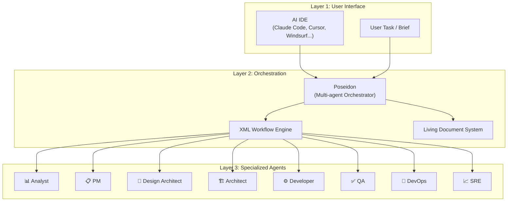
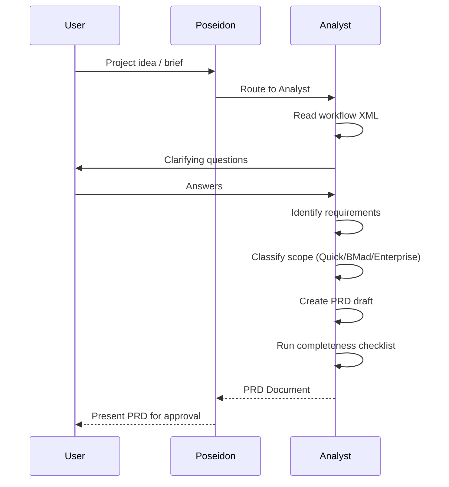
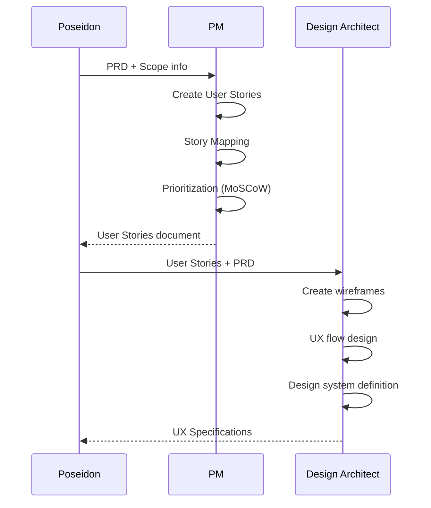
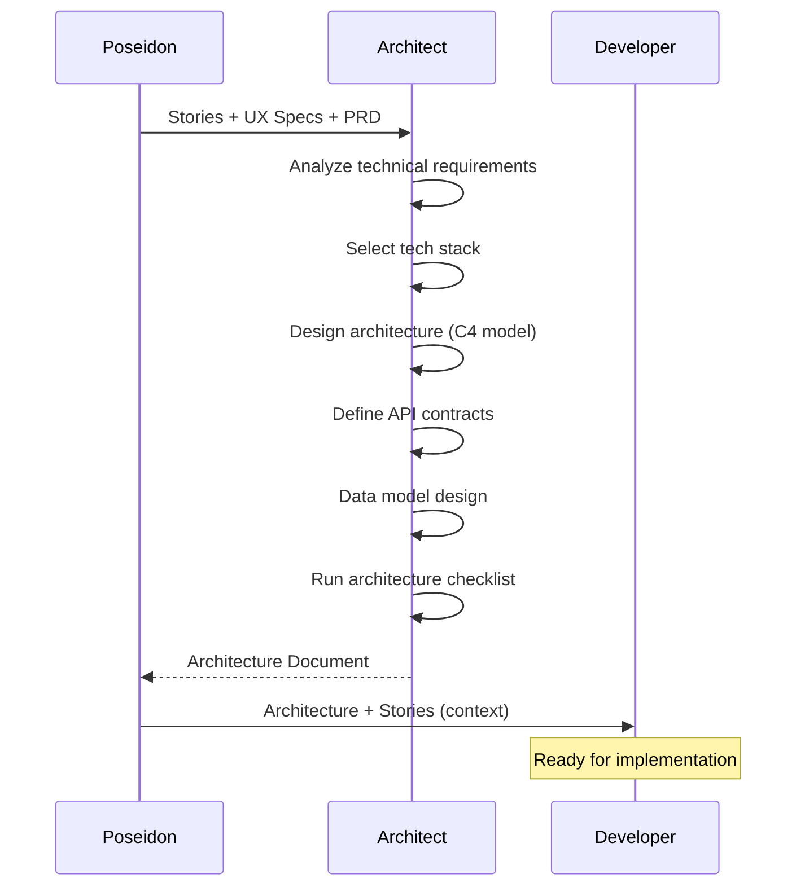
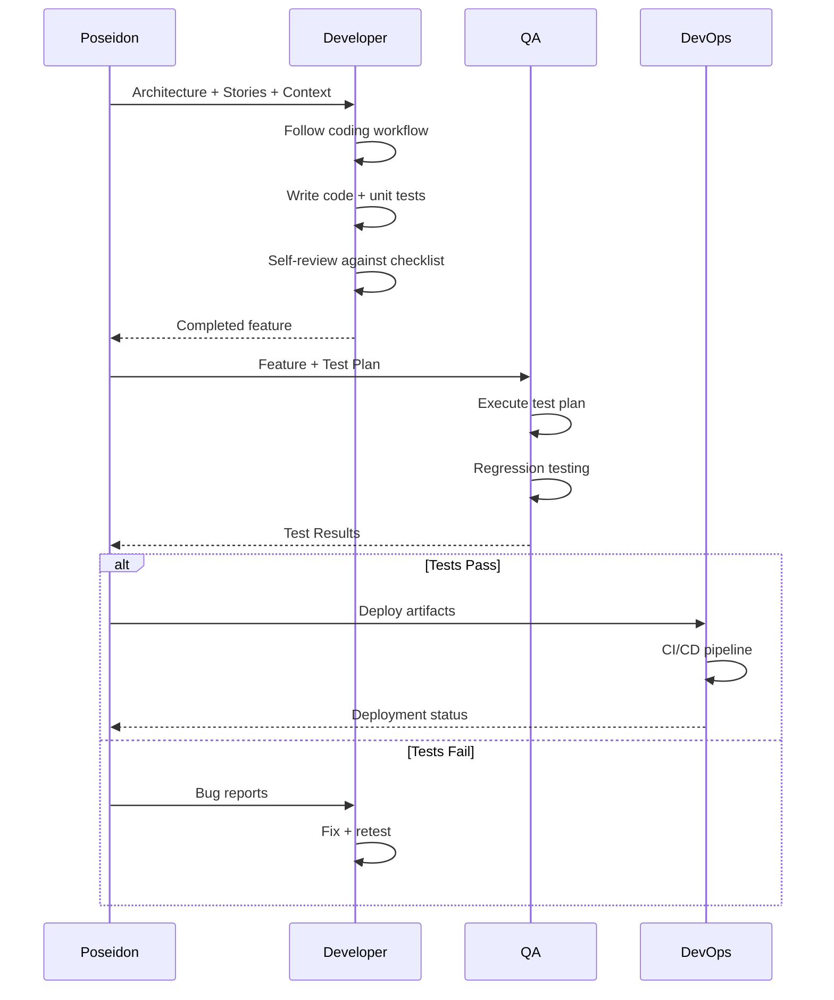
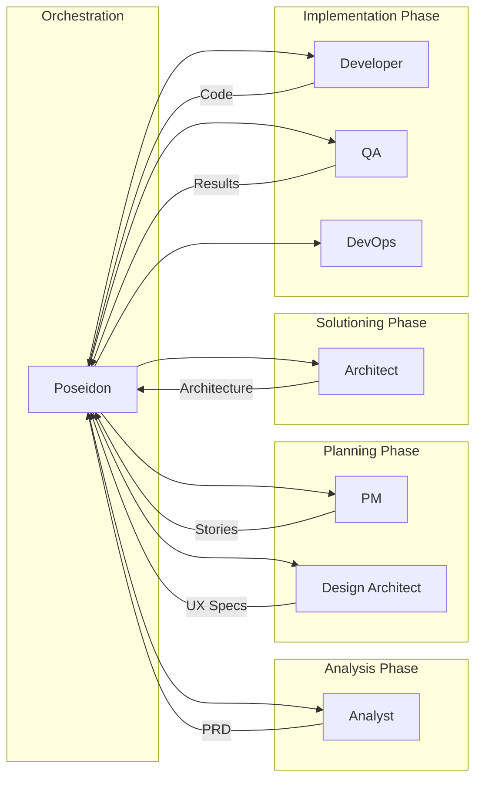
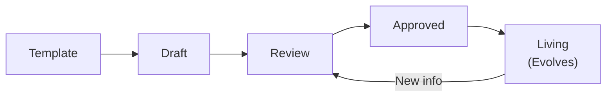
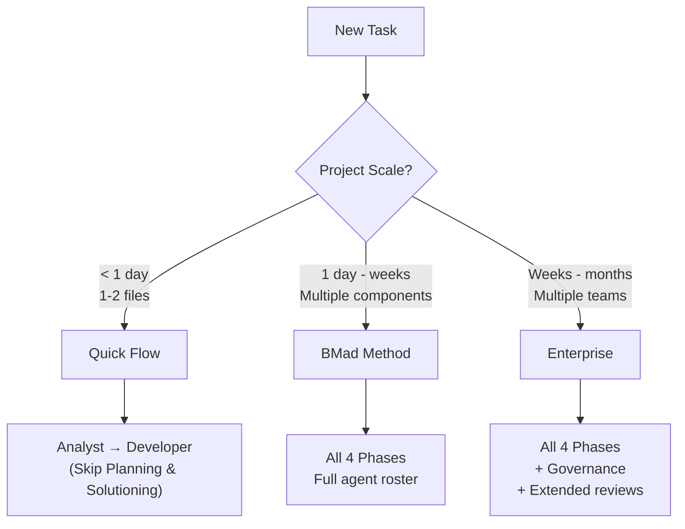

# BMad Method — Architecture and Logic

## Overall Architecture Model

### 3-Layer Architecture



### Architecture Principles

| Principle | Description |
|---|---|
| **Separation of Concerns** | Each agent handles one domain exclusively |
| **Workflow-Driven** | XML workflows determine the sequence and conditions |
| **Living Documents** | Templates evolve with the project, not static |
| **Scale-Adaptive** | Auto-adjusts process complexity based on project size |
| **Platform Agnostic** | Not tied to any specific AI IDE |

---

## Detailed Data Flow by Phase

### Phase 1: Analysis



**Input → Output:**

| Input | Output |
|---|---|
| Raw idea, brief, or conversation | PRD (Product Requirements Document) |
| | Scope classification (Quick Flow / BMad Method / Enterprise) |
| | Gap analysis report (if any) |

### Phase 2: Planning



**Key Documents:**

| Document | Creator | Content |
|---|---|---|
| **User Stories** | PM | As a [user], I want [action], so that [value] + Acceptance Criteria |
| **Story Map** | PM | Backbone → Walking Skeleton → Releases |
| **UX Specs** | Design Architect | Wireframes, interactions, design tokens |

### Phase 3: Solutioning



**Architecture Document Includes:**

| Section | Content |
|---|---|
| **Tech Stack** | Languages, frameworks, databases, infrastructure |
| **Architecture Diagrams** | C4: Context, Container, Component, Code |
| **API Specifications** | Endpoints, request/response models, auth flows |
| **Data Model** | Entities, relationships, migrations |
| **Security** | Auth strategy, data protection, threat model |
| **DevOps** | CI/CD pipeline, environments, monitoring |

### Phase 4: Implementation



---

## XML Workflow Engine

### How It Works

BMad agents follow XML-formatted workflows that provide:

1. **Structured Instructions** — Clear, unambiguous steps
2. **Conditional Logic** — Branch based on project context
3. **Checkpoints** — Validation gates between steps
4. **Context Injection** — Dynamic data insertion

### XML Workflow Structure Example

```xml
<workflow name="analyst-workflow">
  <phase name="requirements-elicitation">
    <step id="1">
      <action>Read the user's brief/idea</action>
      <output>Initial understanding</output>
    </step>
    <step id="2">
      <action>Classify project scope</action>
      <condition>
        <if scope="small">Route to Quick Flow</if>
        <if scope="medium">Continue BMad Method</if>
        <if scope="large">Activate Enterprise track</if>
      </condition>
    </step>
    <step id="3">
      <action>Ask clarifying questions</action>
      <checkpoint>
        <validate>All critical requirements identified?</validate>
        <on-fail>Return to step 3</on-fail>
      </checkpoint>
    </step>
  </phase>
</workflow>
```

### Workflow Categories

| Category | Workflows | Used By |
|---|---|---|
| **Analysis** | Requirements elicitation, gap analysis, scope classification | Analyst |
| **Planning** | Story mapping, prioritization, UX design | PM, Design Architect |
| **Solutioning** | Architecture design, API design, data modeling | Architect |
| **Implementation** | Coding, testing, code review, deployment | Developer, QA, DevOps |
| **Orchestration** | Agent routing, state management, hand-offs | Poseidon |

---

## Agent System — Deep Dive

### Agent Anatomy

Each agent consists of:

```
agent/
├── system-prompt.md       # Deep system prompt defining personality & expertise
├── workflow.xml           # Step-by-step workflow instructions
├── templates/             # Document templates this agent produces
│   ├── output-template.md
│   └── checklist.md
└── examples/              # Example outputs for reference
    └── sample-output.md
```

### Agent Interaction Model



### Agent Communication Rules

| Rule | Description |
|---|---|
| **No direct agent-to-agent** | All communication goes through Poseidon |
| **Document-based hand-offs** | Agents share context via living documents |
| **Checklist gates** | Next agent only starts after previous checklist passes |
| **Context isolation** | Each agent receives only the context it needs |

---

## Living Document System

### Document Lifecycle



### Core Documents

| Document | Phase | Template Features |
|---|---|---|
| **PRD** | Analysis | Auto-sizes based on scope, includes checklist |
| **User Stories** | Planning | Acceptance criteria template, dependency tracking |
| **UX Specs** | Planning | Wireframe placeholders, interaction descriptions |
| **Architecture Doc** | Solutioning | C4 diagram templates, tech stack table |
| **Test Plan** | Implementation | Test matrix, coverage tracking |

### Checklist System

Every major document has an embedded checklist:

```markdown
## Completeness Checklist
- [ ] All functional requirements captured
- [ ] Non-functional requirements defined
- [ ] Edge cases identified
- [ ] Dependencies mapped
- [ ] Risks documented
- [ ] Acceptance criteria for each story
```

---

## Scale-Adaptive Logic

### Decision Flow



### Scale Indicators

| Indicator | Quick Flow | BMad Method | Enterprise |
|---|---|---|---|
| **Duration** | < 1 day | Days to weeks | Weeks to months |
| **Files affected** | 1-5 | 5-50 | 50+ |
| **Team size** | Solo | Solo to small team | Multiple teams |
| **Requirements** | Obvious | Need clarification | Complex, ambiguous |
| **Architecture impact** | None | Local changes | System-wide |

---

## Error Handling & Recovery

| Issue | Recovery Path |
|---|---|
| Agent produces incomplete output | Re-run with checklist feedback |
| Wrong agent selected | Poseidon re-routes to correct agent |
| Conflicting requirements | Escalate to user for clarification |
| Template too heavy for project | Scale down to Quick Flow |
| Context window overflow | Split work into smaller chunks |

---

## Integration Points

| Integration | Mechanism |
|---|---|
| **Version Control (Git)** | Documents committed alongside code |
| **IDE** | Agent prompts work in any AI IDE |
| **CI/CD** | QA agent generates test configs compatible with CI |
| **Project Management** | Stories export to Jira/Linear format |

---

## See Also

- [[3-Research/Github/BMAD-METHOD/0. Overview]] — Overview, philosophy, key features
- [[3-Research/Github/BMAD-METHOD/2. Playbook]] — Installation, Day 1 workflow, cheat sheet, troubleshooting
- [[3-Research/Github/BMAD-METHOD/3. Decision Guide]] — Comparison with alternatives, use cases, costs, migration path
