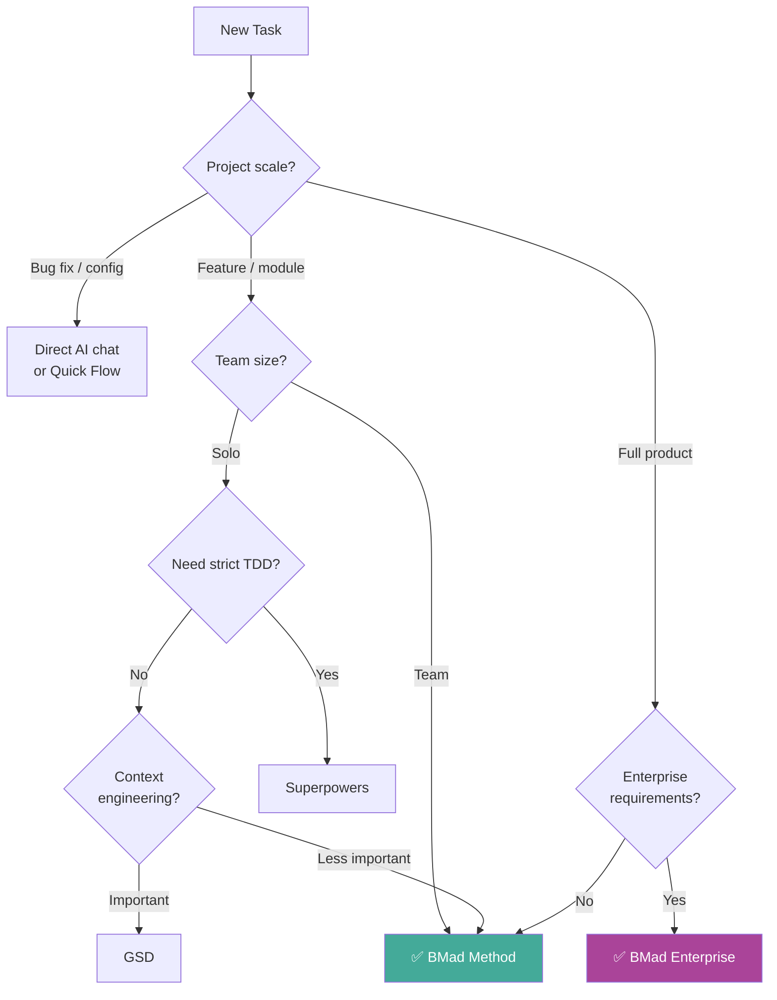

# BMad Method — Decision Guide

## 1. Comparison with Alternatives

### Overview Comparison Table

| Feature | **BMad Method** | **GSD** | **Superpowers** | **Vibe Coding** | **Manual Process** |
|---|---|---|---|---|---|
| **Philosophy** | Scale-adaptive AI SDLC | Context engineering + multi-agent | Skills-based TDD enforcement | Chat-and-fix | Traditional Agile/Scrum |
| **Agent count** | 9+ specialized | 11+ specialized | 14 skills | None | Human roles |
| **Scale-adaptive** | ✅ 3 tracks | ❌ Single workflow | ❌ Single workflow | ❌ | ❌ |
| **Documentation** | ✅ Living documents | ✅ State files | ⚠️ Spec/plan files | ❌ | ✅ Manual |
| **TDD enforcement** | ⚠️ Optional | ⚠️ Verify commands | ✅ Iron Law | ❌ | ❌ |
| **Cost** | Free (MIT) | Free (MIT) | Free (MIT) | Free | Free |
| **Learning curve** | 🟡 Medium | 🟡 Medium | 🟡 Medium | 🟢 Low | 🔴 High |
| **Platform** | Any AI IDE | Claude Code primary | CC, Cursor, Codex, OpenCode | Any | N/A |
| **Multi-agent** | ✅ Orchestrated | ✅ Orchestrated | ✅ Subagent-based | ❌ | ❌ |

### BMad vs GSD (Get Shit Done)

| Aspect | BMad Method | GSD |
|---|---|---|
| **Scope** | Full SDLC (Analysis → Deploy) | Planning → Execution → Verification |
| **Scale handling** | 3 tracks (Quick/BMad/Enterprise) | Single workflow (toggleable agents) |
| **Context engineering** | Document-based context | File-based state + fresh 200K per task |
| **Agent types** | Role-based (PM, Architect, Dev...) | Task-based (Planner, Executor, Verifier...) |
| **Verification** | Checklist-driven | 8-dimension plan checker + UAT |
| **When to choose BMad** | Full SDLC management, team coordination | |
| **When to choose GSD** | | Solo dev, context-sensitive execution |

### BMad vs Superpowers

| Aspect | BMad Method | Superpowers |
|---|---|---|
| **Focus** | Process management (SDLC phases) | Coding discipline (TDD, debugging) |
| **Trigger model** | Phase-based (explicit) | Auto-trigger (1% rule) |
| **TDD** | Optional (agent-dependent) | Iron Law (non-negotiable) |
| **Documentation** | Comprehensive (PRD, Stories, Architecture) | Spec + Plan files |
| **Code review** | Checklist-based | Two-stage automated (spec + quality) |
| **When to choose BMad** | Need full SDLC, enterprise process | |
| **When to choose Superpowers** | | Need strict TDD, autonomous coding |

---

## 2. When to Use BMad Method

### ✅ Ideal Use Cases

| Scenario | Why BMad Method Fits |
|---|---|
| **New product from scratch** | Full SDLC coverage from idea to deployment |
| **Team needs unified AI workflow** | Standardized agents and templates for everyone |
| **Complex architecture decisions** | Dedicated Architect agent with structured design process |
| **Multiple stakeholders** | PRD and Stories create shared understanding |
| **Scale varies across tasks** | 3 tracks automatically match complexity |
| **Need documentation** | Living documents produced as side-effect of workflow |
| **Enterprise compliance needed** | Enterprise track includes governance and extended reviews |

### Signals You Should Use BMad

- [ ] Project has multiple features/modules
- [ ] Team members use AI inconsistently
- [ ] Architecture decisions need documentation
- [ ] Requirements change frequently
- [ ] Quality varies across AI-generated code
- [ ] Need traceability from requirements to code

---

## 3. When NOT to Use BMad Method

### ❌ Anti-Use-Cases

| Scenario | Why BMad Method Is NOT Suitable | Use Instead |
|---|---|---|
| **Quick bug fix** | Too much overhead for a simple change | Direct AI chat or Quick Flow |
| **Throwaway prototype** | Documentation overhead unnecessary | Vibe coding |
| **One-line config change** | Full SDLC for a one-liner is overkill | Direct editing |
| **Need strict TDD enforcement** | BMad TDD is optional, not enforced | Superpowers |
| **Solo dev, context-sensitive work** | BMad focuses on process, not context engineering | GSD |
| **Budget-constrained, high-volume** | Multiple agents = more tokens | Single agent + budget model |

### Known Limitations

| Limitation | Impact | Workaround |
|---|---|---|
| **Learning curve** | Takes time to understand all agents and phases | Start with Quick Flow, gradually adopt |
| **Token consumption** | Multiple agents = more API calls | Use Quick Flow for simple tasks |
| **No built-in CI/CD** | QA agent suggests but doesn't run CI | Integrate with existing CI tools |
| **Template maintenance** | Living documents need attention | Regular checkpoint reviews |

---

## 4. Case Studies

### Case 1: Startup — MVP Development

**Scenario:** Founder needs to build SaaS MVP in 2 weeks.

**Solution:**
- Start with **BMad Method** track
- Analyst creates lightweight PRD
- Architect designs minimal architecture
- Developer implements feature by feature
- QA validates each feature

**Result:** Structured MVP with documentation that scales to v2.

### Case 2: Enterprise — System Migration

**Scenario:** Large company migrating legacy system to microservices.

**Solution:**
- **Enterprise** track with full governance
- Analyst maps existing system
- Architect designs target architecture + migration plan
- Developer implements in phases
- SRE monitors throughout

**Result:** Documented, reviewable migration with audit trail.

### Case 3: Solo Developer — Side Project

**Scenario:** Developer building personal project on weekends.

**Solution:**
- Start with **Quick Flow** for initial features
- Upgrade to **BMad Method** when complexity increases
- Use Analyst for requirement clarity, Developer for code

**Result:** Structured approach without overhead. Documentation exists if project grows.

---

## 5. Costs & Resources

### Direct Costs

| Item | Cost |
|---|---|
| **BMad Method** | Free (MIT License) |
| **AI IDE** | Depends on choice (some free, some paid) |
| **API tokens** | Depends on usage and model |

### Token Cost Management

| Strategy | Approach |
|---|---|
| **Quick Flow** for small tasks | Minimizes agent invocations |
| **Skip non-essential phases** | Use scale-adaptive tracks |
| **Reuse documents** | Don't regenerate existing PRDs/Architecture |
| **Budget models** for simple agents | Use cheaper models for straightforward tasks |

### Hardware Requirements

| Requirement | Details |
|---|---|
| **OS** | Any (Mac, Windows, Linux) |
| **IDE** | Any AI IDE (Claude Code, Cursor, etc.) |
| **Storage** | Minimal (~1-10MB for documents) |
| **Network** | Required for AI API calls |

---

## 6. Migration Path

### From Vibe Coding → BMad Method

| Step | Action |
|---|---|
| 1 | Install BMad Method configurations |
| 2 | Start with Quick Flow for anything new |
| 3 | Gradually use full BMad Method for larger features |
| 4 | Adopt Enterprise track when team grows |

**Risk:** Low — BMad adds structure without breaking existing code.

### From Manual Agile → BMad Method

| Step | Action |
|---|---|
| 1 | Map existing roles to BMad agents |
| 2 | Import existing requirements as PRD |
| 3 | Use BMad templates for new documentation |
| 4 | Gradually replace manual process with AI-assisted |

### From BMad → Other Tools

BMad Method does **not lock you in**:
- All documents are **Markdown** files
- No proprietary formats
- Removing `.bmad-core` → project continues normally

---

## 7. Decision Matrix

| Scenario | Recommendation | Reason |
|---|---|---|
| **New product, need full SDLC** | ✅ **BMad Method** | Comprehensive coverage from idea to deploy |
| **Solo dev, context-sensitive** | ⚠️ **GSD** better fit | Context engineering is GSD's strength |
| **Strict TDD required** | ⚠️ **Superpowers** better fit | Iron Law enforcement |
| **Quick bug fix** | **Quick Flow** or direct chat | Minimal overhead |
| **Team needs consistency** | ✅ **BMad Method** | Unified templates and agents |
| **Enterprise compliance** | ✅ **BMad Method (Enterprise track)** | Governance and documentation |
| **Throwaway prototype** | ❌ **Vibe coding** | No process overhead needed |
| **Budget-constrained development** | ✅ **BMad Method (Quick Flow)** | Free tool, minimal tokens |

### Decision Flowchart

---

## See Also

- [0. Overview](./0. Overview.md) — Overview of the BMad Method system
- [1. Architecture and Logic](./1. Architecture and Logic.md) — Internal architecture and operational mechanisms
- [2. Playbook](./2. Playbook.md) — Practical operations guide
