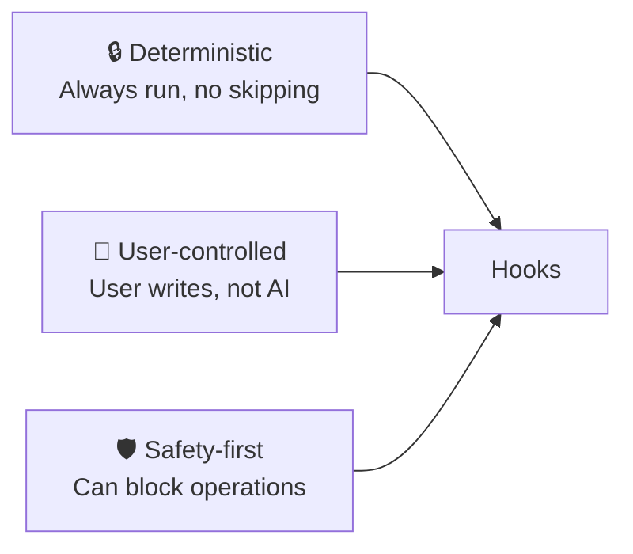
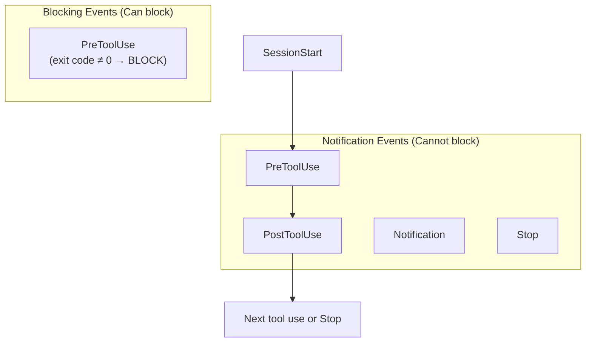

# Claude Code Hooks — Overview

> [!NOTE]
> **Official docs:** [Anthropic Hooks Documentation](https://docs.anthropic.com/en/docs/claude-code/hooks)
> **Supported from:** Claude Code 1.0.34+
> **Configuration file:** `.claude/settings.json` or `.claude/settings.local.json`

---

## 1. What are Claude Code Hooks?

**Claude Code Hooks** are a system that allows you to run **custom actions** at specific points in Claude Code's lifecycle — without needing human approval. These actions can be:

- **Shell commands** (bash/zsh scripts)
- **HTTP requests** (call APIs, webhooks)
- **LLM evaluations** (check AI output against criteria)

In simple terms: Hooks are "triggers" that let you automate things you previously had to do manually — like formatting code after writing, checking for secrets before committing, or validating output before responding.

### Core Problems Hooks Solve

| Problem | Description | How Hooks Solve It |
|---|---|---|
| **Manual approval fatigue** | Having to approve every `git commit`, `npm install`... dozens of times per session | Hooks auto-run predefined commands without asking |
| **Lack of standardized quality checks** | No built-in mechanism to check AI output before it reaches user | `PostToolUse` hooks can lint, format, scan after every tool use |
| **Missing workflow automation** | No way to auto-send notifications, log, or sync when events happen in Claude Code | Hooks can call webhooks, scripts, APIs at any lifecycle point |
| **Uncontrolled tool usage** | AI can run any allowed command without review | `PreToolUse` hooks can gate commands, reject dangerous operations |

---

## 2. Design Philosophy

> *"Hooks are for **deterministic, user-controlled automation** — not AI decision-making."*

### 3 Core Principles



1. **Deterministic:** Hooks ALWAYS run when conditions are met. Claude cannot skip or modify hooks.
2. **User-controlled:** Only users configure hooks. Claude cannot create, edit, or disable hooks.
3. **Safety-first:** Hooks can BLOCK operations (non-zero exit code = block). This is a protection mechanism.

---

## 3. Who Should Use Hooks?

| Audience | Use Case |
|---|---|
| **Developers who value automation** | Auto-format, auto-lint, auto-test after every change |
| **Security-conscious teams** | Scan for secrets, block dangerous commands, audit trails |
| **AI researchers** | Log and evaluate AI behavior at every step |
| **DevOps engineers** | Auto-sync, notifications, CI/CD triggers |
| **Anyone tired of approval prompts** | Reduce friction without sacrificing safety |

---

## 4. Architecture Overview

### 4.1. Hook Event Types



| Event | When it fires | Can block? | Use case |
|---|---|---|---|
| **PreToolUse** | Before Claude executes any tool | ✅ Yes | Validate, gate, prevent |
| **PostToolUse** | After Claude finishes using a tool | ❌ No | Format, lint, log, notify |
| **Notification** | When Claude sends a notification | ❌ No | External alerts, Slack/Discord |
| **Stop** | When Claude finishes a turn | ❌ No | Summary, metrics, cleanup |
| **SessionStart** | When a new session starts | ❌ No | Init environment, load context |

### 4.2. Handler Types

| Handler Type | Mechanism | Use Case |
|---|---|---|
| **command** | Execute shell command | Run linters, formatters, scripts |
| **http** | Send HTTP request | Webhooks, API calls, notifications |
| **llm** | LLM evaluation | Check output quality, compliance |

### 4.3. Configuration Scope

| Scope | File | Who manages | Committed to git? |
|---|---|---|---|
| **User** | `~/.claude/settings.json` | Individual user | No |
| **Project** | `.claude/settings.json` | Team | Yes |
| **Local** | `.claude/settings.local.json` | Individual, project-specific | No |

---

## 5. Key Features

### 5.1. Matcher System

Hooks use matchers to filter WHICH tool invocations trigger them:

```json
{
  "matcher": "Write|Edit",
  "hooks": [{ "type": "command", "command": "prettier --write $CLAUDE_FILE_PATH" }]
}
```

| Matcher | Matches |
|---|---|
| `Write` | File write operations |
| `Edit` | File edit operations |
| `Bash` | Shell command executions |
| `Write\|Edit` | Both write and edit |
| (empty) | All tool uses |

### 5.2. Environment Variables

Hooks receive context through environment variables:

| Variable | Available in | Content |
|---|---|---|
| `$CLAUDE_TOOL_NAME` | PreToolUse, PostToolUse | Name of the tool being used |
| `$CLAUDE_TOOL_INPUT` | PreToolUse, PostToolUse | JSON input to the tool |
| `$CLAUDE_FILE_PATH` | PostToolUse (Write/Edit) | Path of the file being modified |
| `$CLAUDE_SESSION_ID` | All events | Current session ID |
| `$CLAUDE_PROJECT_DIR` | All events | Project root directory |

### 5.3. Blocking Mechanism

For `PreToolUse` hooks:
- **Exit code 0** → Operation proceeds
- **Exit code ≠ 0** → Operation is **BLOCKED**, stderr message shown to Claude
- Claude can see the error and adjust its approach

### 5.4. LLM Evaluation

```json
{
  "type": "llm",
  "prompt": "Check if this code follows our security guidelines: {{tool_input}}"
}
```

LLM hooks evaluate content against criteria — useful for automated code review, compliance checking, etc.

---

## 6. Configuration Example

```json
{
  "hooks": {
    "PreToolUse": [
      {
        "matcher": "Bash",
        "hooks": [
          {
            "type": "command",
            "command": "echo $CLAUDE_TOOL_INPUT | jq -r '.command' | grep -qE '^rm -rf /' && exit 1 || exit 0"
          }
        ]
      }
    ],
    "PostToolUse": [
      {
        "matcher": "Write|Edit",
        "hooks": [
          {
            "type": "command",
            "command": "prettier --write $CLAUDE_FILE_PATH 2>/dev/null; exit 0"
          }
        ]
      }
    ],
    "Stop": [
      {
        "matcher": "",
        "hooks": [
          {
            "type": "command",
            "command": "echo 'Turn completed' >> ~/.claude/activity.log"
          }
        ]
      }
    ]
  }
}
```

---

## 7. Comparison: Hooks vs Other Mechanisms

| Feature | Hooks | CLAUDE.md Rules | Permission System |
|---|---|---|---|
| **Enforcement** | Deterministic, always runs | Suggestions, AI may ignore | Allow/deny list |
| **Automation** | Full (scripts, APIs, LLM) | None | None |
| **Blocking** | ✅ PreToolUse can block | ❌ Cannot block | ✅ Can deny |
| **Customization** | Shell commands, HTTP, LLM | Natural language | Static list |
| **Scope** | Per-event, per-tool | Global context | Per-tool/command |

---

## See Also

- [1. Architecture and Logic](./1. Architecture and Logic.md) — Internal architecture, data flow, processing pipeline details
- [2. Playbook](./2. Playbook.md) — Installation, Day 1 workflow, cheat sheet, troubleshooting
- [3. Decision Guide](./3. Decision Guide.md) — Comparison, use cases, costs, decision guide
