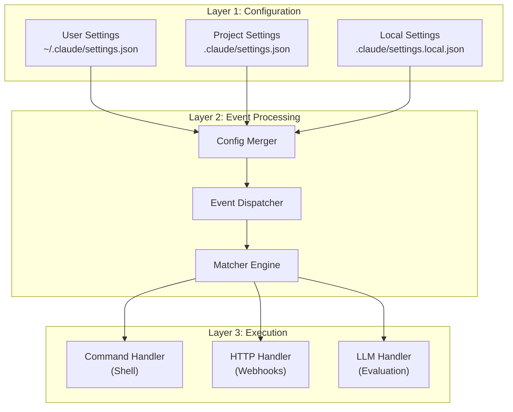
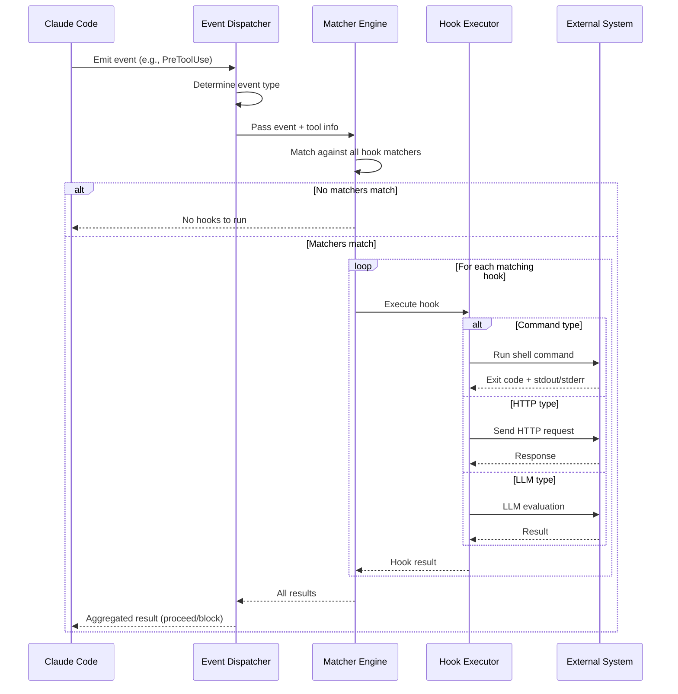
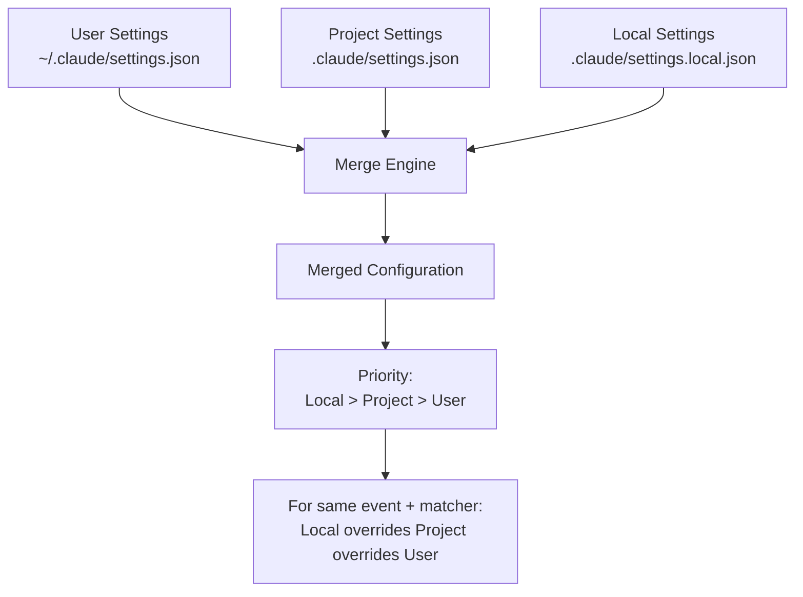
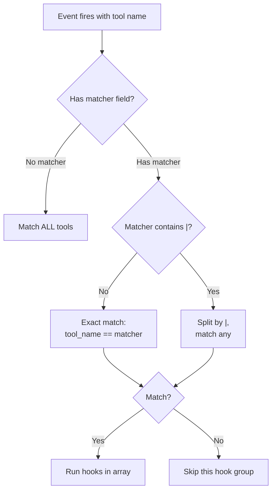
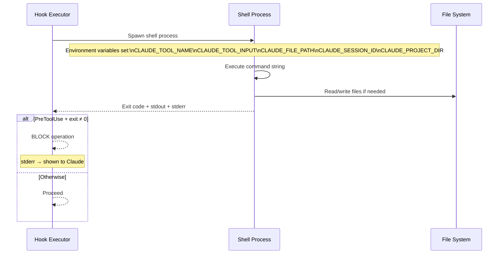
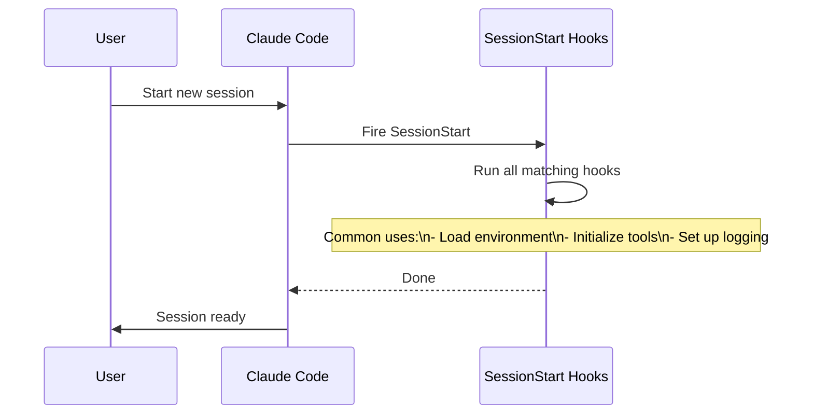
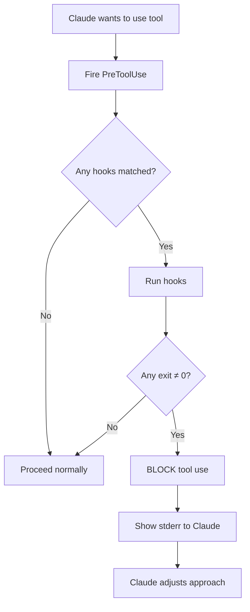
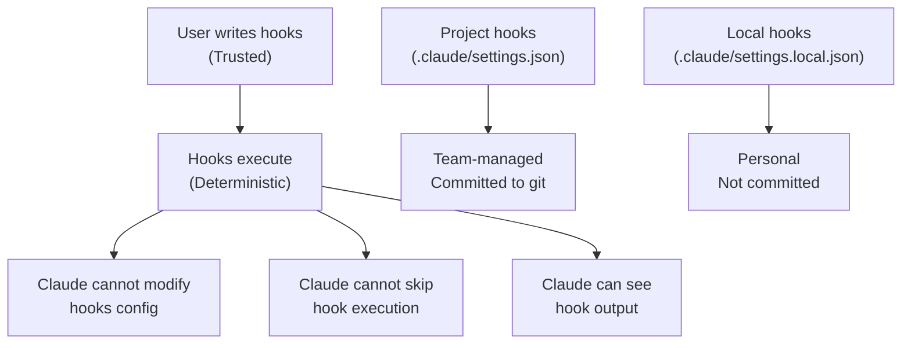

# Claude Code Hooks — Architecture and Logic

> [!NOTE]
> This document dives deep into the **internal workings** of the Hook system. Read [[3-Research/Github/Claude Code Hooks/0. Overview]] first to grasp the big picture.

---

## 1. Overall Architecture Model

### 3-Layer Architecture



### Core Architecture Principles

1. **Configuration Layering:** Three layers of config merge together — User < Project < Local.
2. **Event-Driven:** Every action in Claude Code emits events that hooks can intercept.
3. **Deterministic Execution:** Hooks ALWAYS run when matched — no randomness, no AI decision.
4. **Isolation:** Each hook runs in its own process — one failing hook doesn't crash others.
5. **Fail-Open (default):** Non-blocking events ignore hook failures. Only PreToolUse can block.

---

## 2. Detailed Data Flow

### 2.1. Event Lifecycle



### 2.2. Configuration Merge Process



**Merge Rules:**

| Scenario | Result |
|---|---|
| Only User config | User hooks apply |
| User + Project config | Both apply, Project hooks run after User |
| User + Project + Local | All apply, execution order: User → Project → Local |
| Same matcher in multiple configs | All hooks run, in priority order |

### 2.3. Matcher Resolution



**Matcher Examples:**

| Matcher | Matches | Does NOT match |
|---|---|---|
| `"Write"` | Write | Edit, Bash, Read |
| `"Write|Edit"` | Write, Edit | Bash, Read |
| `"Bash"` | Bash | Write, Edit |
| `""` (empty) | Everything | Nothing (matches all) |

---

## 3. Handler Deep Dive

### 3.1. Command Handler



**Execution Details:**

| Property | Value |
|---|---|
| Shell | User's default shell (bash/zsh) |
| Working directory | Project root (`$CLAUDE_PROJECT_DIR`) |
| Timeout | Configurable, default varies |
| stdin | Piped from previous command (if chained) |
| stdout | Captured, available to Claude |
| stderr | Captured, shown as error if blocking |

### 3.2. HTTP Handler

```json
{
  "type": "http",
  "url": "https://hooks.example.com/notify",
  "method": "POST",
  "headers": {
    "Authorization": "Bearer $HOOK_TOKEN"
  },
  "body": {
    "event": "{{event_type}}",
    "tool": "{{tool_name}}",
    "input": "{{tool_input}}"
  }
}
```

**Template Variables:**

| Variable | Value |
|---|---|
| `{{event_type}}` | Current event name |
| `{{tool_name}}` | Tool being used |
| `{{tool_input}}` | JSON input to tool |
| `{{tool_output}}` | Tool output (PostToolUse only) |
| `{{session_id}}` | Session identifier |

### 3.3. LLM Handler

```json
{
  "type": "llm",
  "prompt": "Review this code change for security issues:\n\n{{tool_input}}",
  "model": "claude-sonnet",
  "threshold": 0.8
}
```

The LLM evaluates the prompt and returns a pass/fail judgment. For PreToolUse, failing the evaluation blocks the operation.

---

## 4. Event Types — Detailed Behavior

### 4.1. SessionStart



- **Cannot block:** SessionStart hooks always proceed
- **Fires on:** New session, resume, clear, compact

### 4.2. PreToolUse



- **CAN block:** Most powerful event type
- **Use case:** Security gates, validation, approval workflows

### 4.3. PostToolUse

- **Cannot block** (tool already executed)
- **Common uses:** Format files, run linters, log activity, send notifications

### 4.4. Notification

- **Cannot block**
- **Fires when:** Claude sends a notification (e.g., task complete)
- **Common uses:** Forward to Slack, Discord, email

### 4.5. Stop

- **Cannot block**
- **Fires when:** Claude completes a turn
- **Common uses:** Summary logging, metrics, cleanup

---

## 5. Security Model

### 5.1. Security Boundaries



### 5.2. Trust Model

| Actor | Can configure hooks? | Can skip hooks? | Can see hook output? |
|---|---|---|---|
| **User** | ✅ Yes | ✅ By removing config | ✅ Yes |
| **Claude** | ❌ No | ❌ No | ✅ Yes (stdout/stderr) |
| **Team** | ✅ Via project settings | ❌ No (unless editing config) | ✅ Yes |

---

## 6. Error Handling & Recovery

| Error | Behavior |
|---|---|
| Hook command fails (non-PreToolUse) | Logged, execution continues |
| Hook command fails (PreToolUse) | Tool use BLOCKED, stderr shown to Claude |
| Hook timeout | Hook killed, treated as failure |
| HTTP hook network error | Logged, treated as non-blocking failure |
| LLM hook API error | Logged, treated as non-blocking failure |
| Invalid config JSON | Hooks not loaded, warning shown |

---

## See Also

- [[3-Research/Github/Claude Code Hooks/0. Overview]] — Overview, philosophy, key features
- [[3-Research/Github/Claude Code Hooks/2. Playbook]] — Practical guide, cheat sheet, troubleshooting
- [[3-Research/Github/Claude Code Hooks/3. Decision Guide]] — Comparison, use cases, decision guide
