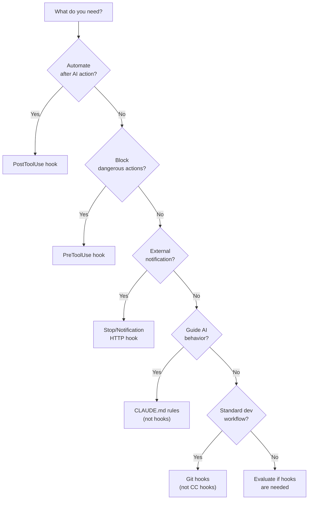

# Claude Code Hooks — Decision Guide

> [!NOTE]
> Read this document BEFORE deciding to use Hooks. Read [0. Overview](./0. Overview.md) if you don't know what Hooks are yet.

---

## 1. Comparison Between Hook Types

### 1.1. Handler Type Comparison

| Aspect | Command (Shell) | HTTP (Webhook) | LLM (Evaluation) |
|---|---|---|---|
| **Speed** | Fast (local) | Medium (network) | Slow (API call) |
| **Cost** | Free | Free (depends on endpoint) | Costs per API call |
| **Flexibility** | Very high (any script) | Medium (HTTP only) | Medium (prompt-based) |
| **Blocking capability** | ✅ Via exit code | ⚠️ Via status code | ✅ Via evaluation result |
| **Debugging** | Easy (local logs) | Medium (network inspection) | Hard (LLM output varies) |
| **Best for** | Formatting, linting, scripts | Notifications, webhooks | Quality checks, compliance |

### 1.2. Event Type Comparison

| Event | Best For | Not For |
|---|---|---|
| **PreToolUse** | Security gates, validation, blocking dangerous operations | Logging (use PostToolUse) |
| **PostToolUse** | Formatting, linting, logging, notifications | Blocking (can't block after execution) |
| **SessionStart** | Environment setup, context loading | Per-tool operations |
| **Notification** | External alerts (Slack, Discord) | Code changes |
| **Stop** | Summary, metrics, cleanup | Per-tool operations |

---

## 2. Hooks vs Alternatives

### 2.1. Hooks vs CLAUDE.md Rules

| Aspect | Hooks | CLAUDE.md Rules |
|---|---|---|
| **Enforcement** | Deterministic — always runs | Suggestive — AI may choose to ignore |
| **Type of action** | External commands, HTTP, LLM | Natural language instructions |
| **Can block operations** | ✅ PreToolUse | ❌ Cannot block |
| **Configuration** | JSON in settings files | Markdown in CLAUDE.md |
| **Flexibility** | Limited to predefined events | Unlimited (any instruction) |
| **When to choose Hooks** | Enforcement, automation, external integration | |
| **When to choose CLAUDE.md** | | Behavioral guidance, coding style, preferences |

> [!IMPORTANT]
> **Use both together.** They are complementary:
> - CLAUDE.md: "Always use TypeScript strict mode" (guidance)
> - Hooks: Auto-run `tsc --strict` after every file write (enforcement)

### 2.2. Hooks vs Permission System

| Aspect | Hooks | Permission System |
|---|---|---|
| **Mechanism** | Custom scripts/HTTP/LLM | Allow/deny list |
| **Granularity** | Per-event, conditional logic | Per-tool/command pattern |
| **Dynamic** | ✅ Can check context, file content | ❌ Static patterns only |
| **Blocking** | ✅ PreToolUse only | ✅ Deny list blocks |
| **When to choose Hooks** | Dynamic security checks, conditional logic | |
| **When to choose Permissions** | | Simple allow/deny for known tools |

### 2.3. Hooks vs Git Hooks

| Aspect | Claude Code Hooks | Git Hooks |
|---|---|---|
| **Trigger** | Claude Code lifecycle events | Git operations (commit, push...) |
| **Scope** | Only within Claude Code | All Git operations |
| **Context** | Full Claude context (tool, input, session) | Git-specific context |
| **Blocking** | ✅ PreToolUse | ✅ Pre-commit, pre-push |
| **When to choose CC Hooks** | AI-specific automation | |
| **When to choose Git Hooks** | | Standard dev workflow, non-AI operations |

---

## 3. When to Use Hooks

### ✅ Ideal Use Cases

| Scenario | Hook Type | Why Hooks Fit |
|---|---|---|
| **Auto-format code after AI writes** | PostToolUse (command) | Deterministic, always runs |
| **Block dangerous commands** | PreToolUse (command) | Can block, sees command before execution |
| **Secret scanning** | PreToolUse (command) | Prevent secrets from being written |
| **Slack/Discord notifications** | Stop (http) | External integration, non-blocking |
| **Activity logging** | PostToolUse (command) | Audit trail for AI actions |
| **Code quality gate** | PreToolUse (llm) | AI-powered quality check |
| **Auto-run tests** | PostToolUse (command) | Immediate feedback after changes |
| **Environment setup** | SessionStart (command) | Consistent environment per session |

### Signals You Should Use Hooks

- [ ] You find yourself manually running formatters after AI edits
- [ ] You worry about AI running dangerous commands
- [ ] You want notifications when AI completes tasks
- [ ] You need an audit trail of AI actions
- [ ] You want consistent code quality regardless of AI behavior

---

## 4. When NOT to Use Hooks

### ❌ Anti-Use-Cases

| Scenario | Why Hooks Are NOT Suitable | Use Instead |
|---|---|---|
| **Complex AI behavior control** | Hooks are deterministic, not decision-making | CLAUDE.md rules |
| **Conversational guidance** | Hooks can't modify AI's response style | System prompt, CLAUDE.md |
| **Non-Claude workflows** | Hooks only work in Claude Code | Git hooks, CI/CD, other tools |
| **Heavy processing per tool use** | Slows down every AI action | Background jobs, CI pipeline |
| **Dynamic AI instruction** | Hooks don't inject instructions back | CLAUDE.md, context files |

### Limitations

| Limitation | Impact | Workaround |
|---|---|---|
| **Claude Code only** | Not available in other AI tools | Use tool-specific mechanisms |
| **No async hooks** | Hooks run synchronously (blocking) | Keep hooks fast, offload to background |
| **Limited event types** | Only 5 event types | Combine with Git hooks, CI for more coverage |
| **No conditional hooks** | Matcher is tool-name only, not content-based | Use command scripts with conditional logic |

---

## 5. Cost & Resources

| Item | Cost |
|---|---|
| **Hooks feature** | Free (built into Claude Code) |
| **Command hooks** | Free (local execution) |
| **HTTP hooks** | Depends on endpoint |
| **LLM hooks** | API call costs |

---

## 6. Decision Matrix

| Scenario | Recommendation | Reason |
|---|---|---|
| Auto-format code | ✅ **PostToolUse command** | Deterministic, fast, free |
| Block dangerous commands | ✅ **PreToolUse command** | Only mechanism that can block |
| Enforce coding style | ⚠️ **CLAUDE.md + PostToolUse** | Guidance + enforcement |
| Secret scanning | ✅ **PreToolUse command** | Block before write |
| Team notifications | ✅ **Stop http** | Non-blocking, external |
| AI behavior control | ❌ **Use CLAUDE.md** | Hooks can't control AI reasoning |
| Complex workflows | ⚠️ **Hooks + Scripts** | Keep hooks simple, logic in scripts |
| Activity logging | ✅ **PostToolUse command** | Complete audit trail |

### Decision Flowchart

---

## See Also

- [0. Overview](./0. Overview.md) — Overview of the Claude Code Hooks system
- [1. Architecture and Logic](./1. Architecture and Logic.md) — Internal architecture and mechanisms
- [2. Playbook](./2. Playbook.md) — Practical operations guide
