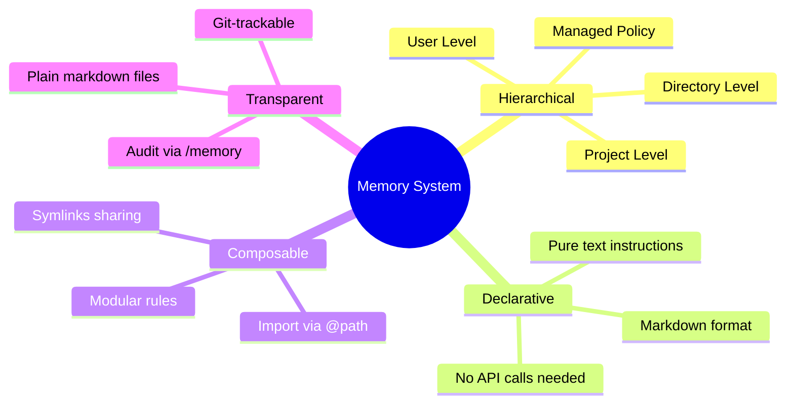
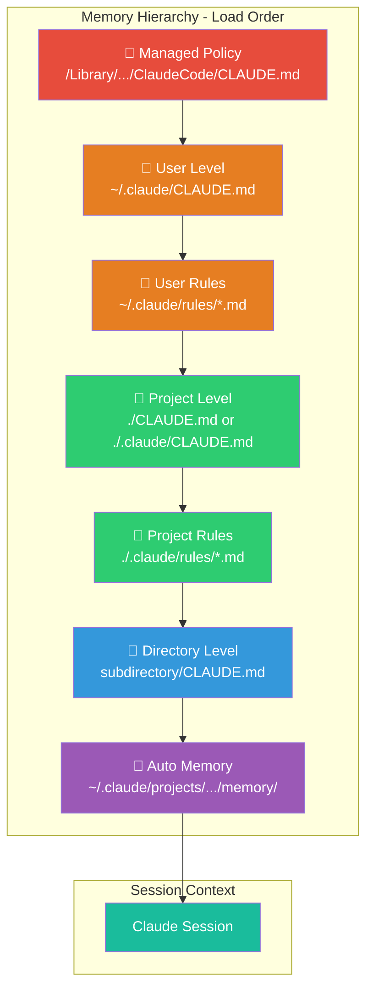
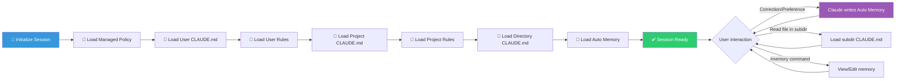

# Claude Code Memory — Overview

## 1. What is Claude Code Memory?

**Claude Code Memory** is Claude Code's persistent memory system, allowing Claude to **remember context, rules, and knowledge** across working sessions. Instead of repeating instructions every time you open a new terminal, Memory helps Claude automatically load important information at the beginning of each session.

The system consists of **2 main mechanisms**:

| Feature | CLAUDE.md files | Auto Memory |
|---|---|---|
| **Who writes** | You (developer) | Claude writes automatically |
| **Content** | Instructions, rules, conventions | Learnings, patterns, corrections |
| **Scope** | Project, User, or Organization | Per working tree (per project) |
| **Loaded into session** | Every session | Every session (first 200 lines of MEMORY.md) |
| **Format** | Free-form Markdown | Auto-generated Markdown |
| **Control** | Entirely by you | Review/edit via `/memory` |

## 2. Problems Solved

| Problem | Description | How Memory Solves It |
|---|---|---|
| **Context lost after each session** | Claude remembers nothing from the previous session | CLAUDE.md + auto memory reload context automatically |
| **Repeating instructions** | Having to remind coding style, conventions over and over | Write once in CLAUDE.md, apply forever |
| **Slow onboarding** | New team members don't know conventions | CLAUDE.md committed to repo = shared knowledge |
| **Claude forgets corrections** | Fixed an error, next session makes the same mistake | Auto memory records learnings automatically |
| **Different config per team** | Frontend team vs Backend team need different rules | `.claude/rules/` with path-specific scoping |
| **Organization standards** | Need to enforce rules company-wide | Managed policy CLAUDE.md at system level |

## 3. Design Philosophy

**Core principles:**

| Principle | Explanation |
|---|---|
| **Simplicity** | Just create a `.md` file — no complex config needed |
| **Hierarchy** | Rules cascade from system → user → project → directory |
| **Specificity** | Specific rules (path-scoped) take priority over general rules |
| **Transparency** | All memory is readable/editable — no black box |
| **Team-first** | CLAUDE.md committed to repo = shared across team |

## 4. Who Should Use It?

| Audience | Reason |
|---|---|
| **Solo developer** | Speed up workflow, no repeating instructions |
| **Team lead** | Enforce coding standards via shared CLAUDE.md |
| **Enterprise** | Deploy org-wide policies, compliance rules |
| **OSS maintainer** | Onboard contributors quickly with project CLAUDE.md |
| **AI-native developer** | Maximize Claude's context awareness |

## 5. Architecture Overview

| Layer | Location | Scope | Example Content |
|---|---|---|---|
| **Managed Policy** | `/Library/Application Support/ClaudeCode/CLAUDE.md` | Entire machine (org-wide) | Security policies, compliance |
| **User** | `~/.claude/CLAUDE.md` | All user's projects | Personal coding style |
| **User Rules** | `~/.claude/rules/*.md` | All user's projects | Personal workflows |
| **Project** | `./CLAUDE.md` or `./.claude/CLAUDE.md` | Current project | Project conventions, tech stack |
| **Project Rules** | `./.claude/rules/*.md` | Project (path-scoped) | API rules, testing rules |
| **Directory** | `subdirectory/CLAUDE.md` | Specific subdirectory | Module-specific instructions |
| **Auto Memory** | `~/.claude/projects/<project>/memory/` | Per working tree | Learnings, patterns discovered |

## 6. Lifecycle / Main Workflow

**Operation flow:**

1. **Session initializes** → Claude automatically loads all CLAUDE.md files according to hierarchy
2. **During session** → Claude loads additional directory-level CLAUDE.md when navigating into subdirectories
3. **User corrects** → Auto memory automatically records the correction/pattern
4. **Review** → User uses `/memory` to audit and edit memory
5. **Session ends** → Auto memory persists, ready for the next session

## 7. Key Features

| # | Feature | Description |
|---|---|---|
| 1 | **Hierarchical Loading** | 6 layers from system → directory, automatically merged |
| 2 | **Path-Scoped Rules** | Rules only apply to specific file types/folders via `paths:` frontmatter |
| 3 | **@import System** | Import external files into CLAUDE.md using `@path/to/file` |
| 4 | **Auto Memory** | Claude automatically records learnings from corrections — no user action needed |
| 5 | **`/memory` Command** | Built-in UI to view, edit, delete memories |
| 6 | **`--add-dir` Support** | Load CLAUDE.md from directories outside the project |
| 7 | **Symlink Sharing** | Share rules across projects via filesystem symlinks |
| 8 | **`claudeMdExcludes`** | Exclude specific CLAUDE.md files in monorepo/large teams |
| 9 | **Team Scalability** | Org-wide managed policy + per-team rules + per-dev preferences |
| 10 | **Compact Survival** | CLAUDE.md instructions survive `/compact` — chat-only instructions do not |

## 8. Comparison with Other Approaches

| Criteria | Claude Code Memory | Cursor Rules | GitHub Copilot Instructions | Codeium Context |
|---|---|---|---|---|
| **Structure** | Hierarchical (6 layers) | Flat `.cursorrules` | Single `.github/copilot-instructions.md` | Project-level |
| **Auto learning** | ✅ Auto Memory | ❌ | ❌ | ❌ |
| **Path scoping** | ✅ `paths:` frontmatter | ❌ | ❌ | ❌ |
| **Team sharing** | ✅ Git + Managed Policy | ✅ Git | ✅ Git | ✅ Git |
| **Import system** | ✅ `@path` | ❌ | ❌ | ❌ |
| **Org-wide policy** | ✅ Managed Policy | ❌ | ❌ | ❌ |
| **Audit tool** | ✅ `/memory` | ❌ | ❌ | ❌ |

## 9. Notable New Features

| Feature | Details |
|---|---|
| **Auto Memory with topic files** | Memory is organized into multiple files by topic (debugging.md, api-conventions.md...) instead of a single file |
| **`claudeMdExcludes`** | New setting that allows excluding CLAUDE.md files in monorepo environments |
| **`--add-dir` + env var** | Support for loading CLAUDE.md from shared config directories outside the project |
| **InstructionsLoaded hook** | Hook to debug exactly which files are being loaded |
| **Subagent memory** | Sub-agents can maintain their own auto memory |

## 10. See Also

- [[1. Architecture and Logic]] — Load mechanisms, data flow, path resolution in detail
- [[2. Playbook]] — Installation, configuration, and Memory operation guide
