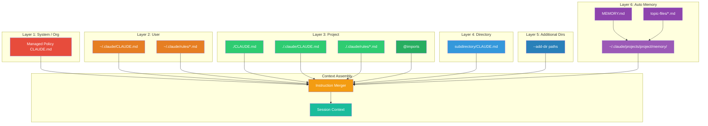
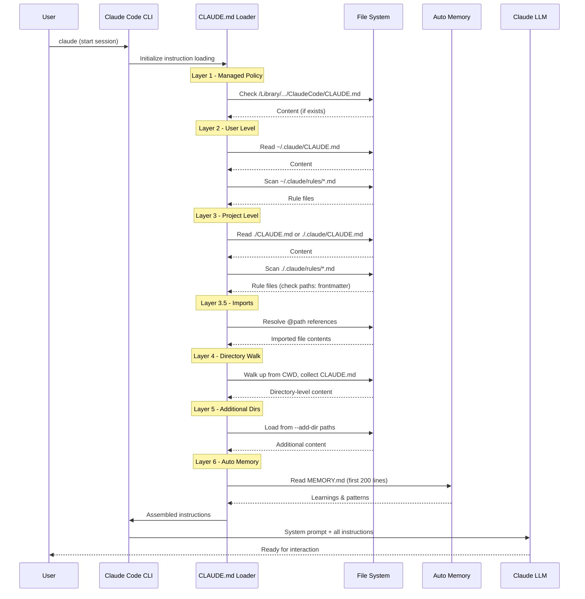
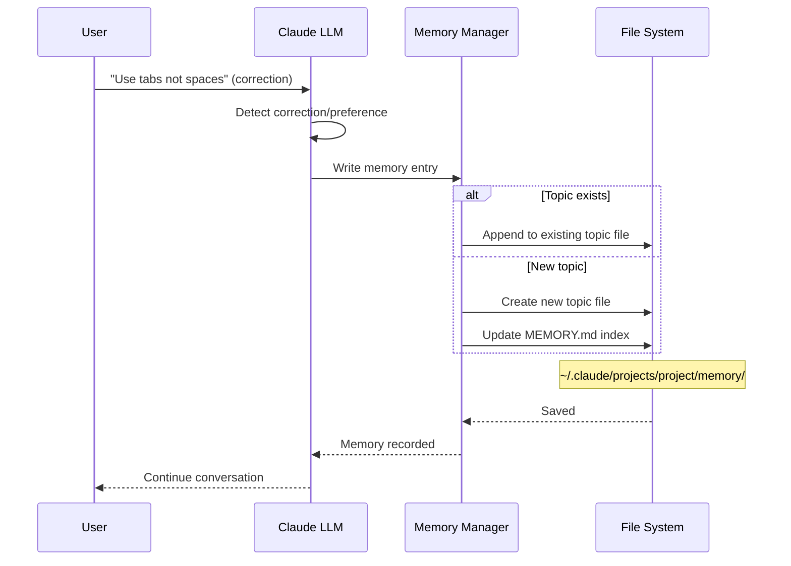
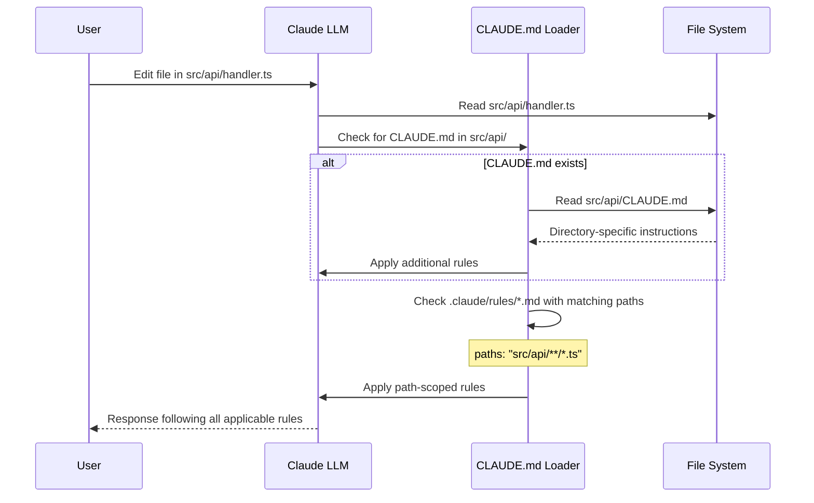
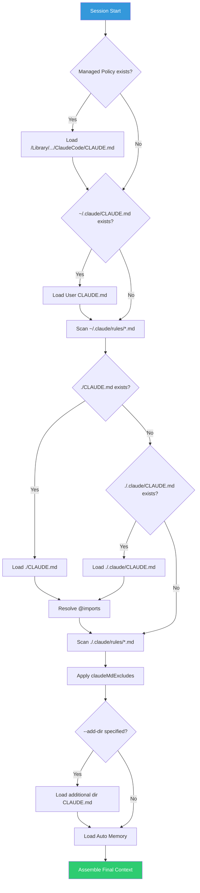
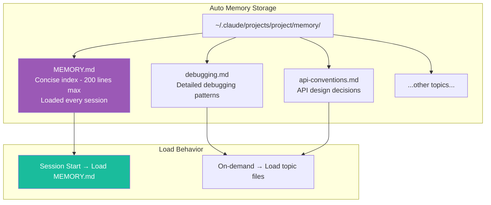

# Claude Code Memory — Architecture and Logic

## 1. Overall Architecture Model



**3-pillar architecture:**

| Pillar | Components | Description |
|---|---|---|
| **Static Instructions** | CLAUDE.md files (all layers) | Developer-written, deterministic, version-controlled |
| **Modular Rules** | `.claude/rules/*.md` | Path-scoped, composable, sharable via symlinks |
| **Dynamic Learning** | Auto Memory | Claude auto-generated, per-project, evolving over time |

## 2. Detailed Data Flow

### 2.1. Session Initialization Flow



### 2.2. Auto Memory Write Flow



### 2.3. Directory Navigation Flow



## 3. Core Modules / Components

| Module | Role | Input | Output |
|---|---|---|---|
| **CLAUDE.md Loader** | Scan & load all CLAUDE.md files by hierarchy | File system paths | Merged instruction text |
| **Import Resolver** | Resolve `@path/to/file` references | CLAUDE.md content | Expanded content with imports |
| **Rules Engine** | Load & filter `.claude/rules/*.md` by `paths:` frontmatter | Rule files + current file path | Applicable rules |
| **Directory Walker** | Walk up directory tree to find CLAUDE.md | CWD + file being edited | Directory-level instructions |
| **Auto Memory Manager** | Read/write MEMORY.md and topic files | Conversation context | Persisted learnings |
| **Memory UI** | `/memory` command handler | User command | Interactive view/edit |
| **Exclusion Filter** | Apply `claudeMdExcludes` patterns | All discovered CLAUDE.md | Filtered list |
| **Instruction Merger** | Combine all sources into final context | All instruction sources | Unified system prompt |

## 4. Internal Operating Mechanisms

### 4.1. CLAUDE.md Discovery Algorithm



### 4.2. Path-Scoped Rules Resolution

When Claude is working with file `src/api/users.ts`:

```
.claude/rules/
├── code-style.md          # No paths: → applies to ALL files
├── testing.md             # paths: ["tests/**/*.test.ts"] → DOES NOT apply
├── api-design.md          # paths: ["src/api/**/*.ts"] → APPLIES ✅
└── security.md            # paths: ["src/**/*"] → APPLIES ✅
```

**Matching logic:**

| Rule file | `paths:` value | File being edited | Match? |
|---|---|---|---|
| `code-style.md` | _(none)_ | `src/api/users.ts` | ✅ Apply (global) |
| `testing.md` | `["tests/**/*.test.ts"]` | `src/api/users.ts` | ❌ Skip |
| `api-design.md` | `["src/api/**/*.ts"]` | `src/api/users.ts` | ✅ Apply |
| `security.md` | `["src/**/*"]` | `src/api/users.ts` | ✅ Apply |

**Supported glob patterns:**

| Pattern | Meaning | Example |
|---|---|---|
| `**/*.ts` | Any .ts file at any depth | `src/deep/nested/file.ts` |
| `src/**/*` | Any file within src/ | `src/api/handler.ts` |
| `*.md` | Only .md files at root | `README.md` |
| `src/components/*.tsx` | .tsx files directly in components/ | `src/components/Button.tsx` |
| `src/**/*.{ts,tsx}` | .ts or .tsx files within src/ | `src/utils/helper.ts` |

### 4.3. Import Resolution (`@path`)

```
# CLAUDE.md
See @README for project overview and @package.json for available npm commands.

# Additional Instructions
- Git workflow: @docs/git-instructions.md

# Individual Preferences
- @~/.claude/my-project-instructions.md
```

**Resolution rules:**

| Syntax | Resolve to | Scope |
|---|---|---|
| `@README` | `./README.md` (or `./README`) | Project-relative |
| `@package.json` | `./package.json` | Project-relative |
| `@docs/git-instructions.md` | `./docs/git-instructions.md` | Project-relative |
| `@~/.claude/my-instructions.md` | `$HOME/.claude/my-instructions.md` | User home |

**Note:** Import content is inlined into context — not lazy loaded.

### 4.4. Auto Memory Internal Architecture



**How Auto Memory works:**

| Step | Action | Details |
|---|---|---|
| 1 | **Detection** | Claude recognizes a user correction or new preference |
| 2 | **Classification** | Determines the appropriate topic (debugging, style, API...) |
| 3 | **Write** | Writes to the corresponding topic file or creates a new one |
| 4 | **Index Update** | Updates MEMORY.md index if needed |
| 5 | **Load** | Next session: MEMORY.md is loaded automatically |

**MEMORY.md** is the main file — always loaded into every session (first 200 lines). Topic files are only loaded on-demand when needed.

### 4.5. Directory Walk Algorithm

When Claude is working in `foo/bar/`:

```
project-root/
├── CLAUDE.md              ← Level 0 (project root) — ALWAYS loaded
├── foo/
│   ├── CLAUDE.md          ← Level 1 — loaded when working in foo/
│   └── bar/
│       └── CLAUDE.md      ← Level 2 — loaded when working in foo/bar/
```

Claude **walks UP** from the current directory to root, loading in order:
1. `foo/bar/CLAUDE.md`
2. `foo/CLAUDE.md`
3. `./CLAUDE.md` (project root — always loaded)

## 5. Configuration / API

### 5.1. Settings Affecting Memory

| Setting | Location | Value | Default | Description |
|---|---|---|---|---|
| `autoMemoryEnabled` | `.claude/settings.json` | `true` / `false` | `true` | Enable/disable auto memory |
| `claudeMdExcludes` | `.claude/settings.local.json` | Array of glob patterns | `[]` | Exclude CLAUDE.md files |

### 5.2. Environment Variables

| Variable | Value | Description |
|---|---|---|
| `CLAUDE_CODE_DISABLE_AUTO_MEMORY` | `1` | Disable auto memory completely |
| `CLAUDE_CODE_ADDITIONAL_DIRECTORIES_CLAUDE_MD` | `1` | Allow loading CLAUDE.md from `--add-dir` paths |

### 5.3. CLI Flags

| Flag | Example | Description |
|---|---|---|
| `--add-dir` | `claude --add-dir ../shared-config` | Load CLAUDE.md from additional directory |

### 5.4. Slash Commands

| Command | Description |
|---|---|
| `/memory` | View and edit auto memory interactively |
| `/init` | Create a new CLAUDE.md for the current project |
| `/compact` | Compact conversation but retain CLAUDE.md instructions |

### 5.5. CLAUDE.md File Locations Summary

| Scope | Path (macOS) | Path (Linux/WSL) | Path (Windows) |
|---|---|---|---|
| **Managed Policy** | `/Library/Application Support/ClaudeCode/CLAUDE.md` | `/etc/claude-code/CLAUDE.md` | `C:\Program Files\ClaudeCode\CLAUDE.md` |
| **User** | `~/.claude/CLAUDE.md` | `~/.claude/CLAUDE.md` | `~/.claude/CLAUDE.md` |
| **User Rules** | `~/.claude/rules/*.md` | `~/.claude/rules/*.md` | `~/.claude/rules/*.md` |
| **Project** | `./CLAUDE.md` or `./.claude/CLAUDE.md` | ← same | ← same |
| **Project Rules** | `./.claude/rules/*.md` | ← same | ← same |

### 5.6. `claudeMdExcludes` Configuration

```json
// .claude/settings.local.json
{
  "claudeMdExcludes": [
    "**/monorepo/CLAUDE.md",
    "/home/user/monorepo/other-team/.claude/rules/**"
  ]
}
```

`claudeMdExcludes` can be placed in any [settings layer](https://code.claude.com/docs/en/settings#settings-files).

### 5.7. Path-Scoped Rules Frontmatter

```yaml
---
paths:
  - "src/api/**/*.ts"
---

# API Development Rules

- All API endpoints must include input validation
- Use the standard error response format
- Include OpenAPI documentation comments
```

**Multi-pattern support:**

```yaml
---
paths:
  - "src/**/*.{ts,tsx}"
  - "lib/**/*.ts"
  - "tests/**/*.test.ts"
---
```

## 6. Error Handling / Recovery

| Issue | Cause | Solution |
|---|---|---|
| **Claude doesn't follow CLAUDE.md** | File not loaded — wrong location | Run `/memory` to check loaded files |
| **Instructions too vague** | "Format code nicely" instead of specific | Write specifically: "Use 2-space indentation" |
| **Conflicts between multiple CLAUDE.md** | 2 files giving contradictory instructions | Review all files, remove conflicts |
| **Auto memory saved incorrectly** | Claude misunderstood correction | Use `/memory` to review and delete |
| **CLAUDE.md too large** | File > 200 lines → reduced adherence | Split into `@imports` or `.claude/rules/` |
| **Instructions lost after `/compact`** | Instructions only said in chat, not in CLAUDE.md | Persist instructions into CLAUDE.md file |
| **Monorepo conflict** | Other team has conflicting CLAUDE.md | Use `claudeMdExcludes` to exclude |

## 7. Security

| Aspect | Details |
|---|---|
| **Managed Policy** | IT admins deploy org-wide rules — users cannot override |
| **Local-only storage** | Auto memory is stored locally (`~/.claude/`), not sent to cloud |
| **Git-trackable** | Project CLAUDE.md committed to repo → audit trail |
| **Exclude sensitive** | `claudeMdExcludes` prevents loading unwanted files |
| **User control** | `/memory` allows reviewing/deleting any auto memory |
| **No black box** | All memory is plain markdown — readable with any text editor |

## 8. See Also

- [[0. Overview]] — Memory system overview, comparison, key features
- [[2. Playbook]] — Practical guide for installation, configuration, and operation
