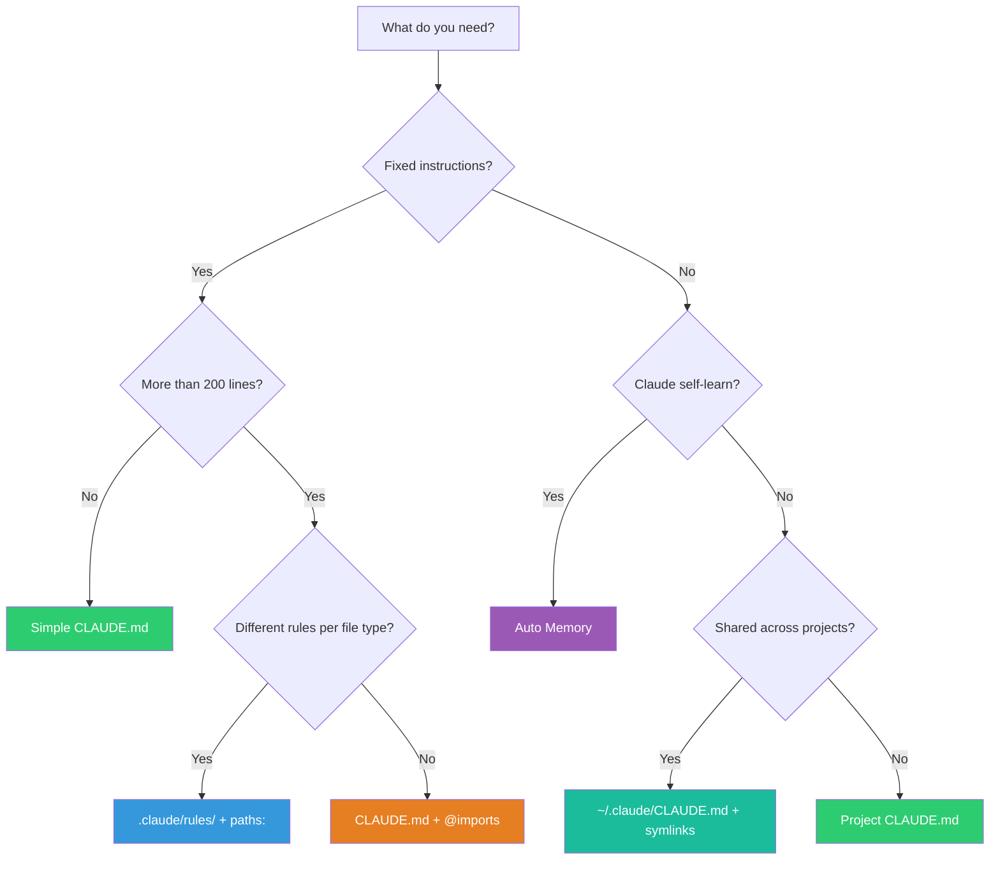

# Claude Code Memory — Decision Guide

## 1. Comparison with Alternatives

### 1.1. Feature-by-Feature Comparison

| Criteria | Claude Code Memory | Cursor Rules (`.cursorrules`) | GitHub Copilot Instructions | Codeium / Windsurf Rules | Aider Conventions |
|---|---|---|---|---|---|
| **Structure** | Hierarchical 6 layers | Single flat file | Single file `.github/copilot-instructions.md` | Project-level config | `.aider.conf.yml` + conventions |
| **Auto learning** | ✅ Auto Memory | ❌ | ❌ | ❌ | ❌ |
| **Path scoping** | ✅ `paths:` frontmatter | ❌ | ❌ | ❌ | ❌ |
| **Import system** | ✅ `@path/to/file` | ❌ | ❌ | ❌ | ❌ |
| **Org-wide policy** | ✅ Managed Policy | ❌ | ❌ | ❌ | ❌ |
| **User-level rules** | ✅ `~/.claude/` | ❌ Global only | ❌ | ✅ Global config | ✅ Global config |
| **Directory-level** | ✅ Subdirectory CLAUDE.md | ❌ | ❌ | ❌ | ❌ |
| **Audit tool** | ✅ `/memory` command | ❌ | ❌ | ❌ | ❌ |
| **Team sharing** | ✅ Git + symlinks | ✅ Git | ✅ Git | ✅ Git | ✅ Git |
| **Modular rules** | ✅ `.claude/rules/*.md` | ❌ | ❌ | ❌ | ❌ |
| **Exclude mechanism** | ✅ `claudeMdExcludes` | ❌ | ❌ | ❌ | ❌ |
| **Format** | Free-form Markdown | Free-form Markdown | Free-form Markdown | YAML/Markdown | YAML |
| **Survive compact** | ✅ | N/A | N/A | N/A | N/A |
| **Max recommended size** | ~200 lines (main file) | No official limit | No official limit | Tool-dependent | ~50 lines |

### 1.2. Strengths & Weaknesses


| Aspect | Claude Code Memory Strengths | Claude Code Memory Weaknesses |
|---|---|---|
| **Flexibility** | 6 layers, path-scoping, imports — very flexible | Complexity curve — many locations can cause confusion |
| **Team** | Symlinks, managed policy, excludes — scales well | Needs clear convention within team, otherwise will conflict |
| **Learning** | Auto memory self-records — unique feature | Can save incorrect info, needs regular auditing |
| **Debugging** | `/memory` is clear, transparent | Many sources = hard to debug when rules conflict |
| **Portability** | Pure markdown — easy to switch tools | Specific features (`@import`, `paths:`) are not portable |

## 2. When You SHOULD Use It

### 2.1. Ideal Use Cases

| Scenario | Reason to Use Claude Memory | Recommended Strategy |
|---|---|---|
| **Solo dev, multiple projects** | User CLAUDE.md + per-project rules = consistent style | `~/.claude/CLAUDE.md` global + `./CLAUDE.md` per project |
| **Team of 3-15 people** | Shared conventions via Git, path-scoped rules for sub-teams | Project CLAUDE.md + `.claude/rules/` committed |
| **Enterprise / Monorepo** | Managed policy + team exclusions + org standards | Managed Policy + per-package CLAUDE.md + `claudeMdExcludes` |
| **OSS project** | Onboard contributors quickly, enforce contribution standards | Project CLAUDE.md + CONTRIBUTING.md `@import` |
| **Long-term project** | Auto memory accumulates knowledge over time | Enable auto memory + review `/memory` weekly |
| **Multi-language monorepo** | Path-scoped rules for TypeScript vs Python vs Go | `.claude/rules/` with `paths:` frontmatter per language |
| **Freelancer with many clients** | User-level preferences + per-client project rules | `~/.claude/CLAUDE.md` (personal style) + `./CLAUDE.md` (client rules) |
| **Brownfield codebase** | Claude learns patterns from corrections via auto memory | Auto memory ON + periodically codify into CLAUDE.md |

### 2.2. Decision Matrix — Which Feature Should You Use?



## 3. When You Should NOT Use It

### 3.1. Limitations

| Limitation | Details | Workaround |
|---|---|---|
| **Not a database** | Memory is text files — no querying, no indexing | Keep concise, organize by topics |
| **200-line soft cap** | CLAUDE.md > 200 lines → reduced adherence | Split into rules + imports |
| **Auto memory noise** | Claude may save inaccurate info | Review regularly, delete wrong entries |
| **No cross-session state** | Memory only provides instructions, doesn't save session state | Use Git commits, notes, or external tools for state |
| **Conflict resolution** | When 2 CLAUDE.md files give contradictory instructions — Claude picks arbitrarily | Audit all files, remove conflicts |

### 3.2. Anti-use-cases

| Scenario | Why NOT | Alternative |
|---|---|---|
| **Store entire documentation** | CLAUDE.md is not a wiki — too long = reduced effectiveness | Link to docs with `@path`, don't copy paste |
| **Complex project config** | Memory is instructions, not config management | Use `tsconfig.json`, `.eslintrc`, etc. for machine config |
| **Sensitive secrets** | CLAUDE.md committed to Git → exposes secrets | Use `.env`, vault, or secret managers |
| **Real-time collaboration** | Memory files are static — no real-time sync | Use Git + PR reviews for collaborative editing |
| **Cross-tool portability** | `@imports`, `paths:`, auto memory are Claude-specific | Write CLAUDE.md content generic + tool-specific files separately |
| **Only using Claude 1-2 times** | Setup overhead not worth it for one-off tasks | Just say instructions in chat |

## 4. Case Studies / Real-World Examples

### 4.1. Solo Developer — TypeScript Full-Stack

**Setup:**
```
~/.claude/CLAUDE.md          → Personal: "Prefer functional, strict TS"
project/CLAUDE.md            → Project: Tech stack, folder structure
project/.claude/rules/
├── api.md                   → paths: ["src/api/**"] API conventions
└── frontend.md              → paths: ["src/components/**"] React rules
```

**Result:** Claude consistently follows TypeScript conventions, API validation, React patterns — no need to repeat each session. Auto memory remembers the team's error format after a single correction.

### 4.2. Team of 8 — SaaS Product

**Setup:**
```
CLAUDE.md (committed)        → Shared: coding standards, git workflow
.claude/rules/ (committed)
├── code-style.md            → 2-space indent, naming conventions
├── api.md                   → paths: ["src/api/**"] REST API rules
├── db.md                    → paths: ["src/models/**"] Prisma conventions
└── testing.md               → paths: ["tests/**"] Testing standards

.claude/settings.local.json  → Personal (gitignored): excludes

~/.claude/CLAUDE.md          → Personal: individual preferences
```

**Result:** All team members have consistent Claude behavior. Frontend dev excludes backend rules via `claudeMdExcludes`. New member onboarding just needs `git pull` — Claude already has full context.

### 4.3. Enterprise Monorepo

**Setup:**
```
/Library/.../ClaudeCode/CLAUDE.md  → IT deploys: security, compliance
monorepo/CLAUDE.md                  → Org-wide: shared conventions
monorepo/packages/frontend/.claude/  → Frontend team rules
monorepo/packages/backend/.claude/   → Backend team rules
monorepo/packages/ml/.claude/        → ML team rules

Each team has claudeMdExcludes for other teams' rules
```

**Result:** Security policies enforced org-wide (cannot be overridden). Teams have autonomy in their own rules without conflict. CISO deploys compliance updates centrally.

## 5. Cost & Resources

### 5.1. Token/Context Cost

| Component | Estimated Token Cost | Impact |
|---|---|---|
| **CLAUDE.md 50 lines** | ~200-400 tokens | Minimal — recommended starting point |
| **CLAUDE.md 200 lines** | ~800-1600 tokens | Acceptable — soft cap |
| **CLAUDE.md 500+ lines** | ~2000-4000 tokens | Significant — reduces context for actual work |
| **Auto Memory MEMORY.md** | ~200-800 tokens | Loaded automatically (200 lines cap) |
| **Each .claude/rules/ file** | ~100-500 tokens | Only loaded when path matches |
| **@imports** | Varies | Content fully inlined — counts toward total |

### 5.2. Setup Time

| Scenario | Setup Time | ROI |
|---|---|---|
| **Basic CLAUDE.md** | 5-10 minutes | Immediate — first session already shows difference |
| **Rules directory** | 15-30 minutes | High — path-scoped rules save hours/week |
| **Team setup** | 1-2 hours | Very high — consistency across entire team |
| **Enterprise deployment** | 2-4 hours | Critical — org-wide compliance |

### 5.3. Maintenance Cost

| Activity | Frequency | Time |
|---|---|---|
| Review auto memory (`/memory`) | Weekly | 5-10 minutes |
| Update CLAUDE.md conventions | Monthly or when conventions change | 10-20 minutes |
| Audit cross-file conflicts | Quarterly | 30 minutes |
| Update managed policy | As needed | Varies |

## 6. Migration Path

### 6.1. From Cursor Rules → Claude Code Memory

```bash
# 1. Copy content
cp .cursorrules CLAUDE.md

# 2. Restructure if long
# Split sections into .claude/rules/*.md
mkdir -p .claude/rules

# 3. Add path-scoping (Cursor doesn't have this)
# Add paths: frontmatter to rules that need scoping

# 4. Enable auto memory (Cursor doesn't have this)
# Enabled by default — no action needed

# 5. Setup user-level preferences
# Move personal preferences to ~/.claude/CLAUDE.md
```

### 6.2. From GitHub Copilot Instructions → Claude Code Memory

```bash
# 1. Copy content
cp .github/copilot-instructions.md CLAUDE.md

# 2. Enhance with Claude-specific features
# - Add @imports for docs references
# - Create .claude/rules/ for path-scoped rules
# - Setup user-level CLAUDE.md

# 3. Keep copilot-instructions.md if team uses both tools
```

### 6.3. From Nothing → Claude Code Memory

```bash
# Fastest path:
claude
# In session:
/init
# Claude creates CLAUDE.md based on project analysis

# Then iterate: fix errors → Claude auto-learns → review /memory
```

### 6.4. Breaking Changes / Gotchas When Migrating

| From | To | Gotcha |
|---|---|---|
| Cursor | Claude | `.cursorrules` format differs — needs review, don't copy verbatim |
| Copilot | Claude | `copilot-instructions.md` usually more generic — should add more detail |
| Aider | Claude | `conventions.md` YAML format → needs conversion to Markdown |
| No tool | Claude | No migration — just create new |

## 7. Roadmap & Future

### 7.1. Expected Development Direction

| Feature | Status | Prediction |
|---|---|---|
| **Auto Memory topics** | ✅ Available | Will improve classification accuracy |
| **Path-scoped rules** | ✅ Available | May add regex support |
| **Managed Policy** | ✅ Available | Will expand for cloud-managed orgs |
| **Subagent memory** | ✅ Available | Deeper integration with multi-agent workflows |
| **InstructionsLoaded hook** | ✅ Available | More hooks for memory lifecycle |
| **Memory sharing across machines** | ❌ Not yet | Possible via cloud sync in the future |
| **Memory analytics** | ❌ Not yet | Dashboard tracking memory effectiveness |
| **Conditional rules** | ❌ Not yet | Rules apply based on env/branch |

### 7.2. Community & Ecosystem Health

| Metric | Assessment |
|---|---|
| **Maintainer** | Anthropic — well-funded, active development |
| **Update frequency** | Regular releases of Claude Code |
| **Documentation** | Comprehensive, well-structured official docs |
| **Community adoption** | Growing — Claude Code user base expanding rapidly |
| **Backward compatibility** | Good — CLAUDE.md format stable, additive changes |
| **Ecosystem integration** | Skills, Hooks, Plugins, Sub-agents — rich ecosystem |

## 8. Decision Matrix

| Scenario | Recommendation | Reason |
|---|---|---|
| **Solo dev, 1 small project** | ✅ Basic CLAUDE.md only | 5 minutes setup, immediate ROI |
| **Solo dev, multiple projects** | ✅ User CLAUDE.md + per-project | Consistency across projects, personal preferences shared |
| **Team of 2-5** | ✅ Project CLAUDE.md committed | Shared conventions, easy onboarding |
| **Team of 5-15** | ✅ CLAUDE.md + .claude/rules/ | Path-scoped rules avoid conflict between sub-teams |
| **Enterprise monorepo** | ✅ Full setup: managed policy + rules + excludes | Compliance + team autonomy |
| **One-off quick task** | ❌ No need to setup Memory | Chat instructions sufficient for one time |
| **Sensitive/regulated project** | ✅ Use, but carefully | Don't put secrets in CLAUDE.md, review auto memory |
| **Multi-tool team (Cursor + Claude)** | ✅ Use, keep `.cursorrules` too | Sync content manually, tool-specific features separate |
| **Long-term project (>6 months)** | ✅ Full setup + auto memory | Knowledge accumulates, ROI increases over time |
| **Learning/exploration** | ✅ Basic + auto memory | Claude remembers discoveries, saves time on repeats |
| **CI/CD scripted Claude** | ✅ CLAUDE.md + managed config | Deterministic behavior, no auto memory drift |

## 9. See Also

- [0. Overview](./0. Overview.md) — Memory system overview, architecture, key features
- [1. Architecture and Logic](./1. Architecture and Logic.md) — Detailed load mechanisms, data flow, path resolution
- [2. Playbook](./2. Playbook.md) — Practical guide for installation, configuration, and operation
