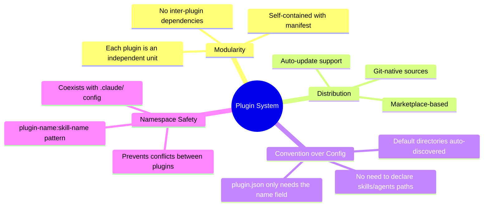
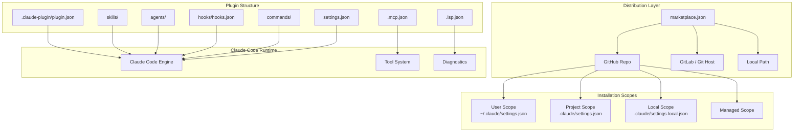
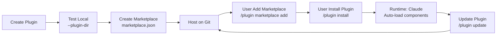

# Claude Code Plugins — Overview

## What are Plugins?

**Claude Code Plugins** is the official extension system that allows packaging and distributing **skills**, **agents**, **hooks**, **MCP servers**, and **LSP servers** as reusable modules. Plugins help extend Claude Code beyond individual `.claude/` configurations, enabling sharing, versioning, and marketplace distribution.

> **Requirement**: Claude Code ≥ **v1.0.33** (check with `claude --version`)

---

## Problems Solved

| Problem | Description | How Plugins Solve It |
|---|---|---|
| **Scattered configuration** | Skills, hooks, agents spread across `.claude/` — hard to share between projects | Package everything into 1 plugin folder with `plugin.json` manifest |
| **No versioning** | Config changes can't be version-tracked | Semantic versioning (`MAJOR.MINOR.PATCH`) in `plugin.json` |
| **Name conflicts** | 2 projects using `/deploy` differently → collision | Automatic namespace: `/plugin-name:skill-name` |
| **Difficult distribution** | Manual copy-paste between repos, no update mechanism | Marketplace system — `marketplace.json` + `/plugin install` |
| **Missing Code Intelligence** | Claude can't see type errors, missing imports in real-time | LSP server plugins — Language Server Protocol integration |
| **Team inconsistency** | Each dev configures Claude differently | Team marketplace + `extraKnownMarketplaces` in `.claude/settings.json` |

---

## Design Philosophy

**4 Core Principles:**

1. **Self-contained**: Plugins work independently, no complex setup needed
2. **Convention-first**: Default locations (`commands/`, `skills/`, `agents/`, `hooks/`) are auto-discovered
3. **Namespace isolation**: Plugin name prefix prevents conflicts between plugins
4. **Git-native distribution**: Source directly from GitHub/GitLab repos

---

## Who Should Use Plugins?

| Audience | Use Case |
|---|---|
| **Plugin Developer** | Create tools, skills, hooks packaged as plugins to share with the community |
| **Team Lead / DevOps** | Set up team marketplace to standardize Claude workflow for the entire team |
| **Individual Dev** | Install plugins from marketplace to quickly extend Claude Code |
| **Enterprise Admin** | Manage a managed marketplace with security controls |

---

## Architecture Overview

### Components Table

| Component | File/Directory | Function |
|---|---|---|
| **Manifest** | `.claude-plugin/plugin.json` | Plugin metadata: name, version, description, author |
| **Skills** | `skills/<name>/SKILL.md` | AI skills (slash commands) — auto-discovered |
| **Agents** | `agents/<name>.md` | Specialized subagents — shown in `/agents` |
| **Commands** | `commands/<name>.md` | Legacy slash commands |
| **Hooks** | `hooks/hooks.json` | Event handlers: PreToolUse, PostToolUse, Stop, etc. |
| **MCP Servers** | `.mcp.json` | Model Context Protocol servers — external tool integration |
| **LSP Servers** | `.lsp.json` | Language Server Protocol — code intelligence (diagnostics, navigation) |
| **Settings** | `settings.json` | Default settings for the plugin (default agent, etc.) |

---

## Plugin Lifecycle

### Phase Details

| Phase | Action | Command |
|---|---|---|
| **Develop** | Create folder + `plugin.json` + components | `mkdir`, edit files |
| **Test** | Load plugin locally | `claude --plugin-dir ./my-plugin` |
| **Package** | Create `marketplace.json` listing plugins | Edit `marketplace.json` |
| **Distribute** | Push to GitHub / Git host | `git push` |
| **Install** | User installs from marketplace | `/plugin install name@marketplace` |
| **Manage** | Enable/disable/uninstall | `/plugin enable/disable/uninstall` |
| **Update** | Pull new version | `/plugin update name@marketplace` |

---

## Key Features

### 1. **Namespace System**
Plugins automatically prefix names: `/my-plugin:hello` instead of `/hello`. Prevents conflicts when multiple plugins have skills with the same name.

### 2. **Multi-Component Packaging**
A single plugin can contain: skills + agents + hooks + MCP + LSP + settings. All auto-discovered by convention.

### 3. **4 Installation Scopes**
- **User**: Applies to all projects (`~/.claude/settings.json`)
- **Project**: Shared with team via git (`.claude/settings.json`)
- **Local**: Personal only, gitignored (`.claude/settings.local.json`)
- **Managed**: Enterprise admin control

### 4. **LSP Integration (Code Intelligence)**
LSP plugins provide:
- **Auto diagnostics** — Type errors, missing imports detected immediately after each edit
- **Code navigation** — Go to definition, find references, hover info
- Built-in support for: Go, Python, TypeScript, Rust, Java, C/C++, Kotlin, Lua, PHP, Swift, C#

### 5. **Official Anthropic Marketplace**
Marketplace containing official plugins:
- **Code Intelligence**: gopls-lsp, pyright-lsp, typescript-lsp, rust-analyzer-lsp, etc.
- **External Integrations**: GitHub, GitLab, Slack, Jira, Linear, Figma, Sentry, etc.
- **Workflow**: commit-commands, pr-review-toolkit, agent-sdk-dev, plugin-dev
- **Output Styles**: explanatory-output-style, learning-output-style

### 6. **Hot Reload**
Use `/reload-plugins` to reload after editing plugin code — no need to restart the Claude Code session.

### 7. **`${CLAUDE_PLUGIN_ROOT}` Variable**
Environment variable pointing to plugin root, helping hooks/scripts reference relative file paths portably.

---

## Comparison: Plugin vs `.claude/` Config

| Criteria | `.claude/` Config | Plugin |
|---|---|---|
| **Scope** | Single project only | Cross-project, shareable |
| **Namespace** | Direct name (`/hello`) | Prefixed (`/plugin:hello`) |
| **Versioning** | None | Semantic versioning |
| **Distribution** | Manual copy | Marketplace + `/plugin install` |
| **Team sharing** | Manual sync | `extraKnownMarketplaces` config |
| **LSP support** | No | Yes (`.lsp.json`) |
| **MCP support** | Yes (per-project) | Yes (bundled in plugin) |
| **Migration** | n/a | Migration support available |
| **When to use** | Personal config, experiments | Sharing, reuse, enterprise |

---

## Notable New Features

- **Plugin Marketplace System** — Full marketplace ecosystem: official Anthropic marketplace + custom team marketplace
- **LSP Server Plugins** — Code intelligence for 12+ programming languages
- **4 Hook Types** — `command`, `prompt`, `agent`, + async hooks
- **Managed Marketplace** — Enterprise-grade restrictions & security
- **Plugin Submission** — Submit via `claude.ai/settings/plugins/submit` or `platform.claude.com/plugins/submit`

---

## See Also

- [[3-Research/Claude Code/claude-code-plugins/1. Architecture and Logic]] — Data flow, component specs, manifest schema
- [[3-Research/Claude Code/claude-code-plugins/2. Playbook]] — Installation, plugin creation, cheat sheet, troubleshooting
