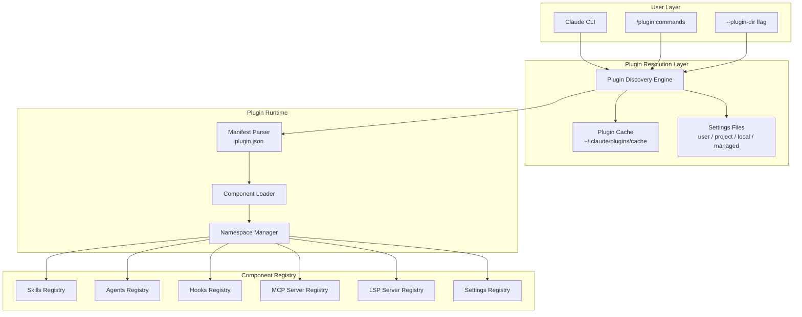
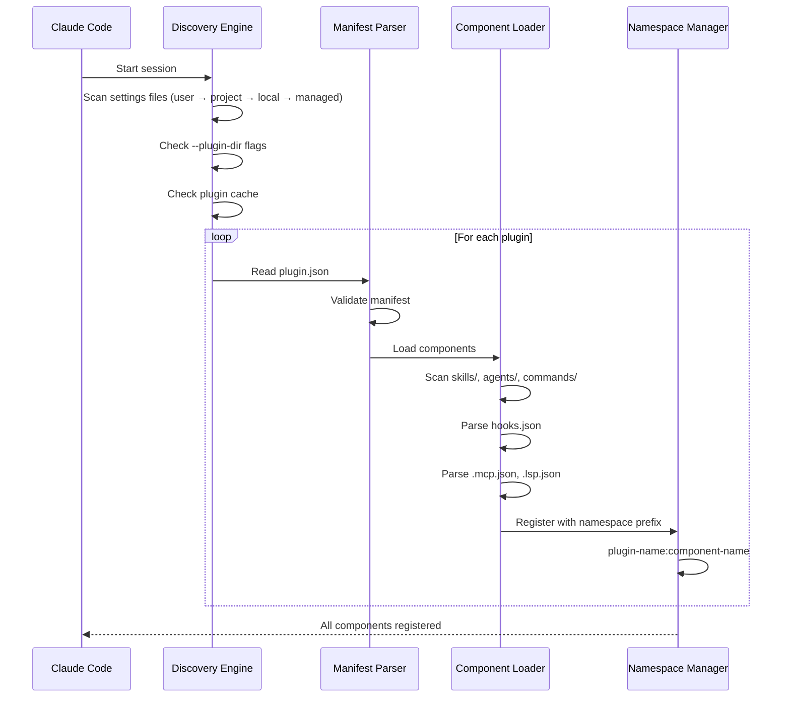
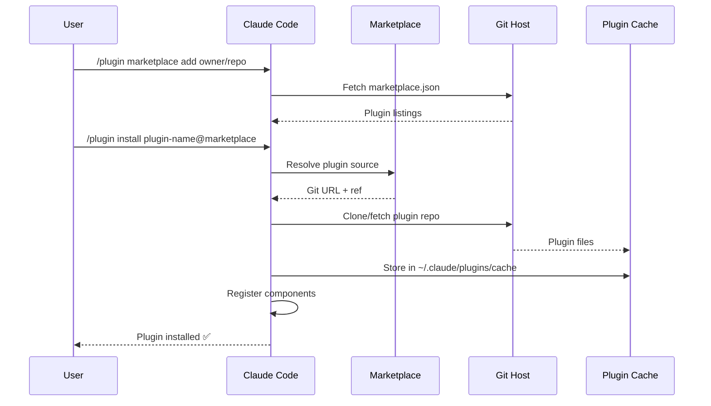
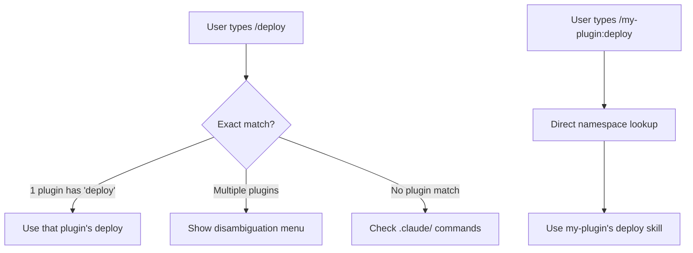

# Claude Code Plugins — Architecture and Logic

## 1. Overall Architecture Model



### Architecture Principles

| Principle | Description |
|---|---|
| **Convention-based Discovery** | Default directories are auto-detected without explicit manifest declarations |
| **Namespace Isolation** | Each plugin has a unique prefix preventing cross-plugin conflicts |
| **Layered Configuration** | 4 installation scopes with clear priority |
| **Component Independence** | Each component type (skills, hooks, agents) functions independently |

---

## 2. Plugin Manifest — `plugin.json`

### Minimal Manifest

```json
{
  "name": "my-plugin"
}
```

### Full Manifest Schema

```json
{
  "name": "my-awesome-plugin",
  "version": "1.2.0",
  "description": "A comprehensive development plugin",
  "author": "Developer Name",
  "homepage": "https://github.com/user/my-awesome-plugin",
  "license": "MIT"
}
```

| Field | Required | Type | Description |
|---|---|---|---|
| `name` | ✅ | string | Unique plugin identifier (kebab-case) |
| `version` | ❌ | string | Semantic version (X.Y.Z) |
| `description` | ❌ | string | Short description |
| `author` | ❌ | string | Author name or organization |
| `homepage` | ❌ | string | URL to plugin homepage/docs |
| `license` | ❌ | string | License identifier |

---

## 3. Component Architecture

### 3.1. Skills

```
skills/
  my-skill/
    SKILL.md          # Main reference (required)
    supporting-file.* # Additional files
```

**Auto-discovery rule:** Any folder in `skills/` with a `SKILL.md` file is registered as a skill.

**Namespace:** If plugin name is `my-plugin` and skill name is `deploy`, the skill is accessible as `/my-plugin:deploy`.

### 3.2. Agents

```
agents/
  code-reviewer.md
  test-writer.md
```

**Auto-discovery rule:** Any `.md` file in `agents/` is registered as an agent.

**Access:** Listed in Claude Code's `/agents` menu, prefixed with plugin name.

### 3.3. Hooks

```
hooks/
  hooks.json          # Hook definitions
  session-start       # Hook scripts
  pre-tool-check.sh
```

**hooks.json schema:**

```json
{
  "hooks": {
    "SessionStart": [
      {
        "matcher": "startup|resume|clear|compact",
        "hooks": [
          {
            "type": "command",
            "command": "'${CLAUDE_PLUGIN_ROOT}/hooks/session-start'",
            "async": false
          }
        ]
      }
    ],
    "PreToolUse": [
      {
        "matcher": "Write|Edit",
        "hooks": [
          {
            "type": "command",
            "command": "bash '${CLAUDE_PLUGIN_ROOT}/hooks/pre-tool-check.sh'"
          }
        ]
      }
    ]
  }
}
```

### 3.4. MCP Servers

```json
// .mcp.json
{
  "mcpServers": {
    "github": {
      "command": "npx",
      "args": ["-y", "@modelcontextprotocol/server-github"],
      "env": {
        "GITHUB_PERSONAL_ACCESS_TOKEN": "${GITHUB_TOKEN}"
      }
    }
  }
}
```

MCP servers extend Claude's tool capabilities by connecting to external services.

### 3.5. LSP Servers

```json
// .lsp.json
{
  "lspServers": {
    "typescript": {
      "command": "npx",
      "args": ["typescript-language-server", "--stdio"],
      "languages": ["typescript", "typescriptreact", "javascript", "javascriptreact"]
    }
  }
}
```

| LSP Feature | Description |
|---|---|
| **Diagnostics** | Type errors, lint warnings shown to Claude after edits |
| **Navigation** | Go to definition, find references |
| **Hover Info** | Type information, documentation |

### 3.6. Settings

```json
// settings.json
{
  "defaultAgent": "plugin-name:code-reviewer",
  "customConfig": {
    "key": "value"
  }
}
```

---

## 4. Data Flow

### 4.1. Plugin Discovery & Loading



### 4.2. Marketplace Installation Flow



### 4.3. Installation Scopes

| Scope | Config File | Who Manages | Committed to Git? | Priority |
|---|---|---|---|---|
| **User** | `~/.claude/settings.json` | Individual | No | Lowest |
| **Project** | `.claude/settings.json` | Team | Yes | Medium |
| **Local** | `.claude/settings.local.json` | Individual (per-project) | No | High |
| **Managed** | System-level | Enterprise admin | N/A | Highest |

**Scope configuration example:**

```json
// ~/.claude/settings.json
{
  "plugins": {
    "installed": [
      {
        "name": "superpowers",
        "source": "obra/superpowers-marketplace",
        "scope": "user"
      }
    ]
  },
  "extraKnownMarketplaces": [
    "my-company/claude-plugins"
  ]
}
```

---

## 5. Namespace Resolution



**Namespace rules:**
1. If only one plugin has a skill with a given name → can be called directly (`/deploy`)
2. If multiple plugins → must use namespace (`/my-plugin:deploy`)
3. Plugin skills and `.claude/` skills coexist — `.claude/` takes priority for unnamespaced calls

---

## 6. Marketplace Architecture

### marketplace.json Schema

```json
{
  "name": "My Team Marketplace",
  "description": "Internal team plugins",
  "plugins": [
    {
      "name": "team-standards",
      "description": "Team coding standards and hooks",
      "git": "https://github.com/my-team/claude-standards.git",
      "ref": "v1.0.0",
      "path": "."
    },
    {
      "name": "deploy-tools",
      "description": "Deployment automation",
      "git": "https://github.com/my-team/claude-deploy.git",
      "ref": "main"
    }
  ]
}
```

| Field | Required | Description |
|---|---|---|
| `name` | ✅ | Marketplace name |
| `description` | ❌ | Marketplace description |
| `plugins` | ✅ | Array of plugin definitions |
| `plugins[].name` | ✅ | Plugin name |
| `plugins[].git` | ✅ | Git URL to plugin repo |
| `plugins[].ref` | ❌ | Git ref (branch, tag, commit) |
| `plugins[].path` | ❌ | Subdirectory in repo (default: `.`) |

---

## 7. Error Handling

| Error | Cause | Resolution |
|---|---|---|
| Plugin not found | Name mismatch or marketplace not added | Check `/plugin marketplace list` |
| Component not loading | Missing SKILL.md or wrong directory structure | Follow convention: `skills/<name>/SKILL.md` |
| Namespace conflict | Multiple plugins with same skill name | Use full namespace `/plugin:skill` |
| LSP not providing diagnostics | Server not started or wrong language config | Check `.lsp.json` and server installation |
| Hook not firing | `hooks.json` syntax error or wrong matcher | Validate JSON and matcher patterns |
| Plugin cache stale | Old version cached | `/plugin update plugin-name` |

---

## 8. Security Model

| Aspect | Implementation |
|---|---|
| **Plugin source trust** | User explicitly adds marketplaces and installs plugins |
| **Hook isolation** | Plugin hooks run in separate processes |
| **LSP isolation** | LSP servers run as child processes with limited scope |
| **Managed scope** | Enterprise admins can restrict allowed plugins |
| **Code review** | Plugin source is open Git repos — auditable |

---

## See Also

- [[3-Research/Claude Code/claude-code-plugins/0. Overview]] — Overview, philosophy, key features
- [[3-Research/Claude Code/claude-code-plugins/2. Playbook]] — Installation, plugin creation, cheat sheet
- [[3-Research/Claude Code/claude-code-plugins/3. Decision Guide]] — Comparison, use cases, decision matrix
