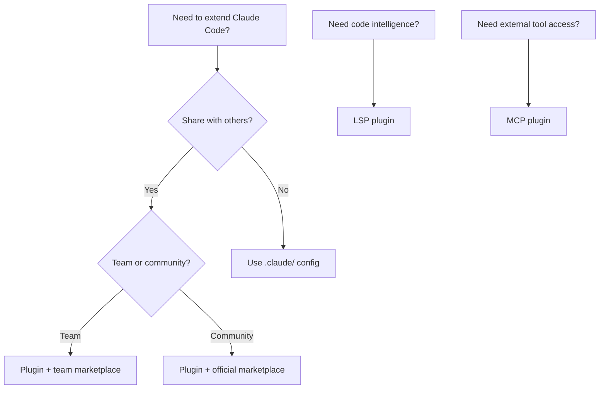

# Claude Code Plugins — Decision Guide

## 1. Comparison with Alternatives

### Plugin vs .claude/ Config vs Custom Setup

| Aspect | Plugin System | `.claude/` Config | Manual/Custom |
|---|---|---|---|
| **Distribution** | Marketplace + Git | Manual copy-paste | Manual |
| **Versioning** | Semantic versions | None | Manual |
| **Namespace** | Automatic isolation | Direct names | Manual |
| **Team sharing** | Built-in marketplace | Git commit | Manual sync |
| **LSP support** | ✅ Built-in | ❌ | ✅ Manual setup |
| **MCP support** | ✅ Bundled | ✅ Per-project | ✅ Manual |
| **Update mechanism** | `/plugin update` | Manual | Manual |
| **Complexity** | Low (convention-based) | Low | High |
| **Best for** | Shareable, versioned tools | Project-specific config | Full custom control |

### Plugin vs npm/pip Packages

| Aspect | Plugins | npm/pip Packages |
|---|---|---|
| **Ecosystem** | Claude Code specific | Language-specific |
| **Installation** | `/plugin install` | `npm install` / `pip install` |
| **Integration** | Auto-discovered by Claude | Requires manual integration |
| **Scope** | AI assistant skills/hooks | Library code |
| **When to choose Plugin** | Extending Claude Code capabilities | |
| **When to choose npm/pip** | | Runtime code dependencies |

---

## 2. When to Use Plugins

### ✅ Ideal Use Cases

| Scenario | Why Plugins Fit |
|---|---|
| **Share skills across projects** | Plugin packaging + marketplace = one-command install |
| **Team standardization** | Team marketplace ensures everyone uses same tools |
| **Code intelligence** | LSP plugins for auto-diagnostics |
| **External integrations** | MCP plugins connect Claude to GitHub, Slack, etc. |
| **Versioned tooling** | Semantic versioning tracks changes |
| **Open source distribution** | Official marketplace for community sharing |
| **Enterprise control** | Managed marketplace with admin restrictions |

---

## 3. When NOT to Use Plugins

### ❌ Anti-Use-Cases

| Scenario | Why Plugins Are NOT Suitable | Use Instead |
|---|---|---|
| **Quick personal experiment** | Plugin overhead unnecessary | Direct `.claude/` config |
| **Single-project config** | No need for distribution | `.claude/settings.json` |
| **One-off scripts** | Too much packaging | Direct hooks in settings |
| **Heavy runtime dependencies** | Plugins don't manage deps | npm/pip + manual integration |

---

## 4. Decision Matrix

| Scenario | Recommendation | Reason |
|---|---|---|
| Share tools with team | ✅ **Plugin + team marketplace** | Built-in distribution |
| Personal workflow | ⚠️ **Plugin or .claude/** | Plugin if reusable, .claude/ if not |
| Code intelligence | ✅ **LSP plugin** | Purpose-built for this |
| External API integration | ✅ **MCP plugin** | Standard protocol |
| Quick experiment | ❌ **Use .claude/** | Less overhead |
| Enterprise deployment | ✅ **Managed marketplace** | Admin control |
| Community distribution | ✅ **Official marketplace** | Widest reach |

### Decision Flowchart

---

## See Also

- [[3-Research/Claude Code/claude-code-plugins/0. Overview]] — Overview and key features
- [[3-Research/Claude Code/claude-code-plugins/1. Architecture and Logic]] — Internal architecture details
- [[3-Research/Claude Code/claude-code-plugins/2. Playbook]] — Installation and operations guide
