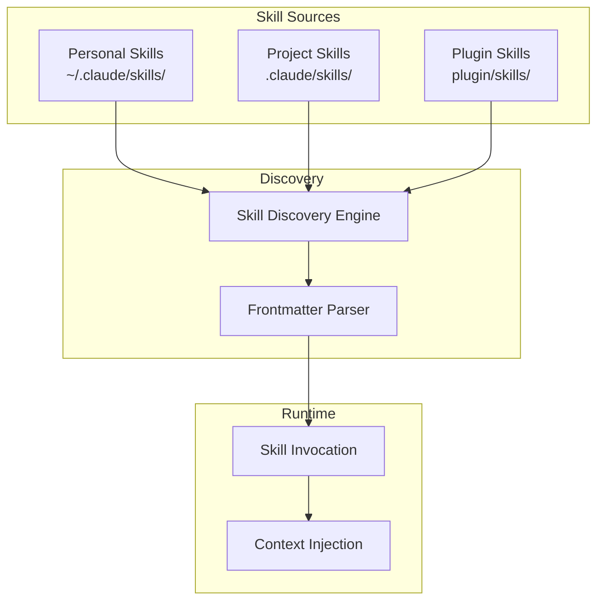

# Claude Code Skills — Overview

## What are Skills?

**Claude Code Skills** is an extensibility system that allows creating **custom instruction sets** through `SKILL.md` files. Each skill is a clear, structured set of instructions that Claude can invoke when needed — similar to teaching Claude a new "ability."

> [!NOTE]
> **Official docs:** [Anthropic Skills Documentation](https://docs.anthropic.com/en/docs/claude-code/skills)
> **Configuration:** `SKILL.md` files in designated directories

---

## Problems Solved

| Problem | Description | How Skills Solve It |
|---|---|---|
| **Repetitive instructions** | Having to explain the same process to Claude every session | Write once in SKILL.md, use forever |
| **Undiscoverable knowledge** | Claude doesn't know your team's specific patterns | Skills inject domain knowledge into context |
| **Inconsistent AI behavior** | Different responses for the same type of task | Skills standardize approach for each task type |
| **Complex workflows** | Multi-step processes that Claude might skip steps in | Skills define exact checklists and workflows |
| **Context overload** | Putting everything in CLAUDE.md makes it huge | Skills are modular — loaded only when relevant |

---

## Design Philosophy

1. **Modular:** Each skill is an independent unit that can be added/removed
2. **Discoverable:** Skills have frontmatter metadata that tells Claude WHEN to use them
3. **Convention-based:** Standard file structure auto-discovered by Claude
4. **Composable:** Skills can reference and invoke other skills
5. **Priority-aware:** User instructions > Skills > System prompt

---

## Who Should Use Skills?

| Audience | Use Case |
|---|---|
| **Individual developers** | Personal workflow automation, coding patterns |
| **Teams** | Standardize coding practices across all members |
| **Plugin developers** | Package skills for distribution via marketplace |
| **AI researchers** | Experiment with specialized agent behaviors |

---

## Architecture Overview



### Skill Directory Structure

```
skills/
  skill-name/
    SKILL.md              # Main reference (required)
    supporting-file.*     # Additional files (optional)
```

### SKILL.md Structure

```yaml
---
name: skill-name
description: "Use when [triggering conditions]"
---
```

The body contains the actual instructions, workflows, checklists, and examples.

---

## Key Features

### 1. Auto-Discovery
Skills in standard locations are automatically found and available to Claude.

### 2. Frontmatter-Based Triggering
The `description` field tells Claude when to invoke the skill. Claude checks skills before every task.

### 3. Shadowing
Personal skills override plugin skills with the same name, allowing customization.

### 4. Namespace Support
Plugin skills use `plugin-name:skill-name` to avoid conflicts.

### 5. Modular Loading
Skills are loaded on-demand, not all at once — keeping context clean.

---

## Comparison: Skills vs CLAUDE.md vs Hooks

| Aspect | Skills | CLAUDE.md | Hooks |
|---|---|---|---|
| **Type** | Structured instructions | Free-form rules | Automated actions |
| **Trigger** | AI-driven (description match) | Always loaded | Event-driven |
| **Scope** | Per-task, modular | Global context | Per-event |
| **Enforcement** | Behavior guidance | Behavior guidance | Deterministic execution |
| **Best for** | Complex workflows, techniques | Project rules, preferences | Automation, validation |

---

## See Also

- [1. Architecture and Logic](./1. Architecture and Logic.md) — Internal architecture, data flow, invocation mechanism
- [2. Playbook](./2. Playbook.md) — Setup, creating skills, cheat sheet, troubleshooting
- [3. Decision Guide](./3. Decision Guide.md) — Comparison, use cases, decision matrix
