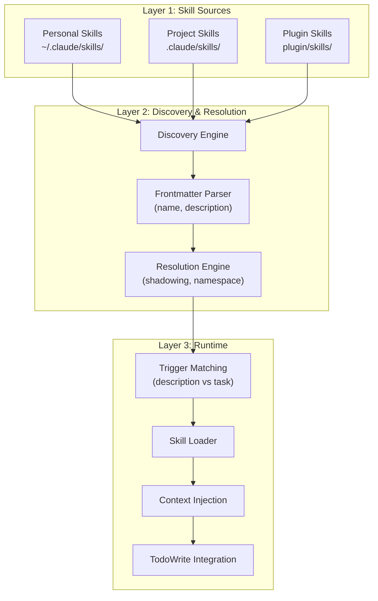
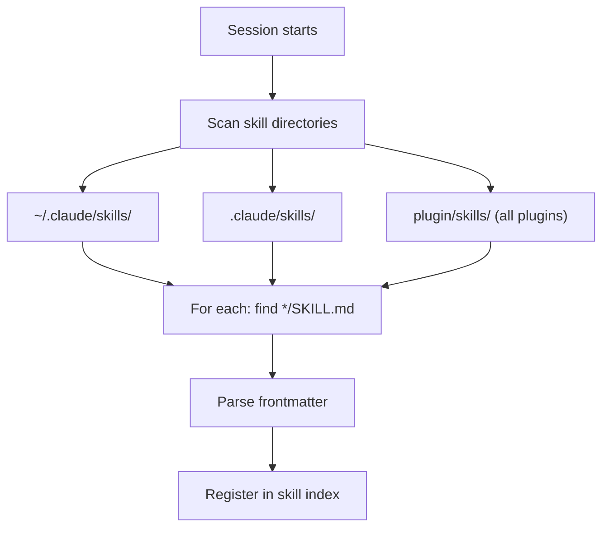
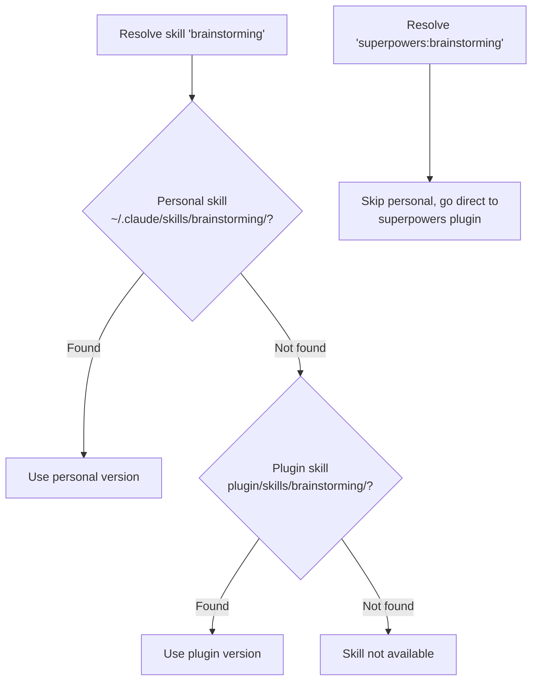
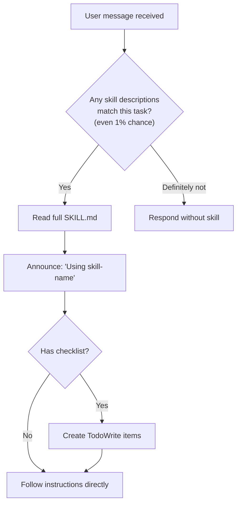

# Claude Code Skills — Architecture and Logic

## 1. Overall Architecture



---

## 2. Skill File Format

### SKILL.md Anatomy

```markdown
---
name: my-skill
description: "Use when [specific triggering conditions]"
---

# Skill Title

## Overview
Core principle in 1-2 sentences.

## When to Use
- Condition A
- Condition B
- NOT for: [exclusions]

## The Process
[Steps, flowcharts, checklists]

## Red Flags
[Signs to STOP and reassess]

## Common Mistakes
[Anti-patterns and fixes]
```

### Frontmatter Rules

| Field | Type | Max Length | Guidelines |
|---|---|---|---|
| `name` | kebab-case string | N/A | Letters, numbers, hyphens only |
| `description` | Free text | ~500 chars recommended, 1024 max total | Start with "Use when..." — focus on triggering conditions |

---

## 3. Discovery & Resolution

### Discovery Process



### Shadowing Mechanism



**Priority:** Personal > Plugin (same name) > Not found

---

## 4. Invocation Logic

### How Claude Decides to Use a Skill



### Skill Types

| Type | Behavior | Example |
|---|---|---|
| **Rigid** | Follow exactly as written, no adaptation | TDD, debugging, verification |
| **Flexible** | Adapt principles to context | Patterns, techniques, coding style |

---

## 5. Supporting Files

Skills can include additional files beyond SKILL.md:

```
skills/
  systematic-debugging/
    SKILL.md                    # Main reference
    root-cause-tracing.md       # Supporting technique
    defense-in-depth.md         # Supporting technique
    find-polluter.sh            # Utility script
```

Supporting files are referenced from SKILL.md and loaded when needed.

---

## 6. Skill Locations

| Location | Type | Use Case |
|---|---|---|
| `~/.claude/skills/` | Personal (Claude Code) | Your custom skills |
| `.claude/skills/` | Project | Team-shared skills |
| `~/.agents/skills/` | Personal (Codex) | Codex-specific |
| `plugin/skills/` | Plugin-bundled | Distributed via marketplace |

---

## 7. Integration with Other Systems

| System | Integration |
|---|---|
| **Plugins** | Skills are a core plugin component, auto-discovered |
| **Hooks** | Skills can reference hook-like behaviors |
| **Agents** | Skills can be invoked by sub-agents |
| **CLAUDE.md** | CLAUDE.md instructions take priority over skills |
| **TodoWrite** | Skills with checklists create TodoWrite items for tracking |

---

## See Also

- [0. Overview](./0. Overview.md) — Overview and key features
- [2. Playbook](./2. Playbook.md) — Setup, creating skills, cheat sheet
- [3. Decision Guide](./3. Decision Guide.md) — Comparison, use cases, decision matrix
