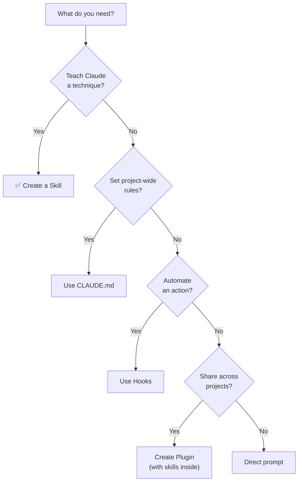

# Claude Code Skills — Decision Guide

## 1. Comparison with Other Extensibility Mechanisms

### Skills vs CLAUDE.md vs Hooks vs Plugins

| Aspect | Skills | CLAUDE.md | Hooks | Plugins |
|---|---|---|---|---|
| **Purpose** | Teach techniques/workflows | Set project rules | Automate actions | Package & distribute |
| **Trigger** | AI-matched per task | Always loaded | Event-driven | Contains skills/hooks/agents |
| **Modular** | ✅ Per-skill | ❌ Single file | ✅ Per-event | ✅ Per-plugin |
| **Distribution** | Via plugins or manual | Git | Via settings files | Marketplace |
| **Priority** | Below CLAUDE.md | Highest | Independent | Contains skills (same priority) |
| **Format** | Markdown + frontmatter | Markdown | JSON | Folder structure |
| **Best for** | Techniques, workflows | Project rules | Automation | Sharing, versioning |

---

## 2. When to Use Skills

### ✅ Ideal Use Cases

| Scenario | Why Skills Fit |
|---|---|
| **Standard coding patterns** | Codify team's React/API/DB patterns |
| **Complex multi-step workflows** | Checklists ensure no steps are skipped |
| **Debugging methodologies** | Systematic approach instead of random fixes |
| **Code review guidelines** | Consistent review criteria |
| **Architecture patterns** | Standard approaches for common architecture decisions |
| **Onboarding new AI tools** | Teach Claude your specific tools and processes |

---

## 3. When NOT to Use Skills

### ❌ Anti-Use-Cases

| Scenario | Why Not | Use Instead |
|---|---|---|
| **Simple project rules** | Overkill for "use TypeScript" | CLAUDE.md |
| **Automated actions** | Skills suggest, don't enforce | Hooks |
| **One-time instructions** | Not worth creating a skill | Direct prompt |
| **Cross-project distribution** | Skills alone don't distribute | Plugins (contain skills) |

---

## 4. Decision Matrix

| Need | Recommendation |
|---|---|
| "Always use this pattern for React components" | ✅ **Skill** |
| "Use TypeScript strict mode" | **CLAUDE.md** |
| "Format files after every edit" | **Hook** |
| "Share patterns across projects" | **Plugin** (containing skills) |
| "Teach debugging methodology" | ✅ **Skill** |
| "Block dangerous commands" | **Hook** (PreToolUse) |
| "Standard code review process" | ✅ **Skill** + **Agent** |

### Decision Flowchart



---

## 5. Migration Paths

### From CLAUDE.md Rules → Skills

```
1. Identify repeating technique/workflow sections in CLAUDE.md
2. Extract each into its own SKILL.md
3. Add appropriate frontmatter with triggering conditions
4. Keep project-specific rules in CLAUDE.md
5. Skills + CLAUDE.md work together
```

### From Skills → Plugins

```
1. Create plugin structure with .claude-plugin/plugin.json
2. Move skills/ directory into plugin
3. Add any hooks/, agents/ as needed
4. Distribute via marketplace
```

---

## See Also

- [0. Overview](./0. Overview.md) — Overview and key features
- [1. Architecture and Logic](./1. Architecture and Logic.md) — Internal architecture details
- [2. Playbook](./2. Playbook.md) — Setup, creating skills, troubleshooting
