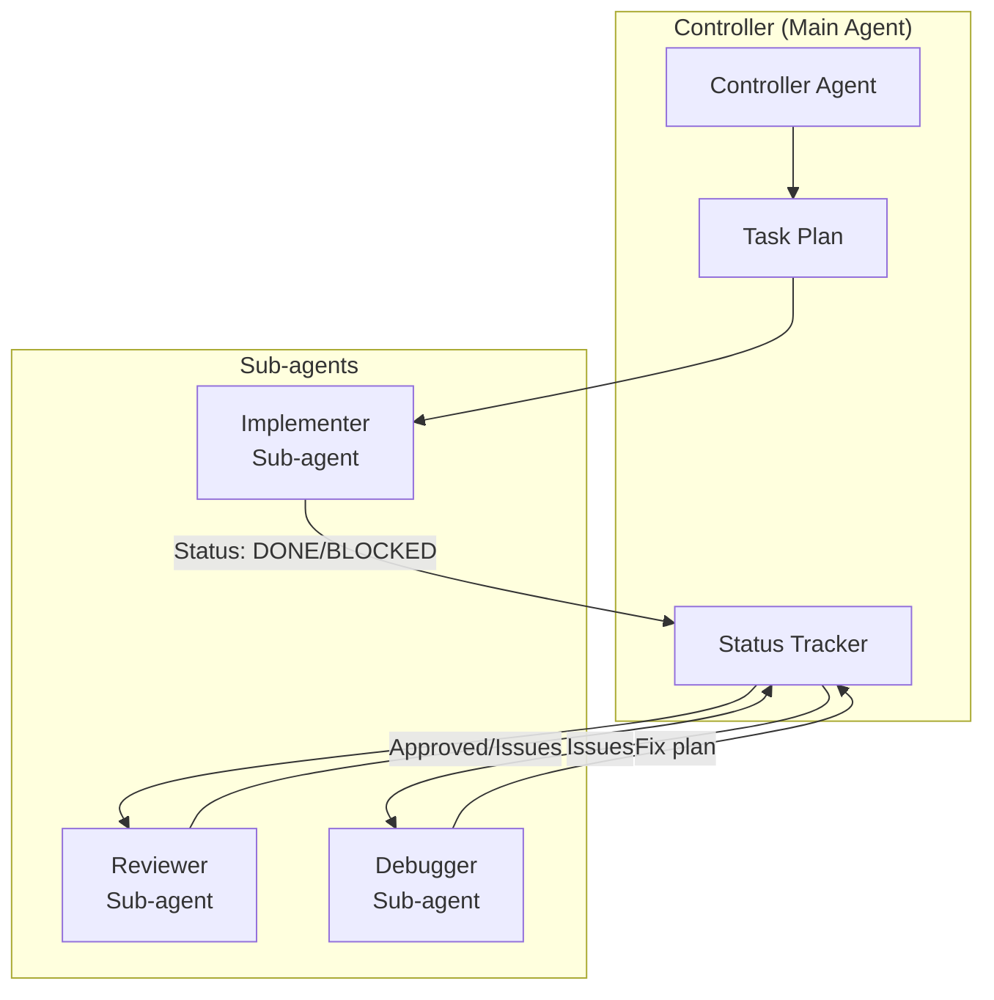

# Claude Code Sub-agents — Overview

## What are Sub-agents?

**Claude Code Sub-agents** are specialized AI agents that run within Claude Code to handle specific tasks with a **fresh, focused context**. Instead of one agent doing everything, sub-agents enable task delegation — each sub-agent gets only the context it needs and runs independently.

> [!NOTE]
> Sub-agents are a core feature of Claude Code that enables multi-agent orchestration patterns.

---

## Problems Solved

| Problem | Description | How Sub-agents Solve It |
|---|---|---|
| **Context pollution** | Main agent's context fills up with irrelevant info | Sub-agents get fresh, focused context per task |
| **Quality degradation** | AI output worsens as conversation grows | Each sub-agent starts clean |
| **Task coupling** | Sequential execution limits throughput | Sub-agents can run in parallel |
| **Lack of specialization** | One agent tries to be expert at everything | Each sub-agent can be specialized for its task |
| **No review mechanism** | Code goes unreviewed | Sub-agents can serve as automated reviewers |

---

## Design Philosophy

1. **Fresh context per task** — Each sub-agent gets a clean 200K token window
2. **Specialized focus** — Sub-agents do one thing well
3. **Controller pattern** — Main agent orchestrates, sub-agents execute
4. **Clear communication** — Structured prompts and status protocols
5. **Fail-safe** — Sub-agents report status, controller handles failures

---

## Who Should Use Sub-agents?

| Audience | Use Case |
|---|---|
| **Developers using Claude Code** | Delegate implementation to sub-agents for cleaner context |
| **Framework developers** | Build multi-agent workflows (like GSD, Superpowers) |
| **Teams** | Automated code review via reviewer sub-agents |
| **Complex projects** | Parallel task execution for faster development |

---

## Architecture Overview



### Built-in Agent Types

| Agent Type | Purpose |
|---|---|
| **Task Agent** | General-purpose task execution |
| **Code Reviewer** | Automated code review |
| **Custom Agent** | User-defined via `agents/*.md` files |

---

## Key Features

### 1. Fresh Context
Each sub-agent starts with an empty context window — no accumulated noise from previous work.

### 2. Structured Prompts
Sub-agents receive clear, structured prompts with task description, relevant file paths, and context.

### 3. Status Protocol
Sub-agents report their status:
- `DONE` — Task completed successfully
- `DONE_WITH_CONCERNS` — Completed with noted issues
- `BLOCKED` — Cannot proceed, needs help
- `NEEDS_CONTEXT` — Missing information

### 4. Custom Agent Files
Define custom agents in `agents/*.md`:
```markdown
You are a specialized security reviewer.
Focus on: SQL injection, XSS, auth bypass, secret exposure.
```

### 5. Permission Modes
- **Full permissions** — Sub-agent can read/write/execute
- **Read-only** — Sub-agent can only read files
- **Custom** — Specific permissions per agent

---

## See Also

- [1. Architecture and Logic](./1. Architecture and Logic.md) — Internal architecture, data flow, configuration
- [2. Playbook](./2. Playbook.md) — Setup, creating agents, cheat sheet, troubleshooting
- [3. Decision Guide](./3. Decision Guide.md) — Comparison, use cases, decision matrix
