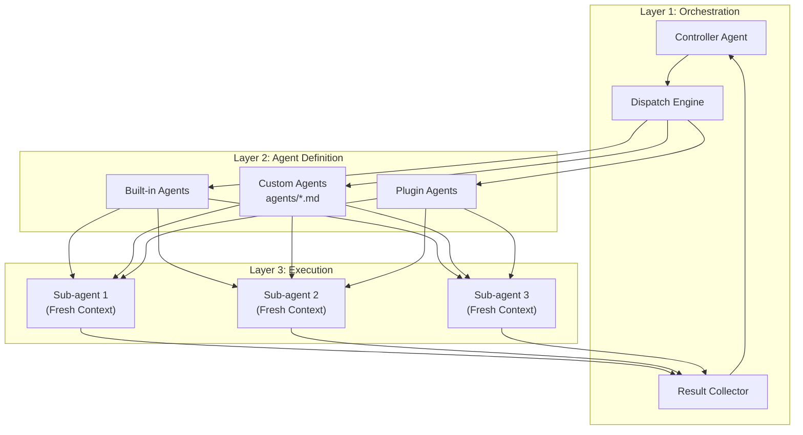
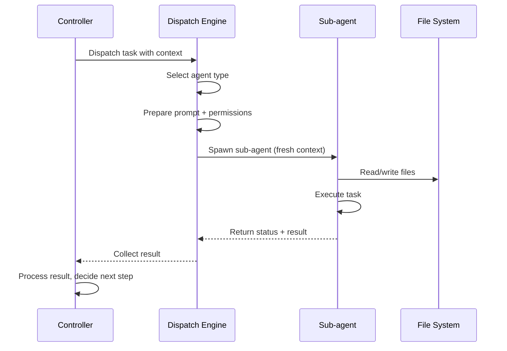
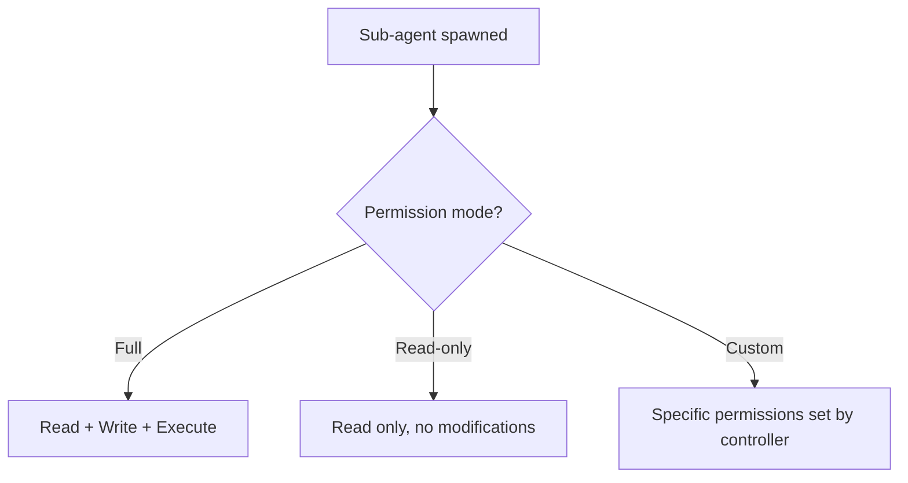
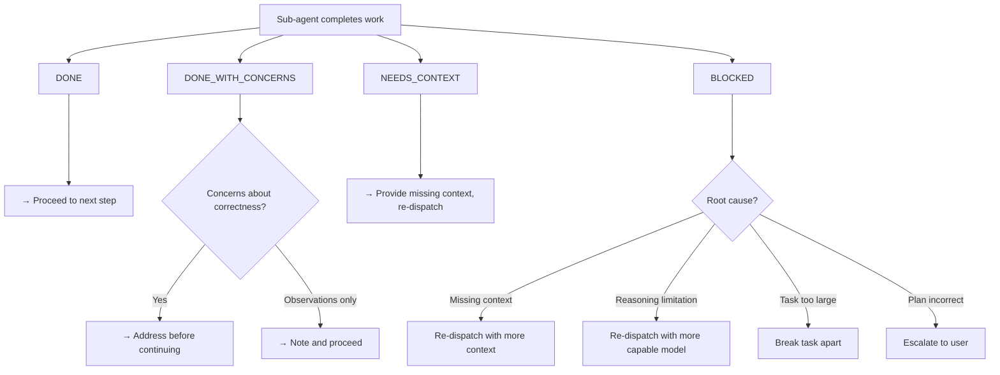

# Claude Code Sub-agents — Architecture and Logic

## 1. Architecture Model



---

## 2. Data Flow

### 2.1. Sub-agent Invocation



### 2.2. Controller-Sub-agent Communication

| Direction | Content |
|---|---|
| **Controller → Sub-agent** | Task description, relevant file paths, context, constraints |
| **Sub-agent → Controller** | Status (DONE/BLOCKED/NEEDS_CONTEXT), output summary, file changes |

---

## 3. Agent Types

### 3.1. Built-in Agents

| Agent | Purpose | Permission |
|---|---|---|
| **Task Agent** | General implementation | Full |
| **Read-only Agent** | Analysis, review | Read-only |

### 3.2. Custom Agent Files

```markdown
<!-- agents/security-reviewer.md -->
You are a security code reviewer.

## Focus Areas
- SQL injection vulnerabilities
- Cross-site scripting (XSS)
- Authentication bypass
- Secret/credential exposure
- Input validation

## Process
1. Read all changed files
2. Check each focus area
3. Report findings with severity (Critical/High/Medium/Low)
4. Suggest fixes for Critical and High issues
```

Custom agents are placed in:
- `.claude/agents/` — Project-level
- Platform-specific locations

### 3.3. Plugin Agents

Agents bundled within plugins, accessible via namespace: `/plugin-name:agent-name`

---

## 4. Permission Model



| Mode | Can Read | Can Write | Can Execute | Use Case |
|---|---|---|---|---|
| **Full** | ✅ | ✅ | ✅ | Implementation tasks |
| **Read-only** | ✅ | ❌ | ❌ | Code review, analysis |
| **Custom** | Configurable | Configurable | Configurable | Specialized tasks |

---

## 5. Status Protocol

Sub-agents communicate their completion status:



---

## 6. Memory & Context Management

| Aspect | Behavior |
|---|---|
| **Context per sub-agent** | Fresh, isolated — no bleed from main agent |
| **Context size** | Full model context window (e.g., 200K tokens) |
| **State persistence** | Via file system only (not in-memory) |
| **Result passing** | Controller receives summary, not full context |

---

## 7. Hooks Integration

Sub-agents can trigger and be affected by hooks:

| Hook Event | Sub-agent Behavior |
|---|---|
| **PreToolUse** | Applies to sub-agent tool use (can block) |
| **PostToolUse** | Fires after sub-agent tool use |
| **SubagentStart** | Custom event when sub-agent spawns |
| **SubagentComplete** | Custom event when sub-agent finishes |

---

## 8. Error Handling

| Error | Controller Response |
|---|---|
| Sub-agent BLOCKED | Assess cause → re-dispatch or escalate |
| Sub-agent timeout | Kill and retry with simpler task |
| Sub-agent produces wrong output | Reviewer sub-agent catches → fix loop |
| Sub-agent crashes | Log error, skip or retry |

---

## See Also

- [0. Overview](./0. Overview.md) — Overview and key features
- [2. Playbook](./2. Playbook.md) — Setup, creating agents, troubleshooting
- [3. Decision Guide](./3. Decision Guide.md) — Comparison, use cases, decision matrix
