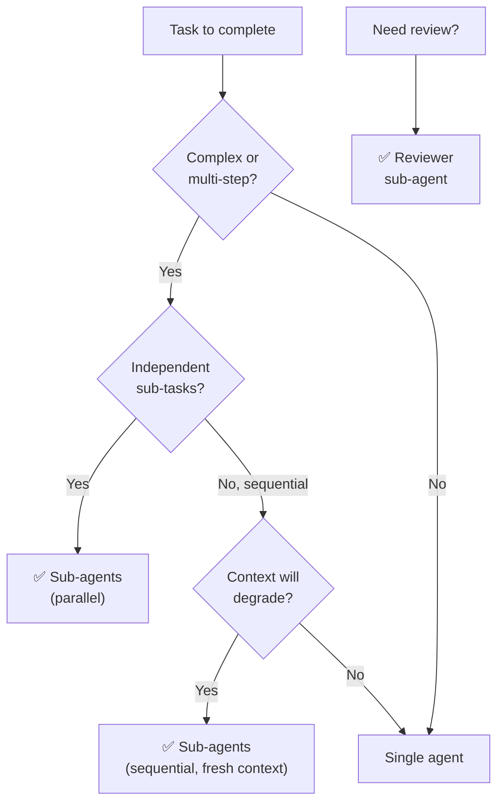

# Claude Code Sub-agents — Decision Guide

## 1. Comparison with Alternatives

### Sub-agents vs Single Agent vs External Tools

| Aspect | Sub-agents | Single Agent | External Tools |
|---|---|---|---|
| **Context** | Fresh per task | Accumulates | N/A |
| **Specialization** | Per-agent definition | General purpose | Tool-specific |
| **Parallelism** | ✅ Multiple sub-agents | ❌ Sequential | ✅ Tool-dependent |
| **Review capability** | ✅ Built-in pattern | ❌ Self-review only | ✅ External tools |
| **Cost** | Higher (multiple invocations) | Lower | Varies |
| **Complexity** | Medium | Low | High |
| **Best for** | Complex, multi-step projects | Simple, focused tasks | Specific integrations |

### Sub-agents vs Hooks

| Aspect | Sub-agents | Hooks |
|---|---|---|
| **Purpose** | Task delegation | Action automation |
| **Intelligence** | AI-powered decisions | Deterministic scripts |
| **Trigger** | Controller dispatches | Event-driven |
| **Cost** | API token cost | Free (local execution) |
| **When sub-agents** | Complex tasks needing AI judgment | |
| **When hooks** | | Simple automation, formatting, logging |

---

## 2. When to Use Sub-agents

### ✅ Ideal Use Cases

| Scenario | Why Sub-agents Fit |
|---|---|
| **Long-running development** | Fresh context prevents quality degradation |
| **Code review automation** | Reviewer sub-agent with focused scope |
| **Complex feature implementation** | Break into tasks, each with clean context |
| **Parallel independent tasks** | Multiple sub-agents run simultaneously |
| **Specialized analysis** | Read-only sub-agent for security/performance audit |
| **Multi-step workflows** | Controller coordinates, sub-agents execute |

---

## 3. When NOT to Use Sub-agents

### ❌ Anti-Use-Cases

| Scenario | Why Not | Use Instead |
|---|---|---|
| **Simple, quick task** | Sub-agent overhead unnecessary | Direct single agent |
| **Task needs conversation history** | Sub-agents start fresh | Keep in main agent |
| **Deterministic automation** | AI overhead for simple checks | Hooks |
| **Budget-constrained** | Each sub-agent = API call | Single agent + careful prompting |

---

## 4. Decision Matrix

| Scenario | Recommendation | Reason |
|---|---|---|
| Implement complex feature | ✅ **Sub-agents** | Fresh context per task |
| Quick bug fix | ❌ **Single agent** | Less overhead |
| Automated code review | ✅ **Sub-agents** | Specialized reviewer |
| Format code after edit | ❌ **Hooks** | Deterministic, free |
| Parallel feature development | ✅ **Sub-agents** | Independent contexts |
| Simple analysis | ⚠️ **Either** | Depends on complexity |
| Long conversation | ❌ **Single agent** | Needs context continuity |
| Multi-agent framework (GSD, etc.) | ✅ **Sub-agents** | Core building block |

### Decision Flowchart

---

## 5. Cost Considerations

| Factor | Impact |
|---|---|
| **Each sub-agent** | 1 API invocation |
| **Per-task review** | +2 invocations (spec + quality) |
| **Typical feature** | 8 tasks × 3 invocations = 24 API calls |
| **Cost optimization** | Use cheaper models for mechanical tasks |

---

## See Also

- [[3-Research/Claude Code/claude-code-sub-agents/0. Overview]] — Overview and key features
- [[3-Research/Claude Code/claude-code-sub-agents/1. Architecture and Logic]] — Internal architecture details
- [[3-Research/Claude Code/claude-code-sub-agents/2. Playbook]] — Setup, creating agents, troubleshooting
