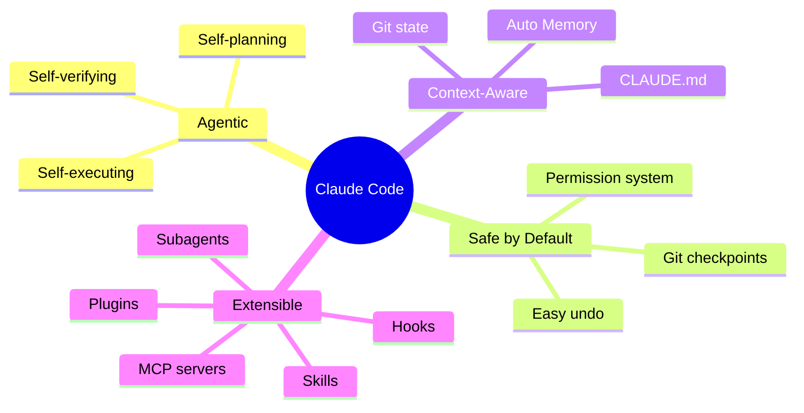
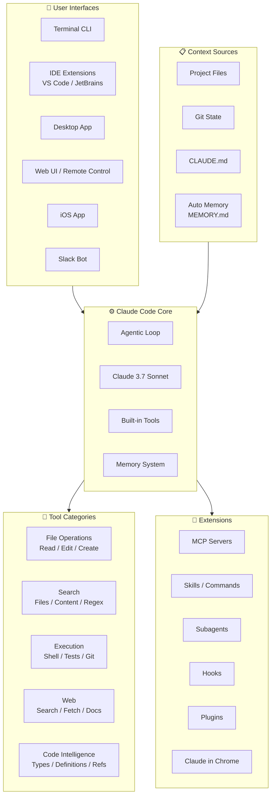

# How Claude Code Works — Overview

## What is Claude Code?

**Claude Code** is an **agentic coding** tool developed by [Anthropic](https://www.anthropic.com). It reads codebases, edits files, runs terminal commands, and integrates directly into the software development workflow. Available on **terminal**, **IDE** (VS Code, JetBrains), **desktop app**, **web**, and **mobile**.

> **Core differentiator:** Claude Code isn't just code completion — it's an **autonomous agent** capable of planning, executing multi-step tasks, and self-verifying results.

---

## Problems Solved

| Problem | Description | How Claude Code Solves It |
|:---|:---|:---|
| Context switching | Devs have to jump between editor, terminal, browser, docs | Agent integrates everything in 1 interface — read, edit, run, search |
| Repetitive tasks | Writing tests, fixing lint, committing, creating PRs are repetitive work | End-to-end automation — from writing tests to running and fixing |
| Codebase understanding | Large repos are hard to grasp quickly | Agent automatically reads, searches, traces code before acting |
| Multi-step debugging | Debugging requires many manual steps | Automatic agentic loop: run test → read error → find file → fix → verify |
| Knowledge silos | Project knowledge is scattered | CLAUDE.md + Auto Memory stores context across sessions |
| Permission anxiety | Concern about AI making uncontrolled code changes | Checkpoint system + permission modes for each trust level |

---

## Design Philosophy

| Principle | Explanation |
|:---|:---|
| **Agentic-first** | Not just suggesting — takes action through gather → act → verify loop |
| **Safety by design** | Git checkpoint before every major change, 3-tier permission system |
| **Context persistence** | CLAUDE.md + Auto Memory preserves knowledge across sessions |
| **Extensibility** | MCP, Skills, Subagents, Hooks — unlimited extensibility |
| **Universal access** | Terminal, IDE, Desktop, Web, Mobile, Slack, CI/CD |

---

## Who Should Use It?

| Audience | Primary Use Case |
|:---|:---|
| **Individual developers** | Accelerate development, automate repetitive tasks |
| **Dev teams** | Shared CLAUDE.md for conventions, automated code review |
| **DevOps/SRE** | CI/CD integration, monitoring, automated fixes |
| **Open-source maintainers** | Automated PR review, issue triage |
| **Learners** | Understand new codebases, receive detailed explanations |

---

## Architecture Overview

### Main Components

| Component | Role | Details |
|:---|:---|:---|
| **Agentic Loop** | Main processing loop | Gather context → Take action → Verify results |
| **Claude 3.7 Sonnet** | Foundation AI model | Reasoning + Coding capabilities |
| **Built-in Tools** | Environment interaction | File ops, Search, Execution, Web, Code Intelligence |
| **Memory System** | Knowledge storage | CLAUDE.md (explicit) + Auto Memory (implicit) |
| **Permission System** | Access control | Default / Auto-accept / Plan mode |
| **Checkpoint System** | Change safety | Automatic git checkpoints, easy undo/reset |
| **Extension System** | Capability expansion | MCP, Skills, Subagents, Hooks, Plugins |

---

## Lifecycle / Main Workflow

### Agentic Loop Details

| Phase | Description | Commonly Used Tools |
|:---|:---|:---|
| **Gather Context** | Read files, search codebase, understand structure | Read, Search, Git status |
| **Analyze & Plan** | Identify the problem, plan actions | Reasoning (internal) |
| **Take Action** | Execute changes — edit files, run commands | Edit, Bash, Create |
| **Verify Results** | Check results — run tests, review output | Bash (tests), Read |
| **Report** | Summarize what was done for the user | — |

> **Important characteristic:** The loop is **self-adaptive** — simple questions may only need Gather, while bug fixes cycle through all phases multiple times.

---

## Key Features

### 1. Multi-Interface Access
Use Claude Code **everywhere**:
- **Terminal** — Primary interface, full power
- **VS Code / JetBrains** — Integrated IDE extensions
- **Desktop App** — Visual diff review
- **Web / Remote Control** — Access from browser
- **iOS App** — Work from mobile, `/teleport` back to terminal
- **Slack** — `@Claude` in team chat
- **CI/CD** — GitHub Actions, GitLab CI/CD

### 2. Memory System
- **CLAUDE.md** — Markdown file storing instructions, conventions, context for the project
- **Auto Memory** — Claude automatically learns patterns and preferences while working, saved to `MEMORY.md`
- **`.claude/rules/`** — Per-directory rules for monorepos

### 3. Session Management
- **`--continue`** — Continue the previous session
- **`--resume`** — Choose a specific session to continue
- **`--fork-session`** — Fork a session to try a different approach
- **`/compact`** — Compress context when nearing capacity
- **`/context`** — View context window status

### 4. Safety & Control
- **Git Checkpoints** — Automatically creates checkpoints before major changes
- **3 Permission Modes** — Default (ask), Auto-accept edits, Plan mode
- **Fine-grained Permissions** — Allow/Ask/Deny rules per tool
- **Undo/Reset** — Easy revert at any time

### 5. Extension Ecosystem
- **MCP Servers** — Connect external services
- **Skills** — Custom workflows and commands
- **Subagents** — Delegate tasks to specialized agents
- **Hooks** — Event-driven automation
- **Plugins** — Code intelligence and marketplace

---

## Comparison with Alternatives

| Feature | Claude Code | GitHub Copilot | Cursor | Aider |
|:---|:---|:---|:---|:---|
| **Agentic execution** | ✅ Full loop | ⚠️ Limited | ✅ Composer | ⚠️ CLI only |
| **Terminal-native** | ✅ | ❌ | ❌ | ✅ |
| **IDE integration** | ✅ VS Code + JetBrains | ✅ | ✅ Built-in | ❌ |
| **Web/Mobile access** | ✅ | ❌ | ❌ | ❌ |
| **Memory system** | ✅ CLAUDE.md + Auto | ❌ | ⚠️ Rules | ⚠️ .aider |
| **Git checkpoints** | ✅ Automatic | ❌ | ❌ | ✅ |
| **Permission system** | ✅ 3 modes + rules | N/A | ❌ | ⚠️ |
| **Subagents** | ✅ | ❌ | ❌ | ❌ |
| **MCP support** | ✅ | ❌ | ❌ | ❌ |
| **CI/CD integration** | ✅ GH Actions + GitLab | ✅ | ❌ | ⚠️ |
| **Slack integration** | ✅ | ❌ | ❌ | ❌ |
| **Pricing** | Pay-per-use / Max plan | Subscription | Subscription | Free (BYOK) |

---

## Available Tools

| Category | Capabilities |
|:---|:---|
| **File Operations** | Read files, edit code, create new files, rename and reorganize |
| **Search** | Find files by pattern, search content with regex, explore codebases |
| **Execution** | Run shell commands, start servers, run tests, use git |
| **Web** | Search the web, fetch documentation, look up error messages |
| **Code Intelligence** | Type errors/warnings, jump to definitions, find references (via plugins) |

---

## See Also

- [[3-Research/Claude Code/how-claude-code-works/1. Architecture and Logic]] — Detailed data flow, modules, internal operating mechanisms
- [[3-Research/Claude Code/how-claude-code-works/2. Playbook]] — Installation guide, Day 1 workflow, cheat sheet, troubleshooting
