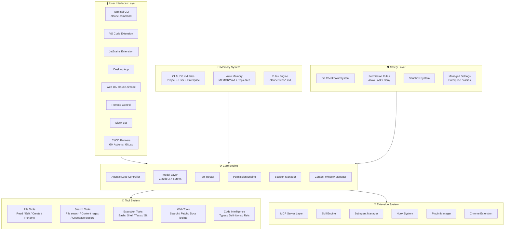
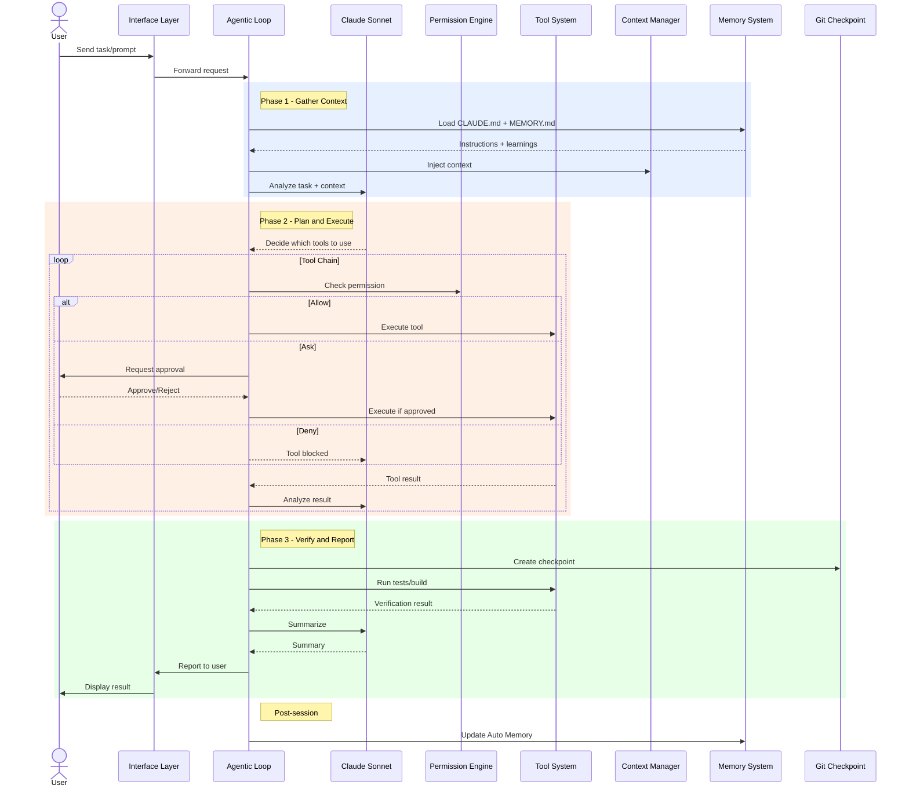
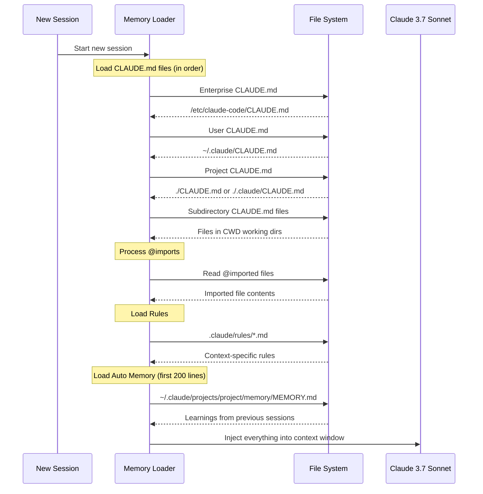
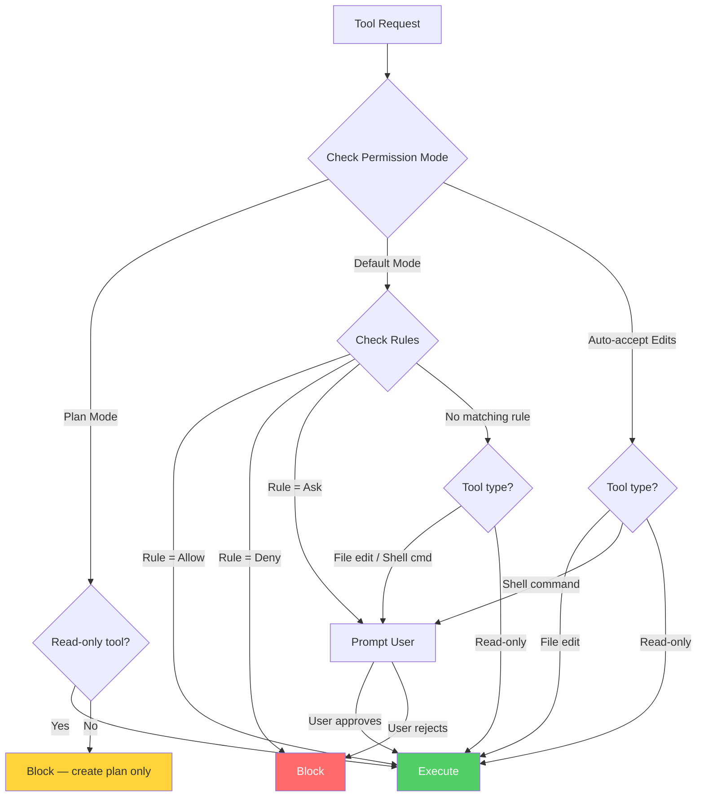
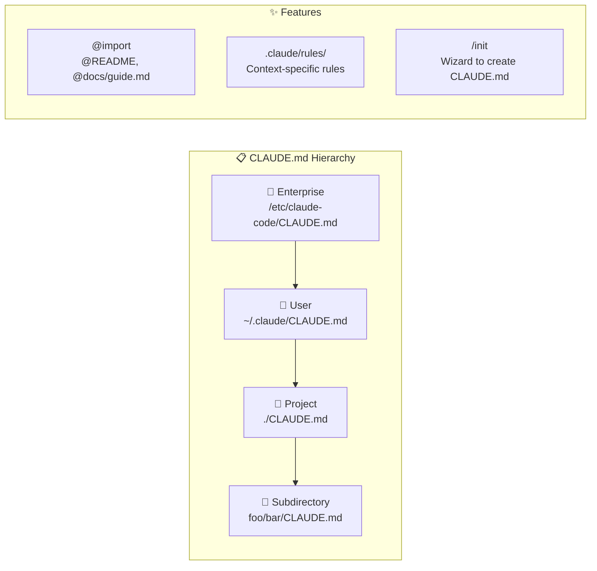
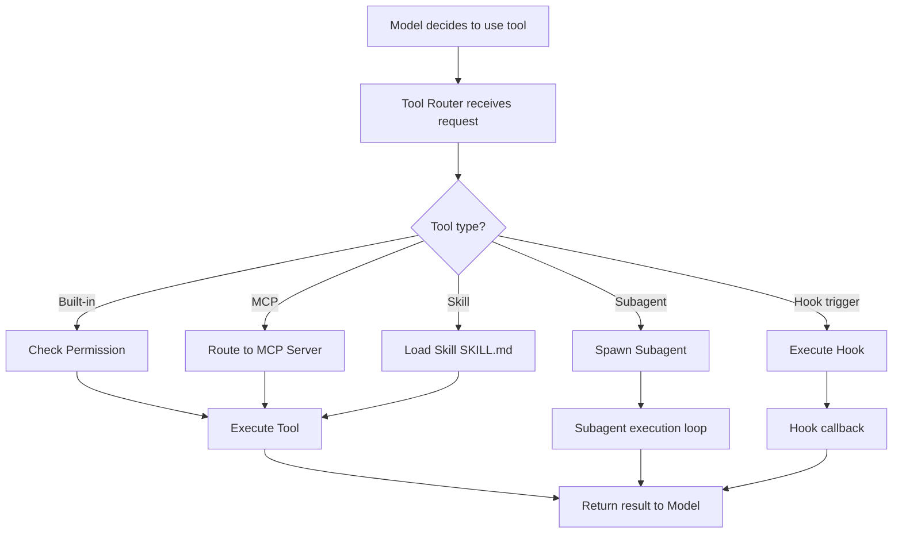
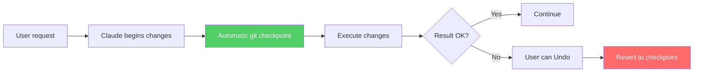
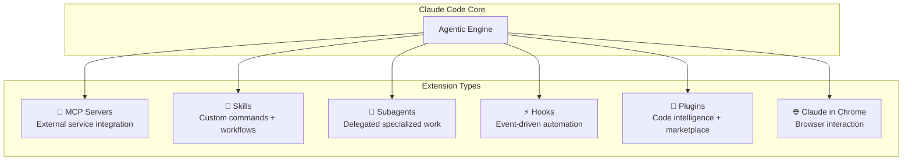

# How Claude Code Works — Architecture & Logic

## Overall Architecture Model



### Layer Explanation

| Layer | Function | Key Components |
|:---|:---|:---|
| **Interfaces** | User touchpoints | CLI, IDE extensions, Desktop, Web, Slack, CI/CD |
| **Core Engine** | Central processing brain | Agentic Loop, Model, Tool Router, Permission, Session, Context |
| **Tool System** | Environment interaction | File ops, Search, Execution, Web, Code Intelligence |
| **Memory System** | Long-term knowledge storage | CLAUDE.md, Auto Memory, Rules |
| **Extension System** | Capability expansion | MCP, Skills, Subagents, Hooks, Plugins |
| **Safety Layer** | Protection and control | Checkpoints, Permissions, Sandbox, Managed Settings |

---

## Detailed Data Flow

### Flow 1: Agentic Loop — Main Processing Loop



### Flow 2: Memory Loading — How Claude Remembers Projects



### Flow 3: Permission Check — Access Control



---

## Core Modules / Components

### Agentic Loop Controller

| Property | Details |
|:---|:---|
| **Role** | Orchestrates the entire request processing |
| **3 Phases** | Gather Context → Take Action → Verify Results |
| **Characteristic** | Self-adaptive — simple questions only need Gather, bug fixes cycle multiple times |
| **Tool chaining** | Automatically chains dozens of actions based on previous step results |
| **Course-correcting** | Self-adjusts when detecting mistakes or new information |

### Model Layer

| Property | Details |
|:---|:---|
| **Default model** | Claude 3.7 Sonnet |
| **Change model** | `/model` command or `claude --model <name>` |
| **Multi-model** | Supports configuring multiple models for different tasks |
| **Settings** | `ANTHROPIC_MODEL` env var, `model` in settings.json |
| **Haiku-class** | `ANTHROPIC_SMALL_FAST_MODEL` for background tasks |

### Context Window Manager

| Property | Details |
|:---|:---|
| **Role** | Manages context window (which has limits) |
| **Auto-management** | Truncates long output, summarizes read files, drops old conversation |
| **`/compact`** | Manually compress context — `/compact focus on the API changes` |
| **`/context`** | View current context window status |
| **Autocompact** | `CLAUDE_AUTOCOMPACT_PCT_OVERRIDE` — automatic trigger |
| **1M context** | Extended context window (can be disabled) |

### Session Manager

| Property | Details |
|:---|:---|
| **Role** | Manages session lifecycle |
| **Continue** | `claude --continue` — continue the last session |
| **Resume** | `claude --resume` — choose a specific session |
| **Fork** | `claude --continue --fork-session` — branch off a session |
| **Git-aware** | Recognizes branch, uncommitted changes, commit history |
| **Worktrees** | Supports git worktrees for parallel sessions |

---

## Internal Operating Mechanisms

### Memory System — How Claude Remembers

Claude Code has **2 memory systems** operating in parallel:

#### CLAUDE.md Files (Explicit Memory)



| Scope | Path | Shared | Use Case |
|:---|:---|:---|:---|
| **Enterprise** | `/etc/claude-code/CLAUDE.md` | Entire org | Company-wide policies |
| **User** | `~/.claude/CLAUDE.md` | User only | Personal preferences |
| **Project** | `./CLAUDE.md` or `./.claude/CLAUDE.md` | Team (git) | Project conventions |
| **Subdirectory** | `foo/CLAUDE.md` | Team (git) | Module-specific rules |

**Writing effective CLAUDE.md:**
- ✅ "Use 2-space indentation" — specific
- ❌ "Format code properly" — vague
- ✅ "Run `npm test` before committing" — clear action
- ❌ "Test your changes" — unclear how

#### Auto Memory (Implicit Memory)

| Property | Details |
|:---|:---|
| **How it works** | Claude automatically saves patterns, preferences while working |
| **Storage** | `~/.claude/projects/<project>/memory/` |
| **Index file** | `MEMORY.md` — first 200 lines loaded each session |
| **Topic files** | `debugging.md`, `api-conventions.md`, etc. |
| **Enable/Disable** | `/memory` command or `autoMemoryEnabled` setting |
| **Audit** | `/memory` to view and edit |

```
~/.claude/projects/<project>/memory/
├── MEMORY.md           # Index, loaded each session
├── debugging.md        # Debugging patterns
├── api-conventions.md  # API design decisions
└── ...                 # Other topic files
```

---

### Tool Router — Routing and Execution



### Built-in Tools Details

| Tool Category | Specific Actions | Default Permission |
|:---|:---|:---|
| **Read** | Read file content | Auto-allow |
| **Edit** | Edit file content | Ask (Default), Allow (Auto-accept) |
| **Create** | Create new files | Ask |
| **Bash** | Run shell commands | Ask |
| **Search** | Find files, grep content | Auto-allow |
| **WebFetch** | Fetch URL content | Ask (domain-based) |
| **Agent** | Spawn subagent | Ask |

---

### Permission System — Details

#### Permission Modes

| Mode | Behavior | When to Use |
|:---|:---|:---|
| **`default`** | Asks before file edits + shell commands | Daily work — full control |
| **`acceptEdits`** | Auto-allows edits, still asks for commands | Trust edits, want command control |
| **`plan`** | Read-only tools only, creates plan | Review before executing |
| **`dontAsk`** | Bypasses all permissions | Automation/CI — be careful! |

#### Permission Rule Syntax

```json
{
  "permissions": {
    "allow": [
      "Bash(npm run *)",
      "Bash(git commit *)",
      "Read"
    ],
    "deny": [
      "Bash(git push *)",
      "Bash(rm -rf *)"
    ]
  }
}
```

| Syntax | Example | Meaning |
|:---|:---|:---|
| `Tool` | `Bash` | Match all uses of the tool |
| `Tool(command)` | `Bash(npm run build)` | Exact command match |
| `Tool(pattern*)` | `Bash(npm run *)` | Wildcard matching |
| `Tool(specifier)` | `WebFetch(domain:example.com)` | Specifier-based matching |

---

### Checkpoint System — Git Safety Net



| Action | Description | How |
|:---|:---|:---|
| **Checkpoint** | Git snapshot before major changes | Automatic |
| **Undo** | Revert last changes | `Esc` or undo command |
| **Reset** | Return to session start state | Reset command |
| **Interrupt** | Stop Claude mid-execution | `Esc` key |

---

### Extension System — Extending Claude Code



| Extension | Purpose | Example |
|:---|:---|:---|
| **MCP Servers** | Connect external APIs/services | GitHub API, database, Jira |
| **Skills** | Custom slash commands + workflows | `/review-pr`, `/deploy-staging` |
| **Subagents** | Delegate tasks to separate agents | Research agent, test agent |
| **Hooks** | Automation when events occur | Pre-commit checks, auto-format |
| **Plugins** | Marketplace + code intelligence | Type checking, linting |
| **Chrome** | Interact with browser content | Screenshot, DOM reading |

---

## Configuration / Settings

### Settings Files

| Scope | Path | Shared |
|:---|:---|:---|
| **Enterprise** | Managed deployment | Entire org |
| **User** | `~/.claude/settings.json` | Personal |
| **Project** | `.claude/settings.json` | Team (commit to git) |
| **Local** | `.claude/settings.local.json` | Personal (gitignore) |

### Key Settings

| Setting | Value | Description |
|:---|:---|:---|
| `permissions` | `{allow:[], deny:[]}` | Permission rules |
| `model` | `"claude-sonnet-4-6"` | Default model |
| `hooks` | `{...}` | Hook configurations |
| `env` | `{"FOO": "bar"}` | Environment variables |
| `autoMemoryEnabled` | `true/false` | Toggle auto memory |
| `includeGitInstructions` | `true/false` | Git instructions in system prompt |
| `defaultMode` | `default/acceptEdits/plan` | Default permission mode |
| `cleanupPeriodDays` | `20` | Clean old sessions after X days |

### Important Environment Variables

| Variable | Description |
|:---|:---|
| `ANTHROPIC_API_KEY` | API key for Anthropic |
| `ANTHROPIC_MODEL` | Override default model |
| `ANTHROPIC_SMALL_FAST_MODEL` | Model for background tasks |
| `CLAUDE_CODE_DISABLE_AUTO_MEMORY` | Disable auto memory |
| `CLAUDE_AUTOCOMPACT_PCT_OVERRIDE` | Autocompact threshold |
| `BASH_DEFAULT_TIMEOUT_MS` | Timeout for bash commands |
| `BASH_MAX_OUTPUT_LENGTH` | Output length limit |
| `CLAUDE_CODE_EFFORT_LEVEL` | `low/medium/high` — effort level |
| `MAX_THINKING_TOKENS` | Thinking tokens limit |

---

## Error Handling / Recovery

| Issue | Solution |
|:---|:---|
| Context window full | `/compact` to compress, `--fork-session` to fork, or start a new session |
| Claude not following CLAUDE.md | Check file load order, ensure specific instructions, avoid conflicts |
| Auto memory saves incorrect info | `/memory` to review + edit, `autoMemoryEnabled: false` to disable |
| CLAUDE.md too large | Split into `.claude/rules/` files, use `@import` |
| Instructions lost after `/compact` | Place in CLAUDE.md (always reloads), not just in conversation |
| Tool blocked | Check permissions — `/permissions`, fix rules in settings |
| Session errors | `claude --resume` to select session, `--fork-session` to retry |
| Git conflicts | Claude recognizes git state — request resolution or auto-resolves |

---

## Security

| Aspect | Mechanism |
|:---|:---|
| **File access** | Working directory only + allowed expansions |
| **Command execution** | Permission system — Allow/Ask/Deny |
| **Sensitive files** | `excludePatterns` in settings |
| **Enterprise control** | Managed settings — lock permissions/models/features |
| **Sandbox** | Sandbox system for execution isolation |
| **MCP security** | `allowedMcpServers` / `deniedMcpServers` |
| **Hook security** | `allowManagedHooksOnly`, `allowedHttpHookUrls` |
| **Plugin trust** | Marketplace restrictions, `pluginTrustMessage` |

---

## See Also

- [0. Overview](./0. Overview.md) — Overview, comparison, key features
- [2. Playbook](./2. Playbook.md) — Installation guide, operations, cheat sheet, troubleshooting
