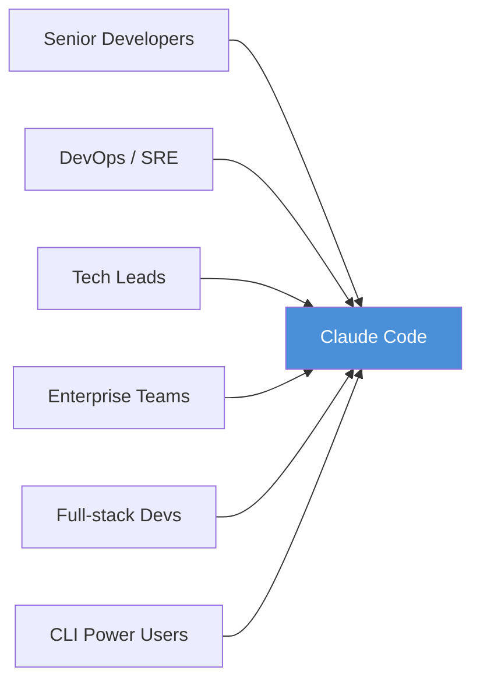
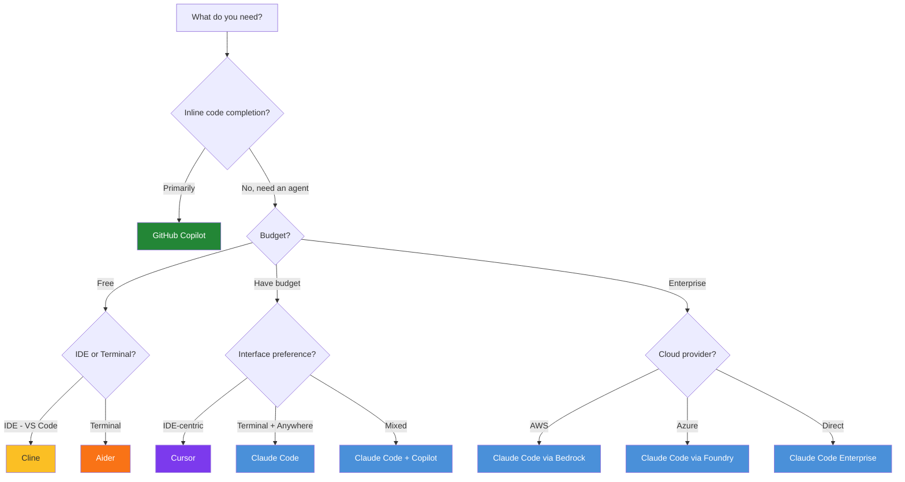

# How Claude Code Works — Decision Guide

## Comparison with Alternatives

### Overview Comparison Table

| Criteria | Claude Code | GitHub Copilot | Cursor | Aider | Cline (OpenRouter) |
|:---|:---|:---|:---|:---|:---|
| **Developer** | Anthropic | GitHub/Microsoft | Anysphere | Open-source | Open-source |
| **Primary model** | Claude 3.7 Sonnet | GPT-4o / Copilot models | GPT-4o + Claude | Customizable (BYOK) | Customizable (BYOK) |
| **Primary interface** | Terminal CLI | IDE extension | Dedicated IDE | Terminal CLI | VS Code extension |
| **Agentic execution** | ✅ Full multi-step loop | ⚠️ Limited (Workspace mode) | ✅ Composer agent | ⚠️ CLI commands | ✅ Autonomous mode |
| **File editing** | ✅ Multi-file, auto | ✅ Inline + multi-file | ✅ Composer multi-file | ✅ Multi-file | ✅ Multi-file |
| **Terminal access** | ✅ Native | ⚠️ Limited | ✅ In IDE | ✅ Native CLI | ✅ Via VS Code |
| **Git integration** | ✅ Deep (checkpoint, branch) | ✅ Copilot Chat | ⚠️ Basic | ✅ Auto-commit | ⚠️ Basic |
| **Memory system** | ✅ CLAUDE.md + Auto Memory | ❌ | ⚠️ Rules file | ⚠️ .aider conventions | ⚠️ Custom instructions |
| **Permission system** | ✅ 3 modes + fine-grained | N/A (suggestion only) | ❌ | ⚠️ Yes/No per edit | ⚠️ Auto-approve toggle |
| **Safety (undo)** | ✅ Auto git checkpoints | N/A | ⚠️ File history | ✅ Git commits | ⚠️ Manual undo |
| **Extensibility** | ✅ MCP + Skills + Hooks + Subagents | ⚠️ Extensions ecosystem | ⚠️ @-mentions | ❌ | ✅ MCP support |
| **Multi-platform** | ✅ Terminal + IDE + Web + Mobile + Slack | ✅ IDE only | IDE only | Terminal only | VS Code only |
| **CI/CD integration** | ✅ GH Actions + GitLab | ✅ Copilot Autofix | ❌ | ⚠️ Script-based | ❌ |
| **Enterprise controls** | ✅ Managed settings, SSO | ✅ Copilot Business/Enterprise | ⚠️ Team plan | ❌ | ❌ |
| **Open-source** | ❌ | ❌ | ❌ | ✅ Apache 2.0 | ✅ Apache 2.0 |

### Detailed Competitor Comparisons

#### Claude Code vs GitHub Copilot

| Aspect | Claude Code 🟦 | GitHub Copilot 🟩 |
|:---|:---|:---|
| **Strengths** | Agentic full-loop, terminal-native, multi-platform, deep git safety | Ecosystem integration (GitHub), smooth inline completion, Copilot Workspace |
| **Weaknesses** | No inline code completion, learning curve | Limited agentic capability, no memory system |
| **Best for** | Multi-step tasks, automation, CI/CD, advanced users | Quick completions, simple edits, GitHub-heavy workflows |
| **Pricing model** | Pay-per-token / Max subscription | $10/mo Individual, $19/mo Business |

#### Claude Code vs Cursor

| Aspect | Claude Code 🟦 | Cursor 🟪 |
|:---|:---|:---|
| **Strengths** | Terminal-native, safety system, cross-platform, subagents, hooks | Visual IDE experience, code context via codebase indexing, Composer UI |
| **Weaknesses** | Requires terminal familiarity | Only on Cursor IDE, limited safety/undo |
| **Best for** | Power users, DevOps, CI/CD, multi-repo | Developers who prefer IDE-centric, visual workflows |
| **Pricing model** | Pay-per-token / Max subscription | $20/mo Pro, $40/mo Business |

#### Claude Code vs Aider

| Aspect | Claude Code 🟦 | Aider 🟧 |
|:---|:---|:---|
| **Strengths** | Managed infrastructure, safety, extensibility, multi-platform | Free, BYOK, open-source, lightweight, multi-model |
| **Weaknesses** | Vendor lock-in (Anthropic), token costs | No safety system, not extensible, rough UX |
| **Best for** | Professional/team use, complex projects | Personal projects, budget-conscious, model experimentation |
| **Pricing model** | Pay-per-token / Max subscription | Free (bring your own API key) |

#### Claude Code vs Cline

| Aspect | Claude Code 🟦 | Cline 🟨 |
|:---|:---|:---|
| **Strengths** | Terminal-native, memory, subagents, CI/CD, enterprise | Open-source, VS Code native, MCP support, BYOK |
| **Weaknesses** | No inline completion | VS Code only, no memory system, no CI/CD |
| **Best for** | Full workflow automation, enterprise | VS Code users, quick autonomous tasks |
| **Pricing model** | Pay-per-token / Max subscription | Free (bring your own API key) |

---

## When You SHOULD Use Claude Code

### ✅ Ideal Use Cases

| Scenario | Why Claude Code Fits |
|:---|:---|
| **Multi-step bug fixing** | Agentic loop automates: trace → analyze → fix → test → verify |
| **Large-scale refactoring** | Multi-file editing with git checkpoints ensures safety |
| **CI/CD automation** | Native GitHub Actions + GitLab CI/CD integration |
| **Codebase exploration** | Agent automatically searches, reads, traces — understands new repos quickly |
| **Test creation** | Writes tests, runs them, fixes failures — all automated |
| **PR automation** | Creates PRs, commit messages, automated code review |
| **DevOps tasks** | Terminal-native, runs any CLI tool |
| **Team/Enterprise** | Managed settings, shared CLAUDE.md, permission policies |
| **Cross-platform work** | Terminal → Web → Mobile → Slack — continue anywhere |
| **Complex multi-agent workflows** | Subagents for parallel tasks, delegation |

### 🎯 Best-Fit Audience

---

## When You Should NOT Use Claude Code

### ❌ Limitations & Anti-use-cases

| Scenario | Why It's Not a Good Fit | Better Alternative |
|:---|:---|:---|
| **Only need inline code completion** | Claude Code has no inline suggestions | GitHub Copilot, Cursor |
| **Extremely budget-constrained** | Pay-per-token can be expensive | Aider (BYOK), Cline (free) |
| **Only work in IDE** | Claude Code is strongest in terminal | Cursor, Copilot |
| **Not familiar with terminal** | Learning curve for CLI workflows | Cursor, GitHub Copilot |
| **Need to run completely offline** | Requires API connection | Local models + Aider |
| **Very small project / simple scripts** | Overkill for simple tasks | Copilot inline, ChatGPT |
| **Don't want vendor lock-in** | Tied to Anthropic ecosystem | Aider (multi-model), Cline |
| **Mobile-first development** | Terminal on mobile is limited | Web IDE solutions |

### ⚠️ Careful Consideration

| Situation | Note |
|:---|:---|
| **Combining with Copilot** | Fully compatible — Copilot for completions, Claude Code for agentic tasks |
| **Teams < 3 people** | Max subscription + CLAUDE.md sharing may suffice, no need for Enterprise |
| **Less popular languages** | Claude still supports but quality may be lower than mainstream languages |
| **Regulated industries** | Check data policies — code is sent to Anthropic API |
| **Air-gapped environments** | Needs API connectivity — see Amazon Bedrock or Microsoft Foundry options |

---

## Costs & Resources

### Pricing Model

| Plan | Cost | Features | Best For |
|:---|:---|:---|:---|
| **API (Pay-per-token)** | ~$3/M input, ~$15/M output tokens (Claude 3.7 Sonnet) | Pay per usage, flexible | Developers needing cost control, CI/CD |
| **Claude Max (5x)** | $100/month | Premium tier, 5x usage | Individual power users |
| **Claude Max (20x)** | $200/month | Maximum tier, 20x usage | Heavy daily use, all day |
| **Enterprise (API Console)** | Custom pricing | Team management, SSO, audit logs | Organizations |
| **Amazon Bedrock** | AWS pricing | VPC, compliance, no data leaving AWS | Enterprise AWS users |
| **Microsoft Foundry** | Azure pricing | Azure integration | Enterprise Azure users |

### Estimated Costs by Use Case

| Use Case | Token Usage/Session | Estimated Cost (API) | Max Plan Cost |
|:---|:---|:---|:---|
| **Quick bug fix** | ~10K-50K tokens | $0.05 - $0.50 | Included |
| **Feature implementation** | ~100K-500K tokens | $0.50 - $5.00 | Included |
| **Large refactoring** | ~500K-2M tokens | $5.00 - $20.00 | Included |
| **Full-day development** | ~2M-10M tokens | $20.00 - $100.00 | Included (Max 20x) |
| **CI/CD review** | ~50K-200K per run | $0.25 - $2.00/run | API only |

### Cost Optimization Strategies

| Strategy | Estimated Savings | How |
|:---|:---|:---|
| **`/compact` frequently** | 20-40% | Compress context between tasks |
| **`/clear` between tasks** | 30-50% | Reset context when switching topics |
| **Use Haiku for simple tasks** | 60-70% | `ANTHROPIC_SMALL_FAST_MODEL` for background |
| **Specific prompts** | 15-25% | Reduce iterations, get it right first time |
| **Skills instead of long CLAUDE.md** | 10-20% | Load instructions on-demand, not every session |
| **Hooks to filter output** | 20-30% | Filter test output, keep only failures |
| **Subagents for verbose ops** | 15-25% | Isolate heavy context from main session |
| **Plan mode before implementing** | 20-40% | Avoid expensive rework |
| **Code intelligence plugins** | 10-20% | Claude knows types, less need to re-read code |
| **CLI tools instead of MCP** | 10-15% | Less overhead than MCP server definitions |

### Cost Comparison with Alternatives

| Tool | Cost/Month (typical) | Pricing Model | Includes |
|:---|:---|:---|:---|
| **Claude Code (API)** | $20 - $200+ | Pay-per-token | Pay only for what you use |
| **Claude Max 5x** | $100 | Subscription | Claude Code + claude.ai + Projects |
| **Claude Max 20x** | $200 | Subscription | Maximum usage allocation |
| **GitHub Copilot Individual** | $10 | Subscription | Inline completion + Chat |
| **GitHub Copilot Business** | $19/user | Subscription | + Policies, audit, IP indemnity |
| **Cursor Pro** | $20 | Subscription | AI-powered IDE |
| **Cursor Business** | $40/user | Subscription | + Admin, centralized billing |
| **Aider** | $0 + API costs | BYOK | Free tool, pay for API |
| **Cline** | $0 + API costs | BYOK | Free tool, pay for API |

> **Important note:** Direct cost comparison is difficult because pricing models differ. Claude Code API pay-per-token can be cheaper than subscriptions for light use, but more expensive for heavy use — Max plans provide predictable cost.

---

## Migration Path

### Currently Using GitHub Copilot → Claude Code

| Step | Action | Note |
|:---|:---|:---|
| 1 | Install Claude Code alongside — `npm install -g @anthropic-ai/claude-code` | No conflict with Copilot |
| 2 | Run `/init` in project | Creates CLAUDE.md from codebase |
| 3 | Use Copilot for inline completion, Claude Code for agentic tasks | Complementary, not exclusive |
| 4 | Migrate conventions from `.github/copilot-instructions.md` → `CLAUDE.md` | Similar format |
| 5 | Try CI/CD integration with Claude Code GitHub Actions | Replace or supplement Copilot Autofix |
| 6 | Evaluate after 2-4 weeks — decide to keep both or fully migrate | Track productivity + cost |

### Currently Using Cursor → Claude Code

| Step | Action | Note |
|:---|:---|:---|
| 1 | Install Claude Code — terminal-based, IDE-independent | Still use Cursor for visual work |
| 2 | Migrate `.cursorrules` → `CLAUDE.md` | Different format, needs rewriting |
| 3 | Use Claude Code VS Code extension instead of Cursor for agentic tasks | Or use terminal alongside Cursor |
| 4 | Learn terminal workflow — `/init`, `--continue`, `--fork-session` | Moderate learning curve |
| 5 | Set up permissions in `.claude/settings.json` | Cursor has no equivalent |
| 6 | Leverage subagents, MCP — not available in Cursor | Game changer for complex projects |

### Currently Using Aider → Claude Code

| Step | Action | Note |
|:---|:---|:---|
| 1 | Install Claude Code — also terminal-based | Familiar interface |
| 2 | `.aider` file → `CLAUDE.md` | Migrate conventions |
| 3 | Aider auto-commit → Claude Code git checkpoints | Better safety |
| 4 | BYOK flexibility lost → locked to Anthropic | Main trade-off |
| 5 | Gain: Memory system, subagents, MCP, CI/CD, multi-platform | Significant |
| 6 | Can keep Aider for quick tasks + Claude Code for complex work | Hybrid approach |

### ⚠️ Breaking Changes / Gotchas

| Issue | Description | Solution |
|:---|:---|:---|
| **Different config format** | Each tool has its own format | Manual migration, no auto-convert |
| **Different API key** | Need separate Anthropic API key | Register at console.anthropic.com |
| **Workflow habits** | Terminal-first vs IDE-first mindset | Allow time to adapt — 1-2 weeks |
| **Cost model change** | Subscription → pay-per-token (or vice versa) | Compare bills for 1 month before committing |
| **Team coordination** | Different shared config format | Update team docs + onboarding |

---

## Roadmap & Future

### Development Direction

| Direction | Status | Significance |
|:---|:---|:---|
| **Agent Teams** | Experimental (`CLAUDE_CODE_EXPERIMENTAL_AGENT_TEAMS`) | Multiple agents collaborating |
| **Scheduled Tasks** | Available | Cron-like automation |
| **Fast Mode** | Available | Speed up simple tasks |
| **Plugin Marketplace** | Available | Expanding ecosystem |
| **More IDE integrations** | VS Code + JetBrains done | Broader coverage |
| **Cloud Execution** | Available | Offload tasks to cloud VMs |
| **Web/Mobile** | Available | Cross-device workflow |
| **Agent SDK** | Available | Build custom agents on Claude Code |

### Community Health

| Metric | Assessment |
|:---|:---|
| **Maintainer** | Anthropic — $1B+ funding, 500+ employees |
| **Update frequency** | Very active — weekly updates |
| **Documentation** | Excellent — comprehensive official docs |
| **Community** | Growing — Discord, GitHub Discussions |
| **Enterprise adoption** | Strong — many enterprise customers |
| **Stability** | Good — semver, changelog, deprecation notices |
| **Long-term viability** | High — Anthropic is a major AI company |

---

## Decision Matrix

### Quick Decision Matrix

| Scenario | Recommendation | Reason |
|:---|:---|:---|
| Terminal power user, complex projects | 🟦 **Claude Code** | Terminal-native, agentic loop, safety, extensibility |
| Only need inline completions | 🟩 **GitHub Copilot** | Best-in-class inline suggestions, affordable |
| IDE-centric, visual workflow | 🟪 **Cursor** | Best IDE experience, Composer UI |
| Budget-conscious, BYOK | 🟧 **Aider** | Free, open-source, multi-model |
| VS Code autonomous agent | 🟨 **Cline** | Free, MCP support, VS Code native |
| Enterprise team deployment | 🟦 **Claude Code** | Managed settings, SSO, audit, policies |
| CI/CD automated workflows | 🟦 **Claude Code** | Native GH Actions + GitLab integration |
| Mixed: completions + agentic | 🟦🟩 **Claude Code + Copilot** | Best of both worlds |
| Fullstack + design review | 🟪 **Cursor** | Visual diffs, design-to-code |
| Multi-model experimentation | 🟧 **Aider** | BYOK, supports dozens of models |
| Mobile / remote work | 🟦 **Claude Code** | Web, iOS, Remote Control, Slack |
| Air-gapped / offline | 🟧 **Aider** (local models) | Ollama + Aider = fully offline |
| Pair programming style | 🟦 **Claude Code** | Conversational, interrupt, steer |
| Quick scripts / one-offs | 🟩 **GitHub Copilot** | Inline, fast, low friction |

### Decision Flowchart

### Scoring Matrix (1-5, higher = better)

| Criteria | Weight | Claude Code | Copilot | Cursor | Aider | Cline |
|:---|:---|:---|:---|:---|:---|:---|
| **Agentic capability** | 25% | ⭐⭐⭐⭐⭐ | ⭐⭐ | ⭐⭐⭐⭐ | ⭐⭐⭐ | ⭐⭐⭐⭐ |
| **Ease of use** | 15% | ⭐⭐⭐ | ⭐⭐⭐⭐⭐ | ⭐⭐⭐⭐⭐ | ⭐⭐⭐ | ⭐⭐⭐⭐ |
| **Safety / Control** | 15% | ⭐⭐⭐⭐⭐ | ⭐⭐⭐ | ⭐⭐ | ⭐⭐⭐ | ⭐⭐⭐ |
| **Extensibility** | 15% | ⭐⭐⭐⭐⭐ | ⭐⭐⭐ | ⭐⭐ | ⭐⭐ | ⭐⭐⭐ |
| **Cost efficiency** | 10% | ⭐⭐⭐ | ⭐⭐⭐⭐ | ⭐⭐⭐ | ⭐⭐⭐⭐⭐ | ⭐⭐⭐⭐⭐ |
| **Multi-platform** | 10% | ⭐⭐⭐⭐⭐ | ⭐⭐⭐ | ⭐⭐ | ⭐⭐ | ⭐⭐ |
| **Enterprise** | 10% | ⭐⭐⭐⭐⭐ | ⭐⭐⭐⭐ | ⭐⭐⭐ | ⭐ | ⭐ |
| **Weighted Total** | | **4.40** | **3.30** | **3.30** | **2.90** | **3.10** |

> **Disclaimer:** Scoring is based on subjective assessment from official documentation and community feedback. Actual results depend on specific use cases.

---

## See Also

- [0. Overview](./0. Overview.md) — Overview, quick comparison, key features
- [1. Architecture and Logic](./1. Architecture and Logic.md) — Data flow, modules, internal operating mechanisms
- [2. Playbook](./2. Playbook.md) — Installation guide, operations, cheat sheet, troubleshooting
