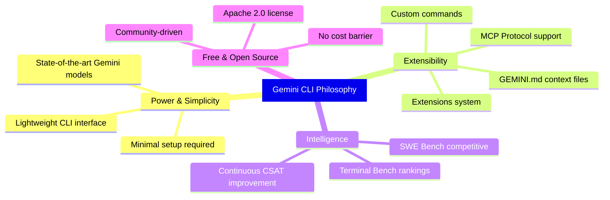
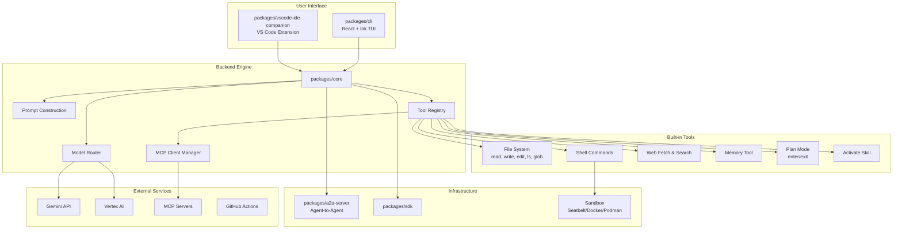
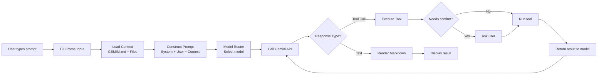

# Gemini CLI

## What is Gemini CLI?

**Gemini CLI** is an **open-source AI agent** developed by Google that brings the power of Gemini models directly into the terminal. Designed with a **terminal-first** philosophy, it provides the shortest path from your prompt to the Gemini model, allowing developers to interact with AI right within their familiar working environment.

| Info | Details |
|---|---|
| **Package name** | `@google/gemini-cli` |
| **Language** | TypeScript |
| **Runtime** | Node.js ≥20.0.0 |
| **License** | Apache 2.0 |
| **Stars** | ~98,000 ⭐ |
| **Forks** | ~12,300 |
| **Contributors** | 587+ |
| **Website** | [geminicli.com](https://geminicli.com) |

## Problems it solves

| Problem | Description | How Gemini CLI solves it |
|---|---|---|
| **AI coding cost** | AI coding tools often require expensive subscriptions | Free tier: 60 req/min, 1,000 req/day with a personal Google account |
| **Limited context window** | Many tools only support tens of thousands of tokens | Gemini 3 with 1M token context window |
| **Vendor lock-in** | Closed-source, not customizable | Apache 2.0 fully open-source |
| **Hard to extend** | Difficult to add tools or external integrations | MCP (Model Context Protocol) for custom integrations |
| **Lack of terminal integration** | Having to switch between IDE/browser/terminal | Terminal-first design, runs right in the command line |
| **Lack of sandboxing** | Security risks when AI runs shell commands | Built-in sandboxing (macOS Seatbelt, Docker, Podman) |

## Design Philosophy

## Who should use it?

| Audience | Use Case |
|---|---|
| **Individual developer** | Daily coding, debugging, code generation — free |
| **Development team** | Code review, automation, CI/CD integration via GitHub Actions |
| **Enterprise** | Vertex AI backend, enterprise security, compliance |
| **Open-source contributor** | Contributing to the Gemini ecosystem |
| **AI/ML researcher** | Experimenting with agentic coding, MCP tools |
| **DevOps engineer** | Automating operational tasks, scripting |

## Architecture Overview

| Package | Role |
|---|---|
| `packages/cli` | Terminal UI, input processing, React/Ink rendering |
| `packages/core` | Backend logic, API orchestration, prompt construction, tool execution |
| `packages/a2a-server` | Agent-to-Agent server (experimental) |
| `packages/sdk` | SDK for external integrations |
| `packages/vscode-ide-companion` | VS Code extension companion for the CLI |
| `packages/devtools` | React DevTools for development |
| `packages/test-utils` | Utilities for testing |

## Main Interaction Lifecycle

## Key Features

### Code Understanding & Generation
- Query and edit large codebases with 1M token context
- Generate apps from PDFs, images, sketches (multimodal)
- Debug and troubleshoot using natural language

### Automation & Integration
- Automate tasks: query PRs, complex rebases
- MCP servers: connect to Imagen, Veo, Lyria, custom tools
- Headless mode: run non-interactive in scripts
- Structured output: `--output-format json` or `stream-json`

### Advanced Capabilities
- **Google Search grounding**: real-time information
- **Conversation checkpointing**: save/resume sessions
- **GEMINI.md context files**: customize behavior per project
- **Custom commands**: create your own slash commands
- **Token caching**: optimize token usage
- **Plan mode**: plan before executing

### GitHub Integration
- **Gemini CLI GitHub Action**: integrate directly into workflows
- Automated PR reviews, issue triage
- `@gemini-cli` mention in issues/PRs

### Security & Sandboxing
- **macOS Seatbelt**: native sandboxing
- **Docker/Podman**: container-based isolation
- **Trusted Folders**: control execution policies
- **Confirmation policies**: user approves before tools run

## Authentication — 3 Methods

| Method | Audience | Free tier |
|---|---|---|
| **Google OAuth** | Individual developer | 60 req/min, 1,000 req/day |
| **Gemini API Key** | Need to select specific model | 1,000 req/day |
| **Vertex AI** | Enterprise, production | Per billing account |

## Comparison with Alternatives

| Feature | Gemini CLI | Claude Code | GitHub Copilot CLI | Aider |
|---|---|---|---|---|
| **Open-source** | ✅ Apache 2.0 | ❌ Closed | ❌ Closed | ✅ Apache 2.0 |
| **Free tier** | ✅ 1,000 req/day | ❌ Paid | ❌ Subscription | ✅ BYOK |
| **Context window** | 1M tokens | 200K tokens | N/A | Model-dependent |
| **MCP support** | ✅ Built-in | ✅ Built-in | ❌ | ❌ |
| **Sandboxing** | ✅ Multi-provider | ✅ | ❌ | ❌ |
| **GitHub Actions** | ✅ Official | ❌ | ✅ | ❌ |
| **Multimodal** | ✅ Image/PDF/Sketch | ✅ Image | ❌ | ❌ |
| **IDE companion** | ✅ VS Code | ❌ | ✅ | ❌ |
| **Headless/Script** | ✅ | ✅ | ⚠️ Limited | ✅ |

## Release Cadence

| Channel | Frequency | Description |
|---|---|---|
| **Stable** (`latest`) | Weekly on Tuesday (UTC 20:00) | Promotion from preview + bug fixes |
| **Preview** (`preview`) | Weekly on Tuesday (UTC 23:59) | Not fully vetted |
| **Nightly** (`nightly`) | Daily (UTC 00:00) | From main branch, may have issues |

## Roadmap — Focus Areas

| Area | Description |
|---|---|
| **Authentication** | API keys, Gemini Code Assist login |
| **Model** | New Gemini models, multi-modality, local execution |
| **User Experience** | Usability, performance, interactive features |
| **Tooling** | Built-in tools, MCP ecosystem |
| **Extensibility** | GitHub Actions, new surfaces |
| **Background Agents** | Long-running autonomous tasks |
| **Security & Privacy** | Sandboxing, data protection |
| **Quality** | Testing, reliability, benchmarks |

## See Also

- [1. Architecture and Logic](./1. Architecture and Logic.md) — Detailed data flow, core modules, internal mechanisms
- [2. Playbook](./2. Playbook.md) — Installation, Day 1, cheat sheet, troubleshooting
