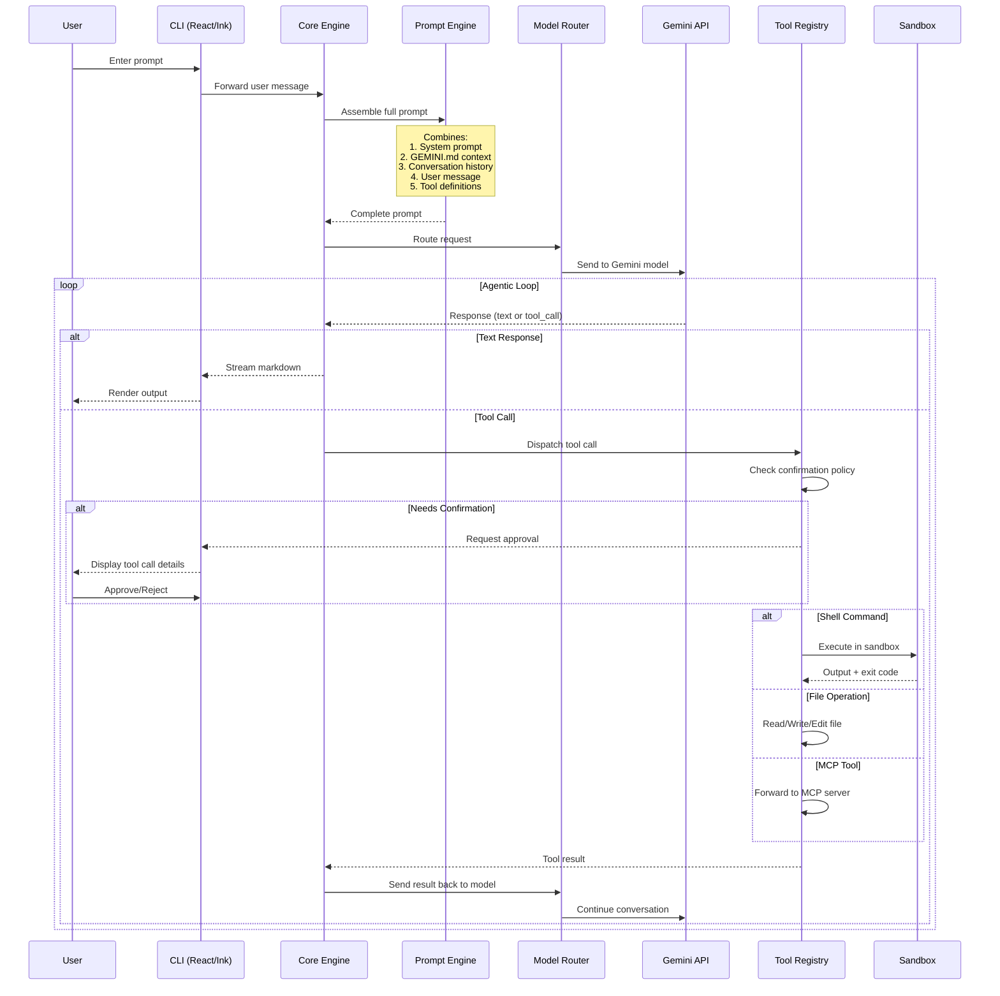
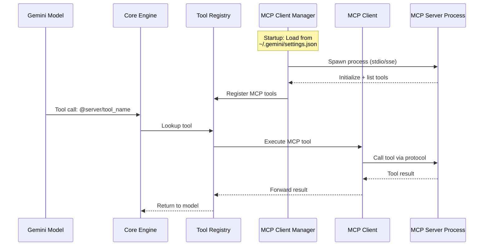
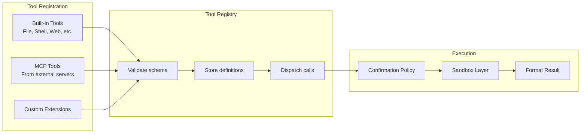
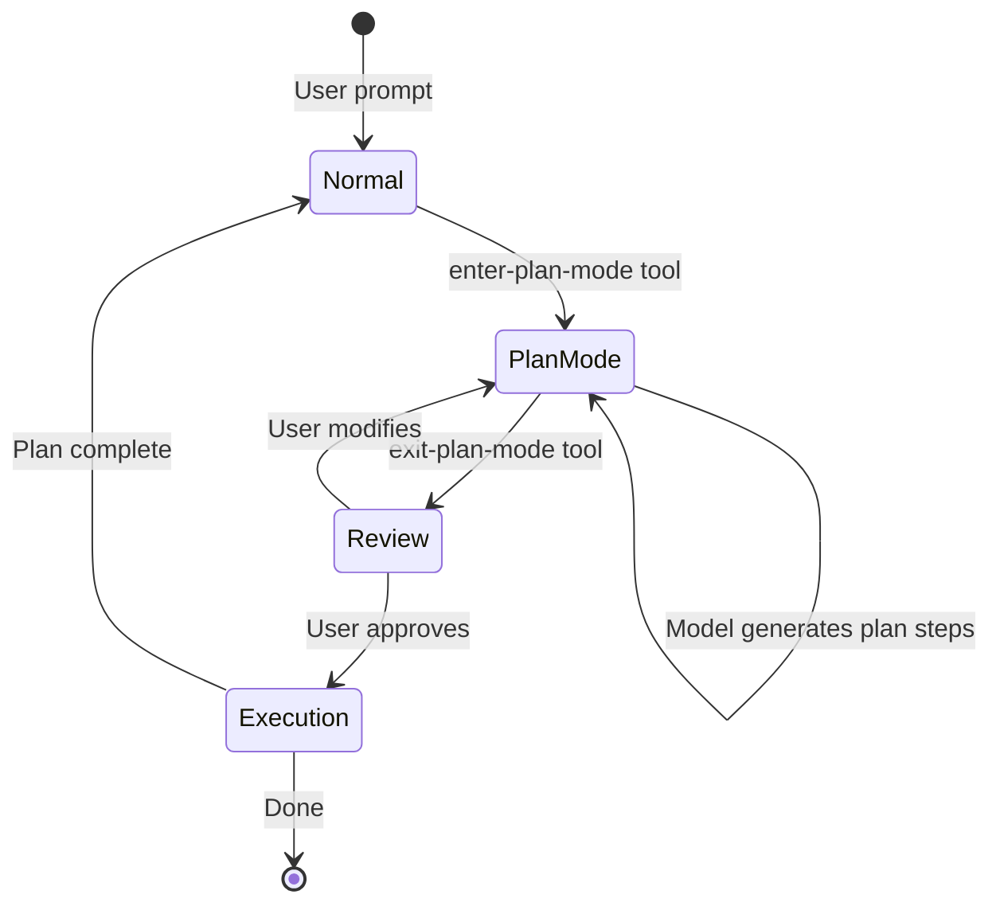
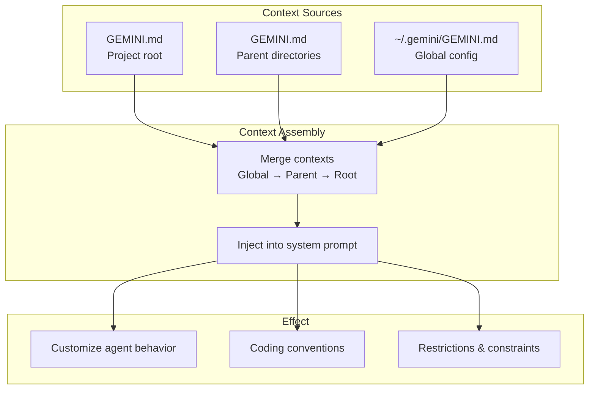
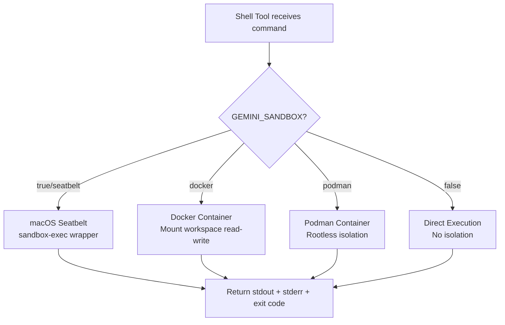
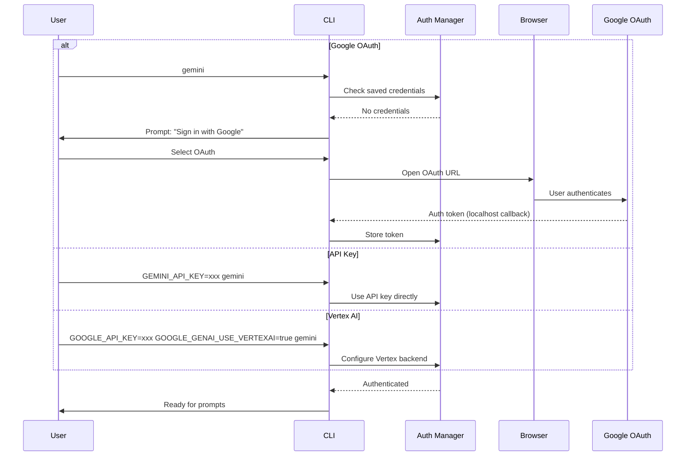
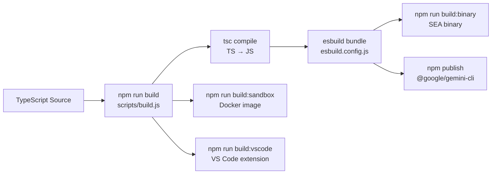

# Architecture and Logic — Gemini CLI

## Overall Architecture Model

Gemini CLI uses a **monorepo** architecture with npm workspaces, clearly separating 3 layers: **UI → Core → Services**.

```mermaid
graph TB
    subgraph Presentation["Presentation Layer"]
        CLI["packages/cli<br/>React + Ink Terminal UI"]
        VSCode["packages/vscode-ide-companion<br/>VS Code Extension"]
        Headless["Headless Mode<br/>Non-interactive scripting"]
    end

    subgraph Logic["Core Logic Layer"]
        Core["packages/core"]

        subgraph CoreModules["Core Modules"]
            PromptEngine["Prompt Engine<br/>System prompt + context assembly"]
            ModelRouter["Model Router Service<br/>Route to correct backend"]
            ToolRegistry["Tool Registry<br/>Register + dispatch tools"]
            ConversationMgr["Conversation Manager<br/>History + checkpointing"]
            ConfigMgr["Configuration Manager<br/>Settings + GEMINI.md"]
            AuthManager["Auth Manager<br/>OAuth, API Key, Vertex"]
        end
    end

    subgraph ToolLayer["Tool Execution Layer"]
        subgraph BuiltIn["Built-in Tools"]
            FileOps["File Operations<br/>read, write, edit, glob, ls"]
            ShellTool["Shell Execution"]
            WebTools["Web Fetch + Search"]
            MemTool["Memory Tool"]
            PlanTool["Plan Mode"]
            SkillTool["Activate Skill"]
            JITContext["JIT Context"]
            TrackerTool["Tracker Tools"]
            AskUser["Ask User"]
        end

        subgraph External["External Tools"]
            MCPClient["MCP Client<br/>Protocol handler"]
            MCPManager["MCP Client Manager<br/>Lifecycle management"]
        end
    end

    subgraph Infrastructure["Infrastructure Layer"]
        Sandbox["Sandbox Provider<br/>Seatbelt / Docker / Podman"]
        A2AServer["A2A Server<br/>Agent-to-Agent protocol"]
        SDK["SDK Package"]
        Bundler["esbuild Bundler"]
        SEA["Single Executable App"]
    end

    subgraph Backend["Backend Services"]
        GeminiAPI["Gemini API<br/>Google AI Studio"]
        VertexAI["Vertex AI<br/>Google Cloud"]
        GoogleSearch["Google Search<br/>Grounding"]
    end

    CLI --> Core
    VSCode --> Core
    Headless --> Core
    Core --> PromptEngine
    Core --> ModelRouter
    Core --> ToolRegistry
    Core --> ConversationMgr
    Core --> ConfigMgr
    Core --> AuthManager
    ToolRegistry --> FileOps
    ToolRegistry --> ShellTool
    ToolRegistry --> WebTools
    ToolRegistry --> MemTool
    ToolRegistry --> PlanTool
    ToolRegistry --> SkillTool
    ToolRegistry --> JITContext
    ToolRegistry --> TrackerTool
    ToolRegistry --> AskUser
    ToolRegistry --> MCPClient
    MCPClient --> MCPManager
    ShellTool --> Sandbox
    ModelRouter --> GeminiAPI
    ModelRouter --> VertexAI
    ModelRouter --> GoogleSearch
    Core --> A2AServer
    Core --> SDK
```



## Detailed Data Flow

### Main Flow: User Prompt → Response



### Flow: MCP Server Integration



## Core Modules / Components

### packages/core — Backend Engine

| Module | File/Dir | Role | Relationships |
|---|---|---|---|
| **Prompt Engine** | `src/prompts/` | Build system prompt, assemble context, GEMINI.md | → Model Router |
| **Model Router** | `src/routing/` | Select model backend (API/Vertex), send request | ← Prompt Engine → API |
| **Tool Registry** | `src/tools/tool-registry.ts` | Register, manage, dispatch all tools | ← Core → Tools |
| **Tool Definitions** | `src/tools/definitions/` | Declare schema for each built-in tool | → Tool Registry |
| **Confirmation Policy** | `src/tools/confirmation-policy.ts` | Decide which tools need user approval | → Tool Registry |
| **MCP Client** | `src/tools/mcp-client.ts` (73KB) | Handle MCP protocol communication | ← Tool Registry → MCP Servers |
| **MCP Client Manager** | `src/tools/mcp-client-manager.ts` | Manage lifecycle of multiple MCP connections | → MCP Client |
| **Memory Tool** | `src/tools/memoryTool.ts` | Save/read information cross-session | → File system |
| **Conversation** | `src/conversation/` | Manage history, checkpointing | ← Core |
| **Settings** | `src/settings/` | Config management, GEMINI.md parsing | ← Core |
| **Auth** | `src/auth/` | OAuth, API key, Vertex auth | ← Model Router |
| **Sandbox** | `src/sandbox/` | Shell command isolation | ← Shell Tool |

### packages/cli — Terminal UI

| Module | Role |
|---|---|
| **App Component** | Root React component, layout management |
| **Input Processing** | Parse user input, slash commands |
| **Display Rendering** | Markdown rendering via Ink |
| **Keyboard Handler** | Keybindings, shortcuts |
| **Theme System** | Terminal colors, styling |

## Internal Working Mechanisms

### 1. Tool System — Registry Pattern

Gemini CLI uses the **Tool Registry Pattern** to manage all tools:



### 2. Built-in Tools — Complete List

| Tool | File | Function | Needs confirm? |
|---|---|---|---|
| **read-file** | `read-file.ts` | Read file contents | ❌ |
| **read-many-files** | `read-many-files.ts` | Read multiple files at once | ❌ |
| **write-file** | `write-file.ts` | Write new file contents | ✅ |
| **edit** | `edit.ts` (40KB) | Edit existing file (diff-based) | ✅ |
| **ls** | `ls.ts` | List directory contents | ❌ |
| **glob** | `glob.ts` | Find files by pattern | ❌ |
| **grep** | `grep.ts` | Search content within files | ❌ |
| **ripGrep** | `ripGrep.ts` | Fast search with ripgrep engine | ❌ |
| **shell** | `shell.ts` | Run shell commands | ✅ |
| **web-fetch** | `web-fetch.ts` (29KB) | Fetch URL content | ✅ |
| **web-search** | `web-search.ts` | Google Search grounding | ❌ |
| **memoryTool** | `memoryTool.ts` | Save/load memory across sessions | ❌ |
| **enter-plan-mode** | `enter-plan-mode.ts` | Switch to plan mode | ❌ |
| **exit-plan-mode** | `exit-plan-mode.ts` | Exit plan mode, execute plan | ✅ |
| **activate-skill** | `activate-skill.ts` | Activate skill files | ❌ |
| **ask-user** | `ask-user.ts` | Ask user for input | ❌ |
| **jit-context** | `jit-context.ts` | Just-in-time context loading | ❌ |
| **get-internal-docs** | `get-internal-docs.ts` | Read internal documentation | ❌ |
| **write-todos** | `write-todos.ts` | Manage TODO tracking | ✅ |
| **trackerTools** | `trackerTools.ts` | Tracking and telemetry | ❌ |
| **mcp-tool** | `mcp-tool.ts` | Bridge for MCP server tools | Config-dependent |

### 3. Plan Mode — Think Before Acting



Plan Mode allows the model to **plan** before executing, effective for complex tasks.

### 4. GEMINI.md Context System



GEMINI.md works like `.cursorrules` or `CLAUDE.md` — providing persistent context for the model.

### 5. Sandbox Architecture

| Provider | Mechanism | Platform | Description |
|---|---|---|---|
| **macOS Seatbelt** | `sandbox-exec` | macOS only | Native OS-level sandboxing |
| **Docker** | Container isolation | Cross-platform | Full container isolation |
| **Podman** | Container isolation | Cross-platform | Docker alternative, rootless |
| **None** | No sandbox | All | Default, requires `GEMINI_SANDBOX=false` |



### 6. Authentication Flow



## Configuration / API

### Main Configuration — `~/.gemini/settings.json`

| Setting | Type | Default | Description |
|---|---|---|---|
| `theme` | string | `"default"` | Terminal theme |
| `model` | string | auto | Default model |
| `sandbox` | string | `"false"` | Sandbox provider |
| `mcpServers` | object | `{}` | MCP server configurations |
| `trustedDirectories` | array | `[]` | Folders allowed to run without confirmation |
| `telemetry` | boolean | `true` | Allow telemetry |

### MCP Server Config Format

```json
{
  "mcpServers": {
    "github": {
      "command": "npx",
      "args": ["-y", "@modelcontextprotocol/server-github"],
      "env": {
        "GITHUB_TOKEN": "ghp_xxx"
      }
    },
    "filesystem": {
      "command": "npx",
      "args": ["-y", "@modelcontextprotocol/server-filesystem", "/path"]
    }
  }
}
```

### Important CLI Flags

| Flag | Description |
|---|---|
| `-p "prompt"` | Non-interactive mode, run prompt then exit |
| `-m model` | Select specific model (e.g., `gemini-2.5-flash`) |
| `--include-directories` | Add directories to context |
| `--output-format json` | JSON output for scripting |
| `--output-format stream-json` | Streaming JSON events |
| `--sandbox docker` | Force Docker sandbox |
| `-c "command"` | Run custom command |

### Slash Commands

| Command | Function |
|---|---|
| `/help` | Display help |
| `/chat` | Open new chat session |
| `/clear` | Clear conversation history |
| `/save` | Save checkpoint |
| `/restore` | Restore from checkpoint |
| `/bug` | Report bug |
| `/stats` | Display usage statistics |
| `/model` | Switch model |
| `/tools` | List available tools |

## Error Handling / Recovery

| Issue | Handling Mechanism |
|---|---|
| **API rate limit** | Retry with exponential backoff |
| **Network timeout** | Auto-retry, notify user |
| **Tool execution failure** | Return error message to model, model decides next step |
| **Sandbox crash** | Fallback to non-sandbox, warn user |
| **Auth token expired** | Auto-refresh (OAuth), prompt re-auth (API key) |
| **Large file read** | Truncate + notify, use JIT context |
| **MCP server crash** | Restart server, retry tool call |
| **Model hallucination** | Omission Placeholder Detector blocks lazy output |
| **Diff apply failure** | Diff utils retry, fallback to full write |

### Omission Placeholder Detector

The `omissionPlaceholderDetector.ts` module detects when the model returns "lazy" output containing placeholders instead of real code (e.g., `// ... rest of the code`). When detected, the tool rejects the edit and requests the model to write the complete output.

## Security

| Mechanism | Description |
|---|---|
| **Confirmation Policy** | Modifying tools (write, edit, shell) require user approval |
| **Sandboxing** | Shell commands run in an isolated environment |
| **Trusted Folders** | Whitelisted folders allow auto-execution |
| **SECURITY.md** | Responsible disclosure policy |
| **Auth Isolation** | Tokens stored locally, not sent to third parties |
| **Modifiable Tool Check** | `modifiable-tool.ts` checks if a tool modifies the filesystem |

## Monorepo Build Pipeline



| Script | Function |
|---|---|
| `npm run build` | Build all packages |
| `npm run bundle` | Bundle with esbuild into single file |
| `npm run build:all` | Build + sandbox + VS Code |
| `npm run build:binary` | Create SEA (Single Executable Application) |
| `npm run preflight` | Clean → install → format → build → lint → typecheck → test |
| `npm run test` | Unit tests (Vitest) |
| `npm run test:e2e` | Integration tests |

## See Also

- [[0. Overview]] — Overview, features, comparisons
- [[2. Playbook]] — Installation, Day 1, cheat sheet, troubleshooting
