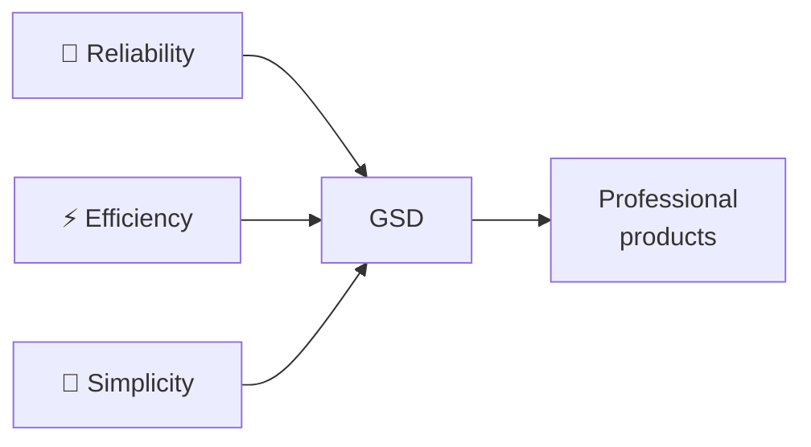
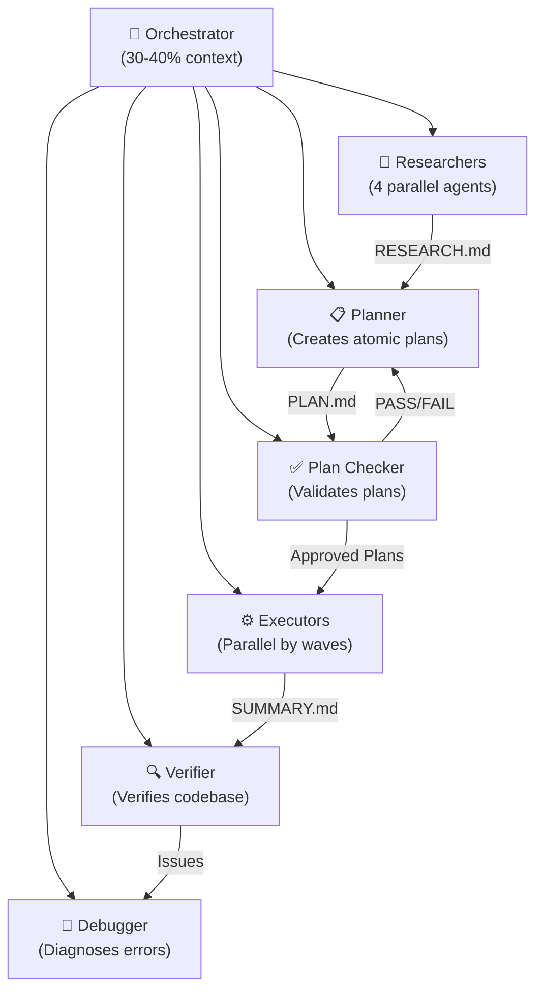
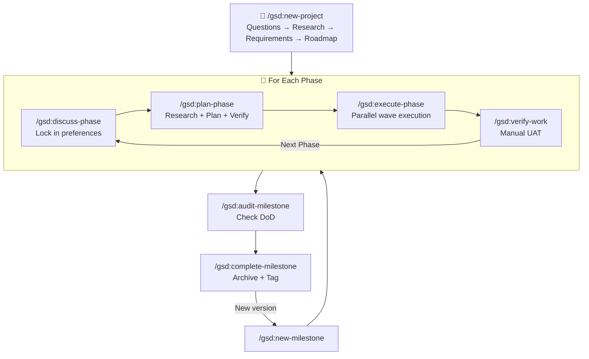

# GSD (Get Shit Done) System Overview — v1.22

> [!NOTE]
> **Repository:** [gsd-build/get-shit-done](https://github.com/gsd-build/get-shit-done)
> **Current version:** v1.22.4 (2026-03-03)
> **License:** MIT
> **Installation:** `npx get-shit-done-cc@latest`

---

## 1. What is GSD?

**GSD (Get Shit Done)** is a lightweight yet powerful **meta-prompting**, **context engineering**, and **spec-driven development** system, designed specifically for **Claude Code** with extended support for **Gemini CLI**, **OpenCode**, and **Codex**.

In simple terms: GSD is a **smart orchestration layer** between you and AI, transforming Claude Code from a code-writing chatbot into a **structured software engineering system** with memory, self-verification capabilities, and structured processes.

### Core Problems GSD Solves

| Problem | Description | How GSD Solves It |
|---|---|---|
| **Context Rot** | Response quality degrades as context window fills with junk | Each task runs in a sub-agent with **fresh 200K tokens**; orchestrator uses only 30-40% context |
| **Vibe-coding** | Coding by impulse → inconsistent code, breaks at scale | Spec-driven development with requirements traceability |
| **Lost context** | AI forgets previous decisions when switching sessions | State file system (`STATE.md`, `PROJECT.md`) serves as "long-term memory" |
| **Complexity management** | Heavyweight project management tools (Jira, story points...) | "Complexity is in the system, not in your workflow" — users only need a few commands |

---

## 2. Design Philosophy

GSD was built by **TÂCHES** — a solo developer who doesn't write code directly but lets Claude Code do the work. Core philosophy:

> *"I'm not a 50-person software company. I don't want to play 'enterprise theater.' I'm just a creator who wants to build great things that work reliably."*

### 3 Core Values



1. **Reliability:** Domain research process, plan verification loop (max 3 iterations), and automated UAT ensure code is correct from the start.
2. **Efficiency:** Specialized sub-agents run in parallel, each agent gets its own 200K tokens for each atomic task.
3. **Simplicity:** Complexity is encapsulated within the system. Users only need to focus on product vision.

---

## 3. Who Should Use GSD?

- **Solo developers** wanting to build professional-quality products without a large team.
- **Startup founders** who need rapid prototyping while maintaining engineering structure.
- **Software engineers** wanting to optimize AI-assisted development workflows.
- Anyone who wants to **describe an idea** and have the system build it precisely — without pretending to run a 50-person engineering organization.

> **Trusted by engineers at:** Amazon, Google, Shopify, Webflow.

---

## 4. Architecture Overview

### 4.1. Multi-Runtime Support

GSD isn't just for Claude Code — it supports **4 runtime environments**:

| Runtime | Verification command | Installation mechanism | Specifics |
|---|---|---|---|
| **Claude Code** | `/gsd:help` | Custom slash commands (`.claude/commands/gsd/`) | Deeply optimized, primary runtime |
| **Gemini CLI** | `/gsd:help` | Custom commands (`.gemini/commands/gsd/`) | Google Gemini models support |
| **OpenCode** | `/gsd-help` | Config-based (`.config/opencode/`) | Open source, free models |
| **Codex** | Skills-based | Skills files (`skills/gsd-*/SKILL.md`) | Operates via skill system |

### 4.2. Multi-Agent Orchestration

GSD uses the **Orchestrator-Agent** model: a thin orchestrator spawns specialized agents, collects results, and passes them to the next step.



### 4.3. 11 Specialized Agents

| Agent | Role | Model (Balanced) |
|---|---|---|
| `gsd-planner` | Creates atomic plans from context + research | **Opus** |
| `gsd-roadmapper` | Creates roadmap and phases from requirements | Sonnet |
| `gsd-executor` | Executes plans in clean context | Sonnet |
| `gsd-phase-researcher` | Researches domain for each phase | Sonnet |
| `gsd-project-researcher` | Researches domain for new projects | Sonnet |
| `gsd-research-synthesizer` | Synthesizes research results | Sonnet |
| `gsd-plan-checker` | Checks plan feasibility (8 dimensions) | Sonnet |
| `gsd-verifier` | Verifies codebase after execution | Sonnet |
| `gsd-debugger` | Diagnoses root cause when errors occur | Sonnet |
| `gsd-codebase-mapper` | Analyzes existing codebase (brownfield) | Haiku |
| `gsd-integration-checker` | Checks integration between plans | Sonnet |
| `gsd-nyquist-auditor` | Checks test coverage mapping | Sonnet |

---

## 5. Context Engineering — The Heart of GSD

### 5.1. State File System

GSD uses a set of structured Markdown files to maintain "memory" throughout the project:

| File | Role | Why it matters |
|---|---|---|
| `PROJECT.md` | Vision, goals, architecture decisions | **Single source of truth** — always loaded |
| `REQUIREMENTS.md` | v1/v2 requirements with traceable IDs | Prevents scope creep, ensures traceability |
| `ROADMAP.md` | Phase roadmap + status | Global progress map |
| `STATE.md` | Finalized decisions, blockers, current position | **Project Memory** — cross-session memory |
| `config.json` | Workflow config, model profile, git strategy | Control center |
| `MILESTONES.md` | Completed milestone history | Archive and reference |
| `research/` | Domain knowledge from research phase | Foundation for accurate planning |
| `todos/` | Ideas and tasks that arise | Captured ideas for later |

### 5.2. `.planning/` Directory Structure

```
.planning/
├── PROJECT.md
├── REQUIREMENTS.md
├── ROADMAP.md
├── STATE.md
├── config.json
├── MILESTONES.md
├── research/
├── todos/
│   ├── pending/
│   └── done/
├── debug/
│   └── resolved/
├── codebase/               # Brownfield mapping
└── phases/
    └── XX-phase-name/
        ├── XX-YY-PLAN.md        # Atomic plans (XML)
        ├── XX-YY-SUMMARY.md     # Execution outcomes
        ├── CONTEXT.md           # Implementation preferences
        ├── RESEARCH.md          # Phase research findings
        ├── VALIDATION.md        # Nyquist test coverage mapping
        └── VERIFICATION.md     # Post-execution verification
```

### 5.3. XML Prompt Formatting

Each plan uses XML structure optimized for Claude:

```xml
<task type="auto">
  <name>Create login endpoint</name>
  <files>src/app/api/auth/login/route.ts</files>
  <action>
    Use jose for JWT (not jsonwebtoken - CommonJS issues).
    Validate credentials against users table.
    Return httpOnly cookie on success.
  </action>
  <verify>curl -X POST localhost:3000/api/auth/login returns 200 + Set-Cookie</verify>
  <done>Valid credentials return cookie, invalid return 401</done>
</task>
```

Each task has: **precise instructions** → **verification command** → **completion criteria**. No guessing. No ambiguity.

---

## 6. Project Lifecycle



### 6 Detailed Phases

| # | Phase | Command | Input | Output |
|---|---|---|---|---|
| 0 | **Map** (Brownfield) | `/gsd:map-codebase` | Existing codebase | `codebase/STACK.md`, `ARCHITECTURE.md`, `CONVENTIONS.md`, `CONCERNS.md` |
| 1 | **Initialize** | `/gsd:new-project` | Idea + Q&A | `PROJECT.md`, `REQUIREMENTS.md`, `ROADMAP.md`, `STATE.md` |
| 2 | **Discuss** | `/gsd:discuss-phase [N]` | Your preferences | `{N}-CONTEXT.md` |
| 3 | **Plan** | `/gsd:plan-phase [N]` | Context + Research | `{N}-RESEARCH.md`, `{N}-{Y}-PLAN.md`, `{N}-VALIDATION.md` |
| 4 | **Execute** | `/gsd:execute-phase <N>` | Atomic plans | `{N}-{Y}-SUMMARY.md`, `{N}-VERIFICATION.md` + atomic commits |
| 5 | **Verify** | `/gsd:verify-work [N]` | Execution results | `{N}-UAT.md` + fix plans (if errors) |

---

## 7. Key Features

### 7.1. Wave Execution

Plans are grouped into "waves" based on dependencies:
- **Wave 1:** Independent plans → run **in parallel**
- **Wave 2:** Plans dependent on Wave 1 → run after Wave 1 completes
- **Vertical Slices** are preferred over Horizontal Layers → better parallelization

### 7.2. Atomic Git Commits

Each small task = 1 separate commit. Enables `git bisect` to pinpoint exactly which task caused a failure.

### 7.3. Nyquist Validation (v1.21+)

New system that maps test coverage to requirements **before writing code**:
- Researcher discovers existing test infrastructure
- Plan checker enforces 8th verification dimension: every task must have a `verify` command
- Retroactive audit via `/gsd:validate-phase`

### 7.4. Quick Mode

`/gsd:quick` for ad-hoc tasks (bug fixes, config changes) with GSD guarantees but skipping research/verify steps.

### 7.5. Git Branching Strategies (v1.22+)

| Strategy | Description | Best For |
|---|---|---|
| `none` | Commit directly to current branch | Solo, simple |
| `phase` | Branch per phase, merge on completion | Code review per phase |
| `milestone` | Branch per milestone, merge on completion | Release branches |

---

## 8. Comparison: Vibe-coding vs GSD Engineering

| Aspect | Vibe-coding | GSD Engineering |
|---|---|---|
| **Context** | Accumulates → quality degradation | Fresh 200K per task |
| **Execution** | Scattered chat-and-fix | Atomic plans → parallel waves |
| **Git** | 1 large commit | Atomic commits per task |
| **Verification** | "Let's test and see" | Automated + Manual UAT |
| **Memory** | Lost when switching sessions | STATE.md + resume-work |
| **Scalability** | Breaks at complexity | Multi-agent orchestration |

---

## 9. What's New in v1.22 (2026-03)

- **Git Branching:** Phase/milestone branching strategies
- **Nyquist Validation:** Test coverage mapping before code
- **`/gsd:validate-phase`:** Retroactive coverage audit
- **Quick Mode `--discuss`:** Pre-planning discussion for ad-hoc tasks
- **`/gsd:debug`:** Systematic debugging with persistent state
- **`/gsd:list-phase-assumptions`:** See what Claude intends to do before committing to a plan
- **`/gsd:research-phase`:** Standalone deep ecosystem research
- **Windows/Docker** compatibility greatly improved

---

## See Also

- [1. Architecture and Logic](./1. Architecture and Logic.md) — Internal architecture, data flow, and detailed operational mechanisms
- [2. Playbook](./2. Playbook.md) — Practical operations playbook for developers
- [3. Decision Guide](./3. Decision Guide.md) — Comparisons, use cases, costs, and decision guide
- [Official User Guide](https://github.com/gsd-build/get-shit-done/blob/main/docs/USER-GUIDE.md)
- [Discord Community](https://discord.gg/gsd)
