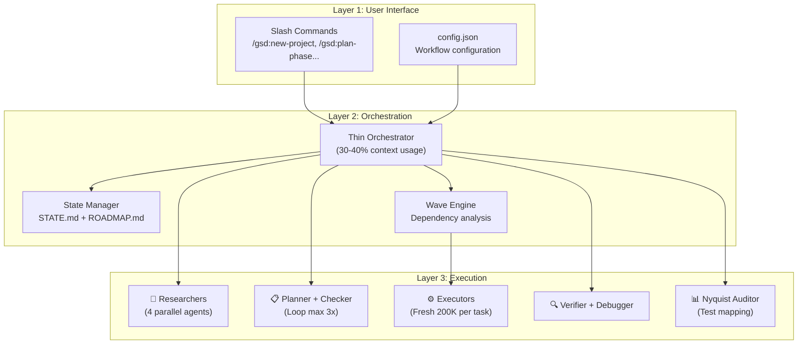
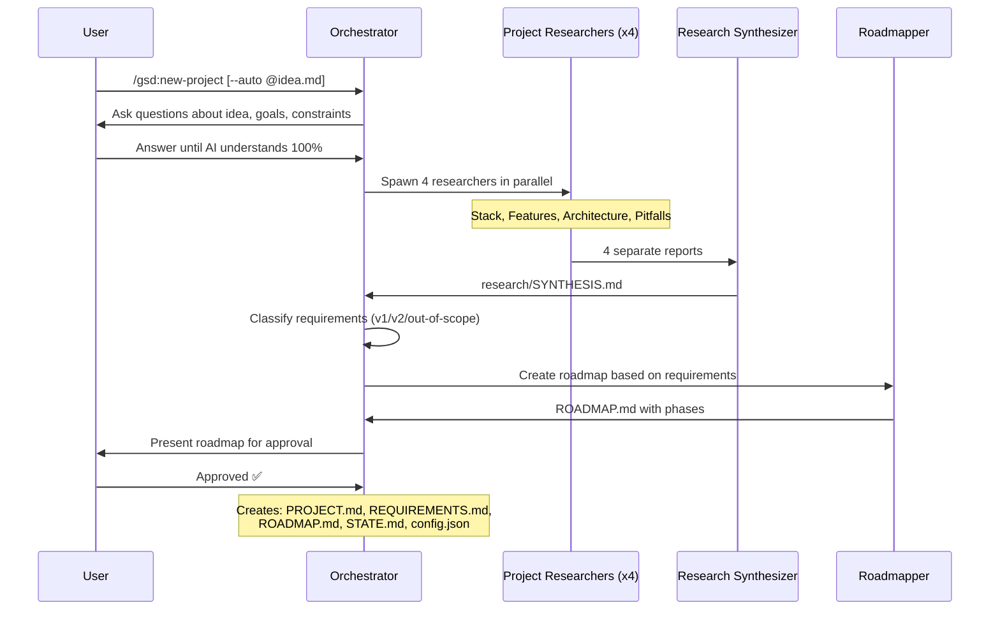
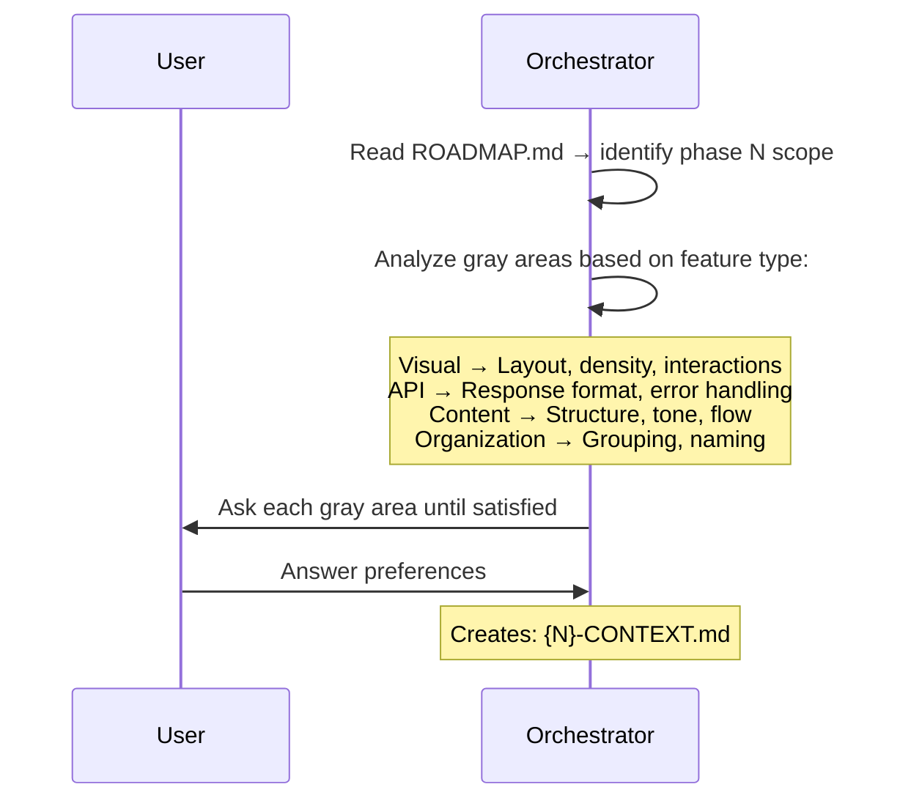
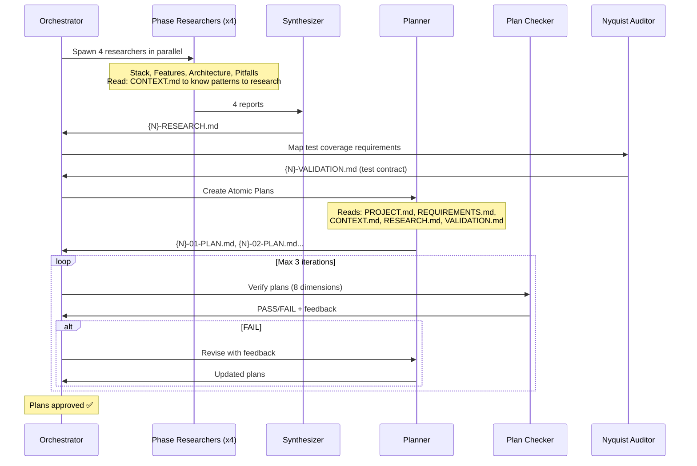
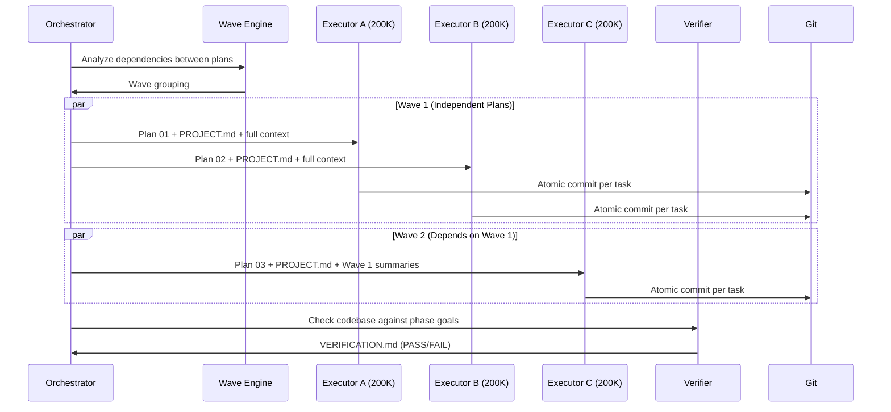
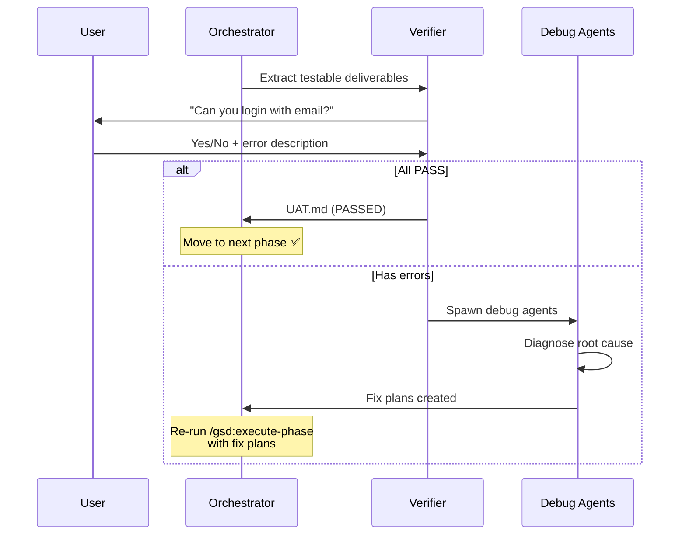
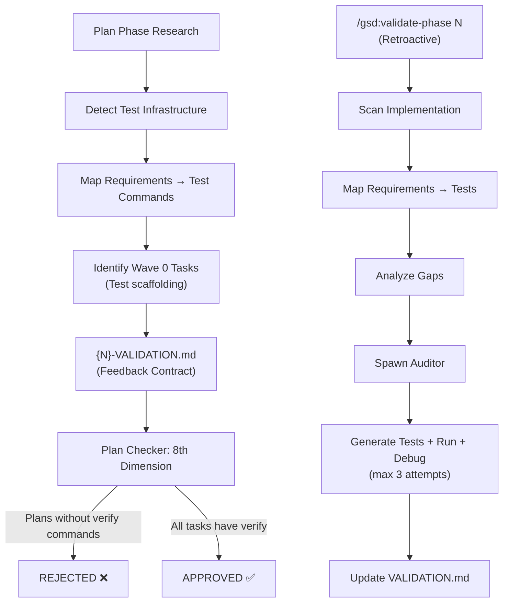
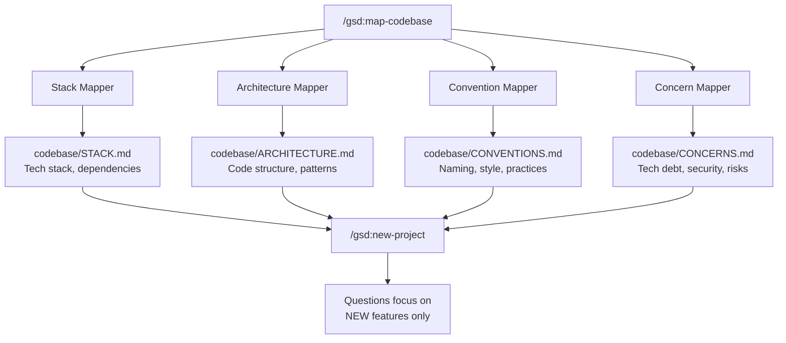
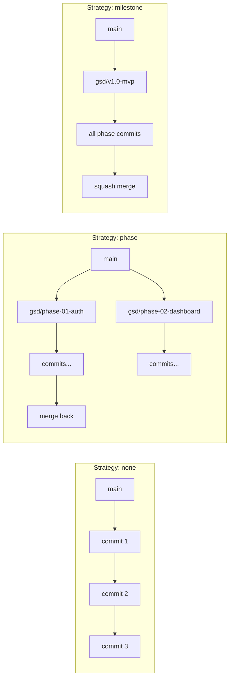
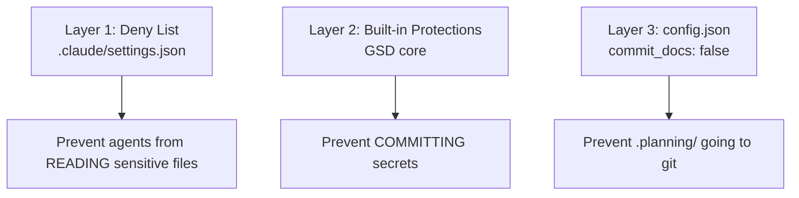

# GSD System Architecture & Logic — Deep Dive

> [!NOTE]
> This document goes deep into **internal operational mechanisms** of GSD. Read [[3-Research/Github/Get Shit Done/0. Overview]] first for the big picture.

---

## 1. Overall Architecture Model

GSD operates on a **3-Layer Architecture** model:



### Core Architecture Principles

1. **Thin Orchestrator Pattern:** The orchestrator NEVER does heavy work. It only: spawns agents → waits for results → aggregates → passes forward.
2. **Context Isolation:** Each agent receives its own context (fresh 200K tokens). No "data junk" from previous steps affects it.
3. **State-Driven Flow:** Every step reads/writes state files. When opening a new session, `/gsd:resume-work` restores full context from files.
4. **Fail-Safe Loops:** Plan checker loops max 3 times. Debug agents auto-spawn when verify fails.

---

## 2. Detailed Data Flow by Phase

### 2.1. Initialize (`/gsd:new-project`)



**Input → Output:**
- **Input:** Your idea (text or file `@idea.md`)
- **Process:** Q&A → Parallel Research (4 agents) → Requirements Extraction → Roadmap Creation
- **Output:**

| File | Content |
|---|---|
| `PROJECT.md` | Vision, goals, core architecture decisions |
| `REQUIREMENTS.md` | Feature list: v1 (MVP), v2, out-of-scope, with traceable IDs (REQ-001, REQ-002...) |
| `ROADMAP.md` | Phases divided by requirements, status tracking |
| `STATE.md` | Project state, finalized decisions, blockers |
| `config.json` | Workflow settings (mode, granularity, model_profile...) |
| `research/` | Domain research: stack analysis, feature patterns, architecture pitfalls |

### 2.2. Discuss (`/gsd:discuss-phase [N]`)



**Why is this step important?**

CONTEXT.md is the **bridge** between your vision and plan execution:

```
Researcher reads CONTEXT.md → Knows which patterns to research
    "User wants card layout" → Research card component libraries

Planner reads CONTEXT.md → Knows which decisions are locked
    "Infinite scroll decided" → Plan includes scroll handling
```

> [!IMPORTANT]
> **If you skip Discuss:** AI uses "reasonable defaults" → you get a generic product.
> **If you use Discuss:** AI understands *your personal vision* → you get *exactly* what you want.

### 2.3. Plan (`/gsd:plan-phase [N]`)

The most complex phase with a **3-step pipeline + validation loop**:



**Plan Checker — 8 Verification Dimensions:**

| # | Dimension | What it checks |
|---|---|---|
| 1 | **Requirements Coverage** | Is each requirement in the phase addressed? |
| 2 | **Task Atomicity** | Is the task small enough for 1 context window? (2-3 tasks/plan) |
| 3 | **Dependency Clarity** | Are dependencies between plans clear? |
| 4 | **File Conflict** | Do multiple plans modify the same file? |
| 5 | **Verification Steps** | Does each task have a `<verify>` command? |
| 6 | **Done Criteria** | Does each task have `<done>` conditions? |
| 7 | **Context Completeness** | Does the plan have enough context for the executor to run without asking? |
| 8 | **Nyquist Compliance** | Does each task have automated test verification? *(v1.21+)* |

### 2.4. Execute (`/gsd:execute-phase <N>`)



**Wave Execution Logic:**

```
┌─────────────────────────────────────────────────────────┐
│  PHASE EXECUTION                                        │
├─────────────────────────────────────────────────────────┤
│                                                          │
│  WAVE 1 (parallel)     WAVE 2 (parallel)     WAVE 3     │
│  ┌────────┐ ┌────────┐ ┌────────┐ ┌────────┐ ┌────────┐ │
│  │Plan 01 │ │Plan 02 │ │Plan 03 │ │Plan 04 │ │Plan 05 │ │
│  │        │ │        │ │        │ │        │ │        │ │
│  │ User   │ │Product │ │Orders  │ │ Cart   │ │Checkout│ │
│  │ Model  │ │ Model  │ │  API   │ │  API   │ │  UI    │ │
│  └────────┘ └────────┘ └────────┘ └────────┘ └────────┘ │
│      │          │           ↑          ↑          ↑      │
│      └──────────┴───────────┴──────────┘          │      │
│                 Dependencies flow                  │      │
│                                                          │
└─────────────────────────────────────────────────────────┘
```

**Wave grouping rules:**
1. **Independent plans → Same wave → Parallel**
2. **Dependent plans → Later wave → Sequential**
3. **File conflicts → Same plan** (to avoid merge conflicts)

**Vertical Slicing vs Horizontal Layering:**

| Strategy | Example | Parallelization |
|---|---|---|
| **Vertical Slices** ✅ | Plan 01: User feature end-to-end (DB → API → UI) | Optimal — plans are independent |
| **Horizontal Layers** ❌ | Plan 01: All models, Plan 02: All APIs | Poor — plan 02 depends on plan 01 |

### 2.5. Verify (`/gsd:verify-work [N]`)



**Automatic fix loop:**
1. Verify fails → system does NOT blindly retry
2. Debug agents **diagnose root cause** automatically
3. Create **specific fix plans**
4. User runs `/gsd:execute-phase` again → fix plans are applied

---

## 3. Nyquist Validation Architecture (v1.21+)

The most important new feature — ensuring **automated feedback loop** for each requirement:



**Important rules:**
- Auditor **NEVER modifies implementation code** — only creates/modifies test files
- If tests discover implementation bugs → **escalation** to the user
- Disable with `workflow.nyquist_validation: false` in `/gsd:settings` for prototyping phases

---

## 4. Brownfield Architecture (Existing Projects)

When applying GSD to an existing codebase, `/gsd:map-codebase` triggers **4 parallel mapper agents**:



**Why is brownfield mapping important?**
- AI understands existing code → **doesn't create "broken windows"** in old architecture
- `/gsd:new-project` **doesn't re-ask** what's already clear in the code → saves time
- Plans automatically comply with discovered conventions

---

## 5. Configuration Logic

### 5.1. Model Profiles — Per-Agent Breakdown

GSD allocates AI power by **role** rather than by phase:

| Agent | Quality | Balanced | Budget |
|---|---|---|---|
| `gsd-planner` | **Opus** | **Opus** | Sonnet |
| `gsd-roadmapper` | Opus | Sonnet | Sonnet |
| `gsd-executor` | **Opus** | Sonnet | Sonnet |
| `gsd-phase-researcher` | Opus | Sonnet | **Haiku** |
| `gsd-project-researcher` | Opus | Sonnet | **Haiku** |
| `gsd-research-synthesizer` | Sonnet | Sonnet | Haiku |
| `gsd-debugger` | **Opus** | Sonnet | Sonnet |
| `gsd-codebase-mapper` | Sonnet | **Haiku** | Haiku |
| `gsd-verifier` | Sonnet | Sonnet | Haiku |
| `gsd-plan-checker` | Sonnet | Sonnet | Haiku |
| `gsd-integration-checker` | Sonnet | Sonnet | Haiku |

**Allocation philosophy:**
- **Quality:** Opus for all decision-making agents. Use when quota is abundant and work is critical.
- **Balanced:** Opus only for planning (where architecture decisions happen), Sonnet for the rest. **Default** — best balance.
- **Budget:** Sonnet for coding, Haiku for research/verification. Use for high-volume or less critical work.

### 5.2. Workflow Toggles

| Toggle | Default | Purpose | When to turn off? |
|---|---|---|---|
| `workflow.research` | `true` | Domain research before planning | Familiar domain |
| `workflow.plan_check` | `true` | Verify plans vs requirements (loop 3x) | Quick prototyping |
| `workflow.verifier` | `true` | Post-execution verification | Quick tasks |
| `workflow.nyquist_validation` | `true` | Test coverage mapping | Rapid prototyping |
| `workflow.auto_advance` | `false` | Auto-chain Discuss → Plan → Execute | When fully automated desired |

### 5.3. Speed vs Quality Presets

| Scenario | Mode | Granularity | Profile | Research | Plan Check | Verifier |
|---|---|---|---|---|---|---|
| **Prototyping** | `yolo` | `coarse` | `budget` | off | off | off |
| **Normal dev** | `interactive` | `standard` | `balanced` | on | on | on |
| **Production** | `interactive` | `fine` | `quality` | on | on | on |

### 5.4. Granularity Control

| Level | Phases per Milestone | Plans per Phase | Use Case |
|---|---|---|---|
| `coarse` | 3-5 | Fewer, larger plans | Small changes, familiar domain |
| `standard` | 5-8 | Moderate | Most projects |
| `fine` | 8-12 | Many, smaller plans | Complex systems, need absolute error control |

---

## 6. Git Integration Logic

### 6.1. Atomic Commits

Each completed task = 1 commit:

```bash
abc123f docs(08-02): complete user registration plan
def456g feat(08-02): add email confirmation flow
hij789k feat(08-02): implement password hashing
lmn012o feat(08-02): create registration endpoint
```

**Format:** `{type}({phase}-{plan}): {description}`

### 6.2. Branching Strategies



---

## 7. Error Handling & Recovery Logic

### 7.1. Subagent Failure Detection

GSD's orchestrators **spot-check actual output** before reporting failure:
- If subagent reports fail but commits were created → system recognizes success
- This is a workaround for Claude Code classification bug

### 7.2. Context Degradation Recovery

```
Symptom: AI quality dropping in main session
→ /clear (clear context window)
→ /gsd:resume-work or /gsd:progress
→ State files restore full context
```

### 7.3. Recovery Quick Reference

| Issue | Solution |
|---|---|
| Lost context / new session | `/gsd:resume-work` or `/gsd:progress` |
| Phase going wrong direction | `git revert` → re-plan |
| Scope changed | `/gsd:add-phase`, `/gsd:insert-phase`, `/gsd:remove-phase` |
| Audit discovered gaps | `/gsd:plan-milestone-gaps` |
| Bug needs debugging | `/gsd:debug "description"` |
| Quick fix | `/gsd:quick` |
| Plan wrong vs vision | `/gsd:discuss-phase [N]` → re-plan |
| Cost too high | `/gsd:set-profile budget` + turn off agents |
| Update broke local changes | `/gsd:reapply-patches` |

---

## 8. Security Architecture

### 8.1. Defense-in-Depth



### 8.2. Deny List Configuration

```json
{
  "permissions": {
    "deny": [
      "Read(.env)",
      "Read(.env.*)",
      "Read(**/secrets/*)",
      "Read(**/*credential*)",
      "Read(**/*.pem)",
      "Read(**/*.key)"
    ]
  }
}
```

### 8.3. Private Project Settings

- `planning.commit_docs: false` → `.planning/` not committed to git
- Add `.planning/` to `.gitignore` → planning artifacts 100% local

---

## See Also

- [[3-Research/Github/Get Shit Done/0. Overview]] — GSD system overview
- [[3-Research/Github/Get Shit Done/2. Playbook]] — Practical operations playbook
- [[3-Research/Github/Get Shit Done/3. Decision Guide]] — Comparisons, use cases, costs, and decision guide
