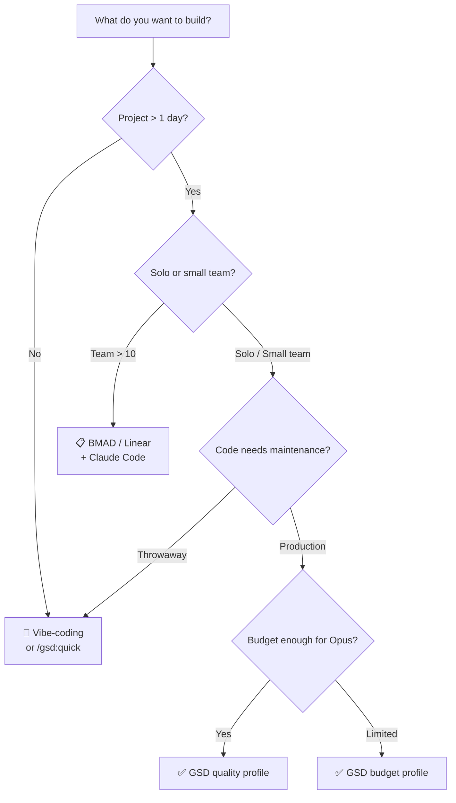

# Decision Guide — GSD (Get Shit Done) v1.22

> [!NOTE]
> Read this document BEFORE deciding to adopt GSD. Read [[3-Research/Github/Get Shit Done/0. Overview]] if you don't know what GSD is yet.

---

## 1. Comparison with Alternatives

### 1.1. Overview Comparison Table

| Feature | **GSD** | **BMAD** | **SpecKit/OpenSpec** | **TaskMaster** | **Pure Vibe-coding** |
|---|---|---|---|---|---|
| **Philosophy** | Solo builders, no enterprise theater | Enterprise workflow simulation | Spec-first | Task management | Chat-and-fix |
| **Context Engineering** | ✅ Fresh 200K per task | ❌ | Partial | ❌ | ❌ |
| **Multi-Agent Orchestration** | ✅ 11+ specialized agents | ❌ | ❌ | ❌ | ❌ |
| **Wave Execution (parallel)** | ✅ Dependency-aware | ❌ | ❌ | ❌ | ❌ |
| **Atomic Git Commits** | ✅ Per task | ❌ | ❌ | ❌ Usually 1 large commit | ❌ |
| **Plan Verification Loop** | ✅ 8 dimensions, max 3 iterations | ❌ | Partial | ❌ | ❌ |
| **UAT (User Acceptance Testing)** | ✅ Guided + auto-diagnosis | ❌ | ❌ | ❌ | ❌ Manual |
| **Brownfield Support** | ✅ `/gsd:map-codebase` | ❌ | Limited | ❌ | ❌ |
| **Multi-Runtime** | ✅ Claude Code, Gemini, OpenCode, Codex | Claude Code only | Claude Code | Claude Code | Any |
| **Nyquist Validation** | ✅ Test coverage mapping | ❌ | ❌ | ❌ | ❌ |
| **Setup complexity** | 🟢 1 npx command | 🔴 Many steps | 🟡 Medium | 🟡 Medium | 🟢 Zero |
| **Learning Curve** | 🟡 Medium (learn workflow) | 🔴 High (enterprise concepts) | 🟡 Medium | 🟢 Easy | 🟢 Zero |
| **License** | MIT (Free) | Varies | Varies | Varies | N/A |

### 1.2. Detailed Comparisons

#### GSD vs BMAD

| Aspect | GSD | BMAD |
|---|---|---|
| **Process** | 4 repeating steps (Discuss → Plan → Execute → Verify) | Sprint ceremonies, story points, retrospectives |
| **Audience** | Solo devs, small teams | Teams wanting to simulate enterprise |
| **Overhead** | Low — a few slash commands | High — many management ceremonies |
| **When to choose BMAD** | When team needs PR reviews, sprint tracking, stakeholder reporting |
| **When to choose GSD** | When you want to build fast, focus on product, no enterprise theater needed |

#### GSD vs Vibe-coding (Chat-and-Fix)

| Aspect | GSD | Vibe-coding |
|---|---|---|
| **Setup time** | ~5 minutes | 0 minutes |
| **Initial code quality** | 🟡 Slower due to Q&A/Research | 🟢 Fast |
| **Code quality after 1 week** | 🟢 Consistent, sustainable | 🔴 Severely degraded (context rot) |
| **Scale** | ✅ Handles large projects | ❌ Breaks at complexity |
| **Debug** | Atomic commits → precise `git bisect` | 1 large commit → manual debug |
| **When to vibe-code** | Quick prototype, throwaway code, experiments |
| **When to use GSD** | Any code you want to maintain > 1 week |

---

## 2. When to Use GSD

### ✅ Ideal Use Cases

| Scenario | Why GSD Is a Good Fit |
|---|---|
| **Solo developer** building SaaS/product | Multi-agent = virtual team, plan verification = virtual code review |
| **Startup founder** needing quality MVP | Spec-driven ensures no scope creep, atomic commits enable rollback |
| **Project > 1 week of development** | Context engineering maintains long-term quality |
| **Complex codebase (brownfield)** | `/gsd:map-codebase` analyzes conventions before adding new code |
| **Need to onboard AI into workflow** | GSD encapsulates best practices for AI-assisted development |
| **Project needs traceability** | Requirements → Plans → Commits → Verification — everything has audit trail |
| **Multiple work sessions** | STATE.md + resume-work keeps context across sessions |

### ✅ Signals You SHOULD Use GSD

- [ ] AI starts getting "clueless" after 30-60 minutes of continuous chat
- [ ] AI-generated code quality degrades over time
- [ ] You have to repeat context many times
- [ ] Project has > 5 files needing synchronized changes
- [ ] You want `git bisect` to work effectively

---

## 3. When NOT to Use GSD

### ❌ Anti-Use-Cases

| Scenario | Why GSD Is NOT Suitable | Use Instead |
|---|---|---|
| **Prototype/experiment under 1 day** | Q&A + research overhead too large for the benefit | Vibe-coding or `/gsd:quick` |
| **Throwaway/demo code** | No need for traceability, atomic commits | Chat directly with Claude |
| **Team > 10 people needing Jira integration** | GSD has no sprint tracking, board view | BMAD or Linear + Claude |
| **Not using Claude Code** | GSD is optimized for Claude, other runtimes are secondary | Dedicated workflow tool for that tool |
| **Script/one-liner** | Too small for GSD workflow | Claude Code directly |
| **Learning/tutorial code** | GSD abstracts too much — you won't learn anything | Write by hand + Claude assistance |
| **Extremely budget-constrained** | Multi-agent = many API calls = high cost | Budget profile or vibe-coding |

### ⚠️ Limitations to Know

| Limitation | Description | Workaround |
|---|---|---|
| **Claude-centric** | Primarily optimized for Claude Code; Gemini/OpenCode/Codex are secondary support | Use Claude Code for best experience |
| **Learning curve** | Need to understand 4-step workflow + slash commands | Read [[3-Research/Github/Get Shit Done/2. Playbook]] before starting |
| **Token consumption** | Multi-agent = many API calls, especially at "quality" profile | Use `budget` profile, turn off research/plan_check |
| **No GUI** | Entirely CLI-based, no dashboard | Use `/gsd:progress` instead of dashboard |
| **No team collaboration** | No sharing, permissions, multi-user | Combine with Git PR workflow |
| **Anthropic ecosystem dependency** | Claude models, Claude Code tool | Community ports for OpenCode, Gemini |

---

## 4. Case Studies & Testimonials

### 4.1. From the Community

> *"If you know clearly what you want, this WILL build it for you. No bs."*

> *"I've done SpecKit, OpenSpec and Taskmaster — this has produced the best results for me."*

> *"By far the most powerful addition to my Claude Code. Nothing over-engineered. Literally just gets shit done."*

### 4.2. Organizations Using It

**Trusted by engineers at:** Amazon, Google, Shopify, Webflow.

### 4.3. Metrics (from community reports)

| Metric | Vibe-coding | GSD |
|---|---|---|
| Time to MVP | 🟢 ~30% faster | 🟡 Slower due to setup |
| Code consistency after 1 milestone | 🔴 50-70% degradation | 🟢 Maintains >90% |
| Debug time when errors occur | 🔴 High (1 large commit) | 🟢 Low (git bisect per task) |
| Context window utilization | 🔴 100% → degradation | 🟢 30-40% (stable) |

---

## 5. Costs & Resources

### 5.1. Direct Costs

| Item | Free? | Details |
|---|---|---|
| **GSD (software)** | ✅ MIT License, free | npm package |
| **Claude Code** | ❌ Paid | Claude Pro/Teams/Enterprise subscription |
| **API costs** | ❌ Depends on profile | See table below |

### 5.2. API Token Costs by Profile

| Profile | Estimated cost / phase | When to use |
|---|---|---|
| **Quality** (Opus heavy) | $$$ — Highest | Production code, critical features |
| **Balanced** (Opus planning only) | $$ — Moderate | Normal development (default) |
| **Budget** (Sonnet/Haiku) | $ — Lowest | Prototyping, familiar domain |

> [!TIP]
> **Save tokens:** Turn off `workflow.research` and `workflow.plan_check` in `/gsd:settings` for familiar domains. Reduces 40-60% token usage.

### 5.3. Hardware Requirements

| Requirement | Description |
|---|---|
| **OS** | Mac, Windows, Linux |
| **Node.js** | To run `npx` installer |
| **Terminal** | Any terminal app |
| **RAM/CPU** | Nothing special — processing on cloud |
| **Storage** | `.planning/` folder (~1-5MB per milestone) |

---

## 6. Migration Path

### 6.1. From Vibe-coding to GSD

| Step | Action |
|---|---|
| 1 | Install: `npx get-shit-done-cc@latest` |
| 2 | Map existing codebase: `/gsd:map-codebase` |
| 3 | Initialize project: `/gsd:new-project` (focus on NEW features) |
| 4 | Start workflow: Discuss → Plan → Execute → Verify |
| 5 | Gradually apply GSD to all new features |

**Migration risk:** Low — GSD doesn't change existing code, only adds `.planning/` folder.

### 6.2. From BMAD/SpecKit to GSD

| Step | Action |
|---|---|
| 1 | Export existing requirements as markdown |
| 2 | Install GSD, run `/gsd:new-project --auto @requirements.md` |
| 3 | GSD will create roadmap from exported requirements |
| 4 | Continue normal GSD workflow |

### 6.3. From GSD to Other Tools

GSD has **no lock-in**:
- All artifacts are **Markdown** files in `.planning/`
- Git history is **standard commits** — no GSD-specific metadata
- Delete `.planning/` → project returns to normal state

---

## 7. Roadmap & Future

### 7.1. Community Health

| Metric | Value (2026-03) |
|---|---|
| **GitHub Stars** | Growing rapidly |
| **npm Downloads** | Thousands/month |
| **Releases** | 170+ releases (very active) |
| **Latest Release** | v1.22.4 (2026-03-03) — 3 days ago |
| **Maintainer** | TÂCHES (active, responsive) |
| **Discord** | Active community, quick support |
| **License** | MIT — safe for commercial use |

### 7.2. Recent Features (v1.20 → v1.22)

| Version | Notable Feature |
|---|---|
| v1.20 | Research-phase standalone, phase assumptions preview |
| v1.21 | **Nyquist Validation** — test coverage mapping before code |
| v1.22 | **Git Branching** strategies, Quick `--discuss`, retroactive validation |

### 7.3. Expected Development Direction

- Expanded multi-runtime support (Gemini, Codex deeper integration)
- Sub-agent orchestration improvements
- Community-driven command extensions
- Potential GUI/dashboard companion

---

## 8. Decision Matrix

### 8.1. What Should You Use?

| Scenario | Recommendation | Reason |
|---|---|---|
| Solo dev, project > 1 week | **✅ GSD** | Context engineering + multi-agent = virtual team |
| Quick prototype < 1 day | **💬 Vibe-coding** | GSD overhead too large for small scope |
| Small fix / bug | **⚡ `/gsd:quick`** | GSD guarantees but fast path |
| Team 5-10 people | **✅ GSD + Git PR** | GSD builds, PR workflow for review |
| Team > 10, needs sprint management | **📋 BMAD/Linear** | GSD lacks team management features |
| Critical project, production | **✅ GSD (quality profile)** | Plan verification + Nyquist validation |
| Very limited budget | **✅ GSD (budget profile)** or **💬 Vibe-coding** | Budget profile reduces 60-70% cost |
| Large codebase, brownfield | **✅ GSD** | `/gsd:map-codebase` for comprehensive analysis |
| Learning / tutorial | **💬 Vibe-coding** | GSD abstracts too much for learning purposes |

### 8.2. Decision Flowchart

---

## See Also

- [[3-Research/Github/Get Shit Done/0. Overview]] — GSD system overview
- [[3-Research/Github/Get Shit Done/1. Architecture and Logic]] — Internal architecture and operational mechanisms
- [[3-Research/Github/Get Shit Done/2. Playbook]] — Practical operations playbook
