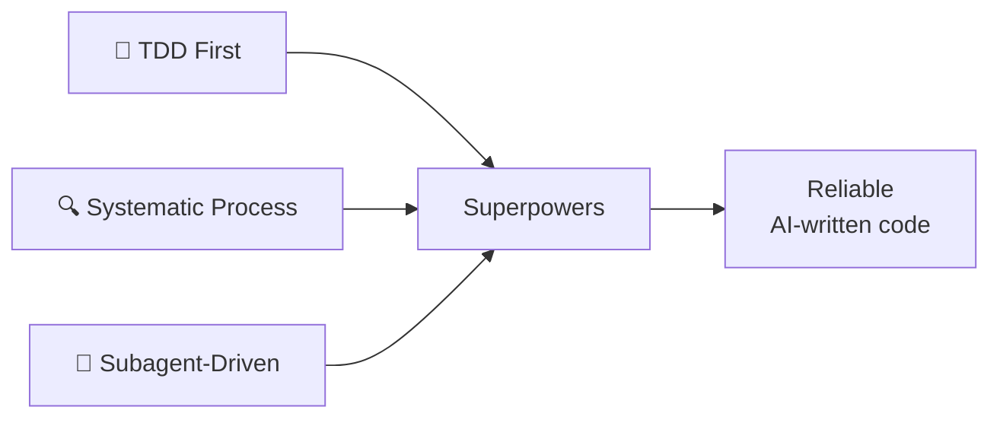
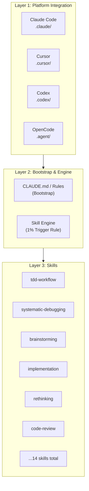

# Superpowers — Framework Overview

> [!NOTE]
> **Repository:** [obra/superpowers](https://github.com/obra/superpowers)
> **Current version:** v0.9.18 (2026-03-09)
> **License:** MIT
> **Platforms:** Claude Code, Cursor, Codex, OpenCode

---

## 1. What is Superpowers?

**Superpowers** is an **agentic skills framework** designed for AI coding assistants, embedding a set of "disciplines" and "skills" that guide AI to write code more reliably. The core principles focus on:

1. **Test-Driven Development (TDD)** — The "Iron Law": never write implementation code without corresponding tests
2. **Systematic debugging** — Multi-layered root cause analysis, defense-in-depth
3. **Subagent-driven development** — Break tasks into smaller pieces, each handled by a fresh-context subagent with mandatory review

### Core Problems Superpowers Solves

| Problem | Description | How Superpowers Solves It |
|---|---|---|
| **Unreliable AI code** | AI writes code that "looks right" but fails in practice | TDD Iron Law ensures automated verification for every line |
| **Whack-a-mole debugging** | Fix one bug → create two more | Systematic debugging with root cause analysis + defense-in-depth |
| **Context overload** | Long sessions → AI quality degrades | Subagent isolation: each task gets fresh context |
| **No review mechanism** | Code goes straight from AI to codebase unreviewed | Two-stage review: spec compliance + code quality |
| **Inconsistent quality** | Sometimes great, sometimes terrible | Skills framework standardizes approach for every task type |

---

## 2. Design Philosophy

> *"Every piece of software you write should have automated tests. There are no exceptions to this policy."*

### Core Values



1. **TDD First:** Tests are written before implementation. This is non-negotiable — the "Iron Law."
2. **Systematic Process:** Every skill follows a defined process with clear steps. No ad-hoc approaches.
3. **Subagent-Driven:** Complex tasks are broken into pieces, each handled by a subagent with fresh context and mandatory brainstorming & review.

---

## 3. Who Should Use Superpowers?

| Audience | Use Case |
|---|---|
| **Developers who value code quality** | Want AI to follow TDD, systematic debugging |
| **Teams with CI/CD** | Superpowers produces code that passes test suites naturally |
| **Projects needing reliability** | Critical code requires automated verification |
| **Anyone frustrated with AI bugs** | Superpowers prevents "code first, debug later" pattern |

---

## 4. Architecture Overview

### 4.1. 3-Layer Architecture



### 4.2. Skill Categories

| Category | Skills | Purpose |
|---|---|---|
| **Core Development** | tdd-workflow, implementation, documentation | Core coding practices |
| **Quality** | code-review, testing-strategy, debugging | Code quality assurance |
| **Thinking** | brainstorming, rethinking | Creative problem-solving |
| **Process** | systematic-debugging, root-cause-tracing | Structured debugging |
| **Verification** | defense-in-depth, find-polluter | Defense-in-depth verification |

---

## 5. Key Features

### 5.1. The Iron Law of TDD

```
NEVER write implementation code without corresponding tests.
Write tests FIRST, then implementation to make tests pass.
```

This is enforced at the skill level — the TDD workflow skill literally prevents writing code before tests.

### 5.2. The 1% Trigger Rule

> *"Even if there's only a 1% chance this situation applies, read the skill."*

Skills are triggered proactively — not waiting until problems occur, but preventing them from happening.

### 5.3. Subagent Architecture

For complex tasks:
1. **Brainstorm** — What could go wrong? What approaches?
2. **Implement** — Subagent executes with fresh context
3. **Review** — Two-stage: spec compliance, then code quality
4. **Iterate** — Fix issues found in review

### 5.4. Two-Stage Code Review

| Stage | Focus | Reviewer |
|---|---|---|
| **Stage 1: Spec Review** | Does code match requirements? | Subagent |
| **Stage 2: Quality Review** | Is code well-written? Performance? Edge cases? | Subagent |

### 5.5. Systematic Debugging

When tests fail:
1. **Root cause tracing** — Don't fix the most obvious thing
2. **Hypothesis generation** — What COULD be the actual cause?
3. **Defense-in-depth** — Prevent the same class of bugs
4. **Find-polluter** — Which prior test left contaminated state?

---

## 6. Comparison: Superpowers vs Direct AI Coding

| Aspect | Direct AI Coding | Superpowers |
|---|---|---|
| **Tests** | Optional, often skipped | Mandatory, write first |
| **Debugging** | Random trial-and-error | Systematic root cause analysis |
| **Context management** | Degrades over time | Fresh per subagent task |
| **Code review** | None (self-review) | Two-stage automated review |
| **Reliability** | Varies widely | Consistently high |
| **Speed (initial)** | Faster | Slower (more process) |
| **Speed (long-term)** | Slower (debugging) | Faster (fewer bugs) |

---

## 7. Notable Features

- **14 Skills** covering the complete development lifecycle
- **Cross-Platform** — Works on Claude Code, Cursor, Codex, OpenCode
- **Plugin Distribution** — Available as Claude Code plugin via marketplace
- **Model Selection** — Suggests appropriate models per task type
- **Configurable** — Skills can be customized per project

---

## See Also

- [1. Architecture and Logic](./1. Architecture and Logic.md) — Internal architecture, data flow, skill mechanics
- [2. Playbook](./2. Playbook.md) — Installation, Day 1 workflow, cheat sheet, troubleshooting
- [3. Decision Guide](./3. Decision Guide.md) — Comparison with alternatives, use cases, costs, decision guide
