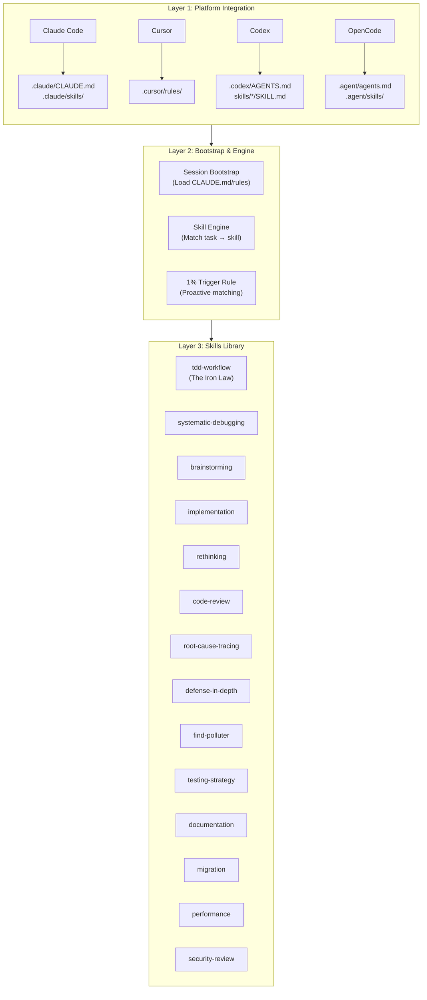
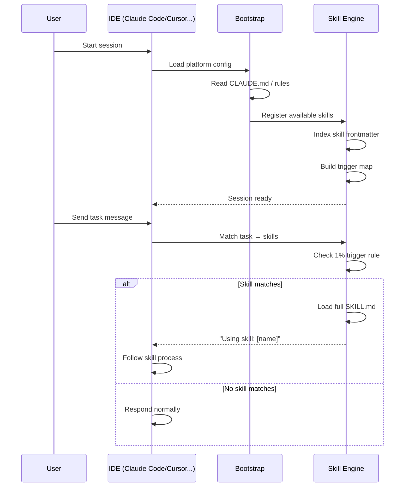
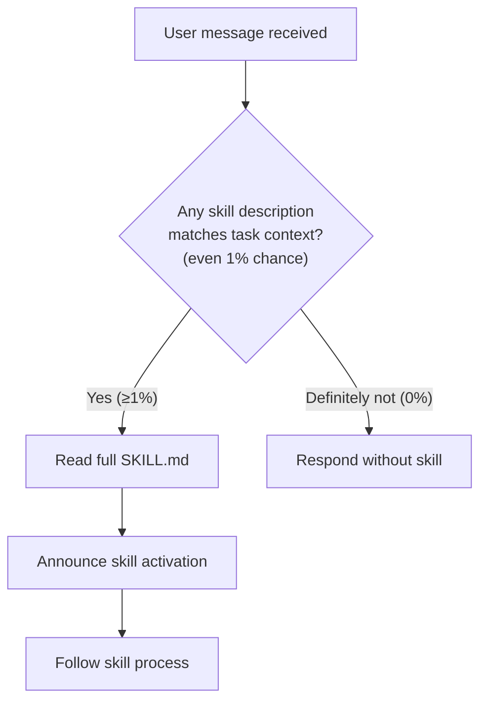
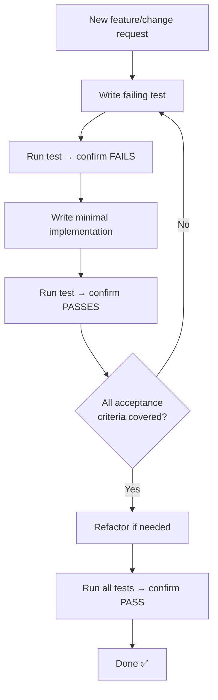
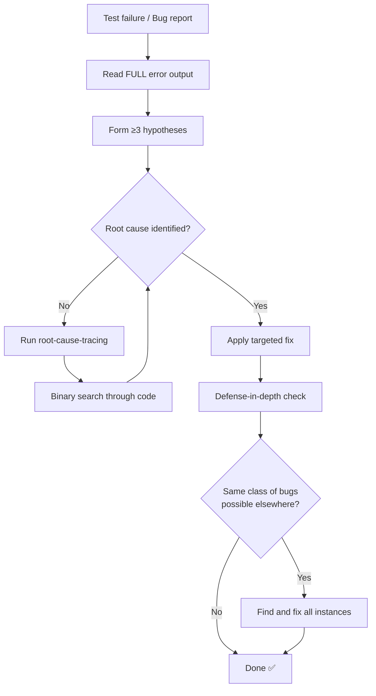
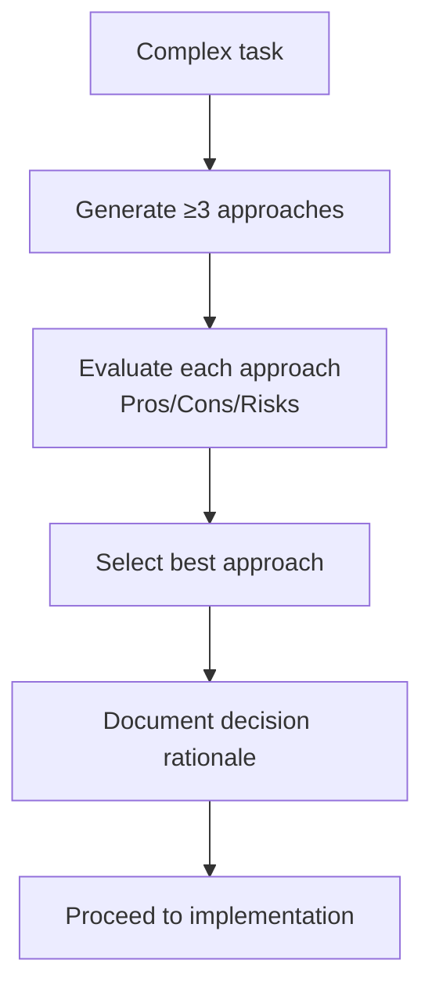
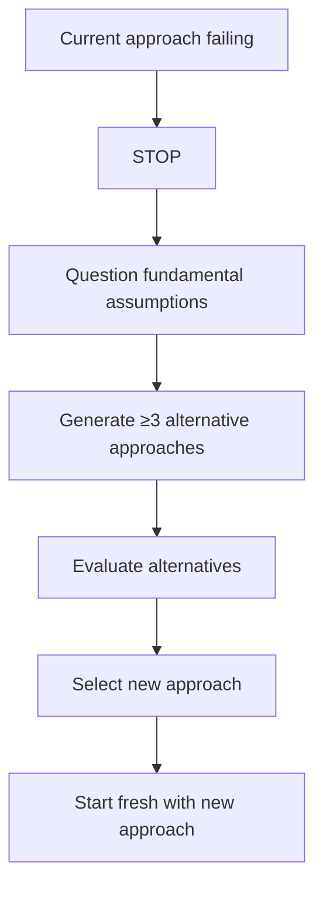
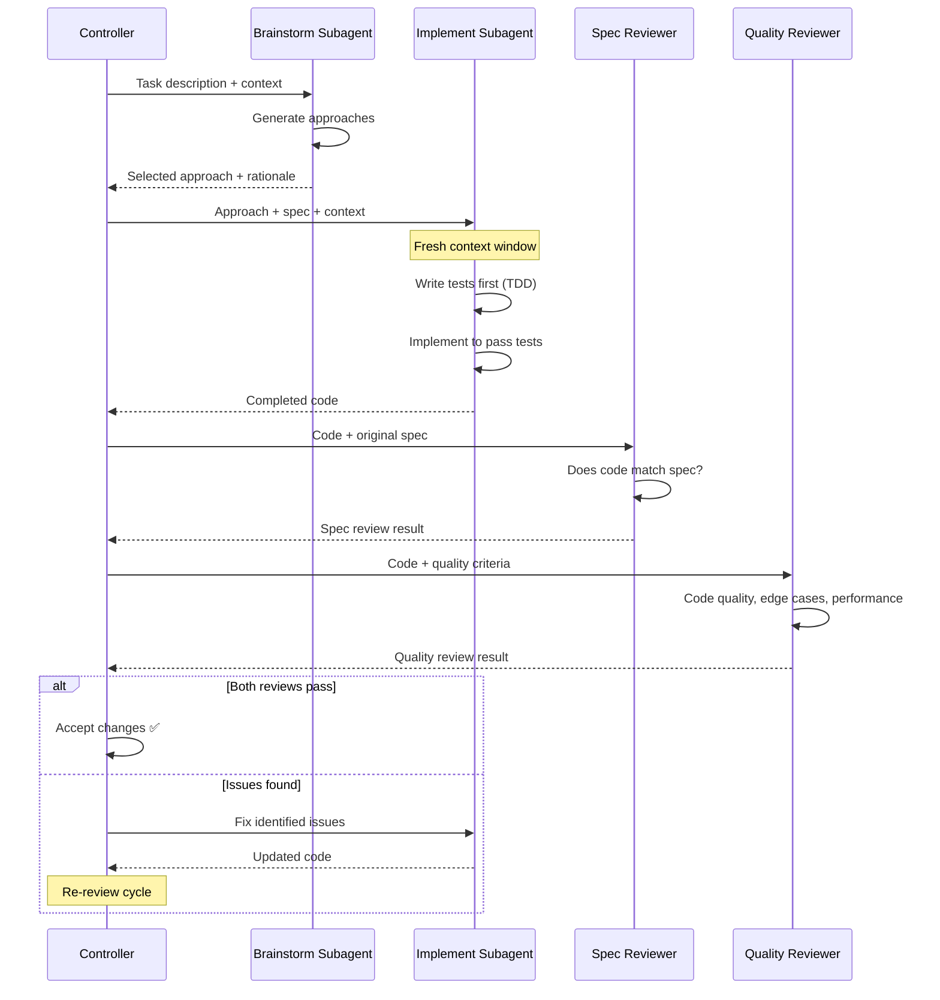

# Superpowers — Architecture and Logic

> [!NOTE]
> This document dives deep into **internal workings** of Superpowers. Read [[3-Research/Github/Superpowers/0. Overview]] first for the big picture.

---

## 1. 3-Layer Architecture — Deep Dive



### Layer Responsibilities

| Layer | Responsibility | Key Files |
|---|---|---|
| **Platform Integration** | Adapt to each IDE's convention | Platform-specific config files |
| **Bootstrap & Engine** | Load skills, match tasks to skills | CLAUDE.md, skill frontmatter |
| **Skills Library** | Define processes, checklists, techniques | SKILL.md files |

---

## 2. Session Bootstrap Flow



---

## 3. Skill Resolution Logic

### The 1% Trigger Rule



**Why 1%?** — Better to invoke a skill unnecessarily than to miss a case where it would have prevented a bug. The cost of reading a SKILL.md is tiny compared to the cost of a missed bug.

### Skill Anatomy

```
skills/
  tdd-workflow/
    SKILL.md                    # Main reference (required)
  systematic-debugging/
    SKILL.md
    root-cause-tracing.md       # Supporting technique
    defense-in-depth.md         # Supporting technique
    find-polluter.sh            # Utility script
```

### SKILL.md Structure

```yaml
---
name: skill-name
description: "Use when [specific triggering conditions]"
---
```

**Body sections:**
1. **Overview** — Core principle in 1-2 sentences
2. **When to Use** — Specific triggers and conditions
3. **The Process** — Step-by-step workflow with checklists
4. **Red Flags** — Signs to STOP and reassess
5. **Common Mistakes** — Anti-patterns and fixes
6. **Integration** — Links to related skills

---

## 4. Core Skills — Detailed Logic

### 4.1. TDD Workflow (The Iron Law)



**Iron Law Rules:**
1. **NEVER** write implementation without a test
2. Tests are written FIRST
3. Implementation is the **minimum** to make tests pass
4. Refactor only after all tests pass
5. No exceptions — not for "simple" changes, not for "config files"

### 4.2. Systematic Debugging



**Key sub-skills:**
- **Root Cause Tracing** — Binary search through code to find the actual cause
- **Defense-in-Depth** — After fixing a bug, check if the same class of bugs exists elsewhere
- **Find Polluter** — When tests pass alone but fail together, find which test contaminates state

### 4.3. Brainstorming



**Mandatory for:**
- Subagent tasks (always brainstorm before implementing)
- Architecture decisions
- Complex debugging

### 4.4. Rethinking

**Trigger:** When the current approach isn't working.



---

## 5. Subagent Architecture

### 5.1. Subagent-Driven Development Flow



### 5.2. Status Protocol

Each subagent reports one of:

| Status | Meaning | Controller Action |
|---|---|---|
| `DONE` | Task completed successfully | Proceed to review |
| `DONE_WITH_CONCERNS` | Completed but has caveats | Note concerns for review |
| `NEEDS_CONTEXT` | Missing information | Provide context, re-dispatch |
| `BLOCKED` | Cannot proceed | Assess: re-dispatch with more context or escalate |

### 5.3. When to Use Subagents

| Task Complexity | Approach |
|---|---|
| Simple (< 50 lines change) | Direct implementation |
| Medium (50-200 lines) | Consider subagent |
| Complex (> 200 lines) | **Always** use subagent |
| Multiple file changes | **Always** use subagent |
| Architecture decisions | Brainstorm subagent first |

---

## 6. Model Selection Strategy

Superpowers suggests appropriate models based on task type:

| Task Type | Recommended Model | Reason |
|---|---|---|
| **Architecture decisions** | Most capable (Opus) | Needs deep reasoning |
| **Implementation** | Balanced (Sonnet) | Code generation sweet spot |
| **Test writing** | Balanced (Sonnet) | Needs understanding of implementation |
| **Code review** | Balanced (Sonnet) | Pattern recognition |
| **Simple refactoring** | Fast (Haiku) | Mechanical changes |
| **Documentation** | Fast (Haiku) | Straightforward generation |

---

## 7. Error Handling

| Error | Skill Response |
|---|---|
| Tests fail after implementation | → systematic-debugging skill |
| Can't find root cause | → root-cause-tracing (binary search) |
| Tests pass alone but fail together | → find-polluter skill |
| Fix creates new bugs | → defense-in-depth check |
| Current approach isn't working | → rethinking skill |
| Task too complex for one context | → subagent decomposition |

---

## 8. Integration with Other Systems

| System | Integration |
|---|---|
| **Claude Code Skills** | Superpowers IS a skills framework — native integration |
| **Claude Code Plugins** | Available as plugin via marketplace |
| **GSD Framework** | Complementary — GSD for orchestration, Superpowers for coding discipline |
| **BMAD Method** | Can coexist — BMAD for SDLC process, Superpowers for coding quality |
| **CI/CD** | TDD-first approach naturally produces CI-ready code |

---

## See Also

- [[3-Research/Github/Superpowers/0. Overview]] — Overview, philosophy, key features
- [[3-Research/Github/Superpowers/2. Playbook]] — Installation, Day 1 workflow, cheat sheet, troubleshooting
- [[3-Research/Github/Superpowers/3. Decision Guide]] — Comparison with alternatives, use cases, costs, decision guide
