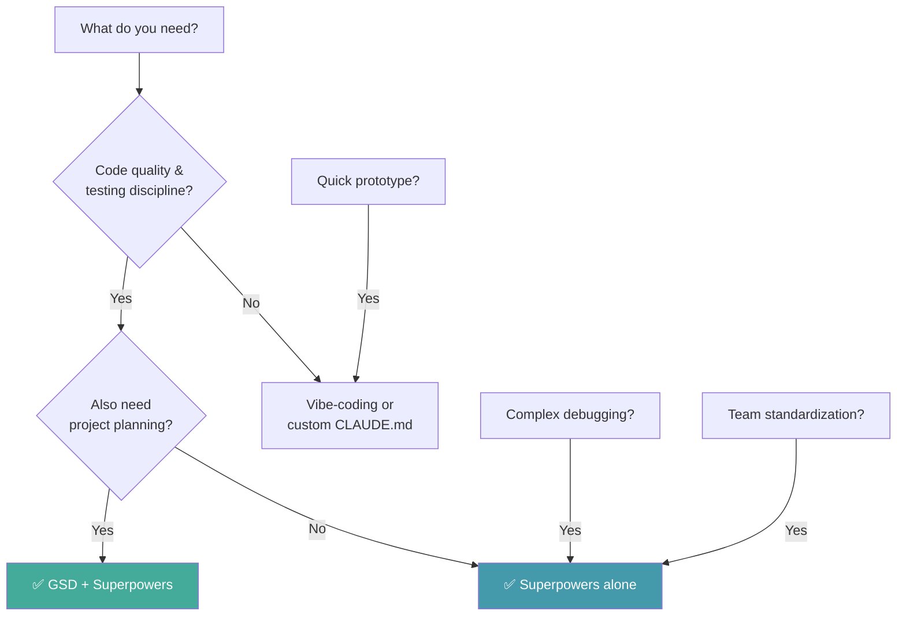

# Superpowers — Decision Guide

> [!NOTE]
> Read this document BEFORE deciding to adopt Superpowers. Read [[3-Research/Github/Superpowers/0. Overview]] if you don't know what Superpowers is yet.

---

## 1. Comparison with Alternatives

### 1.1. Overview Comparison Table

| Feature | **Superpowers** | **GSD** | **BMAD** | **Aider** | **Custom CLAUDE.md** | **Vibe Coding** |
|---|---|---|---|---|---|---|
| **Philosophy** | TDD + Skills + Subagents | Context engineering + Multi-agent | Enterprise SDLC simulation | Git-native AI pair programming | Free-form rules | Chat-and-fix |
| **TDD enforcement** | ✅ Iron Law (non-negotiable) | ⚠️ via verify commands | ⚠️ Optional | ❌ | ⚠️ By user rules | ❌ |
| **Skills framework** | ✅ 14 skills | ❌ | ❌ | ❌ | ❌ | ❌ |
| **Subagent architecture** | ✅ Brainstorm + Implement + Review | ✅ Multi-agent orchestration | ❌ | ❌ | ❌ | ❌ |
| **Context engineering** | ❌ (per-skill) | ✅ (system-level) | ❌ | ❌ | ❌ | ❌ |
| **Project management** | ❌ | ✅ Roadmap + phases | ✅ Full SDLC | ❌ | ❌ | ❌ |
| **Code review** | ✅ Two-stage | ❌ | ⚠️ Checklists | ❌ | ❌ | ❌ |
| **Debugging** | ✅ Systematic (5 techniques) | ✅ Debug agents | ❌ | ❌ | ❌ | ❌ |
| **Platform** | CC, Cursor, Codex, OpenCode | CC, Gemini, OpenCode, Codex | Any AI IDE | Terminal | Any AI IDE | Any |
| **Cost** | Free (MIT) | Free (MIT) | Free | Free | Free | Free |
| **Learning curve** | 🟡 Medium | 🟡 Medium | 🔴 High | 🟢 Low | 🟢 Low | 🟢 Zero |

### 1.2. Detailed Comparisons

#### Superpowers vs GSD

| Aspect | Superpowers | GSD |
|---|---|---|
| **Focus** | **How** to code (skills, TDD, debugging) | **What** to build (planning, execution, verification) |
| **Orchestration** | Per-task subagents | System-level multi-agent orchestration |
| **State management** | Minimal (skill-level) | Full (`.planning/` directory) |
| **Git integration** | Standard | Atomic commits, branching strategies |
| **Complementary?** | ✅ YES — use both together | ✅ YES — GSD for orchestration, Superpowers for coding |

> [!TIP]
> **GSD + Superpowers** is the strongest combination: GSD handles **what** to build (planning, requirements, verification); Superpowers handles **how** to build (TDD, debugging, code review).

#### Superpowers vs Aider

| Aspect | Superpowers | Aider |
|---|---|---|
| **Model** | IDE-integrated skills framework | Terminal-based AI pair programmer |
| **TDD** | ✅ Enforced Iron Law | ❌ Not enforced |
| **Code review** | ✅ Two-stage | ❌ |
| **Debugging** | ✅ 5 systematic techniques | ❌ |
| **Git** | IDE-dependent | ✅ Native git integration |
| **Multi-model** | Via IDE | ✅ Any model |

#### Superpowers vs Custom CLAUDE.md

| Aspect | Superpowers | Custom CLAUDE.md |
|---|---|---|
| **Structure** | 14 modular skills, each focused | One monolithic file |
| **Trigger mechanism** | Skill frontmatter + 1% rule | Always loaded (all or nothing) |
| **Maintenance** | Updated by framework author | User maintained |
| **Extensibility** | Add skills, shadow existing | Add more text |
| **Sharing** | Plugin marketplace | Manual copy |

---

## 2. When to Use Superpowers

### ✅ Ideal Use Cases

| Scenario | Why Superpowers Fits |
|---|---|
| **Quality-critical code** | TDD Iron Law ensures every line is tested |
| **Projects with CI/CD** | TDD-first code naturally passes CI |
| **Complex debugging** | 5 systematic techniques vs random trial-and-error |
| **Team standardization** | Skills ensure consistent coding practices |
| **Long-lived codebases** | TDD + defense-in-depth prevents technical debt |
| **Code review automation** | Two-stage review catches spec and quality issues |
| **Learning TDD** | Framework enforces habits you want to build |

### Signals You SHOULD Use Superpowers

- [ ] AI-generated code keeps breaking in unexpected ways
- [ ] Debug sessions take longer than implementation
- [ ] Same type of bugs keep reappearing
- [ ] Code reviews find fundamental issues
- [ ] You want CI/CD to work reliably

---

## 3. When NOT to Use Superpowers

### ❌ Anti-Use-Cases

| Scenario | Why NOT | Use Instead |
|---|---|---|
| **Rapid prototype / throwaway** | TDD overhead too heavy for disposable code | Vibe-coding |
| **Pure content / static pages** | No logic to test | Direct editing |
| **One-line changes** | Full skill process over-engineered | Direct AI chat |
| **Need project management** | Superpowers doesn't manage roadmaps, requirements | GSD or BMAD |
| **Terminal-preferred workflow** | Superpowers needs IDE | Aider |

### Known Limitations

| Limitation | Impact | Workaround |
|---|---|---|
| **No project planning** | Doesn't handle requirements, roadmaps | Combine with GSD |
| **TDD can feel slow** | More upfront time per feature | Trust the process — faster long-term |
| **14 skills can overwhelm** | New users may not know all skills | Start with core 3: tdd-workflow, systematic-debugging, brainstorming |
| **IDE-dependent** | Doesn't work in terminal | Use supported IDEs |
| **Model quality matters** | Skills need capable models to follow properly | Use Sonnet or better |

---

## 4. Costs & Resources

### Direct Costs

| Item | Cost |
|---|---|
| **Superpowers** | Free (MIT License) |
| **AI IDE** | Depends on choice |
| **API costs** | Standard API costs for your model |

### Cost of TDD Overhead

| Phase | Without TDD | With TDD |
|---|---|---|
| **Initial coding** | Fast | +30-50% slower |
| **Debugging** | Very slow (manual) | Very fast (tests catch issues) |
| **Refactoring** | Risky (no safety net) | Safe (tests verify correctness) |
| **Long-term maintenance** | Expensive (tech debt) | Cheap (clean, tested code) |
| **Total Cost of Ownership** | Higher | **Lower** |

---

## 5. Migration Path

### From Vibe-Coding → Superpowers

| Step | Action |
|---|---|
| 1 | Install Superpowers |
| 2 | Start with new features only — don't retroactively TDD old code |
| 3 | Let skills trigger naturally |
| 4 | Gradually increase test coverage as you modify old code |

### From Custom CLAUDE.md → Superpowers

| Step | Action |
|---|---|
| 1 | Install Superpowers skills alongside your CLAUDE.md |
| 2 | Skills augment (not replace) your CLAUDE.md rules |
| 3 | Gradually move technique-specific rules into custom skills |

### From Superpowers → Other Tools

Superpowers has **no lock-in**:
- All skills are **Markdown** files
- Tests remain in your codebase regardless
- Removing skills doesn't break existing code
- Delete `.claude/skills/` → back to normal

---

## 6. Decision Matrix

| Scenario | Recommendation | Reason |
|---|---|---|
| Need reliable, tested code | ✅ **Superpowers** | TDD Iron Law |
| Need project planning | ❌ **Use GSD** | Superpowers doesn't plan |
| Complex debugging | ✅ **Superpowers** | 5 systematic techniques |
| Quick prototype | ❌ **Vibe-coding** | TDD overhead too heavy |
| Team consistency | ✅ **Superpowers** | Skills standardize practices |
| Full SDLC management | ❌ **BMAD** or **GSD** | Superpowers focuses on coding only |
| Code review automation | ✅ **Superpowers** | Two-stage review |
| Need both planning + quality | ✅ **GSD + Superpowers** | Best of both worlds |

### Decision Flowchart

---

## See Also

- [[3-Research/Github/Superpowers/0. Overview]] — Overview of the Superpowers framework
- [[3-Research/Github/Superpowers/1. Architecture and Logic]] — Internal architecture and mechanisms
- [[3-Research/Github/Superpowers/2. Playbook]] — Practical operations guide
