[ **English** ](understand-beads.md) | [ **Tiếng Việt** ](understand-beads.vi.md)

# Beads - Understanding from Root to Tip

> **For Junior Developers wanting to understand Agentic Coding**

---

## Part 1: Understand the Problem Before the Solution

### 1.1 What is an AI Agent?

Imagine you hire a **virtual programmer** working for you. You assign a task, it codes. That is an AI Coding Agent (Claude Code, Cursor, Aider...).

**But there is a big problem:**

```
You: "Build the Authentication feature for me"

AI Agent: "OK, I will:
1. Create database schema
2. Write Login API
3. Add JWT middleware
4. Create Logout endpoint"

[... Agent does step 1, 2 ...]

[Context window full → Compact/Clear]

AI Agent: "Hello! How can I help you?"

You: "??? You were doing Authentication for me!"

AI Agent: "I don't remember... Can you say it again?"
```

**This is called "Agent Amnesia".**

### 1.2 Why do Agents get Amnesia?

```
┌─────────────────────────────────────────────────────────┐
│                   CONTEXT WINDOW                         │
│                   (AI's Memory)                          │
│                                                          │
│  ┌──────────────────────────────────────────────────┐   │
│  │ System prompt + Conversation + Code + Files...    │   │
│  │                                                    │   │
│  │ Limit: ~100k-200k tokens                          │   │
│  └──────────────────────────────────────────────────┘   │
│                                                          │
│  When full → COMPACT or CLEAR                           │
│  → Lost conversation history                             │
│  → Agent forgets what it is doing                        │
│                                                          │
└─────────────────────────────────────────────────────────┘
```

**Core Issue:**
- AI Agent only "remembers" what is in the context window.
- Context window is limited.
- When compact/clear -> information loss.
- New Session = Agent knows nothing about old session.

### 1.3 "But we have Markdown files already?" - Important Question

Many will ask: **"Spec-driven development already uses Markdown files (tasks.md, TODO.md) to track tasks. Why do we need Beads?"**

This is a **VERY GOOD** question and needs detailed explanation.

---

## Part 2: Why Markdown Is Not Enough for AI Agents?

### 2.1 Markdown Approach (Spec-Driven)

```markdown
# tasks.md

## TODO
- [ ] Setup database
- [ ] Create Login API (depends on: Setup database)
- [ ] Add JWT middleware (depends on: Setup database)
- [ ] Logout endpoint (depends on: Login API, JWT middleware)

## IN PROGRESS
- [ ] ...

## DONE
- [x] ...
```

**Seems fine?** Agent reads this file, knows tasks, knows dependencies.

**So why still "context slip"?**

### 2.2 Issue 1: Markdown is "Implicit" - Agent must infer

```markdown
# tasks.md
- [ ] Login API (depends on: Setup database)
```

Agent reads text, but must **infer**:
- What does "depends on" mean? Fully blocked? Or just related?
- Is "Setup database" done yet? Must search in file.
- Which task has higher priority? Not clear.

```
Agent reads file and infers:
"Hmm, Login API depends on Setup database...
 Let me find Setup database in file...
 Found in TODO section, no [x] check...
 So seemingly not done...
 So I should not do Login API..."
```

**Problem:**
- Inference = **Costs Tokens** (must "think").
- Inference = **Can be wrong** (misunderstanding format).

### Compared to Beads:

```bash
$ bd ready --json
[{"id":"bd-1","title":"Setup database","priority":1}]
```

**Explicit:**
- Only return ready tasks.
- Agent **does not need to infer**.
- Ask -> Receive accurate answer.

---

### 2.3 Issue 2: Markdown has no "Query" - Must read entire file

```
┌─────────────────────────────────────────────────────────┐
│                   MARKDOWN APPROACH                      │
│                                                          │
│   tasks.md has 500 lines                                │
│   ┌──────────────────────────────────────────────────┐  │
│   │ # Epic 1                                          │  │
│   │ - [ ] Task 1.1                                    │  │
│   │ - [ ] Task 1.2 (depends on 1.1)                  │  │
│   │ - [x] Task 1.3                                    │  │
│   │ # Epic 2                                          │  │
│   │ - [ ] Task 2.1                                    │  │
│   │ ... (hundreds more lines)                        │  │
│   └──────────────────────────────────────────────────┘  │
│                                                          │
│   Agent wants to know "which task is actionable?"       │
│                                                          │
│   Must: LOAD ENTIRE FILE into context                   │
│         → 500 lines ≈ 2000 tokens                       │
│         → Parse text, find pattern [ ] and [x]          │
│         → Analyze "depends on"                          │
│         → Infer which task is ready                     │
│         → EVERY QUERY costs this much!                  │
│                                                          │
└─────────────────────────────────────────────────────────┘
```

```
┌─────────────────────────────────────────────────────────┐
│                    BEADS APPROACH                        │
│                                                          │
│   Agent wants to know "which task is actionable?"       │
│                                                          │
│   $ bd ready --json                                     │
│   ┌──────────────────────────────────────────────────┐  │
│   │ [{"id":"bd-1","title":"Setup database","p":1}]   │  │
│   └──────────────────────────────────────────────────┘  │
│                                                          │
│   Agent receives: ONLY NEEDED DATA                      │
│               → 1 ready task ≈ 50 tokens                │
│               → Filtered already                        │
│               → Sorted by priority                      │
│               → No inference needed                     │
│                                                          │
└─────────────────────────────────────────────────────────┘
```

**Core Issue:** Markdown doesn't scale. Big project = big file = expensive context per read.

---

### 2.4 Issue 3: Markdown doesn't track "In-between State"

This is the **MOST SERIOUS** issue!

**Markdown only has 2 states:**
```markdown
- [ ] Task not done (TODO)
- [x] Task done (DONE)
```

**It lacks:**
- "50% done"
- "Waiting for review"
- "Blocked by another task"
- "Who is doing this task"

**Consequence when compacting in the middle:**

```
Active Session:
├── Agent reads tasks.md
├── Agent sees: - [ ] Setup database (not done)
├── Agent STARTS Setup database
├── Agent gets 50% done (schema done, creating migrations)
│
└── COMPACT HAPPENS (in the middle!)
    │
    ▼
    Agent loses conversation
    Agent re-reads tasks.md
    Agent sees: - [ ] Setup database (still unchecked!)
    
    Agent thinks: "This task is not done. Let me start..."
    
    → START OVER FROM BEGINNING! 😱
    → Old code might be overwritten!
```

### Compared to Beads:

```bash
# BEFORE compact - Agent records progress
$ bd update bd-1 --status in_progress
$ bd update bd-1 --notes "
  COMPLETED: Database schema designed, tables created
  IN PROGRESS: Creating migration files
  NEXT: Run migrations on dev server
  FILES: src/db/schema.sql, migrations/001_init.sql
"

[COMPACT HAPPENS]

# AFTER compact - Agent queries again
$ bd show bd-1

Status: in_progress  ← Knows it's in progress!
Notes: "COMPLETED: schema... IN PROGRESS: migrations..."

Agent: "Ah, I am creating migration files. schema.sql is done.
        Continuing migrations..."

→ CONTINUE AT THE RIGHT SPOT! ✅
```

---

### 2.5 Issue 4: Markdown conflict easily when multiple people/agents edit

```
Alice and Bob edit tasks.md together:

Alice's version:
- [x] Setup database        ← Alice marks done
- [ ] Login API

Bob's version (same time):
- [ ] Setup database
- [x] Login API             ← Bob marks done

Git merge:
<<<<<<< Alice
- [x] Setup database
- [ ] Login API
=======
- [ ] Setup database  
- [x] Login API
>>>>>>> Bob

→ CONFLICT! Must resolve manually
```

### Compared to Beads:

```bash
# Alice creates task
$ bd create "Setup database"    # → bd-a1b2 (hash)

# Bob creates task (same time)
$ bd create "Login API"         # → bd-c3d4 (different hash)

# Git merge: No conflict!
# Because each task is a separate line in JSONL
# And ID is hash, unique
```

---

### 2.6 Summary: Markdown vs Beads for Task Management

| Aspect | Markdown (tasks.md) | Beads |
|-----------|---------------------|-------|
| **Get "actionable tasks"** | Read whole file, self-parse, self-infer | `bd ready` → receive correct tasks |
| **Context cost** | Whole file (can be 2000+ tokens) | Only needed data (~50-100 tokens) |
| **Dependency** | Text description, agent self-understands | Database enforce, auto block |
| **Status** | Only TODO/DONE | open/in_progress/blocked/closed + notes |
| **Track mid-progress** | ❌ None | ✅ Detailed notes |
| **Multi-user/agent edit** | Conflict prone | Hash ID, auto-merge |
| **After compact** | Re-read whole file, may misunderstand | Query exact state |

---

### 2.7 Practical Example: Same scenario, 2 approaches

#### With Markdown:

```
Active Session:
│
├── Agent reads tasks.md (2000 tokens)
├── Agent parse: "Task 3 depends on Task 1, 2..."
├── Agent infers: "Task 1, 2 not done → do Task 1 first"
├── Agent does Task 1 up to 50%
│
└── COMPACT HAPPENS
    │
    ▼
    Agent re-reads tasks.md (2000 tokens AGAIN)
    Agent sees: - [ ] Task 1 (unchecked)
    
    Agent: "Task 1 not done. Let me start..."
    
    → START OVER!
    → Cost 4000 tokens just to read file twice
    → 50% effort lost
```

#### With Beads:

```
Active Session:
│
├── Agent: bd ready --json (50 tokens)
├── Output: [{"id":"bd-1","status":"open"}]
├── Agent: bd update bd-1 --status in_progress
├── Agent does 50%
├── Agent: bd update bd-1 --notes "Done: schema. Doing: migrations"
│
└── COMPACT HAPPENS
    │
    ▼
    Agent: bd ready --json (50 tokens)
    Output: [] (empty - because bd-1 is in_progress, not "ready")
    
    Agent: "Hmm, no ready tasks. Any tasks mid-progress?"
    Agent: bd list --status in_progress
    Output: [{"id":"bd-1","status":"in_progress"}]
    
    Agent: bd show bd-1 (100 tokens)
    Output: {status: "in_progress", notes: "Done: schema. Doing: migrations"}
    
    Agent: "Ah, I am doing migrations for bd-1. Continuing..."
    
    → CONTINUE AT RIGHT SPOT!
    → Only cost ~200 tokens
    → No effort lost
```

---

### 2.8 Conclusion: Correct Mindset for AI Agent Task Management

```
┌─────────────────────────────────────────────────────────┐
│                                                          │
│   MARKDOWN = "Task List" to READ and SELF-UNDERSTAND    │
│                                                          │
│   • Agent reads entire file                             │
│   • Agent self-parses format                            │
│   • Agent self-infers dependency                        │
│   • Agent self-determines actionable tasks              │
│   • → Costs tokens, prone to error, no mid-state track  │
│                                                          │
├─────────────────────────────────────────────────────────┤
│                                                          │
│   BEADS = "Task Management System" to ASK and RECEIVE   │
│                                                          │
│   • Agent asks: "Which task is actionable?"             │
│   • Beads answers: This is the list (filtered, sorted)  │
│   • Agent asks: "What is the status of this task?"      │
│   • Beads answers: It is in_progress, notes are...      │
│   • → Low tokens, accurate, full tracking               │
│                                                          │
└─────────────────────────────────────────────────────────┘
```

**One sentence summary:**

> **Markdown is a "task list" to read and interpret.**
> **Beads is a "task management system" to query and receive answers.**

---

## Part 3: Beads - Intelligent Task Management System

### 3.1 What is Beads?

Beads = **Issue Tracker** (like Jira, Trello) but designed **for AI Agents**, not humans.

> *"bd is a lightweight, git-based issue tracker designed for AI coding agents."*

### 3.2 Beads vs Standard Jira/Trello

| Feature | Jira/Trello | Beads | Why important? |
|-----------|-------------|-------|---------------------|
| **Interface** | Web UI for humans | CLI + JSON for Agent | Agents can't use UI |
| **Query** | Mouse click | `bd ready --json` | Agent needs structured output |
| **Storage** | Cloud server | Local Git | No internet needed, sync via git |
| **ID** | Sequential (PROJ-1, PROJ-2) | Hash (bd-a1b2) | Avoid conflict with multiple agents |

### 3.3 Cool features in Beads task management

#### ✅ **1. Clear Priority System**

```bash
-p 0  # P0 - Critical (most urgent, do immediately)
-p 1  # P1 - High (important)
-p 2  # P2 - Medium (normal)
-p 3  # P3 - Low (can wait)
-p 4  # P4 - Backlog (when free)
```

**Why cool?** Agent knows what to do first:
```bash
$ bd ready --json
# Output: Returns tasks ordered P0 → P1 → P2...
# Agent automatically picks P0 first
```

#### ✅ **2. Dependency - Logical Ordering**

This is an **EXCELLENT** feature of Beads!

```
Example: Build feature Authentication

Task A: Setup database        ──┐
                                ├──→ Task C: Login API (waits for A, B)
Task B: Config OAuth          ──┘           │
                                            ▼
                              Task D: Logout (waits for C)
```

```bash
# Create tasks
bd create "Setup database" -p 1        # → bd-1
bd create "Config OAuth" -p 1          # → bd-2
bd create "Login API" -p 1             # → bd-3
bd create "Logout endpoint" -p 2       # → bd-4

# Set dependencies
bd dep add bd-3 bd-1   # Login depends on Database
bd dep add bd-3 bd-2   # Login depends on OAuth
bd dep add bd-4 bd-3   # Logout depends on Login

# Now ask: Which task is ready?
$ bd ready
# Output: bd-1 (Setup database), bd-2 (Config OAuth)
# ✅ bd-3, bd-4 BLOCKED - do not appear in ready list!
```

**Why cool?**
- Agent **CANNOT** do things out of order.
- Only unblocked tasks appear in `bd ready`.
- When bd-1 and bd-2 closed → bd-3 automatically becomes ready.

#### ✅ **3. Auto-Ready Detection**

```bash
# Agent just asks one question:
$ bd ready --json

# Beads automatically:
# - Filters open tasks
# - Removes blocked tasks
# - Sorts by priority
# - Returns list of "immediately actionable work"
```

Agent doesn't need complex thinking. Ask -> Receive work -> Do.

#### ✅ **4. Rich Status - Not just TODO/DONE**

```bash
# Beads statuses:
open         # Not started
in_progress  # Doing
blocked      # Blocked by another task
closed       # Completed

# With detailed notes:
bd update bd-1 --status in_progress --notes "
COMPLETED: Schema design
IN PROGRESS: Writing migrations
NEXT: Run on dev server
"
```

#### ✅ **5. Discovered Work - Track emergent work**

Working on task A, found bug B? Beads tracks it:

```bash
# Working on bd-10 (Add Payment)
# Found CORS bug

$ bd create "CORS bug" -t bug -p 0
# → bd-11

$ bd dep add bd-11 bd-10 --type discovered-from
# Records: "bd-11 was discovered while doing bd-10"
```

**Why cool?**
- Doesn't lose track of emergent work.
- Audit trail: know where bug came from.
- Future agents can read history.

#### ✅ **6. Hash-based ID - No conflict**

```
Jira: PROJ-1, PROJ-2, PROJ-3... (sequential)
      → 2 people create same time = CONFLICT!

Beads: bd-a1b2, bd-c3d4, bd-e5f6... (random hash)
       → 2 agents create same time = OK, IDs differ!
```

#### ✅ **7. Hierarchical Structure - Epic/Task**

```bash
# Create Epic (large group)
bd create "Auth System" -t epic -p 1
# → bd-a3f8

# Create Sub-tasks (auto suffix)
bd create "Login UI" -p 1 --parent bd-a3f8      # → bd-a3f8.1
bd create "Backend API" -p 1 --parent bd-a3f8   # → bd-a3f8.2
bd create "Unit Tests" -p 2 --parent bd-a3f8    # → bd-a3f8.3

# When ALL children closed → Epic automatically closed!
```

#### ✅ **8. Git-Native - Auto Sync**

```bash
# Work on Machine A
bd create "Fix bug" -p 1
git add .beads/
git commit -m "Add task"
git push

# Machine B (or other Agent)
git pull
bd ready  # Automatically sees new task!
```

---

## Part 4: Beads + AI Agent = Operational Flow

### 4.1 Problem: Agent doesn't know about Beads

AI Agent **doesn't automatically know** project uses Beads. It needs to be **"taught"**.

```
❌ NO INSTRUCTION:
Agent: "Hello! How can I help?"
(Doesn't know existing Beads, doesn't know tasks)

✅ WITH INSTRUCTION:
Agent: "I see this project uses Beads.
        Let me check tasks: bd ready --json
        There are 3 ready tasks. Starting with bd-1..."
```

### 4.2 Solution: Hooks - Auto "Remind" Agent

**Hook = Command automatically runs on event**

```
┌─────────────────────────────────────────────────────────┐
│                    CLAUDE CODE                           │
│                                                          │
│  Event: SessionStart (open Claude Code)                 │
│         ↓                                                │
│  Hook runs: bd prime                                    │
│         ↓                                                │
│  Output: ~1-2k tokens workflow instructions             │
│         ↓                                                │
│  Agent reads -> Knows Beads -> Knows usage              │
│                                                          │
│  Event: PreCompact (before compacting context)          │
│         ↓                                                │
│  Hook runs: bd sync                                     │
│         ↓                                                │
│  Save state -> No data loss on compact                  │
└─────────────────────────────────────────────────────────┘
```

### 4.3 `bd prime` - "Instruction Manual" for Agent

When running `bd prime`, it outputs text like:

```markdown
# Beads Workflow Context

## Core Rules
- Track strategic work in beads (multi-session, dependencies)
- Use `bd create` for issues
- Use `bd ready` to find work

## Essential Commands
- `bd ready --json` - View ready tasks
- `bd update <id> --status in_progress` - Claim task
- `bd close <id> --reason "Done"` - Complete task

## Session Close Protocol
1. Commit code
2. Update beads notes
3. bd sync
4. git push
```

**Purpose of `bd prime`:**
1. **Remind Agent:** "There is a Beads system in this project."
2. **Teach Agent:** "These are basic commands."
3. **Guide Agent:** "When doing task, query Beads first."

### 4.4 Summary of Operational Flow

```mermaid
flowchart TD
    subgraph SETUP["🔧 SETUP (Once)"]
        A[Install bd CLI] --> B[bd init in project]
        B --> C[bd setup claude]
        C --> D[Hooks installed in Claude Code]
    end

    subgraph SESSION["🚀 EACH SESSION"]
        E[Open Claude Code] -->|SessionStart| F["bd prime auto-runs"]
        F --> G["Agent reads guide:<br/>• Project has Beads<br/>• Usage commands<br/>• Standard workflow"]
        G --> H["Agent auto calls: bd ready --json"]
        H --> I["Receive tasks list<br/>(filtered blocked, sorted priority)"]
        I --> J["Work + update notes..."]
    end

    subgraph COMPACT["⚠️ WHEN COMPACT"]
        K[Context full] -->|PreCompact| L[bd sync auto-runs]
        L --> M[State saved to Git]
        M --> N[Compact happens]
        N --> O["Agent forgets conversation<br/>BUT Beads database intact!"]
        O --> P["Agent calls: bd ready, bd show<br/>→ Recover context from Beads"]
    end

    D --> E
    J --> K

    style SETUP fill:#e8f5e9
    style SESSION fill:#e3f2fd
    style COMPACT fill:#fff3e0
```



---

## Part 5: Detailed Workflow for Junior Dev

### 5.1 Role of Human vs Agent

```
┌─────────────────────────────────────────────────────────┐
│                      HUMAN                               │
│                    (Strategy)                            │
│                                                          │
│  • Plan: "Need to build Authentication"                 │
│  • Create Epic: bd create "Auth System" -t epic         │
│  • Create Tasks: bd create "Login API" -p 1             │
│  • Set Dependencies: bd dep add ...                     │
│  • Review results                                        │
└─────────────────────────────────────────────────────────┘
                          ↓
┌─────────────────────────────────────────────────────────┐
│                      AI AGENT                            │
│                    (Tactics)                             │
│                                                          │
│  • Query tasks: bd ready --json                         │
│  • Claim task: bd update <id> --status in_progress     │
│  • Code, code, code...                                  │
│  • Notes: bd update <id> --notes "..."                 │
│  • Close task: bd close <id> --reason "Done"           │
│  • Repeat until no tasks...                            │
└─────────────────────────────────────────────────────────┘
```

### 5.2 Agent Workflow Loop

```mermaid
flowchart TD
    START([🚀 Agent Starts]) --> PRIME["bd prime<br/>(if new session)"]
    PRIME --> READY["bd ready --json<br/>Ask: What task is actionable?"]
    
    READY --> CHECK{Any task<br/>ready?}
    CHECK -->|No| DONE([✅ Done work!])
    CHECK -->|Yes| SELECT["Select task<br/>highest priority"]
    
    SELECT --> CLAIM["bd update ID --status in_progress<br/>Claim: I'm doing this"]
    
    CLAIM --> WORK["💻 CODE"]
    
    WORK --> DISCOVER{Discover<br/>new issue?}
    DISCOVER -->|Yes| CREATE["bd create 'Bug found' -t bug<br/>Track emergent work"]
    CREATE --> WORK
    
    DISCOVER -->|No| NOTES["bd update ID --notes '...'<br/>Record detailed progress"]
    NOTES --> COMPLETE["bd close ID --reason 'Done'<br/>Mark complete"]
    
    COMPLETE --> READY
    
    style START fill:#c8e6c9
    style DONE fill:#c8e6c9
    style WORK fill:#fff3e0
    style CLAIM fill:#e3f2fd
    style COMPLETE fill:#e3f2fd
```



### 5.3 Concrete Example Step-by-Step

**Step 1: Human creates tasks**
```bash
# Create Epic
$ bd create "User Authentication" -t epic -p 1
Created: bd-auth

# Create sub-tasks
$ bd create "Setup OAuth" -p 1 --parent bd-auth
Created: bd-auth.1

$ bd create "Login API" -p 1 --parent bd-auth
Created: bd-auth.2

$ bd create "JWT Middleware" -p 1 --parent bd-auth
Created: bd-auth.3

# Set dependencies
$ bd dep add bd-auth.2 bd-auth.1   # Login needs OAuth
$ bd dep add bd-auth.3 bd-auth.1   # JWT needs OAuth
```

**Step 2: Agent queries and works**
```bash
# Agent asks: "Which task is actionable?"
Agent: $ bd ready --json
Output: [{"id":"bd-auth.1","title":"Setup OAuth","priority":1}]

# Only bd-auth.1 ready! (bd-auth.2, bd-auth.3 blocked)

Agent: "I will do bd-auth.1 - Setup OAuth"

Agent: $ bd update bd-auth.1 --status in_progress

# ... Agent codes OAuth integration ...

Agent: $ bd update bd-auth.1 --notes "
COMPLETED: Google OAuth integrated
NEXT: Test callback URLs
"

Agent: $ bd close bd-auth.1 --reason "OAuth setup complete"
```

**Step 3: Dependency auto unblock**
```bash
# Agent asks again
Agent: $ bd ready --json
Output: [
  {"id":"bd-auth.2","title":"Login API","priority":1},
  {"id":"bd-auth.3","title":"JWT Middleware","priority":1}
]

# 2 tasks unblocked! (since bd-auth.1 closed)

Agent: "bd-auth.2 and bd-auth.3 same priority. Doing bd-auth.2 first..."
```

---

## Part 6: Handling After Compact

### 6.1 Weakness to know

```
Timeline:
──────────────────────────────────────────────────────────►
│                    │                    │
▼                    ▼                    ▼
Session Start        Auto-Compact         After Compact
bd prime runs ✅     bd sync runs ✅      bd prime DOES NOT run ❌
Agent knows Beads    Data saved           Agent forgets conversation
                                          BUT Beads intact
```

**Problem:** After compact, `bd prime` DOES NOT auto-run. Agent must query itself.

### 6.2 Solution: Notes is "Letter to Future Agent"

> *"Write notes as if explaining to a future agent with zero conversation context."*

```bash
# ❌ BAD - Meaningless notes for post-compact agent
bd update bd-1 --notes "Done"

# ✅ GOOD - Notes full of context
bd update bd-1 --notes "
COMPLETED: OAuth integration with Google provider
IN PROGRESS: Testing callback URLs
NEXT: Add GitHub OAuth provider
FILES CHANGED: src/auth/oauth.ts, config/providers.json
KEY DECISION: Used PKCE flow because more secure
BLOCKERS: None
"
```

### 6.3 Instruct Agent in CLAUDE.md

Add to project `CLAUDE.md`:

```markdown
## ⚠️ After compact or context loss

If you don't remember what you're doing, IMMEDIATELY run:
1. `bd ready --json` - See ready tasks
2. `bd show <id>` - See task details (read notes!)

DO NOT GUESS. MUST query Beads first.
```

---

## Part 7: Quick Install

```bash
# 1. Install CLI
curl -fsSL https://raw.githubusercontent.com/steveyegge/beads/main/scripts/install.sh | bash

# 2. Init in project (⚠️ REMEMBER SHORT PREFIX!)
cd your-project
bd init --prefix myapp    # ← Important! See Part 8

# 3. Setup hooks for Claude Code
bd setup claude

# 4. Check
bd doctor
```

**Done!** Now every time you open Claude Code:
- `bd prime` auto runs → Agent knows Beads
- Agent will auto `bd ready` → Get tasks
- Before compact → `bd sync` auto runs → Data saved

---

## Part 8: ⚠️ ID Format and Prefix - Very Important!

### 8.1 "Ugly ID" Problem newbies face

When you run `bd init` **WITHOUT prefix**, Beads might create very long ugly IDs:

```
❌ UGLY ID (no prefix):
Competitor-Video-Analysis-System-ey3
My-Super-Long-Project-Name-abc123

✅ GOOD ID (short prefix):
cvs-ey3
myapp-a1b2
auth-c3d4
```

### 8.2 ID Structure in Beads

```
<prefix>-<hash>

Example:
┌────────┬───────┐
│ prefix │ hash  │
├────────┼───────┤
│ bd     │ a1b2  │  → bd-a1b2
│ myapp  │ c3d4  │  → myapp-c3d4
│ auth   │ e5f6  │  → auth-e5f6
└────────┴───────┘

With Epic and Sub-tasks:
┌────────┬───────┬─────────┐
│ prefix │ hash  │ suffix  │
├────────┼───────┼─────────┤
│ auth   │ a3f8  │         │  → auth-a3f8 (Epic)
│ auth   │ a3f8  │ .1      │  → auth-a3f8.1 (Sub-task 1)
│ auth   │ a3f8  │ .2      │  → auth-a3f8.2 (Sub-task 2)
└────────┴───────┴─────────┘
```

### 8.3 Setting Prefix Correctly

#### When init NEW project:

```bash
# ✅ CORRECT - Set short prefix
bd init --prefix myapp
bd init --prefix cvs
bd init --prefix auth

# ❌ WRONG - No prefix (or long prefix)
bd init
bd init --prefix my-super-long-project-name
```

#### When having database with ugly prefix:

Use `bd rename-prefix` to change:

```bash
# Step 1: See current prefix
$ bd where
# Output: prefix: Competitor-Video-Analysis-System

# Step 2: Preview rename (dry run)
$ bd rename-prefix cvs- --dry-run

# Output:
# Would rename 5 issues:
#   Competitor-Video-Analysis-System-ey3 → cvs-ey3
#   ...

# Step 3: Apply rename
$ bd rename-prefix cvs-

# Step 4: Verify
$ bd list
# Now see: cvs-ey3, cvs-f4g, ...
```

### 8.4 Recommended Prefixes

| Project | Suggested Prefix | Example ID |
|---------|-------------|----------|
| Competitor Video System | `cvs-` | cvs-a1b2 |
| E-commerce App | `shop-` | shop-c3d4 |
| Authentication Service | `auth-` | auth-e5f6 |
| Mobile App | `app-` | app-g7h8 |
| API Backend | `api-` | api-i9j0 |

**Rules:**
- **Short:** 2-5 chars
- **Meaningful:** Recognizable project
- **Lowercase:** Easy to read/type
- **Trailing dash:** `myapp-` (clearer)

### 8.5 ID/Prefix Related Commands

| Command | Description |
|---------|-------|
| `bd init --prefix <name>` | Set prefix on init |
| `bd rename-prefix <new>` | Change prefix for ALL issues |
| `bd rename-prefix <new> --dry-run` | Preview change |
| `bd where` | See database path and current prefix |
| `bd where --json` | Detailed JSON output |

### 8.6 Important Note

```
⚠️ IMPORTANT:

1. SET PREFIX ON INIT
   → Avoid rename later
   
2. IF FORGOT PREFIX
   → Use bd rename-prefix to fix
   → Updates ALL issues in database
   
3. SYNC AFTER RENAME
   → Run bd sync after rename
   → Commit .beads/issues.jsonl to git
```

---

## Part 9: Cheat Sheet

### Human (Planning)
```bash
bd init --prefix <short-name>                       # Init with short prefix
bd create "Title" -t task|feature|bug|epic -p 0-4  # Create task
bd dep add <child> <parent>                         # Set dependency
bd list                                             # View all
bd dep tree <id>                                    # View dependency tree
bd rename-prefix <new> --dry-run                    # Preview rename prefix
bd rename-prefix <new>                              # Rename prefix
```

### Agent (Execution)
```bash
bd ready --json                                    # What is actionable?
bd show <id>                                       # Detail + notes
bd update <id> --status in_progress               # Claim task
bd update <id> --notes "..."                       # Record progress
bd close <id> --reason "Done"                      # Complete
```

### Maintenance
```bash
bd sync                # Sync with Git
bd doctor              # Check health
bd prime               # View workflow guide
bd where               # View prefix and database path
```

---

## Part 10: 🖥️ Beads UI - Visual Interface for Beads

### 10.1 Issue: CLI is hard for new humans to track

Beads is CLI-first, great for AI Agents, but for **humans**:
- Hard to visualize overall tasks
- No Board view like Trello/Jira
- Must type commands to check status

### 10.2 Solution: Beads UI

**Beads UI** is a local web UI for Beads, community created.

> *"Local UI for Beads — Collaborate on issues with your coding agent."*

**GitHub:** https://github.com/mantoni/beads-ui

### 10.3 Key Features

| Feature | Description |
|-----------|-------|
| ✨ **Zero setup** | Just `bdui start` |
| 📺 **Live updates** | Auto update on DB change |
| 🔎 **Issues view** | Filter, search, edit inline |
| ⛰️ **Epics view** | View progress by Epic, expand rows |
| 🏂 **Board view** | Kanban board: Blocked / Ready / In Progress / Closed |
| ⌨️ **Keyboard navigation** | Mouse-less navigation |

### 10.4 Install and Usage

```bash
# Install global
npm i beads-ui -g

# Run in Beads project
cd your-project
bdui start --open    # Auto open browser
```

**Note:** Project must have `.beads/` (ran `bd init`).

### 10.5 Views in Beads UI

#### 📋 Issues View
List all issues, filter status, priority, search title.

#### ⛰️ Epics View
View progress by Epic, expand to see sub-tasks.

#### 🏂 Board View (Kanban)
Like Trello - drag drop tasks between columns.

### 10.6 CLI + UI Combined Workflow

```
┌─────────────────────────────────────────────────────────┐
│                     HUMAN                                │
│                                                          │
│  Use Beads UI to:                                       │
│  • See overview (Board view)                            │
│  • Track progress (Epics view)                          │
│  • Quick edit inline                                    │
│                                                          │
└─────────────────────────────────────────────────────────┘
                          ↕ (sync via database)
┌─────────────────────────────────────────────────────────┐
│                     AI AGENT                             │
│                                                          │
│  Use CLI to:                                            │
│  • bd ready --json                                      │
│  • bd update --status                                   │
│  • bd close --reason                                    │
│                                                          │
└─────────────────────────────────────────────────────────┘
```

**Live sync:** Agent updates via CLI → Beads UI auto refreshes!

### 10.7 Beads UI Commands

```bash
bdui start              # Start server (default port 3000)
bdui start --open       # Start and open browser
bdui start --port 8080  # Use other port
bdui stop               # Stop server
bdui --help             # See options
```

### 10.8 When to use UI vs CLI?

| Scenario | Use |
|------------|------|
| Project overview | 🖥️ **UI** - Board/Epics view |
| Create/edit many tasks fast | 🖥️ **UI** - Inline edit |
| AI Agent working | ⌨️ **CLI** - `bd ready`, `bd update` |
| Scripting/Automation | ⌨️ **CLI** - `--json` output |
| Team demo | 🖥️ **UI** - More visual |

---

## Final Summary

```
┌─────────────────────────────────────────────────────────┐
│                    WHAT IS BEADS?                        │
│                                                          │
│  Task management system (like Jira) for AI Agents       │
│                                                          │
├─────────────────────────────────────────────────────────┤
│                    SOLVES WHAT?                          │
│                                                          │
│  Agent Amnesia: AI forgets on context compact           │
│  → Beads = External memory, persist in Git              │
│                                                          │
├─────────────────────────────────────────────────────────┤
│              WHY NOT MARKDOWN?                           │
│                                                          │
│  Markdown: Read whole file → Infer → Can be wrong      │
│  Beads: Ask "what is actionable?" → Receive exact task │
│                                                          │
├─────────────────────────────────────────────────────────┤
│                    COOL POINTS?                          │
│                                                          │
│  ✅ Priority: P0→P4, Agent knows what first             │
│  ✅ Dependency: Blocked task auto hidden                │
│  ✅ Auto-ready: One question, get exact tasks          │
│  ✅ Rich status: in_progress + detailed notes          │
│  ✅ Git-native: Auto sync, team collaboration          │
│                                                          │
├─────────────────────────────────────────────────────────┤
│                    HOW TO OPERATE?                       │
│                                                          │
│  1. bd init --prefix <short> ← Set short prefix!       │
│  2. bd prime (hook) → Remind Agent of Beads             │
│  3. Agent asks bd ready → Get filtered/sorted tasks    │
│  4. Agent works, updates notes in Beads                 │
│  5. bd sync (hook) → Save before compact                │
│  6. After compact: Query Beads → Context recovered      │
│                                                          │
├─────────────────────────────────────────────────────────┤
│              ⚠️ IMPORTANT FOR NEWBIES                   │
│                                                          │
│  • ALWAYS set --prefix short on bd init                │
│  • If ugly prefix: bd rename-prefix <new>              │
│  • Prefix should be: 2-5 chars, lowercase, meaningful  │
│                                                          │
└─────────────────────────────────────────────────────────┘
```

---

## Resources

- **GitHub (Beads)**: https://github.com/steveyegge/beads
- **GitHub (Beads UI)**: https://github.com/mantoni/beads-ui
- **FAQ**: https://github.com/steveyegge/beads/blob/main/docs/FAQ.md
- **QUICKSTART**: https://github.com/steveyegge/beads/blob/main/docs/QUICKSTART.md
- **ADVANCED (rename-prefix)**: https://github.com/steveyegge/beads/blob/main/docs/ADVANCED.md

---

*This document is for Junior Developers wanting to understand Agentic Coding.*
*Written based on official docs from GitHub steveyegge/beads.*
