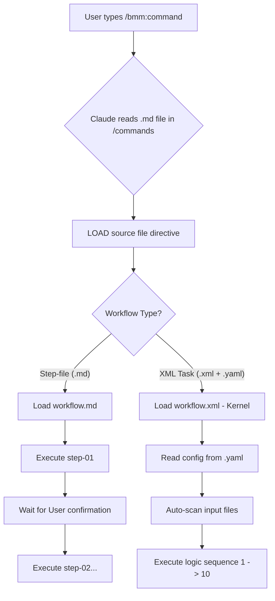

[ **English** ](BMAD-Command-Execution-Logic.md) | [ **Tiếng Việt** ](BMAD-Command-Execution-Logic.vi.md)

# Command & Execution Logic in BMAD

> This document delves into how BMAD connects user Slash Commands with the underlying execution engines.

---

## 1. Decoupled Architecture

BMAD adopts a fully decoupled design model between the **Interface (Frontend - Commands)** and the **Logic (Backend - Workflows)**.

- **Commands** (`.claude/commands/`): What the user sees and types into the terminal.
- **Workflows** (`_bmad/`): Where intelligence, processes, and detailed execution steps reside.

The bridge between these two components consists of powerful **LOAD** and **READ** directives, forcing the LLM (Claude) to switch its working context immediately.

---

## 2. Anatomy of a Command

Every command file in `.claude/commands/bmm/workflows/` follows a minimal yet effective structure.

**Example content of `create-prd.md`:**
```markdown
---
description: 'Brief description of the command'
---
IT IS CRITICAL: 
1. LOAD the FULL @_bmad/path/to/workflow.md
2. READ its entire contents
3. FOLLOW its directions exactly!
```

**Why do this?**
1. **Token Savings**: Claude doesn't need to hold the entire process in memory until the command is invoked.
2. **Easy Updates**: When the process changes, you only need to edit the file in `_bmad/`; dozens of commands calling it will automatically update.
3. **Enforced Discipline**: Using strong words like "CRITICAL", "MANDATORY" helps AI adhere to the process better.

---

## 3. Two Main Execution Engines

BMAD categorizes AI actions into two different "modes":

### Mode A: Step-file Workflow
For **Design & Thinking** tasks.
- **Structure**: A main `workflow.md` file coordinates multiple `steps/step-XX-*.md` files.
- **Characteristics**:
    - AI performs the task like a guided conversation.
    - After each step, AI pauses to ask for user opinion or confirmation.
    - Suitable for: PRD, Architecture, UX Design.

### Mode B: XML Task Engine (`workflow.xml`)
For **Engineering & Automation** tasks.
- **Structure**: Uses the `workflow.xml` file (considered the Kernel/OS) loading configuration from `workflow.yaml`.
- **Characteristics**:
    - Executes precisely like a computer program.
    - Capable of Input Discovery, environment variable management.
    - Has **YOLO mode**: AI automatically executes steps without asking if allowed by the user.
    - Suitable for: `dev-story`, `code-review`, `test-automation`.

---

## 4. Execution Flow Diagram



---

## 5. Command Reference

Below is how the most important commands map to the underlying execution files:

| Slash Command | Execution Target | Engine Type |
| :--- | :--- | :--- |
| `/bmm:workflow-init` | `workflow-status/init/workflow.yaml` | XML Task |
| `/bmm:document-project` | `document-project/workflow.yaml` | XML Task |
| `/bmm:create-prd` | `2-plan-workflows/prd/workflow.md` | Step-file |
| `/bmm:create-architecture` | `3-solutioning/create-architecture/workflow.md` | Step-file |
| `/bmm:dev-story` | `4-implementation/dev-story/workflow.yaml` | XML Task |
| `/bmm:code-review` | `4-implementation/code-review/workflow.yaml` | XML Task |

---

## 6. Developer Notes

1. **Never skip `init`**: The system needs the `bmm-workflow-status.yaml` file to anchor environment variables.
2. **Context is King**: Every code execution command (`dev-story`) searches for `project-context.md`. Without this file, error rates increase significantly.
3. **Power of `workflow.xml`**: This is the most powerful component of BMAD, turning Claude from a chatbot into a true "Worker" that can run repetitive tasks perfectly.
