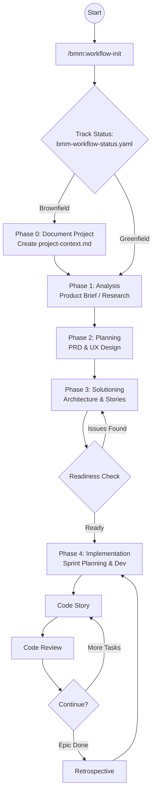

[ **English** ](BMAD-Workflow-Deep-Dive.md) | [ **Tiếng Việt** ](BMAD-Workflow-Deep-Dive.vi.md)

# BMad Method Deep Dive

> This document synthesizes the entire operational process, development phases, and documentation system within the BMAD v6.0.0 software production framework.

---

## 1. Operational Philosophy: Iron Discipline for AI

BMAD does not function like a typical chatbot. It forces AI to adhere to a strict technical process through:
- **Micro-file Architecture**: Splitting instructions into small steps (step files). AI is allowed to read only 1 step at a time to avoid "lost in the middle" phenomenon.
- **State Tracking**: Continually tracking project status via the `bmm-workflow-status.yaml` file.
- **Adversarial Review**: An "adversarial critique" mechanism – one Agent acts as Quality Control finding faults in another Agent's plan before allowing coding.

---

## 2. Project Classification: Greenfield vs. Brownfield

BMAD differentiates processes extremely clearly based on the current state of the source code.

### A. Greenfield (New Project from Scratch)
**Focus**: Defining vision and setting standards.
- Starts from zero.
- Prioritizes creative processes: Brainstorming -> Product Brief -> PRD.
- Establishes a "safe zone" for AI through completely new architectural documentation.

### B. Brownfield (Existing Project)
**Focus**: Understand & Adapt.
- **Phase 0 (Mandatory)**: Run command `/bmm:document-project`.
- Create `project-context.md`: Scan legacy code to teach AI about coding patterns, libraries in use, and technical debt.
- Every new plan must prove compatibility with the current system.

---

## 3. The User Journey

The entire process from concept to running product spans 5 core phases:

### Phase 0: Documentation (Brownfield Only)
- **Activity**: Scan codebase.
- **Artifact**: `project-context.md`.

### Phase 1: Analysis (Optional)
- **Activity**: Market research, competitor analysis, and brainstorming.
- **Artifacts**: `product-brief.md`, `research.md`.

### Phase 2: Planning (Mandatory)
- **Activity**: Define product requirements and UX design.
- **Artifacts**: `prd.md`, `ux-design.md`.

### Phase 3: Solutioning (Mandatory)
- **Activity**: Technical architecture design and work breakdown.
- **Artifacts**: `architecture.md`, `epics-and-stories.md`.
- **Gatekeeper**: Run `/bmm:check-implementation-readiness` to transition to coding phase.

### Phase 4: Implementation
- **Activity**: Sprint Planning, Coding, Code Review, and Retrospectives.
- **Artifacts**: `sprint-status.yaml`, `story-*.md`.

---

## 4. Workflow Diagram

---

## 5. Artifact System (Output Documents)

| Document Name | Phase | Role for AI |
| :--- | :--- | :--- |
| `bmm-workflow-status.yaml` | All | GPS Map: Helps AI know where it is and what to do next. |
| `project-context.md` | Phase 0/1 | Code of Conduct: Ensures AI doesn't write "alien" code compared to the project. |
| `prd.md` | Phase 2 | Product Compass: Specifies business goals and required features. |
| `architecture.md` | Phase 3 | Technical Blueprint: Decides data flow and directory structure. |
| `epics-and-stories.md` | Phase 3 | Execution Plan: Breaks work into bite-sized chunks for AI. |
| `sprint-status.yaml` | Phase 4 | Dashboard: Tracks Story completion progress. |

---

## 6. Different Execution Tracks

Besides the standard process, BMAD has variants:
1. **Quick Flow**: Skips verbose steps, used for quick fixes or micro-projects. Goes straight from **Tech-spec** -> **Code**.
2. **Enterprise Flow**: Adds layers of security, testing (Testing Architecture), and operations (DevOps).

---

## 7. Lessons for Astragentic

From BMAD's process, Astragentic can inherit:
1. **Gateway Mechanism**: Always have a "Check Readiness" step before spending tokens on loose coding.
2. **Context-First**: Always load `project-context.md` before executing any source code modification commands.
3. **Yaml-driven development**: Use YAML to manage state, helping both humans and machines read easily.
