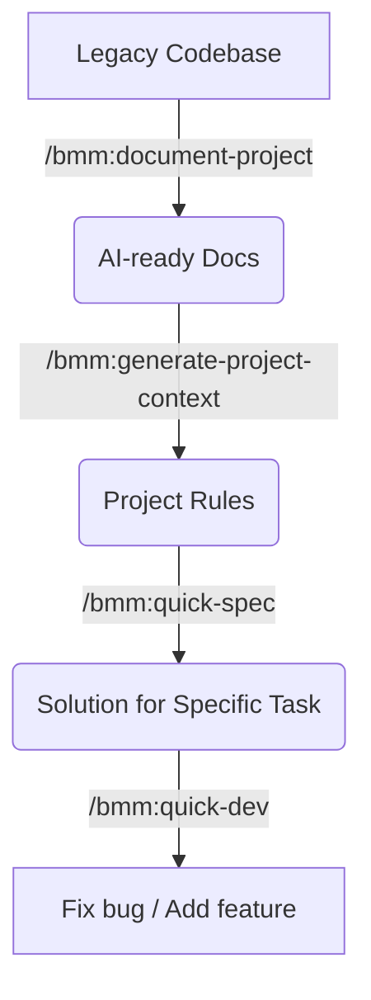

# Case Study 2: Mastering Legacy Project (Brownfield)

**Scenario**: You just inherited a "huge" codebase (tens of thousands of LOC) with zero documentation. You need to fix a bug or add a feature without breaking old logic.

## Step 1: Scan and Index (Project Discovery)
Don't read code with your eyes, let AI do it systematically.

**Command**: `/bmm:document-project`
- **Action**: Agent will scan entire directory, identify used libraries, patterns (MVC, Clean Architecture...), and draw overview diagram.
- **Result**: An `.astraler-docs/` directory containing full knowledge of current codebase.

## Step 2: Set "Game Rules" (Project Context)
To prevent future Agents from coding wrong patterns, you need to finalize rules.

**Command**: `/bmm:generate-project-context`
- **Action**: AI summarizes most important things from Step 1 into a single file.
- **Result**: `project-context.md` file in root folder.
- *Advanced Parameter*: If you want to create multiple different contexts, you can change `context_file` variable.
- *Tip*: Add personal rules here (Ex: "All variables must be in Vietnamese" - if you want).

## Step 3: Quick Analysis Before Fix (Quick Spec)
Assume you need to fix Login error.

**Command**: `/bmm:quick-spec`
- **Parameter (Optional)**: You can specify `input_files` if you know exactly which file is buggy.
- **Action**: You say "Analyze why login is not working". AI looks for files related to `auth`, `login`, `session`.
- **Result**: A concise Tech-spec listing files to modify.

## Step 4: Safe Fix (Quick Dev)
**Command**: `/bmm:quick-dev`
- **Action**: AI performs modifications based on Spec in step 3.
- **Tip**: Always tell AI to write Unit Test for the modified code to ensure no regression bugs.

---

### Summary Diagram of Brownfield Flow:

---
**Next Lesson:** [Case Study 3: Solving Business & Creative Problems](./case-study-3-creative.md)
