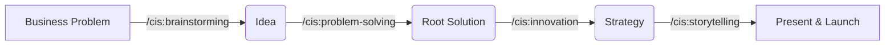

# Case Study 3: Solving Business & Creative Problems

**Scenario**: You are building an app but realize users don't return after first use (Low Retention). You don't know if the fault is in code or business idea.

## Step 1: Start Brainstorming Session
Need fresh and crazy perspectives.

**Command**: `/cis:brainstorming`
- **Agent**: Carson (Brainstorming Coach) will lead.
- **Action**: Carson applies techniques like "Reverse Brainstorming" (How to make users hate the app more?) to find potential weaknesses.

## Step 2: Trace Root Cause (Problem Solving)
After having ideas, need to systematize.

**Command**: `/cis:problem-solving`
- **Agent**: Dr. Quinn (Creative Problem Solver).
- **Action**: Apply "5 Whys" or "First Principles Thinking" techniques.
- **Result**: Identify core cause (Example: UX too complex, not lack of features).

## Step 3: Find Breakthrough Strategy (Innovation Strategy)
How to differentiate from market?

**Command**: `/cis:innovation-strategy`
- **Agent**: Victor (Innovation Strategist).
- **Action**: "Blue Ocean Strategy" analysis. Victor will suggest cutting redundant things and focusing on a single core value.

## Step 4: Tell New Story (Storytelling)
Now you need to persuade boss or investors about this change.

**Command**: `/cis:storytelling`
- **Agent**: Sophia (Storyteller).
- **Parameter**: `input_text` (Raw content needed to edit), `audience` (Target listener: Investor, User, Internal Team).
- **Action**: Help you build Pitch Deck following "Hero's Journey" structure.

---

### Importance of CIS:
CIS command group helps Technical Lead not just be a "code monkey" but become a true **Solution Architect**, who solves problems at a level higher than computer logic.

