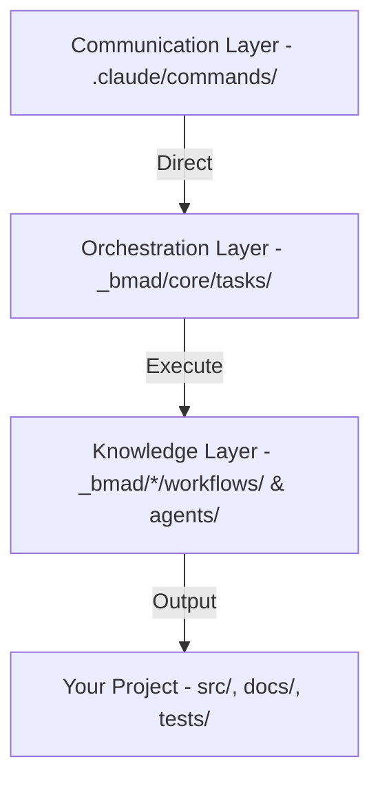

# Module 1: BMAD Structure and Mindset

## 1. The "Workflow-First" Philosophy
In traditional programming (spontaneous Vibe Coding), you chat with AI and hope it does right. In **BMAD**, we don't chat, we **operate workflows**.

### The Difference:
| Feature | Spontaneous Vibe Coding | BMAD Method |
| :--- | :--- | :--- |
| **Center** | Chat Prompt | Workflow (Process) |
| **Context** | Relies on chat history | Relies on `project-context.md` and `manifest` |
| **Staffing** | 1 Multipurpose AI | System of Specialized Agents (Analyst, Dev, Architect...) |
| **Result** | Running code | Code + Spec + Architecture + Test (Full Lifecycle) |

---

## 2. BMAD Layered Architecture

BMAD operates based on 3 main layers:

1.  **Entry Points (Slash Commands)**: Thin `.md` files containing `LOAD` commands. Example: `/bmm:prd`.
2.  **Execution Engine (`workflow.xml`)**: "Engine" reads passed steps and forces Claude to execute in correct order, no skipping.
3.  **Module Domains**:
    -   **BMM (Business)**: Software process from Brief -> PRD -> Code -> Test.
    -   **CIS (Creative)**: Design thinking, problem-solving.
    -   **BMB (Builder)**: Build additional Agents/Workflows for yourself.

---

## 3. Specialized Agent System (Personas)

Instead of using a generic "Claude", BMAD summons "Personas" with deep knowledge:

-   **Mary (Analyst)**: Specializes in hunting requirements, analyzing competitors.
-   **Winston (Architect)**: Specializes in system design, scalability, and tech stack.
-   **Amelia (Dev)**: Only codes based on existing Spec, does not arbitrarily modify logic.
-   **John (PM)**: Keeps the project on track, prioritizes user value.
-   **Murat (TEA - Test Architect)**: Ensures quality, writes tests before code.

---

## 4. "Single Source of Truth" (SSOT) Protocol

BMAD highly values the `project-context.md` file.
- Every Agent starting work must find and read this file.
- This is where project "Rules" live: What tech stack? Naming conventions? Git process?
- Without this file, AI works instinctively. BMAD helps you create this via command `/bmm:generate-project-context`.

---
**Next Lesson:** [Module 2: Command Dictionary and Execution Flow](./module-2-commands.md)
