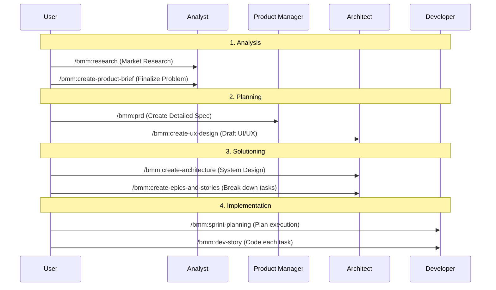

# Module 2: Command Dictionary and Execution Flow

BMAD provides over 40 commands, but you don't need to memorize them all. Let's categorize them by project phase.

## 1. The Roadmap (The Full Lifecycle Flow)

Here is the standard command flow to develop a project from start to finish:

---

## 2. "Rescue" Group (Quick Flows)

When you don't want to follow the lengthy process, use this group:

-   **/bmm:quick-spec**: You chat with AI, it auto-scans code and creates a quick "Tech-spec" to code immediately.
-   **/bmm:quick-dev**: Fast code based on spec or direct instruction.
-   **/bmm:document-project**: (Very cool) Scans an existing project and auto-writes instruction docs for AI.

---

## 3. "Quality Control" Group (Quality Gates)

-   **/bmm:check-implementation-readiness**: Check if PRD and Architecture files are good enough to code. Avoids AI coding halfway then failing due to missing logic.
-   **/bmm:code-review**: Acts as a "strict" Senior Dev, scrutinizing every line of code and catching security/performance errors.

---

## 4. "Creative" Group (CIS - Creative Innovation)

Use when you are "stuck" for ideas or want to innovate:

-   **/cis:brainstorming**: Open an extremely energetic creative discussion session.
-   **/cis:problem-solving**: Apply methods like Root Cause Analysis to find the root of the problem.
-   **/cis:storytelling**: Helps you write content, pitch decks, or instruction docs more engagingly.

---

## 6. Advanced Parameters Reference (Technical Parameters)

Most BMAD commands work on an **Interactive (Q&A)** mechanism, meaning Agent will ask you what it needs. However, for pro usage, you can understand "hidden parameters" the system uses:

### Project & Doc Commands
| Command | Variable (Input Variable) | Explanation |
| :--- | :--- | :--- |
| `/bmm:document-project` | `target_dir` | Directory to scan (Default: `.`) |
| `/bmm:generate-project-context` | `context_file` | Output filename (Default: `project-context.md`) |

### Code & Review Commands
| Command | Variable (Input Variable) | Explanation |
| :--- | :--- | :--- |
| `/bmm:dev-story` | `story_file` | Specific story file path (Ex: `stories/story-1.md`) |
| `/bmm:code-review` | `story_path` | Story file containing Acceptance Criteria to check against |
| `/bmm:testarch-framework` | `framework_preference` | `playwright` or `cypress` (Default: `auto`) |

---

## 7. Execution Tip: #yolo Mode vs Normal

Every BMAD workflow asks for your confirmation at each critical step.
- **Normal mode**: You control every step (Recommended for Architect/PM).
- **#yolo mode**: You trust AI and let it do everything from start to finish (Recommended for small tasks, boilerplate code).

---
**Practical Exercise:** [Case Study 1: Developing New Feature](./case-study-1-greenfield.md)
