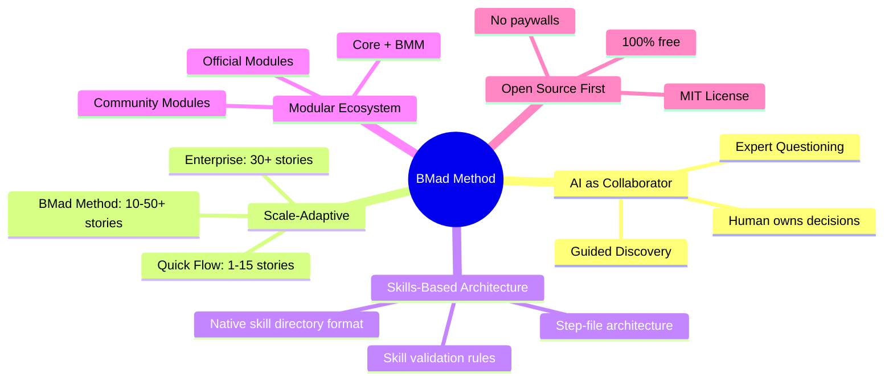
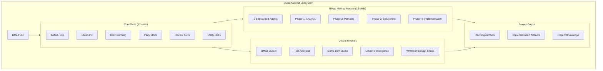
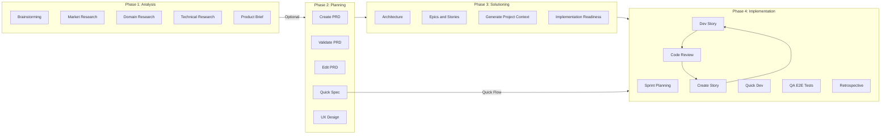

# BMad Method — Overview

## Repo là gì?

**BMad Method** (viết tắt: **B**uild **M**ore **A**rchitect **D**reams) là một **AI-driven agile development framework** thuộc hệ sinh thái BMad Method Module Ecosystem. Framework cung cấp hệ thống **multi-agent chuyên biệt**, **skills-based architecture**, và **intelligent planning** tự động điều chỉnh độ sâu theo complexity của dự án — từ bug fix nhỏ đến enterprise system.

| Thông tin | Chi tiết |
|---|---|
| **Tên** | BMad Method (BMM) |
| **Version hiện tại** | 6.2.0 |
| **Ngôn ngữ chính** | JavaScript (Node.js ≥ 20) |
| **License** | MIT |
| **Stars** | ~39,500+ ⭐ |
| **Forks** | ~4,800+ |
| **Author** | Brian (BMad) Madison |
| **Org** | bmad-code-org |
| **100% miễn phí** | Không paywall, không gated content |

---

## Vấn đề giải quyết

| Vấn đề | Mô tả | Cách BMad giải quyết |
|---|---|---|
| **AI "làm thay" thay vì "cộng tác"** | Các AI tool truyền thống tự suy nghĩ và tạo output trung bình | BMad agents đóng vai expert collaborators, hướng dẫn qua structured process |
| **Thiếu cấu trúc phát triển** | Dev vibe-coding không có quy trình → technical debt | 4-phase lifecycle: Analysis → Planning → Solutioning → Implementation |
| **Không scale theo complexity** | Cùng workflow cho bug fix và enterprise system | Scale-Domain-Adaptive: tự động điều chỉnh planning depth |
| **Context bị mất giữa các bước** | AI quên context khi chuyển phase | Planning artifacts (PRD, Architecture, Epics) làm "bộ nhớ" persistent |
| **Thiếu specialist cho từng giai đoạn** | Một AI generic làm tất cả | 9 specialized agents với expertise riêng biệt |
| **Onboarding phức tạp** | Không biết bắt đầu từ đâu | `bmad-help` — intelligent guide phân tích project state và recommend next step |
| **Cross-platform fragmentation** | Mỗi IDE khác nhau → khó maintain workflows | Skills-based architecture: native skill directory format, 20+ platforms supported |

---

## Triết lý thiết kế

**Giá trị cốt lõi:**

1. **AI as Expert Collaborator** — AI không làm thay, mà hướng dẫn user đưa ra quyết định tốt nhất
2. **Scale-Domain-Adaptive Intelligence** — Tự điều chỉnh planning depth theo project complexity
3. **Skills-Based Architecture** — Mọi thứ (agents, workflows, tasks) đều là native skill directories với `SKILL.md` entrypoint
4. **Specialized Agent System** — Mỗi agent có expertise riêng, persona riêng
5. **100% Open Source** — Không paywall, không gated content, không gated Discord

---

## Ai nên dùng?

| Đối tượng | Mô tả | Track phù hợp |
|---|---|---|
| **Solo developers** | Xây dựng side projects, MVPs | Quick Flow |
| **Startup teams** | Phát triển product từ ý tưởng | BMad Method |
| **Enterprise teams** | Hệ thống compliance, multi-tenant | Enterprise |
| **AI-first developers** | Đã quen Claude Code, Cursor, Copilot | Tất cả |
| **Module builders** | Muốn tạo agents/workflows riêng | BMad Builder (BMB) |
| **Game developers** | Unity, Unreal, Godot workflows | Game Dev Studio |

**Yêu cầu tối thiểu:**
- Node.js 20+
- AI coding assistant (Claude Code, Cursor, Codex CLI, Gemini CLI, hoặc 20+ platforms khác)
- Kiến thức cơ bản về software development

---

## Kiến trúc tổng quan

### Bảng Components chính

| Component | Vai trò | Vị trí |
|---|---|---|
| **BMad CLI** | Installer tương tác/non-interactive, quản lý modules | `tools/cli/bmad-cli.js` |
| **Core Skills** | 12 skills: help, brainstorming, party mode, review, utility | `src/core-skills/` |
| **BMM Skills** | 32 skills chia theo 4 phases + 9 agents | `src/bmm-skills/` |
| **Skills System** | Native skill directory format (`SKILL.md` entrypoint) | `.claude/skills/`, `.cursor/skills/` |
| **Skill Validator** | Inference-based validation cho skills (naming, paths, invocation) | `tools/skill-validator.md` |
| **Planning Artifacts** | PRD, Architecture, UX Design, Epics | `_bmad-output/planning-artifacts/` |
| **Implementation Artifacts** | Sprint status, stories, reviews | `_bmad-output/implementation-artifacts/` |
| **Project Context** | Technical preferences & implementation rules | `_bmad-output/project-context.md` |

---

## Vòng đời / Workflow chính

### 3 Planning Tracks

| Track | Best For | Documents | Phases |
|---|---|---|---|
| **Quick Flow** | Bug fixes, small features (1-15 stories) | Tech-spec only (via Quick Dev unified) | 2 → 4 |
| **BMad Method** | Products, platforms (10-50+ stories) | PRD + Architecture + UX | 1 → 2 → 3 → 4 |
| **Enterprise** | Compliance, multi-tenant (30+ stories) | PRD + Architecture + Security + DevOps | 1 → 2 → 3 → 4 |

---

## Tính năng nổi bật

### 1. Hệ thống Agent chuyên biệt

| Agent | Persona | Skill ID | Vai trò chính |
|---|---|---|---|
| **Analyst** | Mary | `bmad-agent-analyst` | Brainstorm, Research (Market/Domain/Technical), Product Brief |
| **Product Manager** | John | `bmad-agent-pm` | PRD (Create/Validate/Edit), Epics & Stories |
| **Architect** | Winston | `bmad-agent-architect` | Architecture, Implementation Readiness |
| **Scrum Master** | Bob | `bmad-agent-sm` | Sprint Planning, Stories, Sprint Status, Retrospective |
| **Developer** | Amelia | `bmad-agent-dev` | Dev Story, Code Review |
| **QA Engineer** | Quinn | `bmad-agent-qa` | E2E Test automation |
| **Quick Flow Solo** | Barry | `bmad-agent-quick-flow-solo-dev` | Quick Dev (unified workflow), Code Review |
| **UX Designer** | Sally | `bmad-agent-ux-designer` | UX Design |
| **Technical Writer** | Paige | `bmad-agent-tech-writer` | Write/Validate/Explain docs, Mermaid diagrams |

### 2. Skills-Based Architecture (V6.1+)

Từ V6.1, toàn bộ workflows, agents, và tasks đã chuyển sang **native skill directory format**:

- Mỗi skill là 1 directory chứa `SKILL.md` (entrypoint) + `workflow.md` + step files
- **Step-file architecture**: workflows phức tạp được chia thành micro-files, load just-in-time
- **Skill Validator**: bộ rules inference-based kiểm tra naming, paths, variables, invocation syntax
- **Progressive disclosure**: L1 (metadata ~100 tokens) → L2 (instructions <5K tokens) → L3 (resources unlimited)
- Tuân thủ [Agent Skills open standard](https://agentskills.io/specification)

### 3. Party Mode

Gọi toàn bộ team agents vào cùng một hội thoại. BMad Master orchestrates, agents phản hồi theo persona, đồng ý/phản đối và xây dựng trên ý tưởng lẫn nhau. Ideal cho big decisions, brainstorming, post-mortems.

### 4. BMad-Help — Intelligent Guide

`bmad-help` phân tích project state → recommend next step phù hợp. Hiểu natural language, auto-invokes sau mỗi workflow.

### 5. Quick Dev — Unified Quick Flow (NEW v6.1+)

Quick Dev mới merge toàn bộ Quick Flow thành **1 unified workflow** với 5 bước: Clarify & Route → Plan → Implement → Review → Present. Hỗ trợ cả guided mode và autonomous mode. Auto-detect scope:
- Spec target **900–1600 tokens** optimal range
- Auto-split nếu multi-goal
- User override cho cả hai limits

### 6. Code Review — Sharded Architecture (NEW v6.2)

Code Review được rewrite hoàn toàn với **parallel review layers**:
- **Blind Hunter** — adversarial review
- **Edge Case Hunter** — trace branching paths và boundary conditions
- **Acceptance Auditor** — verify acceptance criteria
- Kết quả triage thành actionable categories

### 7. Product Brief Preview (NEW v6.2)

Skill mới `/bmad-product-brief-preview` hỗ trợ 3 modes:
- **Guided**: conversational discovery qua 5 stages
- **Yolo**: draft trước, refine sau
- **Autonomous**: headless execution với subagents
- Fan-out subagents cho artifact analysis và web research

### 8. Research Skills (Expanded v6.1+)

Phase 1 Analysis giờ có **3 research skills riêng biệt**:
- `bmad-market-research` — market analysis, competitive landscape
- `bmad-domain-research` — industry deep dive, terminology
- `bmad-technical-research` — technical feasibility, architecture options

### 9. Module Ecosystem

| Module | Code | Mô tả |
|---|---|---|
| BMad Method (core) | `bmm` | 32 skills, 9 agents |
| BMad Builder | `bmb` | Tạo custom agents, workflows, modules |
| Test Architect | `tea` | Enterprise test strategy & automation |
| Game Dev Studio | `gds` | Game development (Unity, Unreal, Godot) |
| Creative Intelligence | `cis` | Innovation, brainstorming, design thinking |
| Whiteport Design Studio | `wds` | Design workflows (NEW v6.1) |

### 10. Cross-Platform Support (20+ Platforms)

| Category | Platforms |
|---|---|
| **Recommended** | Claude Code, Cursor |
| **CLI** | Codex, Gemini CLI, Auggie |
| **IDEs** | Cline, Roo Code, Windsurf, Trae, Kiro, CodeBuddy, QwenCoder, iFlow, KiloCoder, Crush, Ona |
| **Others** | OpenCode, Rovo Dev, GitHub Copilot, Google Antigravity |

---

## So sánh với Alternatives

| Tính năng | BMad Method | Cursor Rules | Claude Projects | Copilot | GSD |
|---|---|---|---|---|---|
| Multi-agent system | ✅ 9 agents | ❌ | ❌ | ❌ | ✅ 11 agents |
| Scale-adaptive planning | ✅ 3 tracks | ❌ | ❌ | ❌ | ❌ |
| Full project lifecycle | ✅ 4 phases | ❌ | Partial | ❌ | ✅ 6 phases |
| Module ecosystem | ✅ 6 modules | ❌ | ❌ | Extensions | ❌ |
| Party Mode | ✅ | ❌ | ❌ | ❌ | ❌ |
| Intelligent guide | ✅ bmad-help | ❌ | ❌ | ❌ | ❌ |
| Cross-IDE support | ✅ 20+ platforms | Cursor only | Claude only | VS Code | Claude Code |
| Skills-based architecture | ✅ Native SKILL.md | ❌ | ❌ | ❌ | ❌ |
| 100% free & open | ✅ | Freemium | Paid | Paid | ✅ |

---

## Điểm mới phiên bản 6.x

| Version | Highlights |
|---|---|
| **6.2.0** | Product Brief Preview skill, Code Review rewrite (sharded step-file), Skill Validator inference-based, tất cả skills dùng native skill directory format |
| **6.1.0** | 💥 **Breaking:** Chuyển toàn bộ sang skills-based architecture (loại bỏ YAML/XML workflow engine). WDS module, `@next` channel, Quick Dev unified workflow, Edge Case Hunter, Pi platform, Chinese docs, 91% npm tarball reduction |
| **6.0.4** | Edge Case Hunter review task, fix brainstorming overwrite bug |
| **6.0.3** | Root Cause Analysis skill, fix installer ancestor detection, rebrand "Build More Architect Dreams" |
| **6.0.2** | CodeBuddy platform, Codex migration to `.agents/skills`, LLM audit prompt, nhiều bug fixes |
| **6.0.0** | 🎉 V6 Stable Release! PRD workflow enhancements, `bmad uninstall` command, GitHub Copilot installer |

**V6 roadmap đang triển khai:**
- Cross Platform Agent Team & Sub Agent inclusion
- Skill Marketplace
- Dev Loop Automation
- Phase 1-3 Optimization (sub-agents)
- Enterprise Ready (SSO, audit logs)

---

## Xem thêm

- [1. Architecture and Logic](./1.%20Architecture%20and%20Logic.md) — Kiến trúc chi tiết, data flow, modules, configuration
- [2. Playbook](./2.%20Playbook.md) — Cài đặt, Day 1 workflow, cheat sheet, troubleshooting
