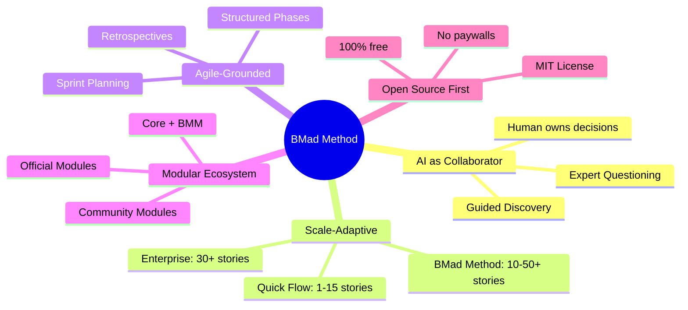
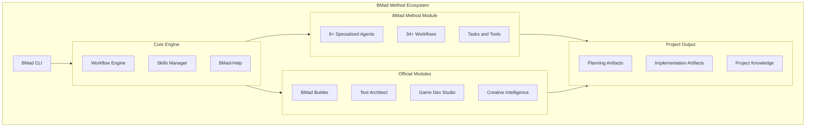
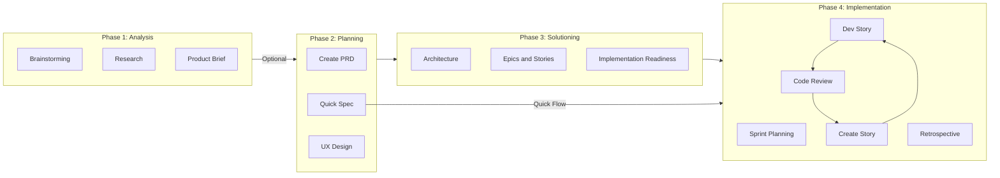

# BMad Method — Overview

## Repo là gì?

**BMad Method** (viết tắt: **B**uild **M**ore **A**rchitect **D**reams) là một **AI-driven agile development framework** thuộc hệ sinh thái BMad Method Module Ecosystem. Framework cung cấp hệ thống **multi-agent chuyên biệt**, **guided workflows có cấu trúc**, và **intelligent planning** tự động điều chỉnh độ sâu theo complexity của dự án — từ bug fix nhỏ đến enterprise system.

| Thông tin | Chi tiết |
|---|---|
| **Tên** | BMad Method (BMM) |
| **Version hiện tại** | 6.0.4 |
| **Ngôn ngữ chính** | JavaScript (Node.js ≥ 20) |
| **License** | MIT |
| **Stars** | ~39,500+ ⭐ |
| **Forks** | ~4,800+ |
| **Author** | Brian (BMad) Madison |
| **Org** | bmad-code-org |
| **100% miễn phí** | Không paywall, không gated content |

---

## Vấn đề giải quyết

| Vấn đề | Mô tả | Cách BMad giải quyết |
|---|---|---|
| **AI "làm thay" thay vì "cộng tác"** | Các AI tool truyền thống tự suy nghĩ và tạo output trung bình | BMad agents đóng vai expert collaborators, hướng dẫn qua structured process |
| **Thiếu cấu trúc phát triển** | Dev vibe-coding không có quy trình → technical debt | 4-phase lifecycle: Analysis → Planning → Solutioning → Implementation |
| **Không scale theo complexity** | Cùng workflow cho bug fix và enterprise system | Scale-Domain-Adaptive: tự động điều chỉnh planning depth |
| **Context bị mất giữa các bước** | AI quên context khi chuyển phase | Planning artifacts (PRD, Architecture, Epics) làm "bộ nhớ" persistent |
| **Thiếu specialist cho từng giai đoạn** | Một AI generic làm tất cả | 9+ specialized agents với expertise riêng biệt |
| **Onboarding phức tạp** | Không biết bắt đầu từ đâu | `bmad-help` — intelligent guide phân tích project state và recommend next step |

---

## Triết lý thiết kế

**Giá trị cốt lõi:**

1. **AI as Expert Collaborator** — AI không làm thay, mà hướng dẫn user đưa ra quyết định tốt nhất
2. **Scale-Domain-Adaptive Intelligence** — Tự điều chỉnh planning depth theo project complexity
3. **Structured Agile Workflows** — Grounded trong agile best practices
4. **Specialized Agent System** — Mỗi agent có expertise riêng, persona riêng
5. **100% Open Source** — Không paywall, không gated content, không gated Discord

---

## Ai nên dùng?

| Đối tượng | Mô tả | Track phù hợp |
|---|---|---|
| **Solo developers** | Xây dựng side projects, MVPs | Quick Flow |
| **Startup teams** | Phát triển product từ ý tưởng | BMad Method |
| **Enterprise teams** | Hệ thống compliance, multi-tenant | Enterprise |
| **AI-first developers** | Đã quen Claude Code, Cursor, Copilot | Tất cả |
| **Module builders** | Muốn tạo agents/workflows riêng | BMad Builder (BMB) |
| **Game developers** | Unity, Unreal, Godot workflows | Game Dev Studio |

**Yêu cầu tối thiểu:**
- Node.js 20+
- AI coding assistant (Claude Code, Cursor, Codex CLI, hoặc tương tự)
- Kiến thức cơ bản về software development

---

## Kiến trúc tổng quan

### Bảng Components chính

| Component | Vai trò | Vị trí |
|---|---|---|
| **BMad CLI** | Installer tương tác/non-interactive, quản lý modules | `tools/cli/bmad-cli.js` |
| **Core Engine** | Workflow engine, skills manager, agent loading | `src/core/` |
| **BMM Module** | Agile suite: agents, workflows, teams, data | `src/bmm/` |
| **Skills System** | Generated prompts cho mỗi IDE (`SKILL.md`) | `.claude/skills/`, `.cursor/skills/` |
| **Workflow Engine** | XML-based multi-step workflow executor | `workflow.xml` |
| **Planning Artifacts** | PRD, Architecture, UX Design, Epics | `_bmad-output/planning-artifacts/` |
| **Implementation Artifacts** | Sprint status, stories, reviews | `_bmad-output/implementation-artifacts/` |
| **Project Context** | Technical preferences & implementation rules | `_bmad-output/project-context.md` |

---

## Vòng đời / Workflow chính

### 3 Planning Tracks

| Track | Best For | Documents | Phases |
|---|---|---|---|
| **Quick Flow** | Bug fixes, small features (1-15 stories) | Tech-spec only | 2 → 4 |
| **BMad Method** | Products, platforms (10-50+ stories) | PRD + Architecture + UX | 1 → 2 → 3 → 4 |
| **Enterprise** | Compliance, multi-tenant (30+ stories) | PRD + Architecture + Security + DevOps | 1 → 2 → 3 → 4 |

---

## Tính năng nổi bật

### 1. Hệ thống Agent chuyên biệt

| Agent | Persona | Skill ID | Vai trò chính |
|---|---|---|---|
| **Analyst** | Mary | `bmad-analyst` | Brainstorm, Research, Product Brief |
| **Product Manager** | John | `bmad-pm` | PRD, Validate, Epics & Stories |
| **Architect** | Winston | `bmad-architect` | Architecture, Implementation Readiness |
| **Scrum Master** | Bob | `bmad-sm` | Sprint Planning, Stories, Retrospective |
| **Developer** | Amelia | `bmad-dev` | Dev Story, Code Review |
| **QA Engineer** | Quinn | `bmad-qa` | Test automation |
| **Quick Flow Solo** | Barry | `bmad-master` | Quick Spec, Quick Dev |
| **UX Designer** | Sally | `bmad-ux-designer` | UX Design |
| **Technical Writer** | Paige | `bmad-tech-writer` | Documentation |

### 2. Party Mode

Gọi toàn bộ team agents vào cùng một hội thoại. BMad Master orchestrates, agents phản hồi theo persona, đồng ý/phản đối và xây dựng trên ý tưởng lẫn nhau. Ideal cho big decisions, brainstorming, post-mortems.

### 3. BMad-Help — Intelligent Guide

`/bmad-help` phân tích project state → recommend next step phù hợp. Hiểu natural language, auto-invokes sau mỗi workflow.

### 4. Skills Architecture

Mỗi workflow/agent/task được generate thành `SKILL.md` file → invoke trực tiếp trong IDE. Cross-platform: Claude Code, Cursor, Codex CLI, Windsurf, OpenCode.

### 5. Module Ecosystem

| Module | Code | Mô tả |
|---|---|---|
| BMad Method (core) | `bmm` | 34+ workflows, 9+ agents |
| BMad Builder | `bmb` | Tạo custom agents, workflows, modules |
| Test Architect | `tea` | Enterprise test strategy & automation |
| Game Dev Studio | `gds` | Game development (Unity, Unreal, Godot) |
| Creative Intelligence | `cis` | Innovation, brainstorming, design thinking |

### 6. Quick Flow

2 skills duy nhất: `bmad-quick-spec` (plan) + `bmad-quick-dev` (build). Auto-detect scope creep và escalate lên full BMad Method khi cần.

---

## So sánh với Alternatives

| Tính năng | BMad Method | Cursor Rules | Claude Projects | Copilot | GSD |
|---|---|---|---|---|---|
| Multi-agent system | ✅ 9+ agents | ❌ | ❌ | ❌ | ✅ 11 agents |
| Scale-adaptive planning | ✅ 3 tracks | ❌ | ❌ | ❌ | ❌ |
| Full project lifecycle | ✅ 4 phases | ❌ | Partial | ❌ | ✅ 6 phases |
| Module ecosystem | ✅ 5 modules | ❌ | ❌ | Extensions | ❌ |
| Party Mode | ✅ | ❌ | ❌ | ❌ | ❌ |
| Intelligent guide | ✅ bmad-help | ❌ | ❌ | ❌ | ❌ |
| Cross-IDE support | ✅ 5+ IDEs | Cursor only | Claude only | VS Code | Claude Code |
| 100% free & open | ✅ | Freemium | Paid | Paid | ✅ |

---

## Điểm mới phiên bản 6.0.x

| Version | Highlights |
|---|---|
| **6.0.4** | Edge Case Hunter review task, fix brainstorming overwrite bug |
| **6.0.3** | Root Cause Analysis skill, fix installer ancestor detection, rebrand "Build More Architect Dreams" |
| **6.0.2** | Nhiều bug fixes, refactoring workflow descriptions |
| **6.0.0** | 🎉 V6 Stable Release! PRD workflow enhancements, `bmad uninstall` command, GitHub Copilot installer, semantic versioning fix |

**V6 roadmap đang triển khai:**
- Universal Skills Architecture
- BMad Builder v1
- Project Context System
- Centralized Skills
- Adaptive Skills (per-IDE optimization)
- Dev Loop Automation
- Skill Marketplace

---

## Xem thêm

- [[3-Research/Github/BMAD-METHOD/1. Architecture and Logic]] — Kiến trúc chi tiết, data flow, modules, configuration
- [[3-Research/Github/BMAD-METHOD/2. Playbook]] — Cài đặt, Day 1 workflow, cheat sheet, troubleshooting
