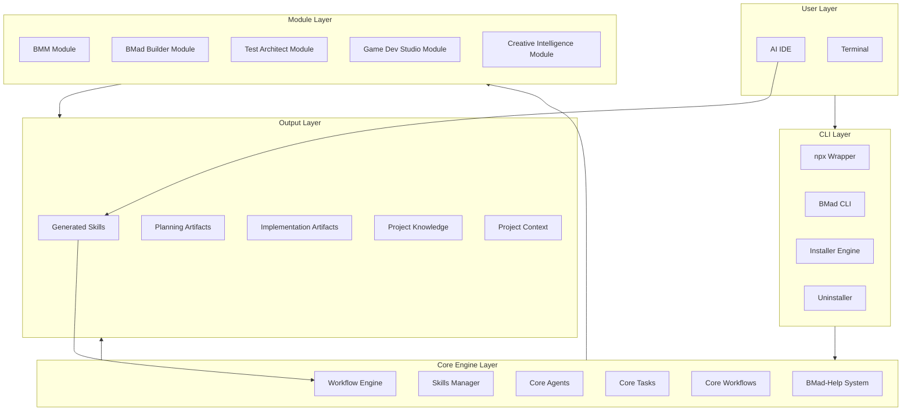
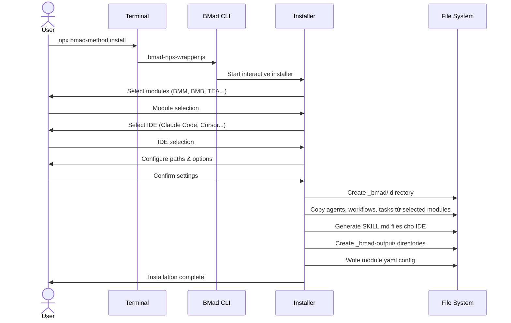
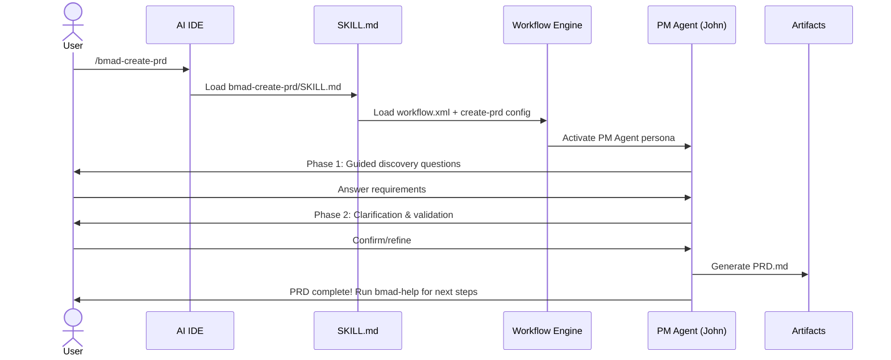
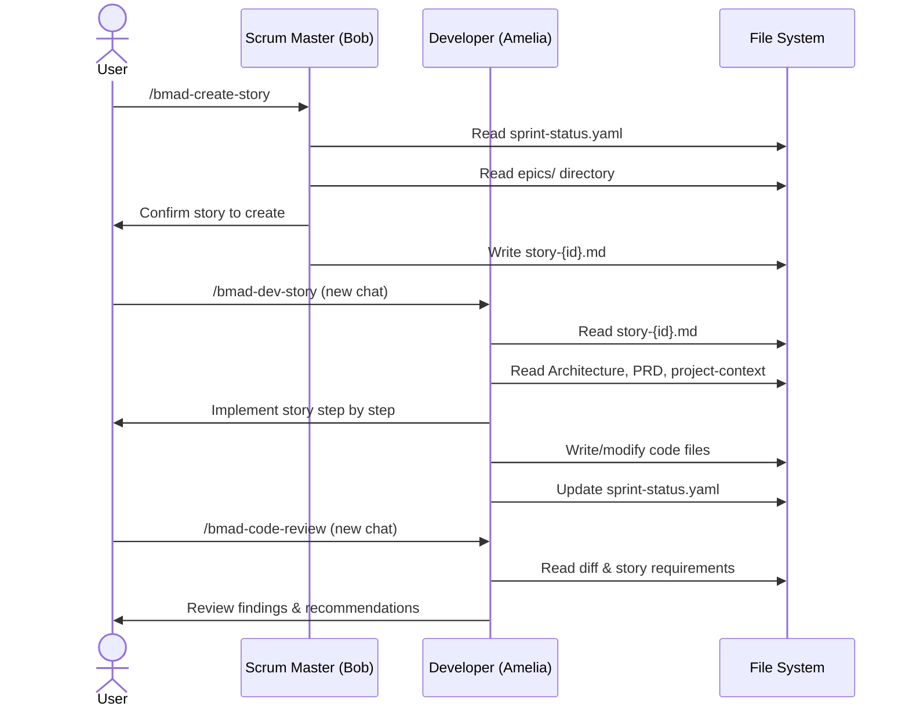
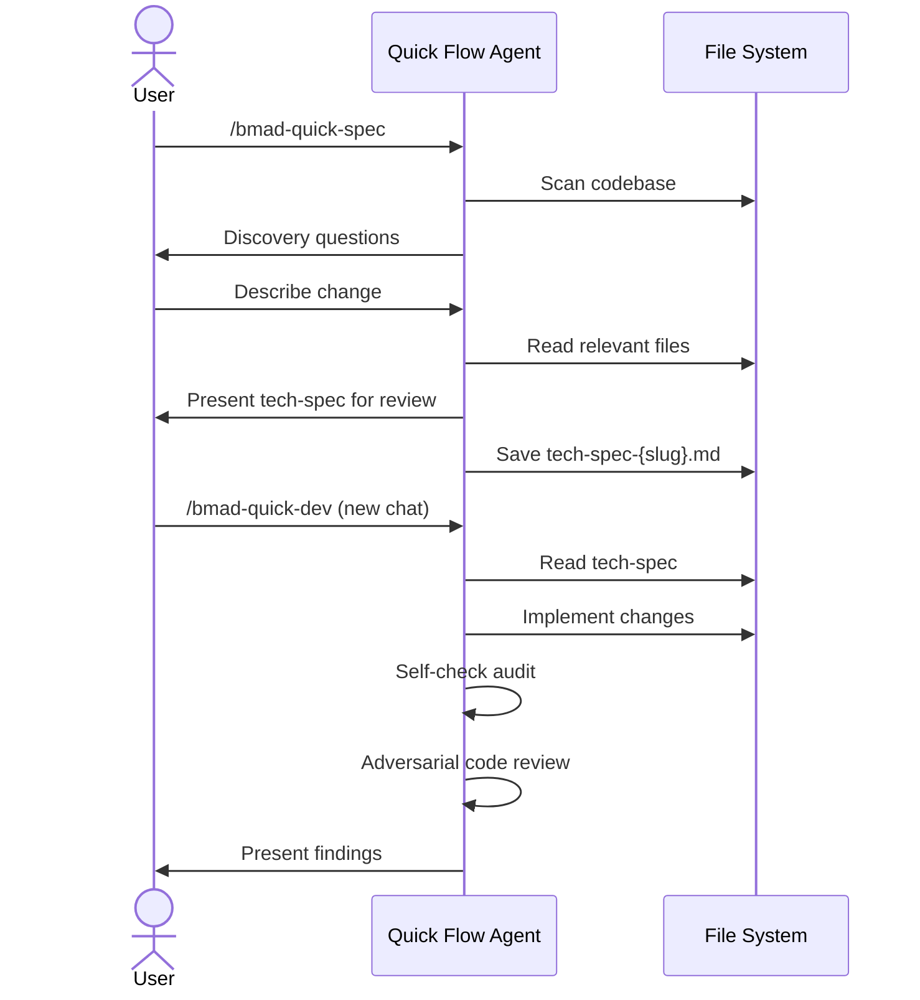
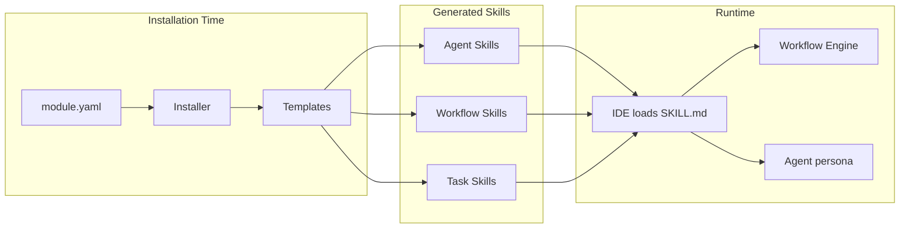
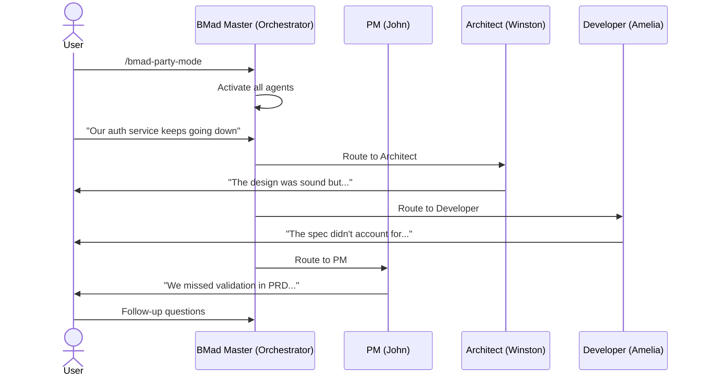
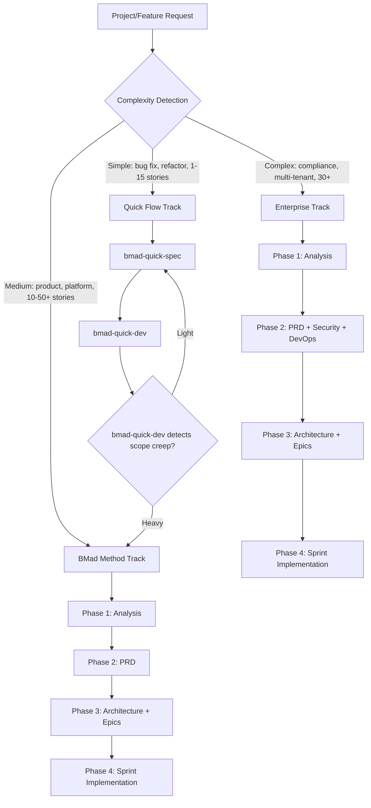

# BMad Method — Architecture and Logic

## Mô hình kiến trúc tổng thể

BMad Method sử dụng kiến trúc **modular layered** với 4 layers chính: CLI Layer, Core Engine, Module Layer, và Output Layer.



### Layer Descriptions

| Layer | Vai trò | Components chính |
|---|---|---|
| **User Layer** | Giao diện tương tác | AI IDE (invoke skills), Terminal (npx commands) |
| **CLI Layer** | Installation, module management | Installer Engine, Uninstaller, npx wrapper |
| **Core Engine** | Runtime: workflow execution, skill loading, help system | Workflow Engine, Skills Manager, Core Agents/Tasks |
| **Module Layer** | Domain-specific agents, workflows, tasks | BMM (agile), BMB (builder), TEA (testing), GDS (game), CIS (creative) |
| **Output Layer** | Generated artifacts & skills | Planning Artifacts, Implementation Artifacts, Skills files |

---

## Data Flow chi tiết

### Flow 1: Installation



### Flow 2: Workflow Execution (VD: Create PRD)



### Flow 3: Build Cycle (Dev Story)



### Flow 4: Quick Flow



---

## Core Modules / Components

### Cấu trúc thư mục Repository

```
BMAD-METHOD/
├── src/
│   ├── core/                    # Core engine
│   │   ├── agents/              # Core agents (bmad-help, etc.)
│   │   ├── tasks/               # Reusable tasks
│   │   ├── workflows/           # Core workflows
│   │   ├── module.yaml          # Core module config
│   │   └── module-help.csv      # Help system data
│   ├── bmm/                     # BMad Method Module (Agile suite)
│   │   ├── agents/              # 9+ specialized agents
│   │   ├── workflows/           # 34+ workflows
│   │   ├── teams/               # Team configurations
│   │   ├── data/                # Reference data
│   │   ├── module.yaml          # BMM module config
│   │   └── module-help.csv      # BMM help data
│   └── utility/                 # Utility functions
├── tools/
│   ├── cli/                     # CLI implementation
│   │   ├── bmad-cli.js          # Main CLI entry point
│   │   └── bundlers/            # Web bundler tools
│   ├── bmad-npx-wrapper.js      # npx entry point
│   ├── build-docs.mjs           # Documentation builder
│   └── validate-*.js            # Validation tools
├── docs/                        # Documentation source (Astro/Starlight)
│   ├── tutorials/               # Step-by-step guides
│   ├── how-to/                  # Task-oriented guides
│   ├── explanation/             # Concept deep-dives
│   ├── reference/               # Technical specs
│   └── roadmap.mdx              # Project roadmap
├── website/                     # Astro website config
├── test/                        # Test suite
└── package.json                 # v6.0.4, Node.js ≥ 20
```

### Module Breakdown

| Module | Path | Contents | Mô tả |
|---|---|---|---|
| **Core** | `src/core/` | agents, tasks, workflows, module.yaml | Engine cơ bản: workflow runner, help system |
| **BMM** | `src/bmm/` | agents, workflows, teams, data | Agile suite: 9+ agents, 34+ workflows |
| **CLI** | `tools/cli/` | bmad-cli.js, bundlers | Installer, uninstaller, module management |
| **Utility** | `src/utility/` | Helper functions | Shared utilities |
| **Docs** | `docs/` | tutorials, how-to, explanation, reference | Astro/Starlight documentation site |
| **Tests** | `test/` | Schema tests, ref tests, install tests | Validation & quality assurance |

---

## Cơ chế hoạt động nội bộ

### Skills System

Skills là cơ chế trung tâm để invoke agents và workflows trong IDE:



| Skill Type | Generated File | Hành vi |
|---|---|---|
| **Agent Launcher** | `SKILL.md` | Load agent persona, activate menu, stay in character |
| **Workflow Skill** | `SKILL.md` | Load workflow engine + workflow config |
| **Task Skill** | `SKILL.md` | Load standalone task file |
| **Tool Skill** | `SKILL.md` | Load standalone tool file |

### Workflow Engine Logic

Workflow Engine xử lý multi-step workflows dựa trên XML configuration:

1. **Load** — IDE đọc `SKILL.md` → load `workflow.xml` + workflow config
2. **Initialize** — Set agent persona, read project context
3. **Step Execution** — Thực hiện từng step theo thứ tự, với guided prompts
4. **Artifact Generation** — Output markdown files vào configured directories
5. **Next Steps** — Auto-trigger `bmad-help` để guide user đến bước tiếp theo

### Agent Menu System

Mỗi agent có menu triggers — short codes cho phép chuyển workflow nhanh:

| Agent | Trigger Codes | Ý nghĩa |
|---|---|---|
| Analyst (Mary) | `BP`, `RS`, `CB`, `DP` | Brainstorm Project, Research, Create Brief, Document Project |
| PM (John) | `CP`, `VP`, `EP`, `CE`, `IR`, `CC` | Create/Validate/Edit PRD, Create Epics, Implementation Readiness, Correct Course |
| Architect (Winston) | `CA`, `IR` | Create Architecture, Implementation Readiness |
| Scrum Master (Bob) | `SP`, `CS`, `ER`, `CC` | Sprint Planning, Create Story, Epic Retrospective, Correct Course |
| Developer (Amelia) | `DS`, `CR` | Dev Story, Code Review |
| QA (Quinn) | `QA` | Automate tests |
| Quick Flow (Barry) | `QS`, `QD`, `CR` | Quick Spec, Quick Dev, Code Review |
| UX Designer (Sally) | `CU` | Create UX Design |
| Tech Writer (Paige) | `DP`, `WD`, `US`, `MG`, `VD`, `EC` | Document Project, Write Doc, Update Standards, Mermaid, Validate, Explain |

### Party Mode Architecture

Party Mode cho phép multiple agents cùng tham gia một conversation:



### Scale-Adaptive Planning

BMad tự detect complexity để recommend planning track:



---

## Configuration / API

### Module Configuration (module.yaml)

BMM module config cho phép customize paths và settings:

| Setting | Options | Default | Mô tả |
|---|---|---|---|
| `project_name` | String | `{directory_name}` | Tên dự án |
| `user_skill_level` | `beginner`, `intermediate`, `expert` | `intermediate` | Ảnh hưởng cách agents giải thích |
| `planning_artifacts` | Path | `{output_folder}/planning-artifacts` | Nơi lưu PRD, Architecture, Epics |
| `implementation_artifacts` | Path | `{output_folder}/implementation-artifacts` | Nơi lưu sprint status, stories |
| `project_knowledge` | Path | `docs` | Nơi lưu project documentation |
| `communication_language` | Language code | (from core) | Ngôn ngữ giao tiếp |
| `document_output_language` | Language code | (from core) | Ngôn ngữ output documents |
| `output_folder` | Path | `_bmad-output` | Root folder cho artifacts |

### CLI Commands

| Command | Mô tả | Ví dụ |
|---|---|---|
| `npx bmad-method install` | Interactive installation | `npx bmad-method install` |
| `npx bmad-method install --directory <path> --modules <list> --tools <ide> --yes` | Non-interactive | `npx bmad-method install --directory ./my-project --modules bmm --tools claude-code --yes` |
| `npx bmad-method uninstall` | Xoá components | `npx bmad-method uninstall` |

### Project Output Structure

```
your-project/
├── _bmad/                           # BMad configuration (installed)
│   ├── agents/                      # Agent persona files
│   ├── workflows/                   # Workflow config files
│   ├── tasks/                       # Reusable task files
│   └── data/                        # Reference data
├── _bmad-output/
│   ├── planning-artifacts/
│   │   ├── PRD.md                   # Product Requirements Document
│   │   ├── architecture.md          # Technical Architecture
│   │   ├── ux-design.md             # UX Design (optional)
│   │   └── epics/                   # Epic and story files
│   ├── implementation-artifacts/
│   │   ├── sprint-status.yaml       # Sprint tracking
│   │   └── stories/                 # Story implementation files
│   └── project-context.md           # Implementation rules (optional)
├── .claude/skills/                  # Generated skills (Claude Code)
│   ├── bmad-help/SKILL.md
│   ├── bmad-create-prd/SKILL.md
│   ├── bmad-dev/SKILL.md
│   └── ...
└── docs/                            # Project knowledge
```

---

## Error Handling / Recovery

| Vấn đề | Nguyên nhân | Giải pháp |
|---|---|---|
| Skills không hiện sau install | IDE chưa enable skills hoặc cần restart | Kiểm tra IDE settings, restart IDE/reload window |
| Skills từ module cũ vẫn còn | Installer không auto-delete old skills | Xoá thủ công skill directories cũ, hoặc xoá toàn bộ skills dir rồi re-install |
| Skills bị thiếu | Module không được chọn khi install | Re-run `npx bmad-method install`, verify module selection |
| Installer bị stale version | npm cache | `npx bmad-method@6.0.4 install` — specify exact version |
| Scope creep trong Quick Flow | Feature lớn hơn dự kiến | `bmad-quick-dev` auto-detect và escalate lên full PRD |
| Context bị mất giữa workflows | Chạy nhiều workflows trong cùng chat | **Luôn dùng fresh chat** cho mỗi workflow |
| Install lồng nhau | Ancestor directory đã có BMAD commands | Installer từ chối install, tránh duplicate autocompletion |
| Brainstorming bị ghi đè | Bug ở versions cũ | Fixed trong v6.0.4 — giờ prompt continue/new session |

---

## Security

BMad Method chủ yếu là **prompt engineering framework**, không chạy server hay xử lý data nhạy cảm. Tuy nhiên:

| Aspect | Chi tiết |
|---|---|
| **Scope** | Chạy local trong IDE, không gửi data ra ngoài (ngoài AI provider) |
| **Dependencies** | 14 npm dependencies (commander, chalk, js-yaml, xml2js...) — tất cả well-known |
| **Vulnerability Policy** | Có `SECURITY.md` với responsible disclosure process |
| **AI Provider Security** | Data gửi tới AI provider (Claude, OpenAI...) theo policy của provider |
| **Project Context** | `project-context.md` có thể chứa info nhạy cảm → nên `.gitignore` |
| **Planning Artifacts** | PRD, Architecture docs có thể chứa business logic → cân nhắc `.gitignore` |

---

## Xem thêm

- [[3-Research/Github/BMAD-METHOD/0. Overview]] — Tổng quan, triết lý, vòng đời, tính năng nổi bật
- [[3-Research/Github/BMAD-METHOD/2. Playbook]] — Cài đặt, Day 1 workflow, cheat sheet, troubleshooting
