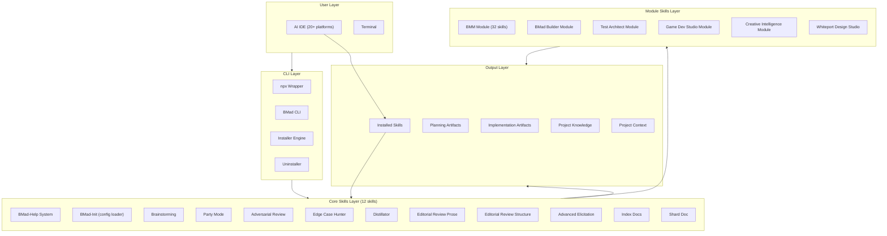
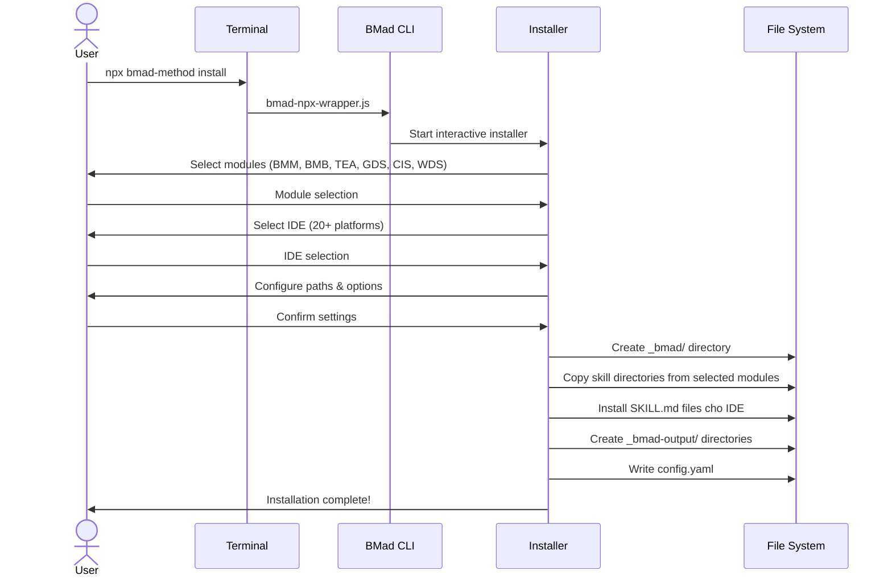
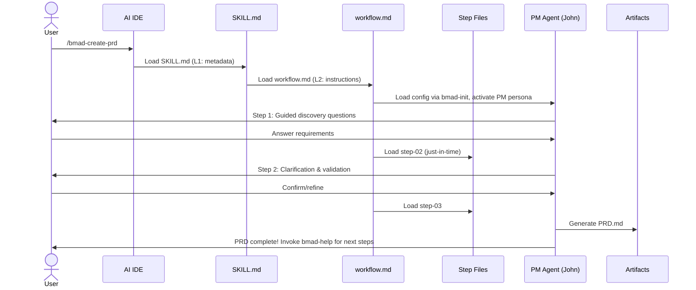
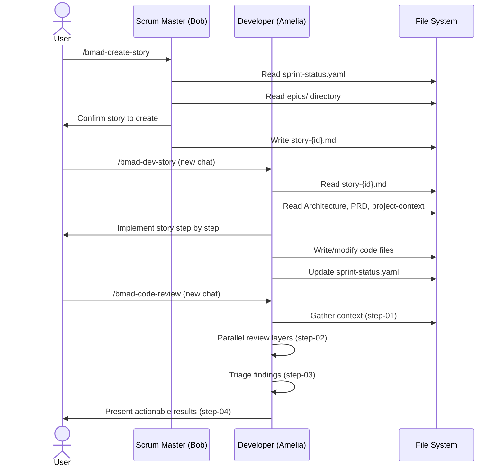
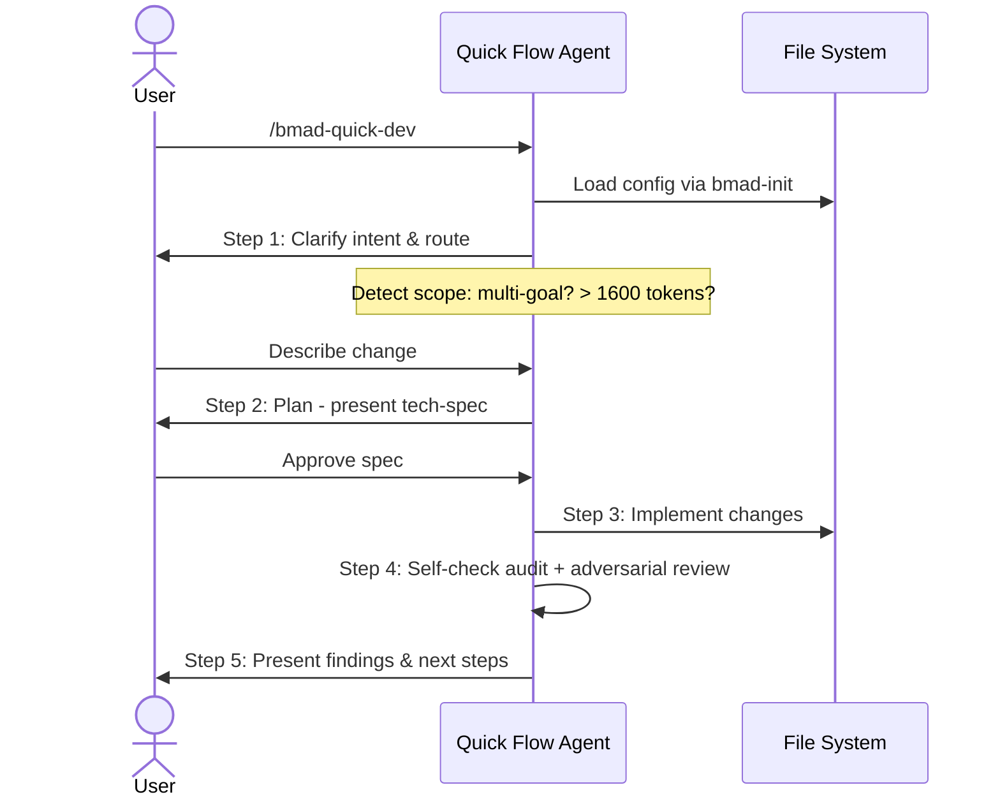
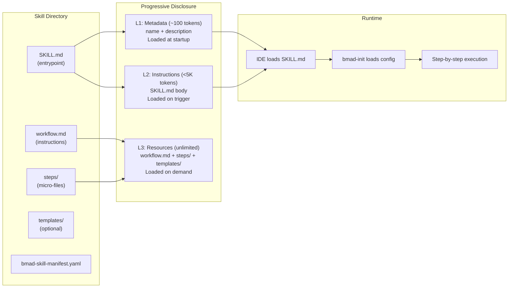
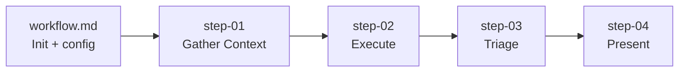
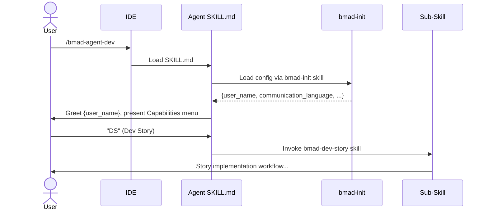
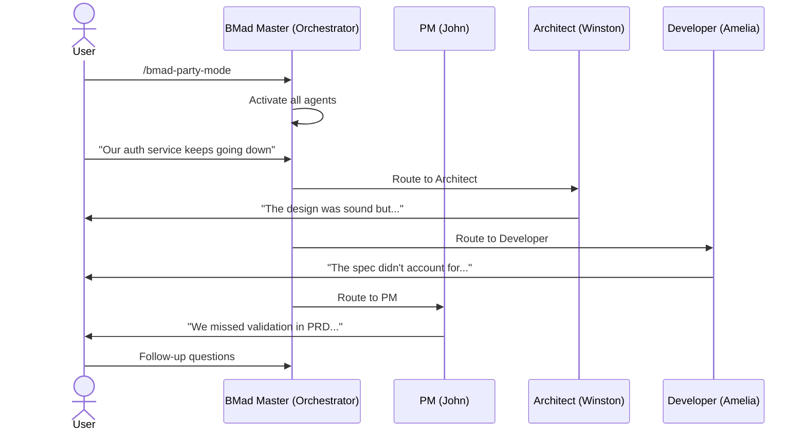
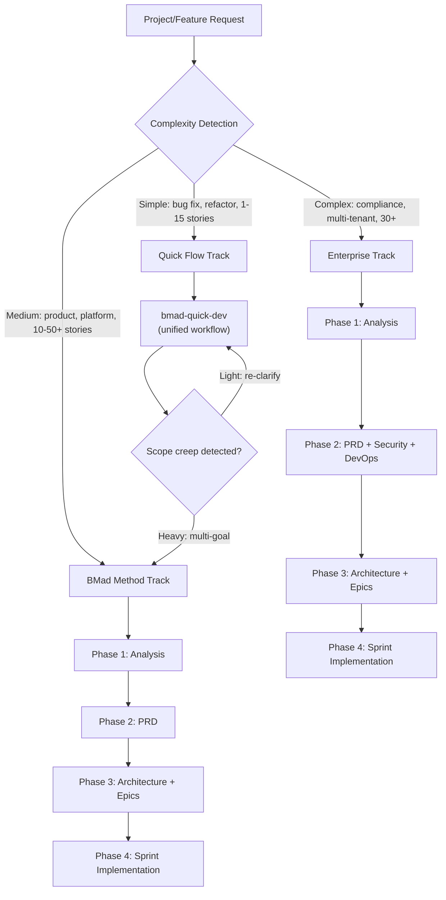

# BMad Method — Architecture and Logic

## Mô hình kiến trúc tổng thể

BMad Method sử dụng kiến trúc **skills-based modular** với 4 layers chính: CLI Layer, Core Skills, Module Skills Layer, và Output Layer. Từ V6.1, toàn bộ hệ thống đã chuyển sang **native skill directory format**, loại bỏ hoàn toàn legacy YAML/XML workflow engine.



### Layer Descriptions

| Layer | Vai trò | Components chính |
|---|---|---|
| **User Layer** | Giao diện tương tác | AI IDE (invoke skills), Terminal (npx commands) |
| **CLI Layer** | Installation, module management | Installer Engine, Uninstaller, npx wrapper |
| **Core Skills** | Foundation: help system, config loading, brainstorming, reviews, utilities | 12 native skills: bmad-help, bmad-init, bmad-brainstorming, bmad-party-mode, reviews, editorial, utilities |
| **Module Skills** | Domain-specific skills organized by phase | BMM (32 skills), BMB (builder), TEA (testing), GDS (game), CIS (creative), WDS (design) |
| **Output Layer** | Generated artifacts & installed skills | Planning Artifacts, Implementation Artifacts, Installed skill files |

---

## Data Flow chi tiết

### Flow 1: Installation



### Flow 2: Skill Execution (VD: Create PRD)



### Flow 3: Build Cycle (Dev Story)



### Flow 4: Quick Dev (Unified Quick Flow)



---

## Core Modules / Components

### Cấu trúc thư mục Repository (V6.2)

```
BMAD-METHOD/
├── src/
│   ├── core-skills/                # Core skills (12 skills)
│   │   ├── bmad-help/              # Intelligent guide
│   │   │   ├── SKILL.md            # Entrypoint
│   │   │   ├── workflow.md         # Workflow instructions
│   │   │   └── bmad-skill-manifest.yaml
│   │   ├── bmad-init/              # Config loader (shared)
│   │   ├── bmad-brainstorming/     # Ideation facilitation
│   │   ├── bmad-party-mode/        # Multi-agent orchestration
│   │   ├── bmad-review-adversarial-general/  # Adversarial review
│   │   ├── bmad-review-edge-case-hunter/     # Edge case analysis
│   │   ├── bmad-distillator/       # Lossless LLM compression
│   │   ├── bmad-advanced-elicitation/  # Advanced questioning
│   │   ├── bmad-editorial-review-prose/    # Prose quality
│   │   ├── bmad-editorial-review-structure/ # Structure quality
│   │   ├── bmad-index-docs/        # Doc indexing
│   │   ├── bmad-shard-doc/         # Doc splitting
│   │   ├── module.yaml             # Core module config
│   │   └── module-help.csv         # Help system data
│   └── bmm-skills/                 # BMad Method Module (32 skills)
│       ├── 1-analysis/             # Phase 1 skills
│       │   ├── bmad-agent-analyst/
│       │   ├── bmad-agent-tech-writer/
│       │   ├── bmad-create-product-brief/
│       │   ├── bmad-product-brief-preview/  # NEW v6.2
│       │   ├── bmad-document-project/
│       │   └── research/
│       │       ├── bmad-market-research/
│       │       ├── bmad-domain-research/
│       │       └── bmad-technical-research/
│       ├── 2-plan-workflows/       # Phase 2 skills
│       │   ├── bmad-agent-pm/
│       │   ├── bmad-agent-ux-designer/
│       │   ├── bmad-create-prd/
│       │   ├── bmad-validate-prd/
│       │   ├── bmad-edit-prd/
│       │   └── bmad-create-ux-design/
│       ├── 3-solutioning/          # Phase 3 skills
│       │   ├── bmad-agent-architect/
│       │   ├── bmad-create-architecture/
│       │   ├── bmad-create-epics-and-stories/
│       │   ├── bmad-check-implementation-readiness/
│       │   └── bmad-generate-project-context/
│       ├── 4-implementation/       # Phase 4 skills (13 skills)
│       │   ├── bmad-agent-dev/
│       │   ├── bmad-agent-qa/
│       │   ├── bmad-agent-quick-flow-solo-dev/
│       │   ├── bmad-agent-sm/
│       │   ├── bmad-code-review/   # Rewritten v6.2 (sharded)
│       │   │   ├── SKILL.md
│       │   │   ├── workflow.md
│       │   │   └── steps/
│       │   │       ├── step-01-gather-context.md
│       │   │       ├── step-02-review.md
│       │   │       ├── step-03-triage.md
│       │   │       └── step-04-present.md
│       │   ├── bmad-quick-dev/     # Unified workflow v6.1
│       │   │   ├── SKILL.md
│       │   │   ├── workflow.md
│       │   │   ├── step-01-clarify-and-route.md
│       │   │   ├── step-02-plan.md
│       │   │   ├── step-03-implement.md
│       │   │   ├── step-04-review.md
│       │   │   ├── step-05-present.md
│       │   │   ├── step-oneshot.md
│       │   │   └── tech-spec-template.md
│       │   ├── bmad-dev-story/
│       │   ├── bmad-create-story/
│       │   ├── bmad-sprint-planning/
│       │   ├── bmad-sprint-status/
│       │   ├── bmad-correct-course/
│       │   ├── bmad-qa-generate-e2e-tests/
│       │   └── bmad-retrospective/
│       ├── module.yaml              # BMM module config
│       └── module-help.csv          # BMM help data (30 entries)
├── tools/
│   ├── cli/                         # CLI implementation
│   │   ├── bmad-cli.js              # Main CLI entry point
│   │   └── bundlers/                # Web bundler tools
│   ├── bmad-npx-wrapper.js          # npx entry point
│   ├── skill-validator.md           # Inference-based skill validator
│   ├── platform-codes.yaml          # 20+ platform definitions
│   ├── build-docs.mjs               # Documentation builder
│   └── validate-*.js                # Validation tools
├── docs/                            # Documentation source (Astro/Starlight)
├── website/                         # Astro website config
├── test/                            # Test suite
└── package.json                     # v6.2.0, Node.js ≥ 20
```

### Module Breakdown

| Module | Path | Contents | Mô tả |
|---|---|---|---|
| **Core Skills** | `src/core-skills/` | 12 skill directories + module.yaml | Foundation: help, brainstorming, reviews, utilities |
| **BMM Skills** | `src/bmm-skills/` | 32 skill directories across 4 phases | Agile suite: 9 agents, workflows organized by phase |
| **CLI** | `tools/cli/` | bmad-cli.js, bundlers | Installer, uninstaller, module management |
| **Skill Validator** | `tools/skill-validator.md` | 25+ validation rules | Inference-based rules cho skill quality |
| **Platform Codes** | `tools/platform-codes.yaml` | 20+ platform definitions | IDE/CLI registry |
| **Docs** | `docs/` | tutorials, how-to, explanation, reference | Astro/Starlight documentation site |
| **Tests** | `test/` | Schema tests, ref tests, install tests | Validation & quality assurance |

---

## Cơ chế hoạt động nội bộ

### Skills Architecture (V6.1+ — Breaking Change)

Skills là cơ chế trung tâm, thay thế hoàn toàn XML workflow engine cũ. Mọi thứ (agents, workflows, tasks) giờ đều là skill directories:



#### SKILL.md Format (Agent Skills Open Standard)

```markdown
---
name: bmad-code-review
description: 'Review code changes adversarially using parallel review layers...'
---

Follow the instructions in ./workflow.md.
```

| Field | Mô tả | Quy tắc |
|---|---|---|
| `name` | Skill identifier | Lowercase, hyphens, max 64 chars, must match directory name |
| `description` | What + When to use | Max 1024 chars, must include trigger phrases |
| `argument-hint` | Optional CLI args | Flag definitions |

#### Skill Types

| Skill Type | Cấu trúc | Hành vi |
|---|---|---|
| **Agent Skill** | `SKILL.md` + persona + capabilities table | Load persona, present menu, invoke sub-skills |
| **Workflow Skill** | `SKILL.md` + `workflow.md` + optional `steps/` | Load config via bmad-init, execute step-by-step |
| **Sharded Workflow** | `SKILL.md` + `workflow.md` + `steps/step-01.md...` | Step-file architecture, just-in-time loading |
| **Standalone Skill** | `SKILL.md` only (all instructions inline) | Self-contained execution |

### Step-File Architecture (Sharded Workflows)

Workflows phức tạp sử dụng **step-file architecture** để tránh context overload:



| Nguyên tắc | Mô tả |
|---|---|
| **Micro-file Design** | Mỗi step self-contained, theo đúng instructions |
| **Just-In-Time Loading** | Chỉ load step hiện tại, không đọc trước |
| **Sequential Enforcement** | Thực hiện theo thứ tự, không skip |
| **State Tracking** | Track progress qua spec frontmatter và in-memory variables |
| **Append-Only Building** | Build artifacts incrementally |

**Critical Rules:**
- ❌ NEVER load multiple step files simultaneously
- ✅ ALWAYS read entire step file before execution
- ❌ NEVER skip steps or optimize sequence
- ✅ ALWAYS halt at checkpoints and wait for human input

### Skill Validator (NEW v6.2)

Inference-based validation system với 25+ rules organized thành categories:

| Category | Rules | Mô tả |
|---|---|---|
| **SKILL-** | SKILL-01→06 | `SKILL.md` must exist, `name` + `description` format |
| **WF-** | WF-01→03 | `workflow.md` must NOT have name/description, variables must be config/runtime only |
| **PATH-** | PATH-01→05 | Internal paths relative, no `installed_path`, external must use `{project-root}`, no cross-skill file references |
| **STEP-** | STEP-01→07 | Step file naming, goal sections, next-step references, halt before menus |
| **SEQ-** | SEQ-01→02 | No skip instructions, no time estimates |
| **REF-** | REF-01→03 | Variables must be defined, file references must resolve, skill invocation must use "Invoke" language |

**Encapsulation rule (PATH-05):** Skills KHÔNG được reference file bên trong skill khác. Cách duy nhất reference skill khác là qua `skill:skill-name` syntax hoặc "Invoke the `skill-name` skill" language.

### Agent System

Mỗi agent giờ là 1 skill directory với SKILL.md chứa persona + capabilities table:



**Capabilities Table format** (ví dụ Developer agent):

| Code | Description | Skill |
|------|-------------|-------|
| DS | Write the next story's tests and code | bmad-dev-story |
| CR | Comprehensive code review | bmad-code-review |

### Party Mode Architecture

Party Mode cho phép multiple agents cùng tham gia một conversation:



### Scale-Adaptive Planning

BMad tự detect complexity để recommend planning track:



---

## Configuration / API

### Module Configuration

**Core config** (`src/core-skills/module.yaml`):

| Setting | Default | Mô tả |
|---|---|---|
| `user_name` | `BMad` | Tên agents gọi bạn |
| `communication_language` | `English` | Ngôn ngữ giao tiếp |
| `document_output_language` | `English` | Ngôn ngữ output |
| `output_folder` | `_bmad-output` | Root output directory |

**BMM config** (`src/bmm-skills/module.yaml`):

| Setting | Options | Default | Mô tả |
|---|---|---|---|
| `project_name` | String | `{directory_name}` | Tên dự án |
| `user_skill_level` | `beginner`, `intermediate`, `expert` | `intermediate` | Ảnh hưởng cách agents giải thích |
| `planning_artifacts` | Path | `{output_folder}/planning-artifacts` | Nơi lưu PRD, Architecture, Epics |
| `implementation_artifacts` | Path | `{output_folder}/implementation-artifacts` | Nơi lưu sprint status, stories |
| `project_knowledge` | Path | `docs` | Nơi lưu project documentation |

### CLI Commands

| Command | Mô tả | Ví dụ |
|---|---|---|
| `npx bmad-method install` | Interactive installation | `npx bmad-method install` |
| `npx bmad-method@next install` | Latest prerelease (tip of main) | `npx bmad-method@next install` |
| `npx bmad-method install --directory <path> --modules <list> --tools <ide> --yes` | Non-interactive | `npx bmad-method install --directory ./my-project --modules bmm --tools claude-code --yes` |
| `npx bmad-method uninstall` | Xoá components | `npx bmad-method uninstall` |

### Project Output Structure

```
your-project/
├── _bmad/                           # BMad configuration (installed)
│   ├── bmm/                         # BMM skills + config.yaml
│   │   ├── config.yaml              # Resolved settings
│   │   ├── agents/                  # Agent persona skills
│   │   ├── skills/                  # Workflow skills
│   │   └── data/                    # Reference data
│   └── core/                        # Core skills
├── _bmad-output/
│   ├── planning-artifacts/
│   │   ├── PRD.md                   # Product Requirements Document
│   │   ├── architecture.md          # Technical Architecture
│   │   ├── ux-design.md             # UX Design (optional)
│   │   └── epics/                   # Epic and story files
│   ├── implementation-artifacts/
│   │   ├── sprint-status.yaml       # Sprint tracking
│   │   ├── stories/                 # Story implementation files
│   │   └── tech-spec-wip.md         # Quick Dev working spec
│   └── project-context.md           # Implementation rules (optional)
├── .claude/skills/                  # Installed skills (Claude Code)
│   ├── bmad-help/SKILL.md
│   ├── bmad-create-prd/SKILL.md
│   ├── bmad-agent-dev/SKILL.md
│   └── ...
└── docs/                            # Project knowledge
```

---

## Error Handling / Recovery

| Vấn đề | Nguyên nhân | Giải pháp |
|---|---|---|
| Skills không hiện sau install | IDE chưa enable skills hoặc cần restart | Kiểm tra IDE settings, restart IDE/reload window |
| Skills từ module cũ vẫn còn | Installer không auto-delete old skills | Xoá thủ công skill directories cũ, hoặc xoá toàn bộ skills dir rồi re-install |
| Skills bị thiếu | Module không được chọn khi install | Re-run `npx bmad-method install`, verify module selection |
| Installer bị stale version | npm cache | `npx bmad-method@6.2.0 install` — specify exact version, hoặc dùng `@next` |
| Scope creep trong Quick Dev | Feature lớn hơn dự kiến | Quick Dev auto-detect multi-goal → propose split hoặc escalate lên BMad Method |
| Context bị mất giữa workflows | Chạy nhiều workflows trong cùng chat | **Luôn dùng fresh chat** cho mỗi workflow |
| Install lồng nhau | Ancestor directory đã có BMAD commands | Installer từ chối install, tránh duplicate autocompletion |
| Brainstorming bị ghi đè | Bug ở versions cũ | Fixed trong v6.0.4 — giờ prompt continue/new session |
| Skill validation errors | Naming, path, variable issues | Run skill-validator.md cho skill directory |
| Code Review infinite loops | Mandatory minimum issue count (old) | Fixed v6.1 — removed mandatory minimum findings |

---

## Security

BMad Method chủ yếu là **prompt engineering framework**, không chạy server hay xử lý data nhạy cảm. Tuy nhiên:

| Aspect | Chi tiết |
|---|---|
| **Scope** | Chạy local trong IDE, không gửi data ra ngoài (ngoài AI provider) |
| **Dependencies** | 14 npm dependencies (commander, chalk, js-yaml, xml2js...) — tất cả well-known |
| **Vulnerability Policy** | Có `SECURITY.md` với responsible disclosure process |
| **AI Provider Security** | Data gửi tới AI provider (Claude, OpenAI...) theo policy của provider |
| **Project Context** | `project-context.md` có thể chứa info nhạy cảm → nên `.gitignore` |
| **Planning Artifacts** | PRD, Architecture docs có thể chứa business logic → cân nhắc `.gitignore` |
| **Skill Encapsulation** | PATH-05 rule: skills không được reference files bên trong skill khác → giảm coupling |

---

## Xem thêm

- [0. Overview](./0.%20Overview.md) — Tổng quan, triết lý, vòng đời, tính năng nổi bật
- [2. Playbook](./2.%20Playbook.md) — Cài đặt, Day 1 workflow, cheat sheet, troubleshooting
