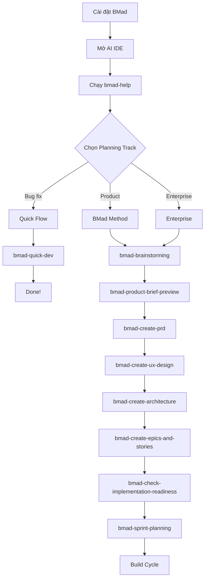

# BMad Method — Playbook

## Cài đặt & Thiết lập

### Prerequisites

| Yêu cầu | Version | Ghi chú |
|---|---|---|
| **Node.js** | ≥ 20.0.0 | Bắt buộc |
| **Git** | Latest | Khuyến nghị |
| **AI IDE** | Latest | Claude Code, Cursor, Gemini CLI, Codex CLI, +16 platforms khác |
| **npm** | Bundled with Node.js | Cần cho `npx` |

### Installation — Interactive Mode

```bash
npx bmad-method install
npx bmad-method@next install
npx bmad-method@6.2.0 install
```

**Các bước installer sẽ hỏi:**

1. **Select modules** — Chọn modules cần cài (BMM, BMB, TEA, GDS, CIS, WDS)
2. **Select IDE** — Chọn AI IDE đang dùng (20+ platforms)
3. **Configure paths** — Đường dẫn output artifacts
4. **Project name** — Tên dự án
5. **Skill level** — beginner / intermediate / expert
6. **Confirm** — Review và xác nhận

### Installation — Non-Interactive Mode (CI/CD)

```bash
npx bmad-method install --directory /path/to/project --modules bmm --tools claude-code --yes
npx bmad-method install --directory ./my-project --modules bmm,tea,bmb --tools cursor --yes
```

| Flag | Mô tả |
|---|---|
| `--directory <path>` | Đường dẫn project |
| `--modules <list>` | Modules cần cài (comma-separated) |
| `--tools <ide>` | IDE target |
| `--yes` | Skip confirmation |
| `--custom-content <path>` | Custom content directory |

### Uninstall

```bash
npx bmad-method uninstall
rm -rf _bmad/ _bmad-output/ .claude/skills/bmad-*
```

> ⚠️ **Breaking changes V6.1:** Toàn bộ hệ thống chuyển sang **skills-based architecture**. Legacy YAML/XML workflow engine bị loại bỏ hoàn toàn.

---

## Day 1 Workflow

### Greenfield Project (Dự án mới)



### Brownfield Project (Dự án có sẵn)

1. **Install BMad** — `npx bmad-method install`
2. **Chạy `/bmad-help`** — BMad-Help sẽ detect project state
3. **Tạo Project Context** — `/bmad-generate-project-context`
4. **Chọn track** — Quick Flow cho small changes, BMad Method cho major features
5. **Bắt đầu từ phase phù hợp**

### Build Cycle (Lặp lại cho mỗi story)

| Bước | Agent | Skill | Command | Mô tả |
|---|---|---|---|---|
| 1 | Scrum Master | `bmad-create-story` | `/bmad-create-story` | Tạo story file từ epic |
| 2 | Developer | `bmad-dev-story` | `/bmad-dev-story` | Implement story (new chat!) |
| 3 | Developer | `bmad-code-review` | `/bmad-code-review` | Review code (sharded: 4-step parallel review) |
| 4 | Scrum Master | `bmad-retrospective` | `/bmad-retrospective` | Sau khi hoàn thành epic |

> ⚡ **QUAN TRỌNG:** Luôn dùng **fresh chat** cho mỗi workflow!

---

## Vận hành hàng ngày

### Khi nào dùng từng Agent?

| Tình huống | Agent | Skill |
|---|---|---|
| Có ý tưởng mới muốn khám phá | Analyst (Mary) | `/bmad-brainstorming` |
| Cần nghiên cứu market | Analyst (Mary) | `/bmad-market-research` |
| Cần nghiên cứu domain | Analyst (Mary) | `/bmad-domain-research` |
| Cần nghiên cứu technical | Analyst (Mary) | `/bmad-technical-research` |
| Tạo product brief (mới) | Analyst (Mary) | `/bmad-product-brief-preview` |
| Viết requirements | PM (John) | `/bmad-create-prd` |
| Validate PRD | PM (John) | `/bmad-validate-prd` |
| Thiết kế UI/UX | UX Designer (Sally) | `/bmad-create-ux-design` |
| Thiết kế kiến trúc | Architect (Winston) | `/bmad-create-architecture` |
| Lên kế hoạch sprint | Scrum Master (Bob) | `/bmad-sprint-planning` |
| Implement code | Developer (Amelia) | `/bmad-dev-story` |
| Review code | Developer (Amelia) | `/bmad-code-review` |
| E2E tests | QA (Quinn) | `/bmad-qa-generate-e2e-tests` |
| Bug fix / small change | Quick Flow (Barry) | `/bmad-quick-dev` |
| Nhóm thảo luận | Party Mode | `/bmad-party-mode` |
| Không biết làm gì tiếp | BMad-Help | `/bmad-help` |

---

## Configuration chiến lược

| Project Type | Modules | Skill Level | Track |
|---|---|---|---|
| **Side project / MVP** | `bmm` | intermediate | Quick Flow |
| **Startup product** | `bmm` + `cis` | intermediate | BMad Method |
| **Enterprise app** | `bmm` + `tea` | expert | Enterprise |
| **Game** | `bmm` + `gds` | intermediate | BMad Method |
| **Custom agents** | `bmm` + `bmb` | expert | BMad Method |
| **Design-heavy** | `bmm` + `wds` | intermediate | BMad Method |
| **Full suite** | `bmm` + `bmb` + `tea` + `cis` | expert | Enterprise |

---

## Cheat Sheet

### Core Skills

| Skill | Phase | Mô tả |
|---|---|---|
| `/bmad-help` | Any | 🌟 Intelligent guide |
| `/bmad-brainstorming` | Any | Guided ideation session |
| `/bmad-party-mode` | Any | Multi-agent collaboration |
| `/bmad-review-adversarial-general` | Any | Adversarial content review |
| `/bmad-review-edge-case-hunter` | Any | Edge case analysis |
| `/bmad-distillator` | Any | Lossless LLM-optimized compression |

### BMM Phase 1-4 Skills

| Skill | Agent | Mô tả |
|---|---|---|
| `/bmad-product-brief-preview` | Analyst | 🆕 Guided/Yolo/Autonomous product brief |
| `/bmad-create-prd` | PM | Product Requirements Document |
| `/bmad-create-architecture` | Architect | Architecture document |
| `/bmad-create-epics-and-stories` | PM | Break PRD → epics |
| `/bmad-sprint-planning` | SM | Initialize sprint tracking |
| `/bmad-dev-story` | Developer | Implement story |
| `/bmad-quick-dev` | Barry | 🆕 Unified quick flow |
| `/bmad-code-review` | Developer | 🆕 Sharded parallel code review (4 steps) |
| `/bmad-retrospective` | SM | Epic retrospective |

### Agent Skills

| Skill | Agent Persona |
|---|---|
| `/bmad-agent-analyst` | Mary — Analyst |
| `/bmad-agent-pm` | John — Product Manager |
| `/bmad-agent-architect` | Winston — Architect |
| `/bmad-agent-sm` | Bob — Scrum Master |
| `/bmad-agent-dev` | Amelia — Developer |
| `/bmad-agent-qa` | Quinn — QA Engineer |
| `/bmad-agent-quick-flow-solo-dev` | Barry — Quick Flow Solo Dev |
| `/bmad-agent-ux-designer` | Sally — UX Designer |
| `/bmad-agent-tech-writer` | Paige — Technical Writer |

---

## Troubleshooting

| Lỗi | Nguyên nhân | Fix |
|---|---|---|
| **Skills không hiện trong IDE** | IDE chưa enable skills | Check IDE settings → restart/reload |
| **`npx bmad-method` cho version cũ** | npm cache bị stale | `npx bmad-method@6.2.0 install` hoặc `@next` |
| **Skills từ module cũ vẫn còn** | Installer không auto-delete | `rm -rf .claude/skills/bmad-*` → re-install |
| **Workflow bị lỗi context** | Chạy nhiều workflows cùng 1 chat | **Luôn dùng fresh chat** |
| **Quick Dev scope creep** | Feature lớn hơn dự kiến | Auto-detect → split hoặc escalate |
| **Code Review infinite loop** | Old bug | Fixed v6.1+ |
| **Cannot find module** | Node.js version < 20 | `nvm install 20` |

---

## Best Practices

### ✅ Gold Rules

1. **Luôn dùng fresh chat** cho mỗi workflow
2. **Bắt đầu với `/bmad-help`**
3. **Tạo Project Context sớm**
4. **Chọn đúng planning track**
5. **Chạy Implementation Readiness** trước khi code
6. **Code Review mỗi story**
7. **Retrospective mỗi epic**
8. **Commit code thường xuyên**
9. **Git ignore planning artifacts** nếu có info nhạy cảm
10. **Upgrade BMad thường xuyên**

### ❌ Anti-Patterns

| Anti-Pattern | Giải pháp |
|---|---|
| Chạy nhiều workflows cùng 1 chat | Fresh chat cho mỗi workflow |
| Skip PRD đi thẳng code | Ít nhất cần PRD hoặc tech-spec |
| Vibe-coding thay vì follow process | Dùng structured workflows |
| Không tạo Project Context | Tạo `project-context.md` sớm |
| Dùng Quick Flow cho complex features | Escalate lên BMad Method |
| Reference files across skills | Dùng `skill:skill-name` syntax |

---

## Tài nguyên

| Resource | Link |
|---|---|
| **Documentation** | [docs.bmad-method.org](https://docs.bmad-method.org) |
| **GitHub** | [bmad-code-org/BMAD-METHOD](https://github.com/bmad-code-org/BMAD-METHOD) |
| **Discord** | [Join Community](https://discord.gg/gk8jAdXWmj) |
| **YouTube** | [BMadCode Channel](https://www.youtube.com/@BMadCode) |
| **npm** | [bmad-method](https://www.npmjs.com/package/bmad-method) |

---

## Xem thêm

- [0. Overview](./0.%20Overview.md) — Tổng quan, triết lý, vòng đời, tính năng nổi bật
- [1. Architecture and Logic](./1.%20Architecture%20and%20Logic.md) — Kiến trúc chi tiết, data flow, modules, configuration
