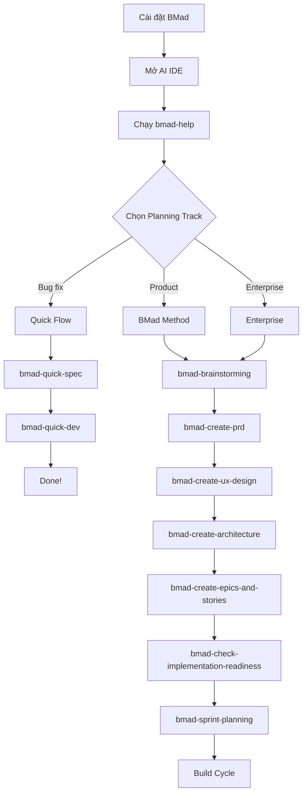

# BMad Method — Playbook

## Cài đặt & Thiết lập

### Prerequisites

| Yêu cầu | Version | Ghi chú |
|---|---|---|
| **Node.js** | ≥ 20.0.0 | Bắt buộc |
| **Git** | Latest | Khuyến nghị |
| **AI IDE** | Latest | Claude Code, Cursor, Codex CLI, Windsurf, OpenCode |
| **npm** | Bundled with Node.js | Cần cho `npx` |

### Installation — Interactive Mode

```bash
# Cài đặt BMad Method (interactive)
npx bmad-method install

# Nếu bị stale beta version
npx bmad-method@6.0.4 install
```

**Các bước installer sẽ hỏi:**

1. **Select modules** — Chọn modules cần cài (BMM, BMB, TEA, GDS, CIS)
2. **Select IDE** — Chọn AI IDE đang dùng (Claude Code, Cursor, Windsurf...)
3. **Configure paths** — Đường dẫn output artifacts
4. **Project name** — Tên dự án
5. **Skill level** — beginner / intermediate / expert
6. **Confirm** — Review và xác nhận

### Installation — Non-Interactive Mode (CI/CD)

```bash
# Cài đặt cơ bản
npx bmad-method install --directory /path/to/project --modules bmm --tools claude-code --yes

# Cài nhiều modules
npx bmad-method install --directory ./my-project --modules bmm,tea,bmb --tools cursor --yes

# Với custom content
npx bmad-method install --directory ./my-project --modules bmm --tools claude-code --custom-content ./custom --yes
```

| Flag | Mô tả |
|---|---|
| `--directory <path>` | Đường dẫn project |
| `--modules <list>` | Modules cần cài (comma-separated: `bmm`, `bmb`, `tea`, `gds`, `cis`) |
| `--tools <ide>` | IDE target: `claude-code`, `cursor`, `windsurf`, `codex`, `opencode` |
| `--yes` | Skip confirmation |
| `--custom-content <path>` | Custom content directory |

### Kết quả sau cài đặt

```
your-project/
├── _bmad/                         # BMad configuration
│   ├── agents/                    # Agent persona files
│   ├── workflows/                 # Workflow configs
│   ├── tasks/                     # Reusable tasks
│   └── data/                      # Reference data
├── _bmad-output/
│   ├── planning-artifacts/        # PRD, Architecture, Epics
│   ├── implementation-artifacts/  # Sprint status, Stories
│   └── project-context.md         # (optional) Implementation rules
├── .claude/skills/                # Generated skills (tuỳ IDE)
│   ├── bmad-help/SKILL.md
│   ├── bmad-create-prd/SKILL.md
│   └── ...
└── docs/                          # Project knowledge
```

### Uninstall

```bash
# Interactive uninstall
npx bmad-method uninstall

# Hoặc xoá thủ công
rm -rf _bmad/ _bmad-output/ .claude/skills/bmad-*
```

### Upgrade từ V5 → V6

```bash
# 1. Backup artifacts hiện tại
cp -r _bmad-output/ _bmad-output-backup/

# 2. Re-run installer (overwrite existing)
npx bmad-method@6.0.4 install

# 3. Verify skills đã regenerate
ls .claude/skills/
```

> **Breaking changes V6:** Path variables đổi từ `@` prefix sang `{project-root}` syntax. Skills architecture mới thay thế hoàn toàn commands system cũ.

---

## Day 1 Workflow

### Greenfield Project (Dự án mới)



### Brownfield Project (Dự án có sẵn)

1. **Install BMad** — `npx bmad-method install` trong project folder hiện tại
2. **Chạy `/bmad-help`** — BMad-Help sẽ detect project state
3. **Tạo Project Context** — `/bmad-generate-project-context` để document technical preferences
4. **Chọn track** — Quick Flow cho small changes, BMad Method cho major features
5. **Bắt đầu từ phase phù hợp** — Có thể skip Phase 1 nếu đã có direction rõ ràng

### Build Cycle (Lặp lại cho mỗi story)

| Bước | Agent | Skill | Command | Mô tả |
|---|---|---|---|---|
| 1 | Scrum Master | `bmad-create-story` | `/bmad-create-story` | Tạo story file từ epic |
| 2 | Developer | `bmad-dev-story` | `/bmad-dev-story` | Implement story (new chat!) |
| 3 | Developer | `bmad-code-review` | `/bmad-code-review` | Review code quality |
| 4 | Scrum Master | `bmad-retrospective` | `/bmad-retrospective` | Sau khi hoàn thành epic |

> ⚡ **QUAN TRỌNG:** Luôn dùng **fresh chat** cho mỗi workflow!

---

## Vận hành hàng ngày

### Daily Operations Checklist

```markdown
## Mỗi ngày khi bắt đầu làm việc:
1. Mở AI IDE trong project folder
2. Chạy `/bmad-help` → xem project state và next steps
3. Chạy `/bmad-create-story` cho story tiếp theo (new chat)
4. Chạy `/bmad-dev-story` để implement (new chat)
5. Chạy `/bmad-code-review` khi hoàn thành (new chat)
6. Commit code thường xuyên

## Khi hoàn thành một epic:
1. Chạy `/bmad-retrospective` (new chat)
2. Review sprint-status.yaml
3. Tiếp tục epic tiếp theo

## Khi scope thay đổi:
1. Chạy `/bmad-correct-course` với SM agent (new chat)
2. Update PRD nếu cần
3. Re-plan epics
```

### Tạo Project Context (Recommended)

Project Context giúp AI agents hiểu technical preferences của bạn:

```bash
# Cách 1: Auto-generate sau khi có architecture
/bmad-generate-project-context

# Cách 2: Tạo manual
# Tạo file _bmad-output/project-context.md với nội dung:
```

```markdown
# Project Context

## Technology Stack
- Frontend: React 18 + TypeScript
- Backend: Node.js + Express
- Database: PostgreSQL
- ORM: Prisma

## Implementation Rules
- Use TypeScript strict mode
- All API responses must follow REST conventions
- Error handling with custom error classes
- Unit test coverage minimum 80%
```

---

## Configuration chiến lược

### Presets theo project type

| Project Type | Modules | Skill Level | Track |
|---|---|---|---|
| **Side project / MVP** | `bmm` | intermediate | Quick Flow |
| **Startup product** | `bmm` + `cis` | intermediate | BMad Method |
| **Enterprise app** | `bmm` + `tea` | expert | Enterprise |
| **Game** | `bmm` + `gds` | intermediate | BMad Method |
| **Custom agents** | `bmm` + `bmb` | expert | BMad Method |
| **Full suite** | `bmm` + `bmb` + `tea` + `cis` | expert | Enterprise |

### Khi nào dùng từng Agent?

| Tình huống | Agent | Skill |
|---|---|---|
| Có ý tưởng mới muốn khám phá | Analyst (Mary) | `/bmad-brainstorming` |
| Cần nghiên cứu market/tech | Analyst (Mary) | `/bmad-research` |
| Viết requirements | PM (John) | `/bmad-create-prd` |
| Thiết kế UI/UX | UX Designer (Sally) | `/bmad-create-ux-design` |
| Thiết kế kiến trúc | Architect (Winston) | `/bmad-create-architecture` |
| Lên kế hoạch sprint | Scrum Master (Bob) | `/bmad-sprint-planning` |
| Implement code | Developer (Amelia) | `/bmad-dev-story` |
| Review code | Developer (Amelia) | `/bmad-code-review` |
| Bug fix nhanh | Quick Flow (Barry) | `/bmad-quick-spec` + `/bmad-quick-dev` |
| Nhóm thảo luận | Party Mode | `/bmad-party-mode` |
| Không biết làm gì tiếp | BMad-Help | `/bmad-help` |

---

## Cheat Sheet

### Core Skills

| Skill | Agent | Phase | Mô tả |
|---|---|---|---|
| `/bmad-help` | Any | Any | 🌟 Intelligent guide — hỏi bất kỳ điều gì |
| `/bmad-brainstorming` | Analyst | 1 | Guided ideation session |
| `/bmad-research` | Analyst | 1 | Market/technical research |
| `/bmad-create-product-brief` | Analyst | 1 | Foundation document |
| `/bmad-create-prd` | PM | 2 | Product Requirements Document |
| `/bmad-create-ux-design` | UX | 2 | UX Design document |
| `/bmad-quick-spec` | Barry | 2 | Quick Flow: tech-spec |
| `/bmad-create-architecture` | Architect | 3 | Architecture document |
| `/bmad-create-epics-and-stories` | PM | 3 | Break PRD → epics |
| `/bmad-check-implementation-readiness` | Architect | 3 | Validate planning cohesion |
| `/bmad-sprint-planning` | SM | 4 | Initialize sprint tracking |
| `/bmad-create-story` | SM | 4 | Create story file |
| `/bmad-dev-story` | Developer | 4 | Implement story |
| `/bmad-quick-dev` | Barry | 4 | Quick Flow: implement |
| `/bmad-code-review` | Developer | 4 | Adversarial code review |
| `/bmad-retrospective` | SM | 4 | Epic retrospective |
| `/bmad-correct-course` | SM/PM | Any | Handle scope changes |

### Agent Skills (Load persona)

| Skill | Agent Persona |
|---|---|
| `/bmad-analyst` | Mary — Analyst |
| `/bmad-pm` | John — Product Manager |
| `/bmad-architect` | Winston — Architect |
| `/bmad-sm` | Bob — Scrum Master |
| `/bmad-dev` | Amelia — Developer |
| `/bmad-qa` | Quinn — QA Engineer |
| `/bmad-master` | Barry — Quick Flow Solo Dev |
| `/bmad-ux-designer` | Sally — UX Designer |
| `/bmad-tech-writer` | Paige — Technical Writer |
| `/bmad-party-mode` | All agents in one room |

### Utility Skills

| Skill | Mô tả |
|---|---|
| `/bmad-shard-doc` | Split large markdown file |
| `/bmad-index-docs` | Index project documentation |
| `/bmad-editorial-review-prose` | Review document prose quality |
| `/bmad-generate-project-context` | Generate project context file |

### CLI Commands

| Command | Mô tả |
|---|---|
| `npx bmad-method install` | Interactive install |
| `npx bmad-method install --directory <path> --modules <m> --tools <ide> --yes` | Non-interactive |
| `npx bmad-method uninstall` | Remove components |
| `npx bmad-method@<version> install` | Install specific version |

---

## Troubleshooting

| Lỗi | Nguyên nhân | Fix |
|---|---|---|
| **Skills không hiện trong IDE** | IDE chưa enable skills hoặc cần restart | Check IDE settings → enable skills → restart/reload |
| **`npx bmad-method` cho version cũ** | npm cache bị stale | `npx bmad-method@6.0.4 install` — specify exact version |
| **Skills từ module cũ vẫn còn** | Installer không auto-delete | Xoá thủ công: `rm -rf .claude/skills/bmad-*` → re-install |
| **Install lồng nhau bị từ chối** | Ancestor directory đã có BMAD | Install ở root project, không lồng nhau |
| **Workflow bị lỗi context** | Chạy nhiều workflows cùng 1 chat | **Luôn dùng fresh chat** cho mỗi workflow |
| **Brainstorming ghi đè session cũ** | Bug v6.0.3 trở xuống | Update lên v6.0.4 — prompt continue/new |
| **Agent trả lời sai role** | Context bị nhiễu từ workflow trước | Fresh chat + invoke đúng agent skill |
| **Quick Flow scope creep** | Feature lớn hơn dự kiến | `bmad-quick-dev` auto-detect → escalate lên BMad Method |
| **PRD auto-discovered sai file** | Nhiều PRD files trong project | Specify đúng path khi chạy workflow |
| **OpenCode integration lỗi** | `name` frontmatter không supported | Update lên v6.0.3+ (fixed: dùng `mode: all`) |
| **CSV manifest bị lỗi quotes** | Double-escaping bug | Update lên v6.0.2+ |
| **Cannot find module** | Node.js version < 20 | Upgrade Node.js: `nvm install 20` |

### Debug Steps khi gặp lỗi

```bash
# 1. Verify Node.js version
node --version  # Phải >= 20

# 2. Clear npm cache
npm cache clean --force

# 3. Re-install với version cụ thể
npx bmad-method@6.0.4 install

# 4. Verify skills directory
ls -la .claude/skills/  # hoặc .cursor/skills/

# 5. Check installed modules
cat _bmad/module.yaml

# 6. Report bug nếu vẫn lỗi
# https://github.com/bmad-code-org/BMAD-METHOD/issues
```

---

## Best Practices

### ✅ Gold Rules

| # | Rule | Tại sao |
|---|---|---|
| 1 | **Luôn dùng fresh chat** cho mỗi workflow | Tránh context pollution, mỗi agent cần clean context |
| 2 | **Bắt đầu với `/bmad-help`** | BMad-Help inspect project state → recommend chính xác next step |
| 3 | **Tạo Project Context sớm** | Agents hiểu tech preferences → output chất lượng hơn |
| 4 | **Chọn đúng planning track** | Quick Flow cho small, BMad Method cho medium, Enterprise cho complex |
| 5 | **Chạy Implementation Readiness** trước khi code | Validate cohesion giữa PRD, Architecture, Epics |
| 6 | **Code Review mỗi story** | Adversarial review bắt bugs sớm |
| 7 | **Retrospective mỗi epic** | Continuous improvement, adjust sprint |
| 8 | **Commit code thường xuyên** | Giữ diff nhỏ, dễ review |
| 9 | **Git ignore planning artifacts** nếu có info nhạy cảm | PRD/Architecture có thể chứa business logic |
| 10 | **Upgrade BMad thường xuyên** | Bug fixes, new features, better agent behavior |

### ❌ Anti-Patterns

| Anti-Pattern | Vấn đề | Giải pháp |
|---|---|---|
| **Chạy nhiều workflows cùng 1 chat** | Context bị nhiễu, agent confused | Fresh chat cho mỗi workflow |
| **Skip PRD đi thẳng code** (cho medium+ projects) | Thiếu requirements → rework nhiều | Ít nhất cần PRD hoặc tech-spec |
| **Vibe-coding thay vì follow process** | Output không nhất quán | Dùng structured workflows |
| **Ignore `bmad-help` recommendations** | Miss important steps | Trust bmad-help, nó inspect project state |
| **Không tạo Project Context** | Agents không hiểu conventions | Tạo `project-context.md` sớm |
| **Install BMAD lồng nhau** | Duplicate commands, confusion | Chỉ install ở root project |
| **Dùng Quick Flow cho complex features** | Under-planned, scope creep | Escalate lên BMad Method khi scope lớn |
| **Không chạy Code Review** | Bugs lọt qua | Luôn `/bmad-code-review` sau mỗi story |

---

## Tài nguyên

| Resource | Link |
|---|---|
| **Documentation** | [docs.bmad-method.org](https://docs.bmad-method.org) |
| **Getting Started** | [Tutorial](https://docs.bmad-method.org/tutorials/getting-started/) |
| **Upgrade to V6** | [Guide](https://docs.bmad-method.org/how-to/upgrade-to-v6/) |
| **GitHub** | [bmad-code-org/BMAD-METHOD](https://github.com/bmad-code-org/BMAD-METHOD) |
| **Discord** | [Join Community](https://discord.gg/gk8jAdXWmj) |
| **YouTube** | [BMadCode Channel](https://www.youtube.com/@BMadCode) |
| **npm** | [bmad-method](https://www.npmjs.com/package/bmad-method) |
| **Issues** | [GitHub Issues](https://github.com/bmad-code-org/BMAD-METHOD/issues) |
| **Discussions** | [GitHub Discussions](https://github.com/bmad-code-org/BMAD-METHOD/discussions) |
| **Roadmap** | [docs.bmad-method.org/roadmap](https://docs.bmad-method.org/roadmap/) |

---

## Xem thêm

- [[3-Research/Github/BMAD-METHOD/0. Overview]] — Tổng quan, triết lý, vòng đời, tính năng nổi bật
- [[3-Research/Github/BMAD-METHOD/1. Architecture and Logic]] — Kiến trúc chi tiết, data flow, modules, configuration
