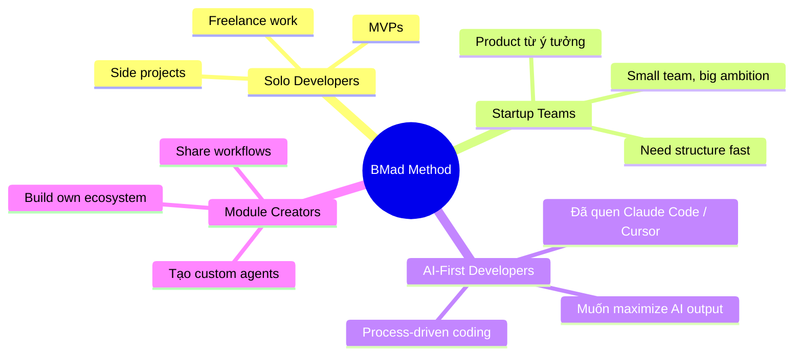
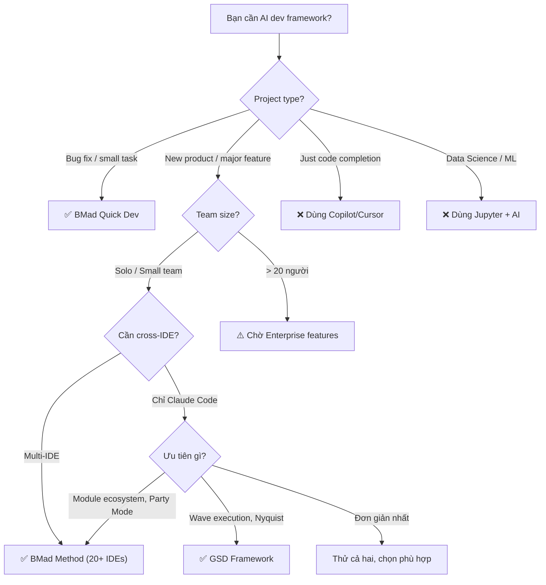

# BMad Method — Decision Guide

## So sánh với Alternatives

### Feature-by-Feature Comparison

| Tính năng | BMad Method | GSD (Get Shit Done) | Cursor Rules | Claude Projects | GitHub Copilot | Aider | Custom Prompts |
|---|---|---|---|---|---|---|---|
| **Multi-agent system** | ✅ 9 agents có persona | ✅ 11 agents chuyên biệt | ❌ Single context | ❌ Single context | ❌ Suggestions only | ❌ Single agent | ❌ Manual |
| **Scale-adaptive planning** | ✅ 3 tracks tự động | ❌ Fixed 6-phase | ❌ | ❌ | ❌ | ❌ | ❌ |
| **Full project lifecycle** | ✅ 4 phases, 44 skills | ✅ 6 phases structured | ❌ Code only | Partial | ❌ Code assist | ❌ Code only | ❌ Manual |
| **Skills-based architecture** | ✅ Native SKILL.md | ❌ | ❌ | ❌ | ❌ | ❌ | ❌ |
| **Party Mode** | ✅ Multi-agent 1 session | ❌ | ❌ | ❌ | ❌ | ❌ | ❌ |
| **Intelligent guide** | ✅ `bmad-help` | ❌ | ❌ | ❌ | ❌ | ❌ | ❌ |
| **Module ecosystem** | ✅ 6 official modules | ❌ Monolithic | ❌ | ❌ | Extensions | ❌ | ❌ |
| **Cross-IDE support** | ✅ 20+ platforms | ❌ Claude Code only | ❌ Cursor only | ❌ Claude only | ❌ VS Code/JetBrains | ✅ Terminal | ❌ Tuỳ |
| **Quick Flow** | ✅ Unified quick-dev | ❌ | ❌ | ❌ | ❌ | ❌ | ❌ |
| **Custom agent builder** | ✅ BMad Builder module | ❌ | ❌ | ❌ | ❌ | ❌ | ❌ Manual |
| **Test architecture** | ✅ TEA module | ❌ | ❌ | ❌ | ❌ | ❌ | ❌ |
| **Game dev workflows** | ✅ GDS module | ❌ | ❌ | ❌ | ❌ | ❌ | ❌ |
| **Installer CLI** | ✅ npx interactive | ❌ Manual setup | ❌ | ❌ | Extension install | pip install | ❌ |
| **Scope creep detection** | ✅ Auto-escalate | ❌ | ❌ | ❌ | ❌ | ❌ | ❌ |
| **Sharded code review** | ✅ Parallel 3-layer review | ❌ | ❌ | ❌ | ❌ | ❌ | ❌ |
| **Sprint tracking** | ✅ YAML-based | ✅ .planning/ files | ❌ | ❌ | ❌ | ❌ | ❌ |
| **Open source** | ✅ MIT, 100% free | ✅ MIT, 100% free | Freemium | Paid subscription | Paid subscription | ✅ Apache 2.0 | ✅ |
| **Community** | Discord + GitHub | GitHub + Docs | Reddit + Forum | Anthropic docs | GitHub + Copilot chat | GitHub | ❌ |

### BMad Method vs GSD — So sánh chi tiết

Cả hai đều là multi-agent frameworks cho AI-driven development, nhưng triết lý khác nhau:

| Khía cạnh | BMad Method | GSD (Get Shit Done) |
|---|---|---|
| **Triết lý** | AI as expert collaborator, guided discovery | Structured automation, wave execution |
| **Phương pháp** | Agile-grounded, scale-adaptive | Fixed 6-phase lifecycle |
| **Agents** | 9 agents với persona name, mỗi agent 1 skill dir | 11 agents chuyên biệt, XML-formatted |
| **Architecture** | Skills-based (native SKILL.md directories) | XML/YAML workflow engine |
| **Planning tracks** | 3 tracks: Quick Flow / BMad Method / Enterprise | 1 track: Map → Initialize → Discuss → Plan → Execute → Verify |
| **IDE support** | 20+ platforms (Claude Code, Cursor, Gemini, Codex...) | Chủ yếu Claude Code |
| **Memory system** | Planning Artifacts + Project Context | `.planning/` hierarchical file system |
| **Extensibility** | Module ecosystem (BMB, TEA, GDS, CIS, WDS) | Monolithic framework |
| **Installation** | `npx bmad-method install` (interactive CLI) | Manual copy/setup |
| **Brownfield support** | Full support + `/bmad-help` guide | `gsd:map-codebase` workflow |
| **Code review** | Sharded parallel (Blind Hunter + Edge Case Hunter + Acceptance Auditor) | Standard review |
| **Unique strengths** | Party Mode, Scale-Adaptive, bmad-help, Module ecosystem, 20+ IDEs | Wave execution, Nyquist validation, Decision Matrix |

### BMad Method vs Tool-specific Solutions

| Khía cạnh | BMad Method | Cursor Rules / .cursorrules | Claude Projects |
|---|---|---|---|
| **Scope** | Full SDLC framework | Code-time rules/context | Project-level knowledge |
| **AI agents** | 9 specialized agents | No agents, just rules | Custom instructions only |
| **Chức năng chính** | Planning → Architecture → Implementation | Code generation quality | Knowledge retrieval + chat |
| **Output** | PRD, Architecture, Epics, Stories, Code | Better code suggestions | Conversation history |
| **Kết hợp được?** | ✅ BMad generates rules cho Cursor | ❌ Standalone | ❌ Standalone |
| **Giá** | Free (MIT) | Cursor Pro $20/mo | Claude Pro $20/mo |

---

## Khi nào NÊN dùng BMad Method

### Use cases lý tưởng

| Scenario | Tại sao BMad phù hợp |
|---|---|
| **Xây dựng product mới từ ý tưởng** | Full lifecycle: brainstorm → product brief → PRD → architecture → implementation |
| **Solo dev muốn quy trình chuyên nghiệp** | Agents đóng vai PM, Architect, QA — bạn có "team ảo" |
| **Team nhỏ cần structure** | Sprint planning, story tracking, sharded code review có sẵn |
| **Dự án cần planning documents** | Auto-generate PRD, Architecture docs, Epics & Stories |
| **Brownfield: thêm major feature** | BMad Method track + project context |
| **Bug fix / small change nhanh** | Quick Dev unified workflow, done in 1 session |
| **Game development** | Game Dev Studio module: GDD, prototyping, engine-specific workflows |
| **Muốn tạo custom AI workflows** | BMad Builder module: build agents & workflows riêng |
| **Cần test strategy** | Test Architect module: risk-based, enterprise-grade |
| **Đánh giá trade-offs phức tạp** | Party Mode: multiple experts discuss trong 1 session |
| **Dùng nhiều IDE/platform khác nhau** | 20+ platforms support: Claude Code, Cursor, Gemini CLI, Codex... |
| **Cần research sâu trước khi xây** | 3 research skills: market, domain, technical |

### Đối tượng phù hợp nhất



---

## Khi nào KHÔNG nên dùng BMad Method

### Limitations

| Limitation | Chi tiết | Alternative tốt hơn |
|---|---|---|
| **Chỉ muốn code completion** | BMad là full SDLC framework, quá nặng nếu chỉ cần autocomplete | GitHub Copilot, Cursor |
| **Không dùng AI IDE** | Cần AI IDE hỗ trợ skills/commands | Aider (terminal-based) |
| **Enterprise cần SSO/audit logs** | Chưa có enterprise features (đang trên roadmap) | Custom enterprise solution |
| **Real-time collaboration** | Không có multiplayer/real-time | Linear + AI tools |
| **CI/CD orchestration** | BMad không thay thế CI/CD pipeline | GitHub Actions, GitLab CI |
| **Project management tool** | Không phải Jira/Linear replacement (chưa integrate) | Jira, Linear, Notion |
| **Micro-projects < 1 hour** | Overhead của install + setup không worth it | Direct AI chat |
| **Team > 20 người** | Chưa có team management features | Enterprise tools |
| **Không biết JavaScript/Node.js** | Installer cần Node.js 20+ | Python-based tools nếu Node.js là barrier |

### Anti-use-cases

| Scenario | Tại sao không phù hợp | Dùng gì thay |
|---|---|---|
| Quick one-off script | Quá nhiều ceremony | Direct Claude/ChatGPT |
| Data science / ML pipeline | Không có ML-specific workflows | Jupyter + AI assistants |
| Mobile app design only | UX workflow có nhưng không sâu về mobile | Figma + AI plugins |
| Infrastructure as Code | Không có IaC workflows | Terraform + Copilot |
| Content writing (blog, docs) | BMad focus software dev | ChatGPT, Claude direct |

---

## Case Studies / Ví dụ Thực tế

### Cộng đồng và Traction

| Metric | Con số | Ghi chú |
|---|---|---|
| **GitHub Stars** | ~39,500+ | Top trending AI dev framework |
| **Forks** | ~4,800+ | Active community |
| **Contributors** | 15+ | Open source contributors |
| **npm Downloads** | Active | Package `bmad-method` trên npm (555 KB after v6.1 optimization) |
| **Discord Members** | Active community | Support, ideas, collaboration |
| **YouTube** | BMadCode channel | Tutorials, masterclass (launching) |
| **Created** | April 2025 | ~11 months, đã lên V6.2 stable |
| **Update frequency** | Very active | Multiple releases per month |
| **Chinese docs** | Available | README_CN.md + docs translations |

### Example Workflows

| Project Type | Track dùng | Thời gian planning | Kết quả |
|---|---|---|---|
| Bug fix authentication | Quick Dev (unified) | ~15 phút | Clarify → plan → implement → review → present |
| MVP SaaS dashboard | BMad Method | ~2-3 giờ | Product Brief → PRD + Architecture + 5 epics + 15 stories |
| E-commerce platform | Enterprise | ~1 ngày | PRD + Security + Architecture + 8 epics |
| Unity puzzle game | BMad Method + GDS | ~2 giờ | GDD + Architecture + Game-specific epics |
| Custom CI/CD agent | BMad Method + BMB | ~3 giờ | Custom agent + workflows + module |

---

## Chi phí & Tài nguyên

### Pricing

| Component | Chi phí | Ghi chú |
|---|---|---|
| **BMad Method** | 🆓 **Free** (MIT License) | 100% miễn phí, mãi mãi |
| **Tất cả official modules** | 🆓 **Free** | BMB, TEA, GDS, CIS, WDS |
| **Discord community** | 🆓 **Free** | Không gated |
| **Documentation** | 🆓 **Free** | docs.bmad-method.org |
| **AI IDE** | Tuỳ IDE | Claude Code free tier / Cursor $20/mo / Copilot $10/mo |
| **AI API tokens** | Tuỳ provider | Claude API / OpenAI API — chi phí riêng |

### Token/Resource Costs

| Workflow | Estimated Token Usage | Ghi chú |
|---|---|---|
| `bmad-help` | Low (~1K tokens) | Quick context check |
| `bmad-quick-dev` | Medium (~5-15K tokens) | Unified 5-step workflow |
| `bmad-create-prd` | Medium-High (~10-20K tokens) | Multi-step guided process |
| `bmad-create-architecture` | High (~15-25K tokens) | Read PRD + design decisions |
| `bmad-code-review` | Medium-High (~10-20K tokens) | Sharded 4-step parallel review |
| `bmad-dev-story` | High (~20-40K tokens) | Read context + implement code |
| `bmad-party-mode` | Very High (~30-50K+ tokens) | Multiple agents in session |
| `bmad-product-brief-preview` | High (~15-30K tokens) | Subagent fan-out + web research |

> **Lưu ý:** Token costs phụ thuộc vào AI provider pricing, model used, và project complexity. BMad Method bản thân miễn phí — chỉ AI provider tính tiền tokens.

### Hardware Requirements

| Yêu cầu | Minimum | Recommended |
|---|---|---|
| **Node.js** | v20 | Latest LTS |
| **RAM** | 4 GB | 8 GB+ |
| **Disk** | ~50 MB (BMad files) | SSD recommended |
| **Internet** | Required (for AI IDE) | Stable connection |
| **OS** | macOS, Linux, Windows | macOS/Linux preferred |

---

## Migration Path

### Từ "No Framework" → BMad Method

```bash
# 1. Install BMad vào project hiện tại
cd your-project
npx bmad-method install

# 2. Generate Project Context từ codebase hiện tại
# Trong AI IDE:
/bmad-generate-project-context

# 3. Dùng bmad-help để xem recommendations
/bmad-help I have an existing project, what should I do?

# 4. Bắt đầu với Quick Dev cho next feature
/bmad-quick-dev
```

### Từ Cursor Rules → BMad Method

| Bước | Hành động |
|---|---|
| 1 | Giữ nguyên `.cursorrules` — BMad tương thích |
| 2 | `npx bmad-method install --tools cursor` |
| 3 | BMad sẽ generate skills vào `.cursor/skills/` |
| 4 | Cursor Rules vẫn hoạt động song song với BMad |
| 5 | Dần dần chuyển rules vào `project-context.md` |

### Từ GSD → BMad Method

| Khía cạnh | GSD | BMad Method | Migration |
|---|---|---|---|
| `.planning/` files | ✅ GSD memory | ❌ Không dùng | Convert thủ công sang `_bmad-output/` |
| Agent definitions | XML format | Native SKILL.md directories | Viết lại bằng BMad Builder |
| Wave execution | GSD-specific | Không tương đương | Dùng sprint-based thay thế |
| Commands | `gsd:command` | `/bmad-skill` or `skill:skill-name` | Map commands → skills |
| Nyquist validation | GSD-specific | `bmad-check-implementation-readiness` | Tương tự nhưng khác mechanism |

> **Ghi chú:** GSD và BMad Method là independent frameworks. Không có direct migration tool — cần manual chuyển đổi planning artifacts.

### Breaking Changes khi upgrade

| Từ version | Tới version | Breaking Changes |
|---|---|---|
| 6.0.x → 6.1 | V6.1.0 | 💥 **Major:** Toàn bộ chuyển sang skills-based architecture, loại bỏ YAML/XML workflow engine, terminology "commands" → "skills", tất cả platforms migrate sang native Agent Skills format |
| V5 → V6 | V6.0.0 | Path variables: `@` → `{project-root}`, Skills thay commands, Directory structure mới |
| V4 → V5 | V5.0.0 | Agent system overhaul, new configuration format |
| V3 → V4 | V4.0.0 | Framework transformation, installation changes |

---

## Roadmap & Tương lai

### Đang phát triển (In Progress)

| Feature | Mô tả | Impact |
|---|---|---|
| **Cross Platform Agent Team & Sub Agent** | Agent teams chạy cross-platform | Scalability |
| **Skills Architecture Optimization** | Per-skill optimization tiếp tục | Better quality |
| **Skill Marketplace** | Discover, install community-built skills | Ecosystem growth |
| **Dev Loop Automation** | Optional autopilot cho development | Productivity boost |
| **Phase 1-3 Optimization** | Lightning-fast planning với sub-agents | Speed improvement |

### Sắp ra mắt

| Feature | Mô tả | Impact |
|---|---|---|
| **Workflow Customization** | Integrate Jira, Linear, custom outputs | Enterprise adoption |
| **Enterprise Ready** | SSO, audit logs, team workspaces | Enterprise customers |
| **Community Modules** | Entertainment, security, therapy, roleplay | Platform expansion |
| **BMad Prototype First** | Idea → working prototype trong 1 session | Speed |

### Community Health

| Indicator | Status | Ghi chú |
|---|---|---|
| **Maintainer activity** | 🟢 Very active | Multiple releases/month |
| **Issue response time** | 🟢 Fast | Active maintainer |
| **PR acceptance** | 🟢 Good | CONTRIBUTING.md rõ ràng |
| **Documentation** | 🟢 Comprehensive | Full docs site + tutorials + Chinese |
| **Community growth** | 🟢 Rapid | 39K+ stars trong ~11 tháng |
| **Versioning** | 🟢 Semantic | Clear changelogs, `@next` channel |
| **License stability** | 🟢 MIT | Không có risk thay đổi |
| **Package size** | 🟢 Optimized | 91% reduction: 6.2MB → 555KB |

---

## Ma trận Ra quyết định

### Tổng kết: Nên dùng BMad Method khi...

| Scenario | Recommendation | Lý do |
|---|---|---|
| Solo dev xây MVP | ✅ **Dùng BMad** (Quick Dev) | Unified workflow, fast, structured output |
| Startup product development | ✅ **Dùng BMad** (BMad Method track) | Full lifecycle, agents thay team |
| Enterprise compliance system | ✅ **Dùng BMad** (Enterprise + TEA) | PRD + Security + Test architecture |
| Game development | ✅ **Dùng BMad** (+ GDS module) | Engine-specific workflows |
| Bug fix đơn giản | ✅ **Dùng BMad** (Quick Dev) | Nhanh, có review |
| Multi-agent brainstorming | ✅ **Dùng BMad** (Party Mode) | Unique feature, không ai có |
| Custom AI workflows | ✅ **Dùng BMad** (+ BMB module) | Builder tools có sẵn |
| Dùng nhiều IDEs | ✅ **Dùng BMad** | 20+ platforms, skills-based = portable |
| Chỉ cần code completion | ❌ **Dùng Copilot/Cursor** | BMad quá nặng cho use case này |
| Data Science / ML | ❌ **Dùng Jupyter + AI** | BMad focus software dev |
| Team > 20 người | ⚠️ **Chờ Enterprise features** | Đang trên roadmap |
| Micro-task < 30 phút | ⚠️ **Tuỳ** — Quick Dev hoặc direct chat | Quick Dev nếu cần structure |
| Đã dùng GSD và happy | ⚠️ **Tuỳ** — Cả hai đều tốt | BMad có module ecosystem + 20+ IDEs, GSD có wave execution |
| Cần integrate Jira/Linear | ⚠️ **Chờ Workflow Customization** | Đang trên roadmap |

### Decision Flowchart



---

## Xem thêm

- [0. Overview](./0. Overview.md) — Tổng quan, triết lý, vòng đời, tính năng nổi bật
- [1. Architecture and Logic](./1. Architecture and Logic.md) — Kiến trúc chi tiết, data flow, modules, configuration
- [2. Playbook](./2. Playbook.md) — Cài đặt, Day 1 workflow, cheat sheet, troubleshooting
