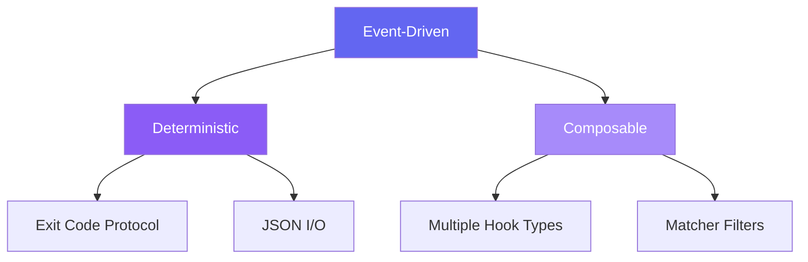
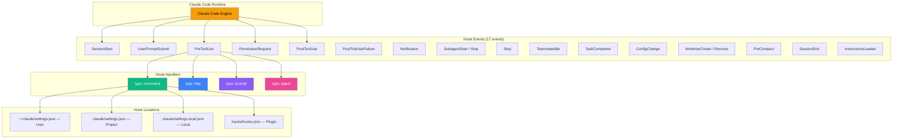
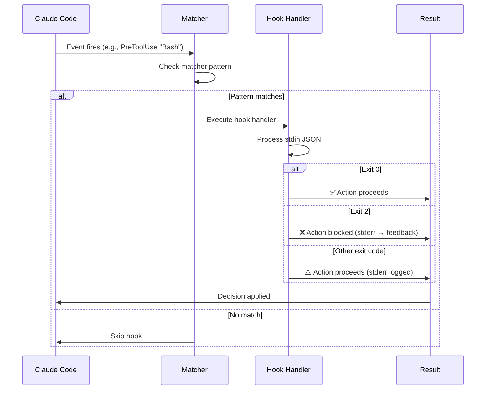

# Claude Code Hooks — Tổng quan

## Hooks là gì?

**Claude Code Hooks** là hệ thống event-driven cho phép chạy **shell commands**, **HTTP requests**, hoặc **LLM evaluations** tự động khi Claude Code thực hiện các hành động cụ thể — chỉnh sửa file, hoàn thành task, cần input từ user, hoặc thay đổi cấu hình.

> Hooks = **Deterministic automation layer** nằm giữa Claude Code và hệ thống của bạn.

## Vấn đề giải quyết

| Vấn đề | Mô tả | Cách Hooks giải quyết |
|---|---|---|
| **Thiếu kiểm soát tự động** | Claude Code chạy tool mà không có guard rails | `PreToolUse` hook chặn/cho phép tool calls trước khi thực thi |
| **Không có notification** | User không biết khi Claude cần input | `Notification` hook gửi desktop notification |
| **Code không format** | File được edit nhưng không qua formatter | `PostToolUse` hook chạy Prettier/ESLint tự động sau mỗi edit |
| **File nhạy cảm bị sửa** | `.env`, `package-lock.json` có thể bị thay đổi | `PreToolUse` hook block edits tới protected files |
| **Context mất sau compact** | Conversation bị compact mất context quan trọng | `SessionStart` hook re-inject context sau compaction |
| **Config bị thay đổi** | Settings bị sửa không kiểm soát | `ConfigChange` hook audit mọi thay đổi |
| **Task chưa xong nhưng Claude dừng** | Claude stop sớm khi chưa hoàn thành | `Stop` hook kiểm tra completeness trước khi cho dừng |

## Triết lý thiết kế



| Nguyên tắc | Mô tả |
|---|---|
| **Event-driven** | Hooks phản ứng theo events trong lifecycle, không polling |
| **Deterministic** | Command hooks dùng exit codes + stdout/stderr, kết quả dự đoán được |
| **Composable** | Kết hợp nhiều hook types (command, http, prompt, agent) cho cùng event |
| **Non-intrusive** | Hooks chạy bên ngoài Claude's reasoning, không ảnh hưởng model behavior |
| **Multi-level** | User, Project, Local, Plugin — 4 cấp độ cấu hình |

## Ai nên dùng?

| Đối tượng | Use Case |
|---|---|
| **Developer solo** | Auto-format code, notifications khi cần input, block file nhạy cảm |
| **Team lead** | Enforce coding standards qua project hooks, audit config changes |
| **DevOps engineer** | Tích hợp CI/CD pipelines, validate commands trước khi chạy |
| **Security engineer** | Block dangerous commands (`rm -rf`), audit tool usage |
| **Plugin developer** | Đóng gói hooks trong plugins để distribute |
| **AI automation engineer** | Dùng prompt/agent hooks cho LLM-powered validation |

## Kiến trúc tổng quan



### Components chính

| Component | Vai trò | Ví dụ |
|---|---|---|
| **Hook Event** | Điểm trigger trong Claude Code lifecycle | `PreToolUse`, `Stop`, `Notification` |
| **Matcher** | Bộ lọc regex xác định khi nào hook fire | `"Edit\|Write"`, `"Bash"`, `"mcp__github__.*"` |
| **Hook Handler** | Logic xử lý khi event match | Shell script, HTTP endpoint, LLM prompt |
| **Settings File** | Nơi lưu trữ hook config | `~/.claude/settings.json`, `.claude/settings.json` |
| **JSON I/O** | Giao thức giao tiếp giữa Claude Code và hooks | stdin JSON → stdout JSON / exit codes |

## Vòng đời Hook (Hook Lifecycle)



## 4 loại Hook Handler

| Type | Mô tả | Async? | Decision? |
|---|---|---|---|
| `command` | Chạy shell command, nhận stdin JSON, trả exit code + stdout | ✅ | ✅ |
| `http` | POST JSON tới URL, nhận response body | ❌ | ✅ |
| `prompt` | Gửi prompt tới Claude model (Haiku mặc định), nhận `{ok, reason}` | ❌ | ✅ |
| `agent` | Spawn subagent có tool access (Read, Grep, Glob), tối đa 50 turns | ❌ | ✅ |

## 17 Hook Events

| Event | Khi nào fire | Matcher matches |
|---|---|---|
| `SessionStart` | Session bắt đầu/resume/clear/compact | `startup`, `resume`, `clear`, `compact` |
| `UserPromptSubmit` | User gửi prompt | *(không dùng matcher)* |
| `PreToolUse` | Trước khi tool chạy | Tool name: `Bash`, `Edit\|Write`, `mcp__.*` |
| `PermissionRequest` | Khi cần permission (interactive mode) | Tool name |
| `PostToolUse` | Sau khi tool chạy thành công | Tool name |
| `PostToolUseFailure` | Sau khi tool chạy thất bại | Tool name |
| `Notification` | Claude cần user attention | `permission_prompt`, `idle_prompt`, `auth_success` |
| `SubagentStart` | Subagent bắt đầu | `Bash`, `Explore`, `Plan` |
| `SubagentStop` | Subagent kết thúc | *(như SubagentStart)* |
| `Stop` | Claude dừng responding | *(không dùng matcher)* |
| `TeammateIdle` | Teammate trong agent team idle | *(không dùng matcher)* |
| `TaskCompleted` | Task trong agent team hoàn thành | *(không dùng matcher)* |
| `InstructionsLoaded` | CLAUDE.md / rules files được load | *(không dùng matcher)* |
| `ConfigChange` | Settings bị thay đổi | `user_settings`, `project_settings`, `skills` |
| `WorktreeCreate` | Git worktree được tạo | *(không dùng matcher)* |
| `WorktreeRemove` | Git worktree bị xóa | *(không dùng matcher)* |
| `PreCompact` | Trước khi compact conversation | `manual`, `auto` |
| `SessionEnd` | Session kết thúc | `clear`, `logout`, `prompt_input_exit` |

## Tính năng nổi bật

### 1. Deterministic Exit Code Protocol
- **Exit 0** → Cho phép action tiếp tục
- **Exit 2** → Block action, stderr trở thành feedback cho Claude
- **Exit khác** → Action tiếp tục, stderr logged (xem bằng `Ctrl+O`)

### 2. Structured JSON Output
Hooks có thể trả JSON phức tạp thay vì chỉ exit codes:
```json
{
  "hookSpecificOutput": {
    "hookEventName": "PreToolUse",
    "permissionDecision": "deny",
    "permissionDecisionReason": "Use rg instead of grep"
  }
}
```

### 3. Prompt & Agent Hooks
Dùng LLM để đánh giá tự động — không cần viết shell script:
```json
{
  "type": "prompt",
  "prompt": "Check if all tasks are complete. Respond with {\"ok\": false, \"reason\": \"...\"} if not."
}
```

### 4. Async Hooks
Chạy hooks ở background, không block Claude's workflow:
```json
{ "async": true, "timeout": 120 }
```

### 5. Multi-level Configuration
4 cấp độ settings: User → Project → Local → Plugin, cho phép team-wide + personal overrides.

### 6. Environment Variable Persistence
`CLAUDE_ENV_FILE` cho phép SessionStart hooks set environment variables persistent cho toàn session.

## So sánh với các hệ thống tương tự

| Feature | Claude Code Hooks | Git Hooks | VS Code Tasks | GitHub Actions |
|---|---|---|---|---|
| **Event types** | 17+ events | ~15 events | Manual triggers | Workflow events |
| **Hook types** | command, http, prompt, agent | Script only | Shell/process | YAML workflows |
| **LLM integration** | ✅ Native (prompt/agent) | ❌ | ❌ | ❌ |
| **Real-time** | ✅ Inline | ✅ Inline | ⚠️ Task-based | ❌ CI/CD |
| **Decision control** | ✅ Allow/Deny/Block | ✅ Pass/Fail | ❌ | ✅ Pass/Fail |
| **Async support** | ✅ | ❌ | ❌ | ✅ |
| **Multi-level config** | ✅ 4 levels | ⚠️ Repo only | ⚠️ Workspace | ⚠️ Repo only |

## Xem thêm

- [1. Architecture and Logic](./1. Architecture and Logic.md) — Data flow chi tiết, cơ chế matcher, JSON I/O schema
- [2. Playbook](./2. Playbook.md) — Hướng dẫn cài đặt, Day 1 workflow, cheat sheet, troubleshooting
