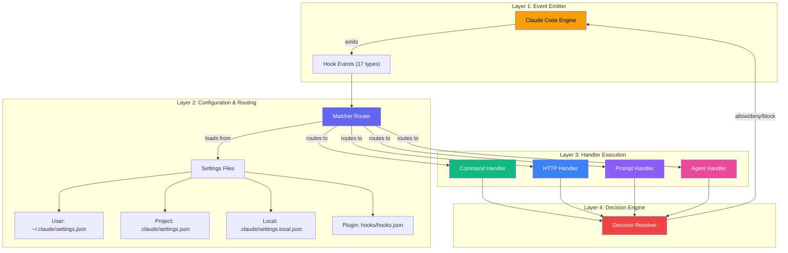
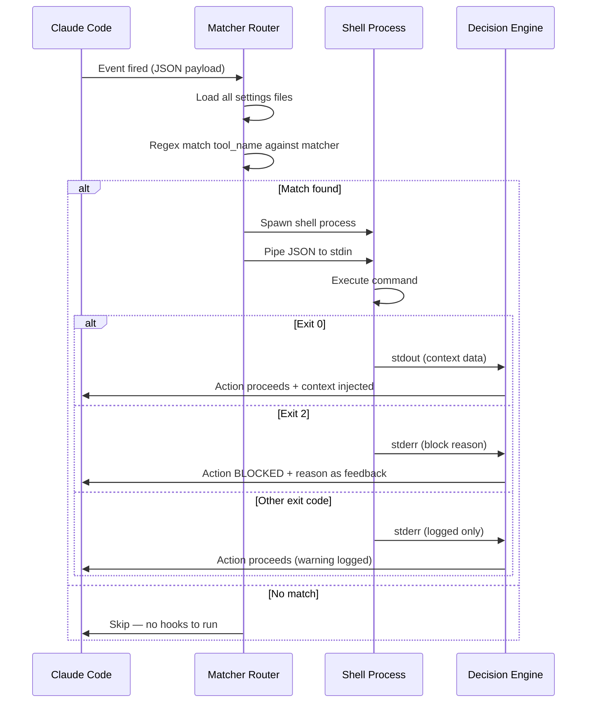
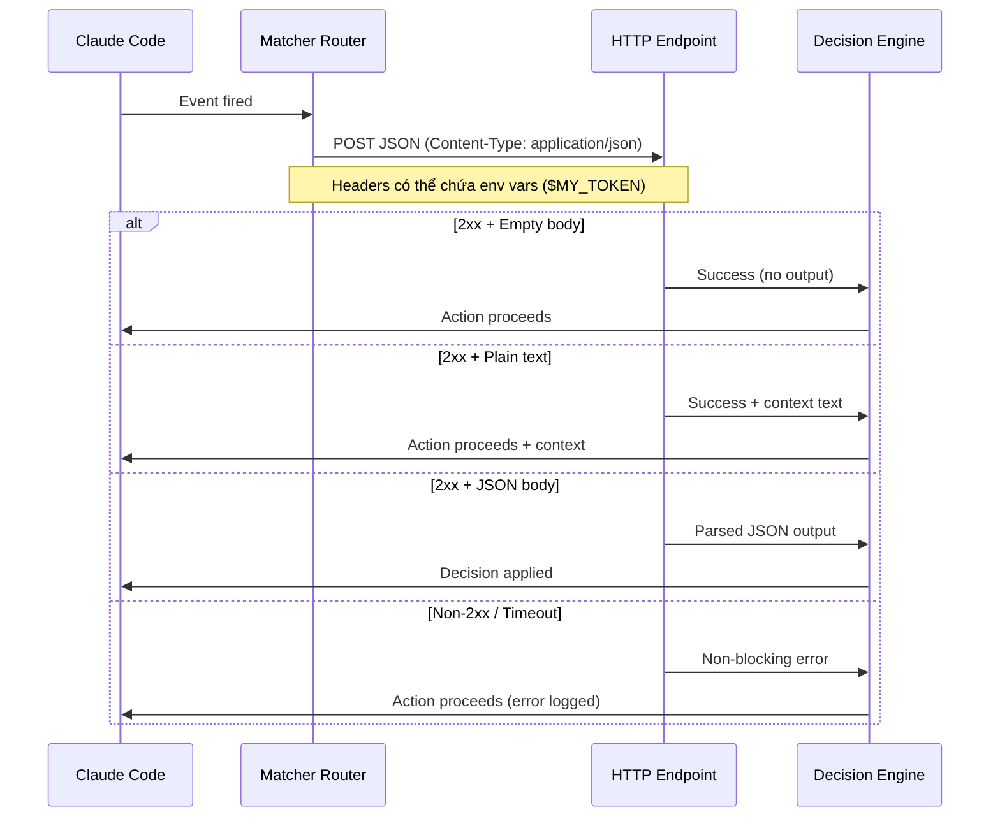
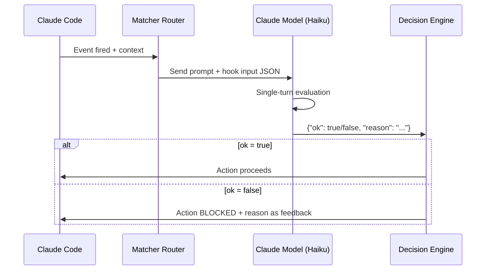
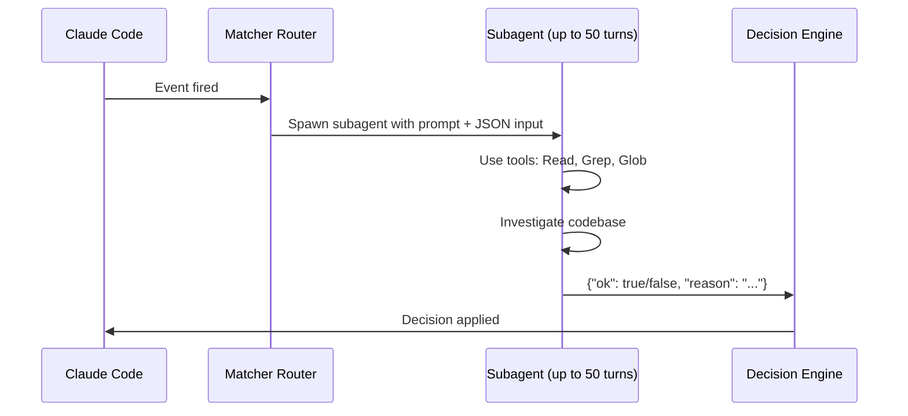
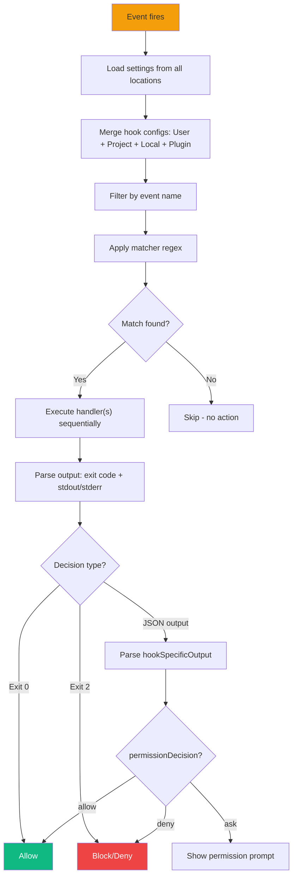
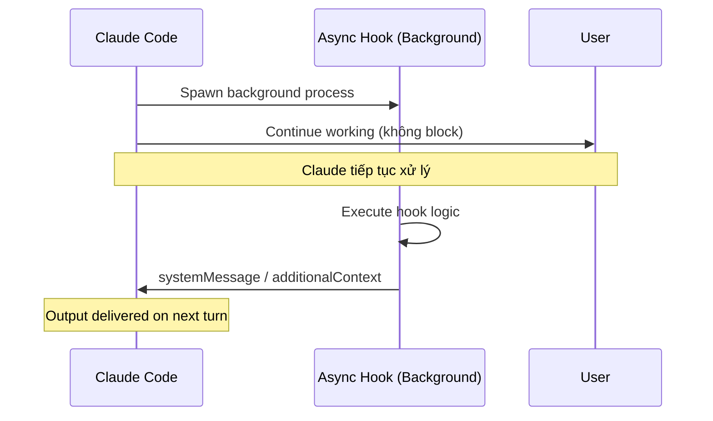

# Claude Code Hooks — Architecture and Logic

## 1. Mô hình kiến trúc tổng thể



### Layer giải thích

| Layer | Vai trò | Responsibility |
|---|---|---|
| **Event Emitter** | Claude Code engine phát ra events tại các điểm quan trọng trong lifecycle | Xác định timing, cung cấp context data |
| **Configuration & Routing** | Đọc settings files, match event + tool name với registered hooks | Filter, priority, multi-source merge |
| **Handler Execution** | Chạy hook handler tương ứng (command/http/prompt/agent) | Execute logic, timeout management |
| **Decision Engine** | Tổng hợp kết quả từ handlers, áp dụng decision lên Claude Code | Allow, deny, block, add context |

## 2. Data Flow chi tiết

### 2.1. Command Hook Flow



### 2.2. HTTP Hook Flow



### 2.3. Prompt Hook Flow



### 2.4. Agent Hook Flow



## 3. Core Modules / Components

### 3.1. Hook Events — Phân loại theo nhóm

| Nhóm | Events | Mục đích |
|---|---|---|
| **Session Lifecycle** | `SessionStart`, `SessionEnd`, `PreCompact` | Khởi tạo, cleanup, compact handling |
| **User Interaction** | `UserPromptSubmit`, `Notification` | Xử lý user input, notifications |
| **Tool Lifecycle** | `PreToolUse`, `PermissionRequest`, `PostToolUse`, `PostToolUseFailure` | Guard rails cho tool execution |
| **Agent Management** | `SubagentStart`, `SubagentStop`, `Stop` | Quản lý subagents và stopping behavior |
| **Team Operations** | `TeammateIdle`, `TaskCompleted` | Điều phối agent teams |
| **Configuration** | `ConfigChange`, `InstructionsLoaded` | Theo dõi thay đổi settings và rules |
| **Worktree** | `WorktreeCreate`, `WorktreeRemove` | Quản lý git worktrees |

### 3.2. Matcher System

Matcher là regex pattern so khớp với **tool name** hoặc **event-specific field**:

| Event Type | Matcher matches against | Ví dụ |
|---|---|---|
| `PreToolUse` / `PostToolUse` / `PostToolUseFailure` / `PermissionRequest` | `tool_name` | `"Bash"`, `"Edit\|Write"`, `"mcp__github__.*"` |
| `SessionStart` | `source` field | `"startup"`, `"resume"`, `"compact"` |
| `SessionEnd` | `reason` field | `"clear"`, `"logout"`, `"prompt_input_exit"` |
| `Notification` | `notification_type` | `"permission_prompt"`, `"idle_prompt"` |
| `SubagentStart` / `SubagentStop` | `agent_type` | `"Bash"`, `"Explore"`, `"Plan"` |
| `PreCompact` | `trigger` | `"manual"`, `"auto"` |
| `ConfigChange` | `source` field | `"user_settings"`, `"project_settings"`, `"skills"` |
| `UserPromptSubmit` / `Stop` / `TeammateIdle` / `TaskCompleted` | *(không dùng matcher)* | Matcher bị ignore |

#### MCP Tool Matching

MCP tools có naming convention đặc biệt:

```
mcp__<server>__<tool>
```

| Pattern | Matches |
|---|---|
| `mcp__memory__create_entities` | Memory server's create entities tool |
| `mcp__filesystem__read_file` | Filesystem server's read file tool |
| `mcp__memory__.*` | Tất cả tools từ memory server |
| `mcp__.*__write.*` | Mọi tool chứa "write" từ mọi server |

### 3.3. Hook Handler Fields

#### Common Fields (tất cả handler types)

| Field | Type | Mô tả |
|---|---|---|
| `type` | `"command"` \| `"http"` \| `"prompt"` \| `"agent"` | Loại handler |
| `timeout` | number (seconds) | Timeout, mặc định 600s (10 phút) |
| `statusMessage` | string | Message hiển thị khi hook đang chạy |
| `once` | boolean | `true` = chỉ chạy 1 lần (dùng trong skills/agents) |

#### Command Hook Fields

| Field | Type | Mô tả |
|---|---|---|
| `command` | string | Shell command cần chạy |
| `async` | boolean | `true` = chạy background, không block |

#### HTTP Hook Fields

| Field | Type | Mô tả |
|---|---|---|
| `url` | string | URL endpoint (chỉ localhost/127.0.0.1) |
| `headers` | object | HTTP headers, hỗ trợ `$VAR_NAME` expansion |
| `allowedEnvVars` | string[] | Danh sách env vars được phép expand trong URL/headers |

#### Prompt & Agent Hook Fields

| Field | Type | Mô tả |
|---|---|---|
| `prompt` | string | Prompt gửi tới LLM, hỗ trợ `$ARGUMENTS` |
| `model` | string | Model override (mặc định Haiku) |

## 4. Cơ chế hoạt động nội bộ

### 4.1. Hook Resolution Pipeline



### 4.2. JSON Input Schema (Common Fields)

Mọi hook đều nhận JSON qua stdin với các fields chung:

```json
{
  "session_id": "abc123",
  "transcript_path": "/Users/.../.claude/projects/.../transcript.jsonl",
  "cwd": "/Users/user/my-project",
  "permission_mode": "default",
  "hook_event_name": "PreToolUse",
  "tool_name": "Bash",
  "tool_input": {
    "command": "npm test"
  }
}
```

| Field | Luôn có | Mô tả |
|---|---|---|
| `session_id` | ✅ | ID phiên làm việc |
| `transcript_path` | ✅ | Đường dẫn tới transcript file |
| `cwd` | ✅ | Working directory hiện tại |
| `permission_mode` | ✅ | `"default"`, `"plan"`, `"acceptEdits"`, `"dontAsk"`, `"bypassPermissions"` |
| `hook_event_name` | ✅ | Tên event đã trigger hook |
| `tool_name` | Tool events | Tên tool (Bash, Edit, Write, etc.) |
| `tool_input` | Tool events | Arguments của tool call |
| `tool_response` | PostToolUse | Response từ tool đã chạy |
| `agent_id` | Agent events | ID của agent đang chạy |
| `agent_type` | Agent events | `--agent` flag hoặc built-in type |

### 4.3. JSON Output Schema

#### Universal Fields

| Field | Type | Mô tả |
|---|---|---|
| `continue` | boolean | `false` = stop Claude hoàn toàn |
| `stopReason` | string | Lý do stop (khi `continue: false`) |
| `suppressOutput` | boolean | `true` = không hiện hook output |
| `systemMessage` | string | Message inject vào Claude's context |

#### Decision Control

```json
{
  "decision": "block",
  "reason": "Test suite must pass before proceeding"
}
```

| Event | Decision `"block"` effect |
|---|---|
| `PreToolUse` | Tool call bị cancel |
| `PostToolUse` | Feedback gửi cho Claude |
| `Stop` / `SubagentStop` | Claude tiếp tục làm việc |
| `ConfigChange` | Config change bị revert |
| `UserPromptSubmit` | Prompt bị reject |

#### PreToolUse hookSpecificOutput

```json
{
  "hookSpecificOutput": {
    "hookEventName": "PreToolUse",
    "permissionDecision": "allow | deny | ask",
    "permissionDecisionReason": "Reason text",
    "updatedInput": { "field": "new value" },
    "additionalContext": "Extra context for Claude"
  }
}
```

| Field | Mô tả |
|---|---|
| `permissionDecision` | `"allow"` = bypass permission, `"deny"` = cancel, `"ask"` = show prompt |
| `updatedInput` | Modify tool input trước khi chạy (chỉ khi `allow` hoặc `ask`) |
| `additionalContext` | Context bổ sung inject vào conversation |

#### PermissionRequest hookSpecificOutput

```json
{
  "hookSpecificOutput": {
    "hookEventName": "PermissionRequest",
    "decision": {
      "behavior": "allow | deny",
      "updatedInput": { "command": "npm run lint" },
      "updatedPermissions": [],
      "message": "Auto-approved by hook",
      "interrupt": false
    }
  }
}
```

### 4.4. Exit Code Protocol — Chi tiết theo Event

| Event | Exit 0 | Exit 2 | Other |
|---|---|---|---|
| `PreToolUse` | Tool proceeds | Tool BLOCKED | Tool proceeds |
| `PermissionRequest` | Show prompt | Tool BLOCKED | Show prompt |
| `UserPromptSubmit` | Prompt accepted | Prompt BLOCKED | Prompt accepted |
| `Stop` | Claude stops | Claude CONTINUES | Claude stops |
| `SubagentStop` | Agent stops | Agent CONTINUES | Agent stops |
| `TeammateIdle` | Teammate goes idle | Teammate CONTINUES | Teammate goes idle |
| `TaskCompleted` | Task marked done | Task NOT completed | Task marked done |
| `ConfigChange` | Change accepted | Change BLOCKED (policy only) | Change accepted |
| `PostToolUse` | No effect | No effect | No effect |
| `SessionStart` | stdout → context | No effect | stderr logged |
| `Notification` | No effect | No effect | No effect |

## 5. Configuration & Settings Hierarchy

### 5.1. Settings File Locations

| Level | File | Scope | Editable via `/hooks` |
|---|---|---|---|
| **User** | `~/.claude/settings.json` | Global — áp dụng mọi project | ✅ |
| **Project** | `.claude/settings.json` | Repo-specific — commit được | ✅ |
| **Local** | `.claude/settings.local.json` | Repo-specific — gitignore | ✅ |
| **Plugin** | `hooks/hooks.json` | Plugin-bundled — read-only | ❌ |

### 5.2. Configuration Schema

```json
{
  "hooks": {
    "<EventName>": [
      {
        "matcher": "<regex_pattern>",
        "hooks": [
          {
            "type": "command",
            "command": "script.sh",
            "timeout": 30,
            "async": false
          }
        ]
      }
    ]
  }
}
```

### 5.3. Environment Variables

| Variable | Mô tả |
|---|---|
| `$CLAUDE_PROJECT_DIR` | Root directory của project |
| `${CLAUDE_PLUGIN_ROOT}` | Root directory của plugin |
| `$CLAUDE_ENV_FILE` | File để persist environment variables |
| `$ARGUMENTS` | Dùng trong prompt/agent hooks — chứa hook context |

### 5.4. Disable Hooks

```json
{
  "disableAllHooks": true
}
```

Hoặc dùng `/hooks` menu → Disable individual hooks.

## 6. Prompt-based vs Agent-based Hooks

| Aspect | Prompt Hook | Agent Hook |
|---|---|---|
| **Turns** | Single-turn | Multi-turn (tối đa 50) |
| **Tool access** | ❌ Không | ✅ Read, Grep, Glob |
| **Model** | Haiku (default, configurable) | Haiku (default, configurable) |
| **Speed** | Nhanh (~1-3s) | Chậm hơn (~5-30s+) |
| **Use case** | Simple yes/no decisions | Complex verification cần read files |
| **Supported events** | PreToolUse, PostToolUse, Stop, etc. (8 events) | Same 8 events |
| **Unsupported events** | SessionStart, SessionEnd, Notification, etc. (10 events) | Same 10 events |

### Events hỗ trợ Prompt/Agent hooks

✅ `PermissionRequest`, `PostToolUse`, `PostToolUseFailure`, `PreToolUse`, `Stop`, `SubagentStop`, `TaskCompleted`, `UserPromptSubmit`

❌ `ConfigChange`, `InstructionsLoaded`, `Notification`, `PreCompact`, `SessionEnd`, `SessionStart`, `SubagentStart`, `TeammateIdle`, `WorktreeCreate`, `WorktreeRemove`

## 7. Async Hooks

### Cách hoạt động



### Hạn chế

| Hạn chế | Mô tả |
|---|---|
| Chỉ `type: "command"` | Prompt/agent hooks không hỗ trợ async |
| Không block được | Hook output đến sau khi action đã thực thi |
| Delivery trễ | Output deliver vào turn tiếp theo |
| Không dedup | Mỗi trigger tạo process riêng |

## 8. Security Considerations

### Best Practices

| Quy tắc | Mô tả |
|---|---|
| **Validate inputs** | Không trust input data blindly |
| **Quote shell variables** | Dùng `"$VAR"` thay vì `$VAR` |
| **Block path traversal** | Check `..` trong file paths |
| **Absolute paths** | Dùng `"$CLAUDE_PROJECT_DIR"` cho project root |
| **Skip sensitive files** | Tránh xử lý `.env`, `.git/`, keys |
| **HTTP chỉ localhost** | HTTP hooks chỉ gửi tới `localhost` / `127.0.0.1` |

### Hooks trong Skills & Agents

Skills và subagents có thể đóng gói hooks trong YAML frontmatter:

```yaml
---
name: secure-operations
description: Perform operations with security checks
hooks:
  PreToolUse:
    - matcher: "Bash"
      hooks:
        - type: command
          command: "./scripts/security-check.sh"
---
```

## 9. Debug Hooks

| Phương pháp | Cách dùng |
|---|---|
| **Verbose mode** | `Ctrl+O` trong Claude Code → xem hook output |
| **Debug flag** | `claude --debug` → xem full hook execution logs |
| **Manual test** | `echo '{"tool_name":"Bash"}' \| ./my-hook.sh && echo $?` |
| **`/hooks` menu** | Xem danh sách hooks đã cấu hình |

Debug output mẫu:
```
[DEBUG] Executing hooks for PostToolUse:Write
[DEBUG] Found 1 hook matchers in settings
[DEBUG] Matched 1 hooks for query "Write"
[DEBUG] Executing hook command: <command> with timeout 600000ms
[DEBUG] Hook command completed with status 0: <stdout>
```

## Xem thêm

- [0. Overview](./0. Overview.md) — Tổng quan hệ thống, vấn đề giải quyết, so sánh
- [2. Playbook](./2. Playbook.md) — Hướng dẫn cài đặt, Day 1 workflow, cheat sheet, troubleshooting
