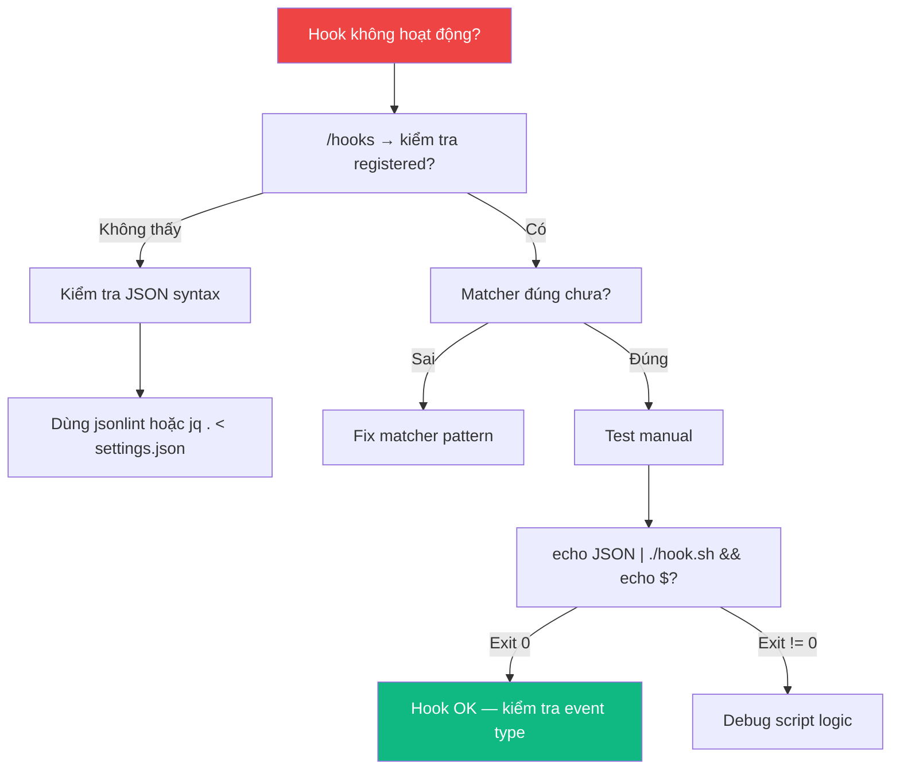

# Claude Code Hooks — Playbook

## 1. Cài đặt & Thiết lập

### 1.1. Prerequisites

| Yêu cầu | Mô tả | Kiểm tra |
|---|---|---|
| **Claude Code** | Đã cài đặt và hoạt động | `claude --version` |
| **jq** | JSON processor (cần cho nhiều hook scripts) | `jq --version` |
| **Shell** | Bash/Zsh (macOS/Linux) hoặc PowerShell (Windows) | `echo $SHELL` |

### 1.2. Cài đặt jq (nếu chưa có)

```bash
# macOS
brew install jq

# Ubuntu/Debian
sudo apt-get install jq

# Windows (Chocolatey)
choco install jq
```

### 1.3. Tạo folder cho hook scripts

```bash
mkdir -p .claude/hooks
```

## 2. Day 1 Workflow — Bắt đầu trong 5 phút

### 2.1. Hook đầu tiên: Desktop Notification

Dùng `/hooks` menu trong Claude Code:

**Bước 1:** Gõ `/hooks` trong Claude Code

**Bước 2:** Chọn `+ Add new hook…` → Event: `Notification`

**Bước 3:** Cấu hình matcher: `*` (match tất cả notifications)

**Bước 4:** Thêm command:

```bash
# macOS
osascript -e 'display notification "Claude Code needs your attention" with title "Claude Code"'

# Linux
notify-send 'Claude Code' 'Claude Code needs your attention'

# Windows (PowerShell)
powershell.exe -Command "[System.Reflection.Assembly]::LoadWithPartialName('System.Windows.Forms'); [System.Windows.Forms.MessageBox]::Show('Claude Code needs your attention', 'Claude Code')"
```

**Bước 5:** Chọn storage: `User settings` (áp dụng global)

**Bước 6:** Nhấn `Esc` để quay lại → test bằng cách để Claude chạy tool cần permission

### 2.2. Hook thứ hai: Auto-format với Prettier

Thêm trực tiếp vào `.claude/settings.json`:

```json
{
  "hooks": {
    "PostToolUse": [
      {
        "matcher": "Edit|Write",
        "hooks": [
          {
            "type": "command",
            "command": "jq -r '.tool_input.file_path' | xargs npx prettier --write"
          }
        ]
      }
    ]
  }
}
```

> **Cách hoạt động:** Sau mỗi khi Claude edit hoặc write file → `jq` trích xuất `file_path` từ JSON input → Prettier format file đó.

### 2.3. Hook thứ ba: Block file nhạy cảm

**Tạo script:**

```bash
#!/bin/bash
# .claude/hooks/protect-files.sh
INPUT=$(cat)
FILE_PATH=$(echo "$INPUT" | jq -r '.tool_input.file_path // empty')

PROTECTED_PATTERNS=(".env" "package-lock.json" ".git/")

for pattern in "${PROTECTED_PATTERNS[@]}"; do
  if ["$FILE_PATH" == *"$pattern"*](./"$FILE_PATH" == *"$pattern"*.md); then
    echo "Blocked: $FILE_PATH matches protected pattern '$pattern'" >&2
    exit 2
  fi
done

exit 0
```

**Cấp quyền chạy:**

```bash
chmod +x .claude/hooks/protect-files.sh
```

**Đăng ký hook:**

```json
{
  "hooks": {
    "PreToolUse": [
      {
        "matcher": "Edit|Write",
        "hooks": [
          {
            "type": "command",
            "command": "\"$CLAUDE_PROJECT_DIR\"/.claude/hooks/protect-files.sh"
          }
        ]
      }
    ]
  }
}
```

## 3. Vận hành hàng ngày

### 3.1. Kiểm tra hooks đã cấu hình

```
# Trong Claude Code
/hooks
```

Hiển thị danh sách hooks theo source: `[User]`, `[Project]`, `[Local]`, `[Plugin]`.

### 3.2. Re-inject context sau compact

Khi conversation bị compact, context quan trọng có thể mất. Dùng `SessionStart` hook:

```json
{
  "hooks": {
    "SessionStart": [
      {
        "matcher": "compact",
        "hooks": [
          {
            "type": "command",
            "command": "echo 'Reminder: use Bun, not npm. Run bun test before committing. Current sprint: auth refactor.'"
          }
        ]
      }
    ]
  }
}
```

### 3.3. Audit config changes

```json
{
  "hooks": {
    "ConfigChange": [
      {
        "matcher": "",
        "hooks": [
          {
            "type": "command",
            "command": "jq -c '{timestamp: now | todate, source: .source, file: .file_path}' >> ~/claude-config-audit.log"
          }
        ]
      }
    ]
  }
}
```

### 3.4. Log mọi Bash commands

```json
{
  "hooks": {
    "PostToolUse": [
      {
        "matcher": "Bash",
        "hooks": [
          {
            "type": "command",
            "command": "jq -r '.tool_input.command' >> ~/.claude/command-log.txt"
          }
        ]
      }
    ]
  }
}
```

### 3.5. Persist environment variables

Dùng `CLAUDE_ENV_FILE` trong `SessionStart` hook:

```bash
#!/bin/bash
if [ -n "$CLAUDE_ENV_FILE" ]; then
  echo 'export NODE_ENV=production' >> "$CLAUDE_ENV_FILE"
  echo 'export DEBUG_LOG=true' >> "$CLAUDE_ENV_FILE"
  echo 'export PATH="$PATH:./node_modules/.bin"' >> "$CLAUDE_ENV_FILE"
fi
exit 0
```

## 4. Configuration chiến lược

### 4.1. Khi nào dùng level nào?

| Level | File | Khi nào | Ví dụ |
|---|---|---|---|
| **User** | `~/.claude/settings.json` | Personal workflow, áp dụng mọi nơi | Notifications, global format rules |
| **Project** | `.claude/settings.json` | Team standards, commit vào repo | Protected files, style guides |
| **Local** | `.claude/settings.local.json` | Personal overrides cho project cụ thể | Debug hooks, local env setup |
| **Plugin** | `hooks/hooks.json` | Distributable hooks | Format plugins, linter integrations |

### 4.2. Prompt-based hook khi nào dùng?

```json
{
  "hooks": {
    "Stop": [
      {
        "hooks": [
          {
            "type": "prompt",
            "prompt": "Check if all tasks are complete. If not, respond with {\"ok\": false, \"reason\": \"what remains to be done\"}."
          }
        ]
      }
    ]
  }
}
```

**Dùng khi:**
- Cần LLM judgment (không thể viết rule cứng)
- Simple yes/no decisions
- Không cần access thêm files

### 4.3. Agent-based hook khi nào dùng?

```json
{
  "hooks": {
    "Stop": [
      {
        "hooks": [
          {
            "type": "agent",
            "prompt": "Verify that all unit tests pass. Run the test suite and check the results. $ARGUMENTS",
            "timeout": 120
          }
        ]
      }
    ]
  }
}
```

**Dùng khi:**
- Cần đọc files để verify
- Cần chạy tests hoặc grep codebase
- Verification phức tạp, multi-step

### 4.4. Async hooks khi nào dùng?

```json
{
  "hooks": {
    "PostToolUse": [
      {
        "matcher": "Write|Edit",
        "hooks": [
          {
            "type": "command",
            "command": "\"$CLAUDE_PROJECT_DIR\"/.claude/hooks/run-tests-async.sh",
            "async": true,
            "timeout": 300
          }
        ]
      }
    ]
  }
}
```

**Dùng khi:**
- Hook chạy lâu (tests, build)
- Không cần block Claude
- Kết quả thông báo ở turn sau

### 4.5. HTTP hooks khi nào dùng?

```json
{
  "hooks": {
    "PostToolUse": [
      {
        "hooks": [
          {
            "type": "http",
            "url": "http://localhost:8080/hooks/tool-use",
            "headers": {
              "Authorization": "Bearer $MY_TOKEN"
            },
            "allowedEnvVars": ["MY_TOKEN"]
          }
        ]
      }
    ]
  }
}
```

**Dùng khi:**
- Tích hợp với local services (CI server, dashboard)
- Khi hook logic phức tạp hơn bash script
- Cần HTTP-based audit trail

## 5. Cheat Sheet

### 5.1. Hook Events — Quick Reference

| Event | Timing | Có thể block? | Matcher? |
|---|---|---|---|
| `SessionStart` | Session bắt đầu | ❌ | `startup`, `resume`, `compact`, `clear` |
| `UserPromptSubmit` | User gửi prompt | ✅ | *(không dùng)* |
| `PreToolUse` | Trước tool chạy | ✅ | Tool name regex |
| `PermissionRequest` | Cần permission | ✅ | Tool name regex |
| `PostToolUse` | Sau tool thành công | ⚠️ Feedback only | Tool name regex |
| `PostToolUseFailure` | Sau tool thất bại | ❌ | Tool name regex |
| `Notification` | Cần user attention | ❌ | Notification type |
| `SubagentStart` | Subagent bắt đầu | ❌ | Agent type |
| `SubagentStop` | Subagent kết thúc | ✅ | *(như SubagentStart)* |
| `Stop` | Claude dừng | ✅ | *(không dùng)* |
| `TeammateIdle` | Teammate idle | ✅ | *(không dùng)* |
| `TaskCompleted` | Task xong | ✅ | *(không dùng)* |
| `InstructionsLoaded` | Rules loaded | ❌ | *(không dùng)* |
| `ConfigChange` | Config thay đổi | ✅ (policy) | Config source |
| `WorktreeCreate` | Worktree tạo | ❌ | *(không dùng)* |
| `WorktreeRemove` | Worktree xóa | ❌ | *(không dùng)* |
| `PreCompact` | Trước compact | ❌ | `manual`, `auto` |
| `SessionEnd` | Session kết thúc | ❌ | `clear`, `logout`, etc. |

### 5.2. Exit Codes

| Code | Ý nghĩa | stdout | stderr |
|---|---|---|---|
| `0` | ✅ Success — action proceeds | Context data (nếu có) | Ignored |
| `2` | ❌ Block — action prevented | Ignored | → Claude nhận làm feedback |
| Khác | ⚠️ Error — action proceeds | Ignored | Logged (xem `Ctrl+O`) |

### 5.3. JSON Output Fields

| Field | Type | Mô tả |
|---|---|---|
| `decision` | `"block"` | Block action |
| `reason` | string | Lý do block |
| `continue` | boolean | `false` = stop Claude |
| `stopReason` | string | Lý do stop |
| `suppressOutput` | boolean | Ẩn hook output |
| `systemMessage` | string | Inject message vào context |
| `hookSpecificOutput.permissionDecision` | `"allow"` \| `"deny"` \| `"ask"` | PreToolUse decision |
| `hookSpecificOutput.additionalContext` | string | Context bổ sung |
| `hookSpecificOutput.updatedInput` | object | Modify tool input |

### 5.4. Common Patterns

#### Block dangerous commands
```bash
#!/bin/bash
INPUT=$(cat)
COMMAND=$(echo "$INPUT" | jq -r '.tool_input.command')
if echo "$COMMAND" | grep -q "drop table"; then
  echo "Blocked: dropping tables is not allowed" >&2
  exit 2
fi
exit 0
```

#### Auto-allow safe tools
```json
{
  "hookSpecificOutput": {
    "hookEventName": "PreToolUse",
    "permissionDecision": "allow",
    "permissionDecisionReason": "Read operations are safe"
  }
}
```

#### Stop hook with loop guard
```bash
#!/bin/bash
INPUT=$(cat)
if [ "$(echo "$INPUT" | jq -r '.stop_hook_active')" = "true" ]; then
  exit 0  # Allow Claude to stop — prevent infinite loop
fi
# ... rest of validation logic
```

#### Clean up on session end
```json
{
  "hooks": {
    "SessionEnd": [
      {
        "matcher": "clear",
        "hooks": [
          {
            "type": "command",
            "command": "rm -f /tmp/claude-scratch-*.txt"
          }
        ]
      }
    ]
  }
}
```

### 5.5. Environment Variables

| Variable | Mô tả |
|---|---|
| `$CLAUDE_PROJECT_DIR` | Project root directory |
| `${CLAUDE_PLUGIN_ROOT}` | Plugin root directory |
| `$CLAUDE_ENV_FILE` | File để persist env vars trong session |
| `$ARGUMENTS` | Hook context (prompt/agent hooks) |

### 5.6. Tool Names cho Matcher

| Tool | Matcher |
|---|---|
| Shell command | `Bash` |
| File edit | `Edit` |
| File write | `Write` |
| File read | `Read` |
| File search by pattern | `Glob` |
| Content search | `Grep` |
| Spawn subagent | `Agent` |
| Fetch URL | `WebFetch` |
| Web search | `WebSearch` |
| MCP tool | `mcp__<server>__<tool>` |
| Multiple tools | `Edit\|Write` |
| All MCP writes | `mcp__.*__write.*` |

## 6. Troubleshooting

### 6.1. Bảng lỗi thường gặp

| Lỗi | Nguyên nhân | Fix |
|---|---|---|
| **Hook not firing** | Matcher pattern sai hoặc event type sai | Chạy `/hooks` kiểm tra hook registered đúng event. Matcher là case-sensitive |
| **"command not found"** | Script path sai hoặc thiếu absolute path | Dùng `"$CLAUDE_PROJECT_DIR"/.claude/hooks/script.sh` |
| **"jq: command not found"** | jq chưa cài | `brew install jq` (macOS) / `apt-get install jq` (Linux) |
| **Script không chạy** | Thiếu execute permission | `chmod +x .claude/hooks/script.sh` |
| **`/hooks` shows no hooks** | JSON invalid hoặc chưa reload | Kiểm tra JSON syntax (no trailing commas), restart session hoặc mở `/hooks` |
| **Stop hook chạy vô hạn** | Không check `stop_hook_active` | Thêm guard: `if stop_hook_active == true → exit 0` |
| **JSON validation failed** | Shell startup scripts (`.zshrc`) output text | Wrap output trong `if [$- == *i*](./$- == *i*.md)` check |
| **Hook error in output** | Script exit non-zero bất ngờ | Test manual: `echo '{"tool_name":"Bash"}' \| ./hook.sh && echo $?` |
| **PermissionRequest hook không fire** | Đang ở non-interactive mode (`-p`) | Dùng `PreToolUse` thay vì `PermissionRequest` |
| **Async hook output mất** | Session idle | Output deliver ở next user interaction turn |

### 6.2. Debug Workflow



### 6.3. Debug commands

```bash
# Chạy Claude với debug mode
claude --debug

# Toggle verbose mode (trong session)
# Ctrl+O

# Test hook script thủ công
echo '{"tool_name":"Bash","tool_input":{"command":"ls"}}' | ./my-hook.sh
echo $?  # Check exit code

# Validate JSON settings
jq . < .claude/settings.json
```

## 7. Best Practices

### ✅ Gold Rules

| Rule | Mô tả |
|---|---|
| **Guard stop hooks** | Luôn check `stop_hook_active` để tránh infinite loop |
| **Quote variables** | `"$VAR"` không phải `$VAR` — tránh word splitting |
| **Absolute paths** | Dùng `"$CLAUDE_PROJECT_DIR"` cho project scripts |
| **Test manually** | Pipe JSON và check exit code trước khi register |
| **Keep hooks fast** | Hooks chậm = UX tệ. Dùng `async: true` cho tasks nặng |
| **Validate JSON** | Trailing commas và comments không hợp lệ trong JSON |
| **Layer config** | User = personal, Project = team, Local = overrides |
| **Use `/hooks` menu** | Thay vì edit JSON tay — menu apply ngay lập tức |

### ❌ Anti-patterns

| Anti-pattern | Vấn đề | Fix |
|---|---|---|
| **Không check `stop_hook_active`** | Stop hook → Claude continues → trigger Stop hook → vô hạn | Thêm guard check |
| **Edit JSON tay không reload** | Hooks không load changes | Dùng `/hooks` menu hoặc restart session |
| **Shell output trong `.zshrc`** | Polute hook JSON parsing | Wrap trong `[$- == *i*](./$- == *i*.md)` |
| **PermissionRequest + non-interactive** | Hook không fire | Dùng `PreToolUse` thay thế |
| **PostToolUse để undo** | Tool đã chạy rồi, không undo được | Dùng `PreToolUse` để chặn trước |
| **Async hook cho decisions** | Async không block, decision vô nghĩa | Dùng sync hooks cho decisions |
| **Hardcode paths** | Breaks trên máy khác | Dùng `$CLAUDE_PROJECT_DIR` |

## 8. Advanced Patterns

### 8.1. Multi-criteria Stop hook (Prompt-based)

```json
{
  "hooks": {
    "Stop": [
      {
        "hooks": [
          {
            "type": "prompt",
            "prompt": "You are evaluating whether Claude should stop working. Context: $ARGUMENTS\n\nAnalyze the conversation and determine if:\n1. All user-requested tasks are complete\n2. Any errors need to be addressed\n3. Follow-up work is needed\n\nRespond with JSON: {\"ok\": true} to allow stopping, or {\"ok\": false, \"reason\": \"your explanation\"} to continue working.",
            "timeout": 30
          }
        ]
      }
    ]
  }
}
```

### 8.2. Agent-based test verification

```json
{
  "hooks": {
    "Stop": [
      {
        "hooks": [
          {
            "type": "agent",
            "prompt": "Verify that all unit tests pass. Run the test suite and check the results. $ARGUMENTS",
            "timeout": 120
          }
        ]
      }
    ]
  }
}
```

### 8.3. Async test runner sau file changes

```bash
#!/bin/bash
# .claude/hooks/run-tests-async.sh
INPUT=$(cat)
FILE_PATH=$(echo "$INPUT" | jq -r '.tool_input.file_path // empty')

# Only run tests for source files
if ["$FILE_PATH" != *.ts && "$FILE_PATH" != *.js](./"$FILE_PATH" != *.ts && "$FILE_PATH" != *.js.md); then
  exit 0
fi

RESULT=$(npm test 2>&1)
EXIT_CODE=$?

if [ $EXIT_CODE -eq 0 ]; then
  echo "{\"systemMessage\": \"Tests passed after editing $FILE_PATH\"}"
else
  echo "{\"systemMessage\": \"Tests failed after editing $FILE_PATH: $RESULT\"}"
fi
```

### 8.4. Hooks trong Skills (YAML frontmatter)

```yaml
---
name: secure-operations
description: Perform operations with security checks
hooks:
  PreToolUse:
    - matcher: "Bash"
      hooks:
        - type: command
          command: "./scripts/security-check.sh"
---
```

### 8.5. WorktreeCreate hook cho non-git VCS

```json
{
  "hooks": {
    "WorktreeCreate": [
      {
        "hooks": [
          {
            "type": "command",
            "command": "bash -c 'NAME=$(jq -r .name); DIR=\"$HOME/.claude/worktrees/$NAME\"; svn checkout https://svn.example.com/repo/trunk \"$DIR\" >&2 && echo \"$DIR\"'"
          }
        ]
      }
    ]
  }
}
```

## Xem thêm

- [0. Overview](./0. Overview.md) — Tổng quan hệ thống, vấn đề giải quyết, so sánh
- [1. Architecture and Logic](./1. Architecture and Logic.md) — Data flow chi tiết, JSON schemas, decision control
