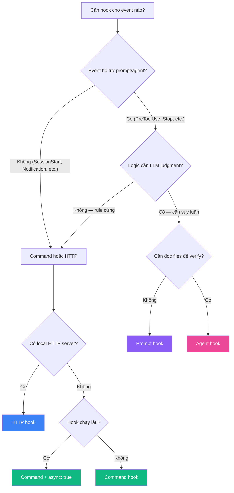
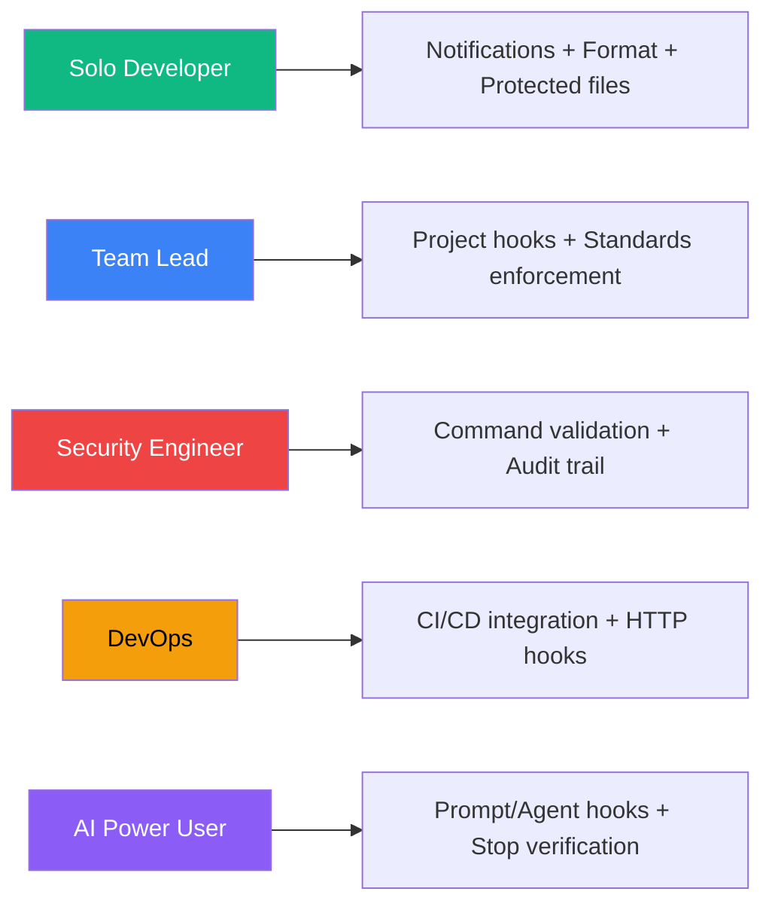

# Claude Code Hooks — Decision Guide

## 1. So sánh 4 Hook Types

### 1.1. Feature-by-Feature

| Tiêu chí | `command` | `http` | `prompt` | `agent` |
|---|---|---|---|---|
| **Cần viết script?** | ✅ Shell script | ❌ Chỉ config URL | ❌ Chỉ viết prompt | ❌ Chỉ viết prompt |
| **Tool access** | ❌ Chỉ shell | ❌ Chỉ HTTP | ❌ Không | ✅ Read, Grep, Glob |
| **Async support** | ✅ `"async": true` | ❌ | ❌ | ❌ |
| **Decision control** | ✅ Exit codes + JSON | ✅ Response JSON | ✅ `{ok, reason}` | ✅ `{ok, reason}` |
| **Latency** | ⚡ ~0.1-1s | ⚡ ~0.1-2s | 🐢 ~1-3s (LLM call) | 🐌 ~5-30s+ (multi-turn) |
| **Deterministic** | ✅ Hoàn toàn | ✅ Hoàn toàn | ⚠️ LLM-dependent | ⚠️ LLM-dependent |
| **Setup complexity** | Trung bình | Thấp (nếu có server) | Thấp | Thấp |
| **Debugging** | Dễ (`echo $?`) | Trung bình (HTTP logs) | Khó (LLM output) | Khó (multi-turn) |
| **Cost** | Free | Free | 💰 Token cost | 💰💰 Token cost cao |
| **Events hỗ trợ** | Tất cả 17 events | Tất cả 17 events | 8 events | 8 events |

### 1.2. Khi nào chọn type nào?

### 1.3. Decision Matrix — Chọn Hook Type

| Scenario | Recommendation | Lý do |
|---|---|---|
| Block file nhạy cảm (`.env`, `.git/`) | **Command** | Rule cứng, xác định, nhanh |
| Auto-format code sau edit | **Command** | Chạy CLI tool (prettier/eslint) |
| Validate command trước khi chạy | **Command** | Pattern matching, deterministic |
| Gửi notification khi cần input | **Command** | OS-level notification |
| Log tool usage ra external system | **HTTP** | Gửi data tới dashboard/API |
| Tích hợp CI/CD pipeline | **HTTP** | Webhook tới CI server |
| Kiểm tra task đã xong chưa trước khi stop | **Prompt** | Cần LLM judgment, nhanh |
| Verify tất cả tests pass trước khi stop | **Agent** | Cần chạy test suite, đọc output |
| Kiểm tra code quality trước commit | **Agent** | Cần đọc nhiều files, analyze |
| Background test runner | **Command + async** | Chạy lâu, không block |
| Audit config changes | **Command** | Simple logging, nhanh |
| Re-inject context sau compact | **Command** | Echo text đơn giản |

## 2. So sánh với Alternatives

### 2.1. Claude Code Hooks vs Git Hooks

| Tiêu chí | Claude Code Hooks | Git Hooks |
|---|---|---|
| **Scope** | AI coding workflow (tool calls, sessions, agents) | Git operations (commit, push, merge) |
| **Events** | 17+ events trong AI lifecycle | ~15 events trong git lifecycle |
| **Hook types** | 4 types (command, http, prompt, agent) | Chỉ scripts |
| **LLM integration** | ✅ Native prompt/agent hooks | ❌ Phải tự tích hợp |
| **Real-time feedback** | ✅ Inline — Claude nhận feedback ngay | ✅ Inline — block git operation |
| **Team sharing** | ✅ Project settings (`.claude/settings.json`) | ⚠️ Phải dùng tools phụ (Husky, pre-commit) |
| **Decision control** | ✅ Allow/deny/ask + input modification | ✅ Pass/fail only |
| **Async** | ✅ Built-in | ❌ |

**Kết luận:** Hai hệ thống **bổ sung cho nhau**, không thay thế. Git hooks cho git operations, Claude Code hooks cho AI workflow.

### 2.2. Claude Code Hooks vs CLAUDE.md Rules

| Tiêu chí | Hooks | CLAUDE.md |
|---|---|---|
| **Enforcement** | ✅ Deterministic (exit code = block) | ⚠️ Soft (model có thể vi phạm) |
| **Scope** | Tool-level actions | Model behavior guidance |
| **Flexibility** | Hạn chế (code logic) | Cao (natural language) |
| **Maintenance** | Cần viết/maintain scripts | Chỉ text |
| **Debug** | Dễ (exit codes, logs) | Khó (model interpretation) |

**Kết luận:** Dùng **CLAUDE.md** cho guidelines chung, **Hooks** cho hard enforcement.

### 2.3. Claude Code Hooks vs MCP Servers

| Tiêu chí | Hooks | MCP Servers |
|---|---|---|
| **Direction** | Reactive (respond to events) | Proactive (provide tools) |
| **Purpose** | Guard rails, automation, notifications | Extend capabilities |
| **Model awareness** | ⚠️ Indirect (feedback via stderr) | ✅ Direct (tools in context) |
| **Complexity** | Thấp (shell scripts) | Cao (server implementation) |
| **Use case** | Validate, block, log, notify | Database access, API calls, custom tools |

**Kết luận:** Hooks để **kiểm soát** Claude, MCP servers để **mở rộng** Claude.

### 2.4. Claude Code Hooks vs VS Code Tasks/Extensions

| Tiêu chí | Claude Code Hooks | VS Code Tasks |
|---|---|---|
| **Trigger** | AI events (tool calls, sessions) | Manual/file save/build events |
| **AI-aware** | ✅ Biết Claude đang làm gì | ❌ Không biết AI context |
| **Decision control** | ✅ Block AI actions | ❌ Không block được |
| **Setup** | JSON config | JSON config |
| **Ecosystem** | Claude Code only | VS Code only |

## 3. Khi nào NÊN dùng Hooks

### 3.1. Ideal Use Cases

| Use Case | Mô tả | Hook Setup |
|---|---|---|
| **Auto-formatting** | Format code mỗi khi Claude edit file | `PostToolUse` + `Edit\|Write` matcher |
| **Protected files** | Không cho sửa `.env`, secrets, lock files | `PreToolUse` + `Edit\|Write` matcher |
| **Command validation** | Block dangerous commands (`rm -rf`, `drop table`) | `PreToolUse` + `Bash` matcher |
| **Desktop notifications** | Nhận thông báo khi Claude chờ input | `Notification` + `*` matcher |
| **Context persistence** | Re-inject project context sau compact | `SessionStart` + `compact` matcher |
| **Audit trail** | Log mọi commands và config changes | `PostToolUse` + `Bash`, `ConfigChange` |
| **Quality gates** | Verify tests pass trước khi Claude dừng | `Stop` + prompt/agent hook |
| **Team standards** | Enforce coding standards cho cả team | Project-level hooks |
| **CI integration** | Trigger builds/tests qua HTTP | `PostToolUse` + HTTP hook |
| **MCP tool monitoring** | Audit MCP tool usage | `PreToolUse` + `mcp__.*` matcher |

### 3.2. Đối tượng phù hợp nhất

## 4. Khi nào KHÔNG nên dùng Hooks

### 4.1. Limitations

| Limitation | Mô tả | Alternative |
|---|---|---|
| **Undo actions** | `PostToolUse` không thể undo — tool đã chạy | Dùng `PreToolUse` để chặn trước |
| **Non-interactive permissions** | `PermissionRequest` không fire với `-p` flag | Dùng `PreToolUse` thay thế |
| **Complex multi-file validation** | Command hooks khó xử lý logic phức tạp | Dùng Agent hooks hoặc MCP server |
| **Real-time UI** | Hooks không có visual feedback | Dùng VS Code extension |
| **Cross-session state** | Hooks không share state giữa sessions | Dùng file-based state hoặc database |
| **User interaction** | Hooks không thể prompt user cho input | Dùng elicitation hoặc CLAUDE.md |

### 4.2. Anti-Use Cases

| Scenario | Tại sao không nên | Nên dùng gì |
|---|---|---|
| **Thay thế CLAUDE.md hoàn toàn** | Hooks chỉ enforce rules, không guide behavior | CLAUDE.md cho guidelines |
| **Complex business logic** | Shell scripts khó maintain cho logic phức tạp | MCP server hoặc dedicated service |
| **Thay thế CI/CD** | Hooks chạy local, không thay được CI pipeline | GitHub Actions, GitLab CI |
| **File watching liên tục** | Hooks chỉ fire theo events, không watch files | `fswatch`, `nodemon` |
| **Inter-session communication** | Không có built-in mechanism | External message queue |
| **Heavy computation** | Block Claude quá lâu → UX tệ | Async hooks hoặc external service |

## 5. Cost & Resource Analysis

### 5.1. Token Costs (Prompt/Agent Hooks)

| Hook Type | Model | Estimated Cost per Call | Ghi chú |
|---|---|---|---|
| **Command** | N/A | Free | Chỉ shell execution |
| **HTTP** | N/A | Free (+ server cost) | Infra cost riêng |
| **Prompt** | Haiku (default) | ~$0.001-0.005 | Single-turn, fast |
| **Agent** | Haiku (default) | ~$0.01-0.10 | Multi-turn, tool usage |

### 5.2. Performance Impact

| Hook Type | Latency | Claude blocked? | Impact |
|---|---|---|---|
| **Command (sync)** | ~0.1-1s | ✅ Có | Thấp nếu script nhanh |
| **Command (async)** | 0s (fire-and-forget) | ❌ Không | Không impact |
| **HTTP** | ~0.1-2s | ✅ Có | Phụ thuộc server |
| **Prompt** | ~1-3s | ✅ Có | Noticeable nhưng chấp nhận được |
| **Agent** | ~5-30s+ | ✅ Có | Đáng kể — chỉ dùng khi cần |

### 5.3. Resource Requirements

| Resource | Mô tả |
|---|---|
| **Disk** | Minimal — chỉ JSON config + scripts |
| **Memory** | Mỗi hook spawn process riêng, giải phóng sau khi xong |
| **Network** | HTTP hooks cần local server. Prompt/agent hooks cần API access |
| **Dependencies** | `jq` (recommended), shell, Prettier/ESLint (optional) |

## 6. Migration Path

### 6.1. Từ manual workflow → Hooks

| Bước | Hành động | Ưu tiên |
|---|---|---|
| 1 | Cài `jq` nếu chưa có | Cao |
| 2 | Tạo Notification hook cho `permission_prompt` + `idle_prompt` | Cao |
| 3 | Thêm auto-format hook (`PostToolUse` + Prettier) | Trung bình |
| 4 | Tạo protected files list (`PreToolUse` block) | Trung bình |
| 5 | Thêm SessionStart hook cho context persistence | Thấp |
| 6 | Cân nhắc prompt/agent hooks cho Stop verification | Thấp |

### 6.2. Từ Git Hooks → Claude Code Hooks

| Git Hook | Claude Code Equivalent | Migration |
|---|---|---|
| `pre-commit` (lint) | `PostToolUse` + `Edit\|Write` + linter | Chuyển lint script sang hook |
| `pre-push` (tests) | `Stop` + agent hook (run tests) | Dùng agent hook verify tests |
| `commit-msg` (format) | Không tương đương trực tiếp | Giữ git hook |
| `post-merge` (install) | Không tương đương trực tiếp | Giữ git hook |

**Lưu ý:** Claude Code Hooks **không thay thế** Git hooks. Chúng bổ sung cho nhau — Git hooks cho git operations, Claude Code hooks cho AI workflow.

### 6.3. Từ CLAUDE.md rules → Hooks (cho enforcement)

| CLAUDE.md Rule | Hook Enforcement |
|---|---|
| "Không sửa file .env" | `PreToolUse` + `Edit\|Write` + check `.env` → exit 2 |
| "Chạy tests trước khi commit" | `Stop` + agent hook verify tests |
| "Dùng Bun thay npm" | `PreToolUse` + `Bash` + check `npm` in command → deny + suggest bun |
| "Format code với Prettier" | `PostToolUse` + `Edit\|Write` + prettier --write |

## 7. Roadmap & Tương lai

### 7.1. Hệ sinh thái hiện tại

| Component | Status | Maturity |
|---|---|---|
| Command hooks | ✅ Stable | Production-ready |
| HTTP hooks | ✅ Stable | Production-ready |
| Prompt hooks | ✅ Stable | Production-ready |
| Agent hooks | ✅ Stable | Production-ready |
| Async hooks | ✅ Stable | Production-ready |
| Plugin hooks | ✅ Stable | Production-ready |
| Skill hooks | ✅ Stable | Production-ready |
| `/hooks` menu | ✅ Stable | Production-ready |

### 7.2. Community & Ecosystem

| Aspect | Mô tả |
|---|---|
| **Documentation** | Official docs tại [code.claude.com/docs/en/hooks](https://code.claude.com/docs/en/hooks) |
| **Examples** | Reference implementation: [bash_command_validator_example.py](https://github.com/anthropics/claude-code/blob/main/examples/hooks/bash_command_validator_example.py) |
| **Plugin marketplace** | Hooks có thể đóng gói trong plugins để distribute |
| **Community** | Anthropic Discord, GitHub discussions |
| **Updates** | Claude Code releases thường xuyên, hooks API ổn định |

### 7.3. Xu hướng phát triển

| Xu hướng | Mô tả |
|---|---|
| **Agent Teams integration** | `TeammateIdle`, `TaskCompleted` hooks cho multi-agent orchestration |
| **Worktree hooks** | `WorktreeCreate`/`Remove` cho parallel development |
| **Config governance** | `ConfigChange` hooks cho enterprise policy enforcement |
| **LLM-powered verification** | Prompt/agent hooks ngày càng phổ biến cho quality gates |

## 8. Ma trận Ra quyết định — Tổng kết

### 8.1. "Tôi có nên dùng Claude Code Hooks?"

| Điều kiện | Có → Dùng | Không → Bỏ qua |
|---|---|---|
| Dùng Claude Code hàng ngày | ✅ | — |
| Cần notifications khi Claude chờ | ✅ | — |
| Muốn auto-format code | ✅ | — |
| Có files không được sửa | ✅ | — |
| Cần audit trail cho AI actions | ✅ | — |
| Chỉ dùng Claude Code thỉnh thoảng | — | ❌ Over-engineering |
| Workflow đơn giản, không cần guard rails | — | ❌ Không cần thiết |

### 8.2. "Tôi nên bắt đầu với hook nào?"

| Priority | Hook | Effort | Impact |
|---|---|---|---|
| 🥇 **P0** | Notification (`permission_prompt` + `idle_prompt`) | 2 phút | Cao — không bỏ lỡ prompts |
| 🥈 **P1** | Auto-format (`PostToolUse` + Prettier) | 5 phút | Cao — code luôn clean |
| 🥉 **P2** | Protected files (`PreToolUse` block) | 10 phút | Trung bình — bảo vệ secrets |
| 4 | Context persistence (`SessionStart` compact) | 5 phút | Trung bình — giữ context |
| 5 | Command logging (`PostToolUse` Bash) | 3 phút | Thấp — audit trail |
| 6 | Stop verification (prompt/agent) | 10 phút | Thấp — quality gate |

### 8.3. Full Decision Matrix

| Scenario | Hook Type | Event | Matcher | Difficulty | ROI |
|---|---|---|---|---|---|
| Desktop notification khi cần input | Command | Notification | `*` | ⭐ | ⭐⭐⭐⭐⭐ |
| Auto-format code | Command | PostToolUse | `Edit\|Write` | ⭐⭐ | ⭐⭐⭐⭐ |
| Block protected files | Command | PreToolUse | `Edit\|Write` | ⭐⭐ | ⭐⭐⭐⭐ |
| Block dangerous commands | Command | PreToolUse | `Bash` | ⭐⭐ | ⭐⭐⭐⭐ |
| Re-inject context | Command | SessionStart | `compact` | ⭐ | ⭐⭐⭐ |
| Audit config changes | Command | ConfigChange | `""` | ⭐ | ⭐⭐⭐ |
| Log all commands | Command | PostToolUse | `Bash` | ⭐ | ⭐⭐ |
| CI/CD webhook | HTTP | PostToolUse | `Write\|Edit` | ⭐⭐⭐ | ⭐⭐⭐ |
| Verify tasks complete | Prompt | Stop | — | ⭐⭐ | ⭐⭐⭐ |
| Run tests before stop | Agent | Stop | — | ⭐⭐⭐ | ⭐⭐⭐ |
| Monitor MCP tools | Command | PreToolUse | `mcp__.*` | ⭐⭐ | ⭐⭐ |
| Async test runner | Command (async) | PostToolUse | `Write\|Edit` | ⭐⭐⭐ | ⭐⭐⭐ |
| Persist env vars | Command | SessionStart | `startup` | ⭐⭐ | ⭐⭐ |
| Clean up temp files | Command | SessionEnd | `clear` | ⭐ | ⭐⭐ |

## Xem thêm

- [[3-Research/Claude Code/claude-code-hooks/0. Overview]] — Tổng quan hệ thống, vấn đề giải quyết, kiến trúc
- [[3-Research/Claude Code/claude-code-hooks/1. Architecture and Logic]] — Data flow chi tiết, JSON schemas, decision control
- [[3-Research/Claude Code/claude-code-hooks/2. Playbook]] — Hướng dẫn cài đặt, Day 1 workflow, cheat sheet, troubleshooting
