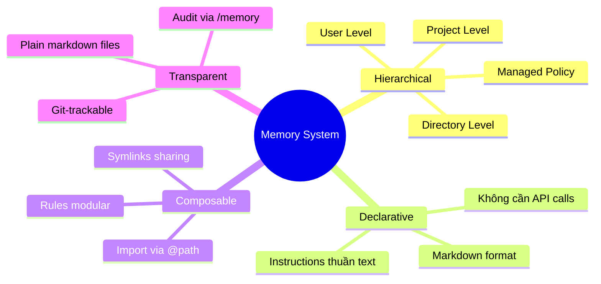
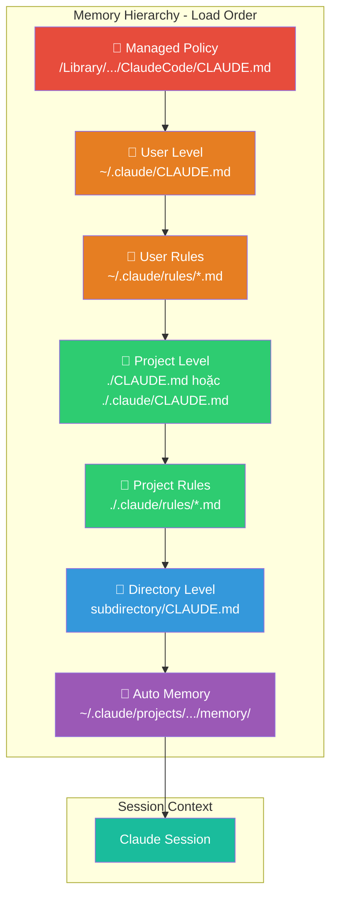
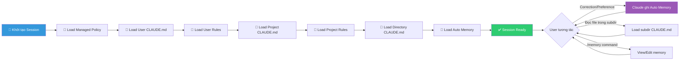

# Claude Code Memory — Tổng quan

## 1. Claude Code Memory là gì?

**Claude Code Memory** là hệ thống bộ nhớ bền vững (persistent memory) của Claude Code, cho phép Claude **ghi nhớ context, quy tắc, và kiến thức** xuyên suốt các phiên làm việc (sessions). Thay vì phải lặp lại hướng dẫn mỗi lần mở terminal mới, Memory giúp Claude tự động nạp những thông tin quan trọng ngay từ đầu phiên.

Hệ thống gồm **2 cơ chế chính**:

| Đặc điểm | CLAUDE.md files | Auto Memory |
|---|---|---|
| **Ai viết** | Bạn (developer) | Claude tự viết |
| **Nội dung** | Instructions, rules, conventions | Learnings, patterns, corrections |
| **Phạm vi** | Project, User, hoặc Organization | Per working tree (theo project) |
| **Nạp vào session** | Mọi session | Mọi session (200 dòng đầu MEMORY.md) |
| **Định dạng** | Markdown tự do | Markdown tự động sinh |
| **Kiểm soát** | Hoàn toàn bởi bạn | Review/edit qua `/memory` |

## 2. Vấn đề giải quyết

| Vấn đề | Mô tả | Cách Memory giải quyết |
|---|---|---|
| **Context mất sau mỗi session** | Claude không nhớ gì từ phiên trước | CLAUDE.md + auto memory nạp lại context tự động |
| **Lặp lại instructions** | Phải nhắc đi nhắc lại coding style, conventions | Viết 1 lần trong CLAUDE.md, áp dụng mãi |
| **Onboarding chậm** | Team member mới không biết conventions | CLAUDE.md commit vào repo = shared knowledge |
| **Claude quên corrections** | Sửa lỗi rồi, session sau lại mắc lại | Auto memory ghi lại learnings tự động |
| **Config khác nhau per team** | Frontend team vs Backend team cần rules khác | `.claude/rules/` với path-specific scoping |
| **Organization standards** | Cần enforce rules toàn công ty | Managed policy CLAUDE.md ở system level |

## 3. Triết lý thiết kế

**Nguyên tắc cốt lõi:**

| Nguyên tắc | Giải thích |
|---|---|
| **Simplicity** | Chỉ cần tạo file `.md` — không cần config phức tạp |
| **Hierarchy** | Rules cascade từ system → user → project → directory |
| **Specificity** | Rules cụ thể (path-scoped) ưu tiên hơn rules chung |
| **Transparency** | Mọi memory đều đọc/sửa được — không có black box |
| **Team-first** | CLAUDE.md commit vào repo = shared across team |

## 4. Ai nên dùng?

| Đối tượng | Lý do |
|---|---|
| **Solo developer** | Tăng tốc workflow, không lặp lại instructions |
| **Team lead** | Enforce coding standards qua shared CLAUDE.md |
| **Enterprise** | Deploy org-wide policies, compliance rules |
| **OSS maintainer** | Onboard contributors nhanh với project CLAUDE.md |
| **AI-native developer** | Maximize Claude's context awareness |

## 5. Kiến trúc tổng quan

| Layer | Vị trí | Phạm vi | Ví dụ nội dung |
|---|---|---|---|
| **Managed Policy** | `/Library/Application Support/ClaudeCode/CLAUDE.md` | Toàn bộ máy (org-wide) | Security policies, compliance |
| **User** | `~/.claude/CLAUDE.md` | Mọi project của user | Coding style cá nhân |
| **User Rules** | `~/.claude/rules/*.md` | Mọi project của user | Personal workflows |
| **Project** | `./CLAUDE.md` hoặc `./.claude/CLAUDE.md` | Dự án hiện tại | Project conventions, tech stack |
| **Project Rules** | `./.claude/rules/*.md` | Dự án (path-scoped) | API rules, testing rules |
| **Directory** | `subdirectory/CLAUDE.md` | Subdirectory cụ thể | Module-specific instructions |
| **Auto Memory** | `~/.claude/projects/<project>/memory/` | Per working tree | Learnings, patterns discovered |

## 6. Vòng đời / Workflow chính

**Luồng hoạt động:**

1. **Session khởi tạo** → Claude tự động load tất cả CLAUDE.md files theo hierarchy
2. **Trong session** → Claude đọc thêm directory-level CLAUDE.md khi navigate vào subdirectories
3. **User sửa sai** → Auto memory tự ghi lại correction/pattern
4. **Review** → User dùng `/memory` để audit và chỉnh sửa memory
5. **Session kết thúc** → Auto memory persist, sẵn sàng cho session tiếp theo

## 7. Tính năng nổi bật

| # | Tính năng | Mô tả |
|---|---|---|
| 1 | **Hierarchical Loading** | 6 layers từ system → directory, tự động merge |
| 2 | **Path-Scoped Rules** | Rules chỉ apply cho file types/folders cụ thể via `paths:` frontmatter |
| 3 | **@import System** | Import file bên ngoài vào CLAUDE.md bằng `@path/to/file` |
| 4 | **Auto Memory** | Claude tự ghi learnings từ corrections — không cần user action |
| 5 | **`/memory` Command** | UI tích hợp để view, edit, delete memories |
| 6 | **`--add-dir` Support** | Load CLAUDE.md từ directories bên ngoài project |
| 7 | **Symlink Sharing** | Share rules across projects via filesystem symlinks |
| 8 | **`claudeMdExcludes`** | Exclude specific CLAUDE.md files trong monorepo/large teams |
| 9 | **Team Scalability** | Org-wide managed policy + per-team rules + per-dev preferences |
| 10 | **Compact Survival** | CLAUDE.md instructions survive `/compact` — chat-only instructions thì không |

## 8. So sánh với các cách tiếp cận khác

| Tiêu chí | Claude Code Memory | Cursor Rules | GitHub Copilot Instructions | Codeium Context |
|---|---|---|---|---|
| **Cấu trúc** | Hierarchical (6 layers) | Flat `.cursorrules` | Single `.github/copilot-instructions.md` | Project-level |
| **Auto learning** | ✅ Auto Memory | ❌ | ❌ | ❌ |
| **Path scoping** | ✅ `paths:` frontmatter | ❌ | ❌ | ❌ |
| **Team sharing** | ✅ Git + Managed Policy | ✅ Git | ✅ Git | ✅ Git |
| **Import system** | ✅ `@path` | ❌ | ❌ | ❌ |
| **Org-wide policy** | ✅ Managed Policy | ❌ | ❌ | ❌ |
| **Audit tool** | ✅ `/memory` | ❌ | ❌ | ❌ |

## 9. Điểm mới đáng chú ý

| Feature | Chi tiết |
|---|---|
| **Auto Memory với topic files** | Memory được tổ chức thành nhiều file theo topic (debugging.md, api-conventions.md...) thay vì 1 file duy nhất |
| **`claudeMdExcludes`** | Setting mới cho phép exclude CLAUDE.md files trong monorepo environments |
| **`--add-dir` + env var** | Hỗ trợ load CLAUDE.md từ shared config directories bên ngoài project |
| **InstructionsLoaded hook** | Hook để debug chính xác file nào đang được load |
| **Subagent memory** | Sub-agents có thể duy trì auto memory riêng |

## 10. Xem thêm

- [1. Architecture and Logic](./1. Architecture and Logic.md) — Cơ chế load, data flow, path resolution chi tiết
- [2. Playbook](./2. Playbook.md) — Hướng dẫn cài đặt, cấu hình, và vận hành Memory
