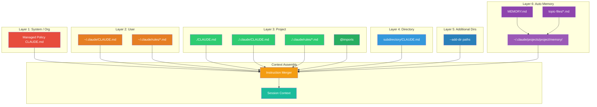
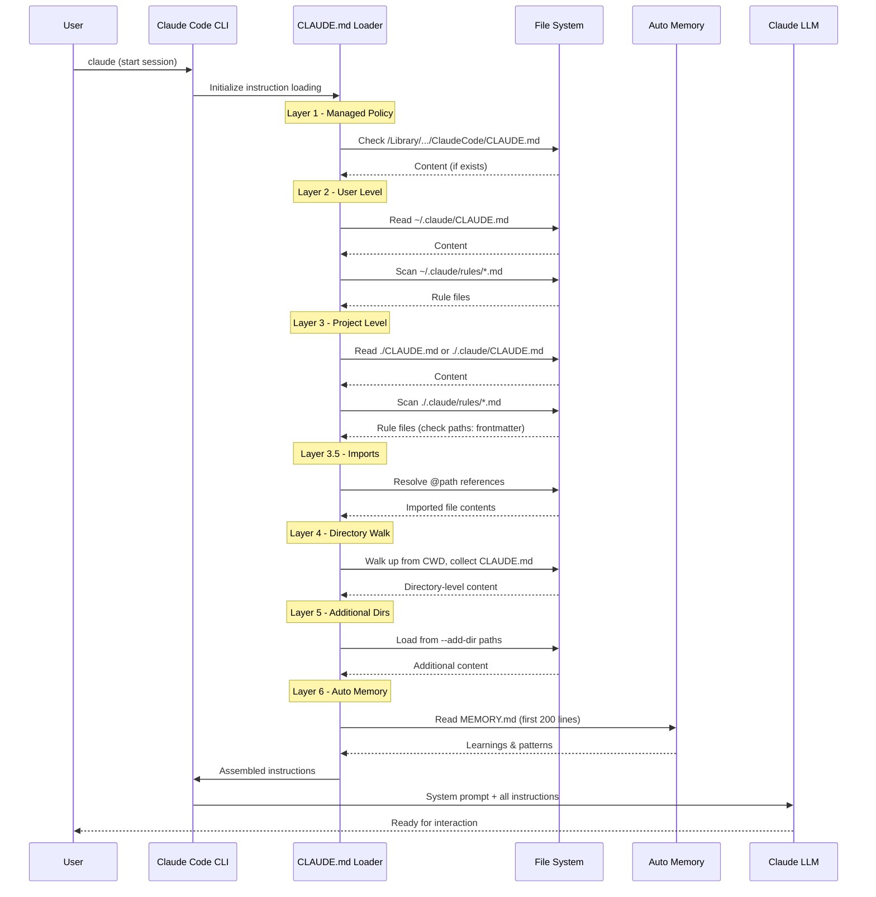
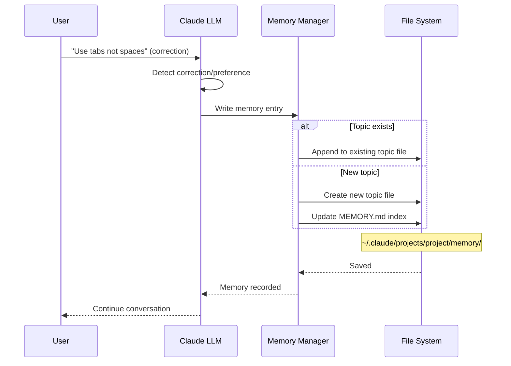
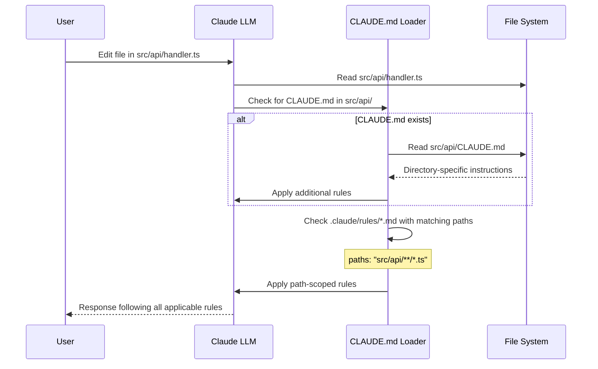
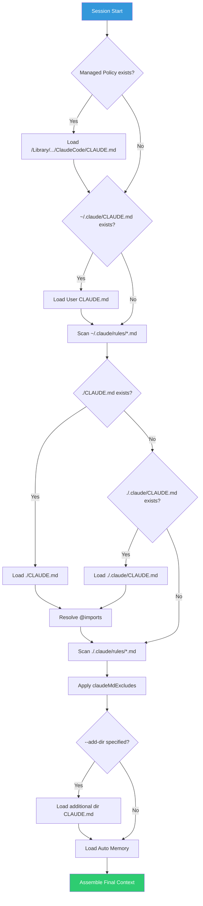
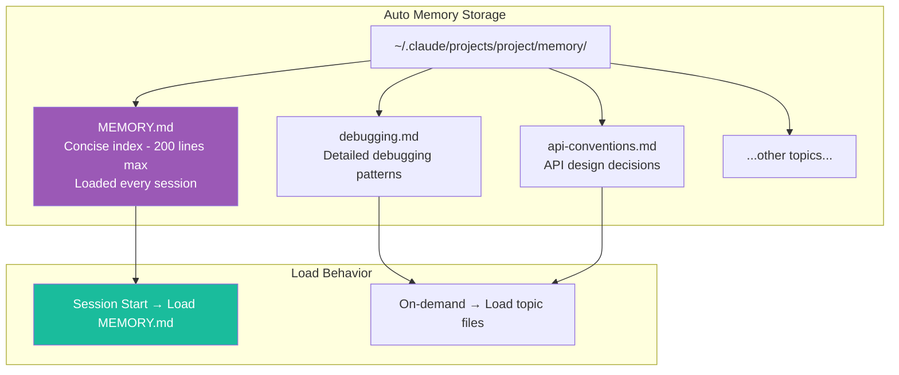

# Claude Code Memory — Architecture and Logic

## 1. Mô hình kiến trúc tổng thể



**Kiến trúc 3 trụ cột:**

| Trụ cột | Thành phần | Mô tả |
|---|---|---|
| **Static Instructions** | CLAUDE.md files (all layers) | Developer viết, deterministic, version-controlled |
| **Modular Rules** | `.claude/rules/*.md` | Path-scoped, composable, sharable via symlinks |
| **Dynamic Learning** | Auto Memory | Claude tự sinh, per-project, evolving over time |

## 2. Data Flow chi tiết

### 2.1. Session Initialization Flow



### 2.2. Auto Memory Write Flow



### 2.3. Directory Navigation Flow



## 3. Core Modules / Components

| Module | Vai trò | Input | Output |
|---|---|---|---|
| **CLAUDE.md Loader** | Scan & load tất cả CLAUDE.md files theo hierarchy | File system paths | Merged instruction text |
| **Import Resolver** | Resolve `@path/to/file` references | CLAUDE.md content | Expanded content with imports |
| **Rules Engine** | Load & filter `.claude/rules/*.md` theo `paths:` frontmatter | Rule files + current file path | Applicable rules |
| **Directory Walker** | Walk up directory tree tìm CLAUDE.md | CWD + file being edited | Directory-level instructions |
| **Auto Memory Manager** | Read/write MEMORY.md và topic files | Conversation context | Persisted learnings |
| **Memory UI** | `/memory` command handler | User command | Interactive view/edit |
| **Exclusion Filter** | Apply `claudeMdExcludes` patterns | All discovered CLAUDE.md | Filtered list |
| **Instruction Merger** | Combine tất cả sources thành final context | All instruction sources | Unified system prompt |

## 4. Cơ chế hoạt động nội bộ

### 4.1. CLAUDE.md Discovery Algorithm



### 4.2. Path-Scoped Rules Resolution

Khi Claude đang làm việc với file `src/api/users.ts`:

```
.claude/rules/
├── code-style.md          # Không có paths: → apply cho TẤT CẢ files
├── testing.md             # paths: ["tests/**/*.test.ts"] → KHÔNG apply
├── api-design.md          # paths: ["src/api/**/*.ts"] → APPLY ✅
└── security.md            # paths: ["src/**/*"] → APPLY ✅
```

**Logic matching:**

| Rule file | `paths:` value | File đang edit | Match? |
|---|---|---|---|
| `code-style.md` | _(không có)_ | `src/api/users.ts` | ✅ Apply (global) |
| `testing.md` | `["tests/**/*.test.ts"]` | `src/api/users.ts` | ❌ Skip |
| `api-design.md` | `["src/api/**/*.ts"]` | `src/api/users.ts` | ✅ Apply |
| `security.md` | `["src/**/*"]` | `src/api/users.ts` | ✅ Apply |

**Glob patterns được hỗ trợ:**

| Pattern | Ý nghĩa | Ví dụ |
|---|---|---|
| `**/*.ts` | Mọi file .ts ở bất kỳ depth | `src/deep/nested/file.ts` |
| `src/**/*` | Mọi file trong src/ | `src/api/handler.ts` |
| `*.md` | Chỉ file .md ở root | `README.md` |
| `src/components/*.tsx` | File .tsx trực tiếp trong components/ | `src/components/Button.tsx` |
| `src/**/*.{ts,tsx}` | File .ts hoặc .tsx trong src/ | `src/utils/helper.ts` |

### 4.3. Import Resolution (`@path`)

```
# CLAUDE.md
See @README for project overview and @package.json for available npm commands.

# Additional Instructions
- Git workflow: @docs/git-instructions.md

# Individual Preferences
- @~/.claude/my-project-instructions.md
```

**Resolution rules:**

| Syntax | Resolve to | Scope |
|---|---|---|
| `@README` | `./README.md` (hoặc `./README`) | Project-relative |
| `@package.json` | `./package.json` | Project-relative |
| `@docs/git-instructions.md` | `./docs/git-instructions.md` | Project-relative |
| `@~/.claude/my-instructions.md` | `$HOME/.claude/my-instructions.md` | User home |

**Lưu ý:** Import content được inline vào context — không phải lazy load.

### 4.4. Auto Memory Internal Architecture



**Cách Auto Memory hoạt động:**

| Bước | Action | Chi tiết |
|---|---|---|
| 1 | **Detection** | Claude nhận ra user correction hoặc preference mới |
| 2 | **Classification** | Xác định topic phù hợp (debugging, style, API...) |
| 3 | **Write** | Ghi vào topic file tương ứng hoặc tạo file mới |
| 4 | **Index Update** | Cập nhật MEMORY.md index nếu cần |
| 5 | **Load** | Session tiếp theo: MEMORY.md được load tự động |

**MEMORY.md** là file chính — luôn được load vào mọi session (200 dòng đầu). Các topic files chỉ được load on-demand khi cần.

### 4.5. Directory Walk Algorithm

Khi Claude đang làm việc trong `foo/bar/`:

```
project-root/
├── CLAUDE.md              ← Level 0 (project root) — ALWAYS loaded
├── foo/
│   ├── CLAUDE.md          ← Level 1 — loaded khi work trong foo/
│   └── bar/
│       └── CLAUDE.md      ← Level 2 — loaded khi work trong foo/bar/
```

Claude **walk UP** từ directory hiện tại lên root, load theo thứ tự:
1. `foo/bar/CLAUDE.md`
2. `foo/CLAUDE.md`
3. `./CLAUDE.md` (project root — luôn load)

## 5. Configuration / API

### 5.1. Settings ảnh hưởng Memory

| Setting | Vị trí | Giá trị | Default | Mô tả |
|---|---|---|---|---|
| `autoMemoryEnabled` | `.claude/settings.json` | `true` / `false` | `true` | Bật/tắt auto memory |
| `claudeMdExcludes` | `.claude/settings.local.json` | Array of glob patterns | `[]` | Exclude CLAUDE.md files |

### 5.2. Environment Variables

| Variable | Giá trị | Mô tả |
|---|---|---|
| `CLAUDE_CODE_DISABLE_AUTO_MEMORY` | `1` | Tắt auto memory hoàn toàn |
| `CLAUDE_CODE_ADDITIONAL_DIRECTORIES_CLAUDE_MD` | `1` | Cho phép load CLAUDE.md từ `--add-dir` paths |

### 5.3. CLI Flags

| Flag | Ví dụ | Mô tả |
|---|---|---|
| `--add-dir` | `claude --add-dir ../shared-config` | Load CLAUDE.md từ directory bổ sung |

### 5.4. Slash Commands

| Command | Mô tả |
|---|---|
| `/memory` | Xem và chỉnh sửa auto memory interactively |
| `/init` | Tạo CLAUDE.md mới cho project hiện tại |
| `/compact` | Compact conversation nhưng giữ lại CLAUDE.md instructions |

### 5.5. CLAUDE.md File Locations Summary

| Scope | Path (macOS) | Path (Linux/WSL) | Path (Windows) |
|---|---|---|---|
| **Managed Policy** | `/Library/Application Support/ClaudeCode/CLAUDE.md` | `/etc/claude-code/CLAUDE.md` | `C:\Program Files\ClaudeCode\CLAUDE.md` |
| **User** | `~/.claude/CLAUDE.md` | `~/.claude/CLAUDE.md` | `~/.claude/CLAUDE.md` |
| **User Rules** | `~/.claude/rules/*.md` | `~/.claude/rules/*.md` | `~/.claude/rules/*.md` |
| **Project** | `./CLAUDE.md` hoặc `./.claude/CLAUDE.md` | ← tương tự | ← tương tự |
| **Project Rules** | `./.claude/rules/*.md` | ← tương tự | ← tương tự |

### 5.6. `claudeMdExcludes` Configuration

```json
// .claude/settings.local.json
{
  "claudeMdExcludes": [
    "**/monorepo/CLAUDE.md",
    "/home/user/monorepo/other-team/.claude/rules/**"
  ]
}
```

`claudeMdExcludes` có thể đặt ở bất kỳ [settings layer](https://code.claude.com/docs/en/settings#settings-files) nào.

### 5.7. Path-Scoped Rules Frontmatter

```yaml
---
paths:
  - "src/api/**/*.ts"
---

# API Development Rules

- All API endpoints must include input validation
- Use the standard error response format
- Include OpenAPI documentation comments
```

**Hỗ trợ multi-pattern:**

```yaml
---
paths:
  - "src/**/*.{ts,tsx}"
  - "lib/**/*.ts"
  - "tests/**/*.test.ts"
---
```

## 6. Error Handling / Recovery

| Vấn đề | Nguyên nhân | Giải pháp |
|---|---|---|
| **Claude không tuân theo CLAUDE.md** | File chưa được load — sai vị trí | Chạy `/memory` kiểm tra files đang load |
| **Instructions quá mơ hồ** | "Format code nicely" thay vì cụ thể | Viết cụ thể: "Use 2-space indentation" |
| **Xung đột giữa nhiều CLAUDE.md** | 2 files cho hướng dẫn trái ngược | Review tất cả files, loại bỏ xung đột |
| **Auto memory lưu nhầm** | Claude hiểu sai correction | Dùng `/memory` để review và delete |
| **CLAUDE.md quá lớn** | File > 200 dòng → giảm adherence | Split sang `@imports` hoặc `.claude/rules/` |
| **Instructions mất sau `/compact`** | Instructions chỉ nói trong chat, không trong CLAUDE.md | Persist instructions vào CLAUDE.md file |
| **Monorepo conflict** | Team khác có CLAUDE.md xung đột | Dùng `claudeMdExcludes` để exclude |

## 7. Security

| Khía cạnh | Chi tiết |
|---|---|
| **Managed Policy** | IT admins deploy org-wide rules — users không thể override |
| **Local-only storage** | Auto memory chỉ lưu local (`~/.claude/`), không gửi lên cloud |
| **Git-trackable** | Project CLAUDE.md commit vào repo → audit trail |
| **Exclude sensitive** | `claudeMdExcludes` ngăn load files không mong muốn |
| **User control** | `/memory` cho phép review/delete bất kỳ auto memory nào |
| **No black box** | Tất cả memory đều là plain markdown — đọc được bằng bất kỳ text editor nào |

## 8. Xem thêm

- [0. Overview](./0. Overview.md) — Tổng quan hệ thống Memory, so sánh, tính năng nổi bật
- [2. Playbook](./2. Playbook.md) — Hướng dẫn thực hành cài đặt, cấu hình, và vận hành
