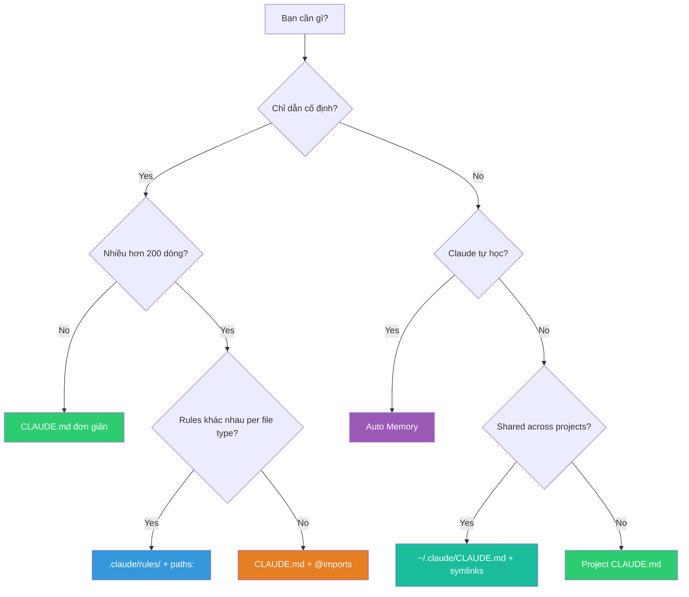

# Claude Code Memory — Decision Guide

## 1. So sánh với Alternatives

### 1.1. Feature-by-Feature Comparison

| Tiêu chí | Claude Code Memory | Cursor Rules (`.cursorrules`) | GitHub Copilot Instructions | Codeium / Windsurf Rules | Aider Conventions |
|---|---|---|---|---|---|
| **Cấu trúc** | Hierarchical 6 layers | Single flat file | Single file `.github/copilot-instructions.md` | Project-level config | `.aider.conf.yml` + conventions |
| **Auto learning** | ✅ Auto Memory | ❌ | ❌ | ❌ | ❌ |
| **Path scoping** | ✅ `paths:` frontmatter | ❌ | ❌ | ❌ | ❌ |
| **Import system** | ✅ `@path/to/file` | ❌ | ❌ | ❌ | ❌ |
| **Org-wide policy** | ✅ Managed Policy | ❌ | ❌ | ❌ | ❌ |
| **User-level rules** | ✅ `~/.claude/` | ❌ Global only | ❌ | ✅ Global config | ✅ Global config |
| **Directory-level** | ✅ Subdirectory CLAUDE.md | ❌ | ❌ | ❌ | ❌ |
| **Audit tool** | ✅ `/memory` command | ❌ | ❌ | ❌ | ❌ |
| **Team sharing** | ✅ Git + symlinks | ✅ Git | ✅ Git | ✅ Git | ✅ Git |
| **Modular rules** | ✅ `.claude/rules/*.md` | ❌ | ❌ | ❌ | ❌ |
| **Exclude mechanism** | ✅ `claudeMdExcludes` | ❌ | ❌ | ❌ | ❌ |
| **Format** | Markdown tự do | Markdown tự do | Markdown tự do | YAML/Markdown | YAML |
| **Survive compact** | ✅ | N/A | N/A | N/A | N/A |
| **Max recommended size** | ~200 lines (main file) | Không giới hạn chính thức | Không giới hạn chính thức | Tùy tool | ~50 lines |

### 1.2. Strengths & Weaknesses


| Aspect | Claude Code Memory Strengths | Claude Code Memory Weaknesses |
|---|---|---|
| **Flexibility** | 6 layers, path-scoping, imports — rất linh hoạt | Complexity curve — nhiều locations có thể gây confuse |
| **Team** | Symlinks, managed policy, excludes — scale tốt | Cần convention rõ ràng trong team, nếu không sẽ conflict |
| **Learning** | Auto memory tự ghi — unique feature | Có thể lưu info sai, cần audit thường xuyên |
| **Debugging** | `/memory` rõ ràng, transparent | Nhiều sources = khó debug khi rules conflict |
| **Portability** | Markdown thuần — chuyển tool dễ | Specific features (`@import`, `paths:`) không portable |

## 2. Khi nào NÊN dùng

### 2.1. Use cases lý tưởng

| Scenario | Lý do dùng Claude Memory | Chiến lược khuyến nghị |
|---|---|---|
| **Solo dev, nhiều projects** | User CLAUDE.md + per-project rules = consistent style | `~/.claude/CLAUDE.md` global + `./CLAUDE.md` per project |
| **Team 3-15 người** | Shared conventions qua Git, path-scoped rules cho sub-teams | Project CLAUDE.md + `.claude/rules/` committed |
| **Enterprise / Monorepo** | Managed policy + team exclusions + org standards | Managed Policy + per-package CLAUDE.md + `claudeMdExcludes` |
| **OSS project** | Onboard contributors nhanh, enforce contribution standards | Project CLAUDE.md + CONTRIBUTING.md `@import` |
| **Dự án dài hạn** | Auto memory tích lũy knowledge theo thời gian | Enable auto memory + review `/memory` hàng tuần |
| **Multi-language monorepo** | Path-scoped rules cho TypeScript vs Python vs Go | `.claude/rules/` với `paths:` frontmatter per language |
| **Freelancer nhiều clients** | User-level preferences + per-client project rules | `~/.claude/CLAUDE.md` (style riêng) + `./CLAUDE.md` (client rules) |
| **Brownfield codebase** | Claude học patterns từ corrections qua auto memory | Auto memory ON + periodically codify vào CLAUDE.md |

### 2.2. Decision Matrix — Nên dùng feature nào?



## 3. Khi nào KHÔNG nên dùng

### 3.1. Limitations

| Limitation | Chi tiết | Workaround |
|---|---|---|
| **Không phải database** | Memory là text files — không query, không index | Giữ concise, organize theo topics |
| **200-line soft cap** | CLAUDE.md > 200 lines → giảm adherence | Split sang rules + imports |
| **Auto memory noise** | Claude có thể lưu info không chính xác | Review định kỳ, delete entries sai |
| **Không cross-session state** | Memory chỉ cung cấp instructions, không lưu session state | Dùng Git commits, notes, hoặc external tools cho state |
| **Conflict resolution** | Khi 2 CLAUDE.md files cho hướng dẫn trái nhau — Claude chọn arbitrary | Audit tất cả files, loại bỏ conflicts |

### 3.2. Anti-use-cases

| Scenario | Tại sao KHÔNG nên | Thay thế |
|---|---|---|
| **Lưu toàn bộ documentation** | CLAUDE.md không phải wiki — quá dài = giảm hiệu quả | Link tới docs bằng `@path`, không copy paste |
| **Project config phức tạp** | Memory là instructions, không phải config management | Dùng `tsconfig.json`, `.eslintrc`, etc. cho machine config |
| **Sensitive secrets** | CLAUDE.md commit vào Git → lộ secrets | Dùng `.env`, vault, hoặc secret managers |
| **Real-time collaboration** | Memory files static — không sync real-time | Dùng Git + PR reviews cho collaborative editing |
| **Cross-tool portability** | `@imports`, `paths:`, auto memory là Claude-specific | Viết CLAUDE.md content generic + tool-specific files riêng |
| **Chỉ dùng Claude 1-2 lần** | Setup overhead không xứng đáng cho one-off tasks | Chỉ cần nói instructions trong chat |

## 4. Case Studies / Ví dụ thực tế

### 4.1. Solo Developer — TypeScript Full-Stack

**Setup:**
```
~/.claude/CLAUDE.md          → Personal: "Prefer functional, strict TS"
project/CLAUDE.md            → Project: Tech stack, folder structure
project/.claude/rules/
├── api.md                   → paths: ["src/api/**"] API conventions
└── frontend.md              → paths: ["src/components/**"] React rules
```

**Kết quả:** Claude consistent follow TypeScript conventions, API validation, React patterns — không cần nhắc lại mỗi session. Auto memory ghi nhớ team's error format sau 1 lần correction.

### 4.2. Team 8 người — SaaS Product

**Setup:**
```
CLAUDE.md (committed)        → Shared: coding standards, git workflow
.claude/rules/ (committed)
├── code-style.md            → 2-space indent, naming conventions
├── api.md                   → paths: ["src/api/**"] REST API rules
├── db.md                    → paths: ["src/models/**"] Prisma conventions
└── testing.md               → paths: ["tests/**"] Testing standards

.claude/settings.local.json  → Personal (gitignored): excludes

~/.claude/CLAUDE.md          → Personal: individual preferences
```

**Kết quả:** Mọi team member có consistent Claude behavior. Frontend dev exclude backend rules via `claudeMdExcludes`. New member onboard chỉ cần `git pull` — Claude đã có full context.

### 4.3. Enterprise Monorepo

**Setup:**
```
/Library/.../ClaudeCode/CLAUDE.md  → IT deploys: security, compliance
monorepo/CLAUDE.md                  → Org-wide: shared conventions
monorepo/packages/frontend/.claude/  → Frontend team rules
monorepo/packages/backend/.claude/   → Backend team rules
monorepo/packages/ml/.claude/        → ML team rules

Each team has claudeMdExcludes for other teams' rules
```

**Kết quả:** Security policies enforced org-wide (cannot be overridden). Teams có autonomy trong rules riêng mà không conflict. CISO deploy compliance updates centrally.

## 5. Chi phí & Tài nguyên

### 5.1. Token/Context Cost

| Component | Estimated Token Cost | Impact |
|---|---|---|
| **CLAUDE.md 50 lines** | ~200-400 tokens | Minimal — recommended starting point |
| **CLAUDE.md 200 lines** | ~800-1600 tokens | Acceptable — soft cap |
| **CLAUDE.md 500+ lines** | ~2000-4000 tokens | Significant — giảm context for actual work |
| **Auto Memory MEMORY.md** | ~200-800 tokens | Loaded automatically (200 lines cap) |
| **Each .claude/rules/ file** | ~100-500 tokens | Only loaded when path matches |
| **@imports** | Varies | Content fully inlined — tính vào total |

### 5.2. Setup Time

| Scenario | Thời gian setup | ROI |
|---|---|---|
| **Basic CLAUDE.md** | 5-10 phút | Immediate — session đầu tiên đã thấy khác biệt |
| **Rules directory** | 15-30 phút | High — path-scoped rules tiết kiệm hàng giờ/tuần |
| **Team setup** | 1-2 giờ | Very high — consistency across entire team |
| **Enterprise deployment** | 2-4 giờ | Critical — org-wide compliance |

### 5.3. Maintenance Cost

| Activity | Frequency | Time |
|---|---|---|
| Review auto memory (`/memory`) | Weekly | 5-10 phút |
| Update CLAUDE.md conventions | Monthly hoặc khi conventions đổi | 10-20 phút |
| Audit cross-file conflicts | Quarterly | 30 phút |
| Update managed policy | As needed | Varies |

## 6. Migration Path

### 6.1. Từ Cursor Rules → Claude Code Memory

```bash
# 1. Copy content
cp .cursorrules CLAUDE.md

# 2. Restructure nếu dài
# Split sections thành .claude/rules/*.md
mkdir -p .claude/rules

# 3. Add path-scoping (Cursor không có)
# Thêm paths: frontmatter cho rules cần scope

# 4. Enable auto memory (Cursor không có)
# Bật sẵn — không cần action

# 5. Setup user-level preferences
# Chuyển personal preferences sang ~/.claude/CLAUDE.md
```

### 6.2. Từ GitHub Copilot Instructions → Claude Code Memory

```bash
# 1. Copy content
cp .github/copilot-instructions.md CLAUDE.md

# 2. Enhance với Claude-specific features
# - Thêm @imports cho docs references
# - Tạo .claude/rules/ cho path-scoped rules
# - Setup user-level CLAUDE.md

# 3. Giữ lại copilot-instructions.md nếu team dùng cả 2 tools
```

### 6.3. Từ không có gì → Claude Code Memory

```bash
# Fastest path:
claude
# Trong session:
/init
# Claude tạo CLAUDE.md dựa trên project analysis

# Sau đó iterate: sửa lỗi → Claude auto-learn → review /memory
```

### 6.4. Breaking Changes / Gotchas khi migrate

| Từ | Sang | Gotcha |
|---|---|---|
| Cursor | Claude | `.cursorrules` format khác — cần review, không copy nguyên |
| Copilot | Claude | `copilot-instructions.md` thường generic hơn — nên thêm chi tiết |
| Aider | Claude | `conventions.md` format YAML → cần chuyển sang Markdown |
| Không dùng tool | Claude | Không có migration — chỉ cần tạo mới |

## 7. Roadmap & Tương lai

### 7.1. Hướng phát triển dự kiến

| Feature | Status | Dự đoán |
|---|---|---|
| **Auto Memory topics** | ✅ Đã có | Sẽ cải thiện classification accuracy |
| **Path-scoped rules** | ✅ Đã có | Có thể thêm regex support |
| **Managed Policy** | ✅ Đã có | Sẽ expand cho cloud-managed orgs |
| **Subagent memory** | ✅ Đã có | Deeper integration với multi-agent workflows |
| **InstructionsLoaded hook** | ✅ Đã có | More hooks cho memory lifecycle |
| **Memory sharing across machines** | ❌ Chưa có | Có thể qua cloud sync trong tương lai |
| **Memory analytics** | ❌ Chưa có | Dashboard theo dõi memory effectiveness |
| **Conditional rules** | ❌ Chưa có | Rules apply based on env/branch |

### 7.2. Community & Ecosystem Health

| Metric | Đánh giá |
|---|---|
| **Maintainer** | Anthropic — well-funded, active development |
| **Update frequency** | Regular releases của Claude Code |
| **Documentation** | Comprehensive, well-structured official docs |
| **Community adoption** | Growing — Claude Code user base mở rộng nhanh |
| **Backward compatibility** | Good — CLAUDE.md format stable, additive changes |
| **Ecosystem integration** | Skills, Hooks, Plugins, Sub-agents — rich ecosystem |

## 8. Ma trận Ra quyết định

| Scenario | Recommendation | Lý do |
|---|---|---|
| **Solo dev, 1 project nhỏ** | ✅ Basic CLAUDE.md only | 5 phút setup, ROI ngay lập tức |
| **Solo dev, nhiều projects** | ✅ User CLAUDE.md + per-project | Consistency across projects, personal preferences shared |
| **Team 2-5 người** | ✅ Project CLAUDE.md committed | Shared conventions, easy onboarding |
| **Team 5-15 người** | ✅ CLAUDE.md + .claude/rules/ | Path-scoped rules tránh conflict giữa sub-teams |
| **Enterprise monorepo** | ✅ Full setup: managed policy + rules + excludes | Compliance + team autonomy |
| **One-off quick task** | ❌ Không cần setup Memory | Chat instructions đủ cho 1 lần |
| **Sensitive/regulated project** | ✅ Dùng, nhưng cẩn thận | Đừng đưa secrets vào CLAUDE.md, review auto memory |
| **Multi-tool team (Cursor + Claude)** | ✅ Dùng, giữ cả `.cursorrules` | Sync content manually, tool-specific features riêng |
| **Dự án dài hạn (>6 tháng)** | ✅ Full setup + auto memory | Knowledge accumulates, ROI tăng theo thời gian |
| **Learning/exploration** | ✅ Basic + auto memory | Claude ghi nhớ discoveries, tiết kiệm thời gian repeat |
| **CI/CD scripted Claude** | ✅ CLAUDE.md + managed config | Deterministic behavior, no auto memory drift |

## 9. Xem thêm

- [[0. Overview]] — Tổng quan hệ thống Memory, kiến trúc, tính năng nổi bật
- [[1. Architecture and Logic]] — Cơ chế load chi tiết, data flow, path resolution
- [[2. Playbook]] — Hướng dẫn thực hành cài đặt, cấu hình, và vận hành
